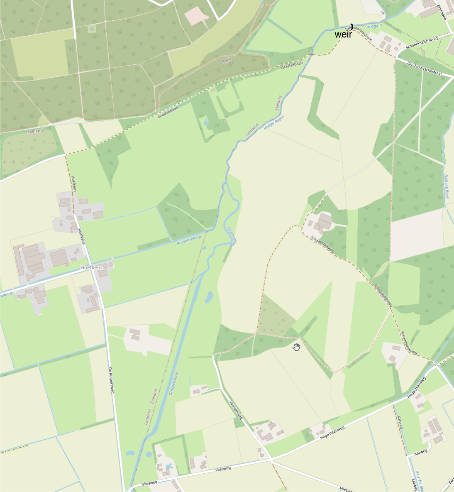
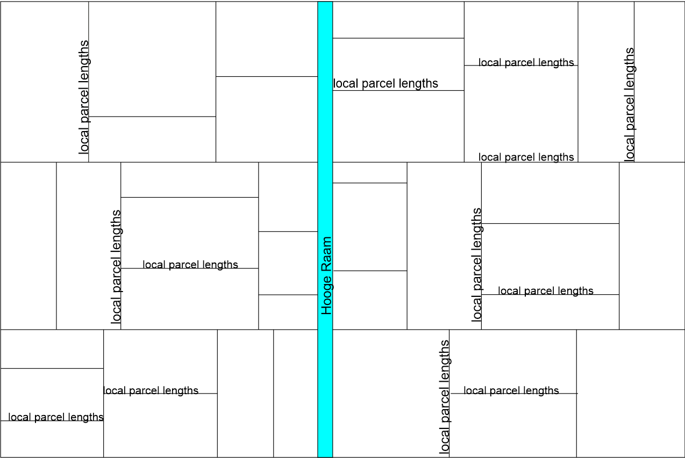

<!-- rnb-text-begin -->

---
title: "Hooge Raam open water with groundwater interactions"
output:
  html_document:
    toc: yes
    css: want_n.css
    df_print: paged
  html_notebook:
    toc: yes
    css: want_n.css
  pdf_document:
    toc: yes
---

# Introduction change


With this final assignment both an open water model and a groundwater model will be developed which will be coupled.  
De open water model represents a small river called the Hooge Raam. The groundwater model will simulate the transition of precipitation into drainage and surface runoff of the area surrounding the Hooge Raam.  
Flow in the open water model is based on the diffusive wave ("Froude = 0") approximation in 1D. Groundwater flow is based on Darcy's equation and simulates the flow between two open water courses (ditches or drains) in 1D.  Groundwater flow will be simulated in transient mode to account for storage changes. The open water flow model simulates in pseudo stationary mode.  
A storm event, a heavy rain shower, is the forcing for which we will investigate flow from the surface into the soil, towards ditches and finally to the Hooge Raam to get discharged at the weir on the lower side.

The Hooge Raam is located just below the small town Grave and is part of the water board "Aa en Maas". The surrounding area is mainly used as grasslands, some cornfields and a few forest plots. The area is reasonably flat where surface levels range from 15.5 till about 17.5 m AMSL (Above Mean Sea Level).

The figure below gives an overview of the Hooge Raam which will be considered for modeling.



The first part contains the explanation and assignments for the open water model, the second will go into the details of the groundwater model, the coupling of both models is described in the third part and finally the last part (4) contains the setup to determine derived uncertainties of the "model-train".

# PART 1 the Open water model

## Open water equations

This document should give an introduction to the hydraulic modeling of the Hooge Raam river.

An attempt is made to make the document self contained. For that reason we start by giving some basic formulas, and more formulas will follow further in the document. This document should however not to be considered as a course in hydrodynamics. The formulas are cited (which should be for most of you a repetition?) to form the base of the code.

The flow in rivers as the Hooge Raam is most often described by the so called St-Venant equations, expressing respectively the mass and the momentum balance (only in *x*-direction:

$$
\frac{\partial A}{\partial t} + \frac{\partial Q}{\partial x} = I\\
\frac{\partial Q}{\partial t} + \frac{\partial Q\,u}{\partial x} 
            = g\;A\;\Big( S_o - S_f - \frac{\partial a}{\partial x}\Big)
$$

As we are here less interested in highly dynamic open water calculations, a simplification of the second equation above will be used. This simplification starts from the observation that in many situations (certainly lowland situations) the first two terms in the momentum part of the St-Venant equations are much smaller than the terms on the right hand side.

$$
\frac{\partial Q}{\partial t} + \frac{\partial Q\,u}{\partial x} = 
        g\;A\;\Big( S_o - S_f - \frac{\partial a}{\partial x}\Big)\\
\Downarrow \\
0 = g\;A\;\Big( S_o - S_f - \frac{\partial a}{\partial x}\Big)\\
\Downarrow \\
0 =  S_o - S_f - \frac{\partial a}{\partial x}
$$

The meaning of the terms in these equations will be explained when they first appear in this document.

In these exercises situations will be studied where

-   the flow in the Hooge Raam can be considered to be *stationary* (so the time derivatives in the equations above disappear)
-   there is a weir at the downstream end of the river

Situations of this type are often called **backwater curves**.

This type of open water model that will be developed in this document will be coupled with a groundwater model. So at some places typical groundwater terms and dimensions may occur.

The open water has its own standard units:

-   length unit = $m$ meter
-   time unit = $s$ second

## Hooge Raam dimensions and parameters

We are going to simulate the open water flow of the Hooge Raam starting at the southern part at the "Vliesweg" with a prescribed flux coming from the discharging upstream area. At the northern part of the Hooge Raam section it discharges through a weir, which finally is getting discharged into the Meuse.

We will use the following data for dimensioning the river. Data is based on "legger" waterboard Aa en Maas.

You may want to quickly browse through this "legger" to see what information is available. Go to https://www.aaenmaas.nl/onswerk/regels/legger/ and open the 'Legger oppervlaktewater'.


The length of this reach of the Hooge Raam is 1470 m. Upstream bottom level 14.50 m AMSL, downstream bottom level 11.80 m AMSL, (average) bottom width 2.10 m, (average) side slope 1.5 m/m.

Weir: crest width 2.0 m, crest height: 11.45 and 12.60 m.

Influx stationary upstream based on base flow as discharge of an upstream area of 250 ha (assume a discharge of 0.5 l/s/ha).


<!-- rnb-text-end -->


<!-- rnb-chunk-begin -->


<!-- rnb-source-begin eyJkYXRhIjoiYGBgclxucm0obGlzdCA9IGxzKCkpXG5IUi5RaW4gPSAyNTAqMC4wMDUgICMyNTBoYSAqIDAuNSBsL3MvaGFcbmNhdCgnVG90YWwgaW5mbHV4IHVwc3RyZWFtIDogJyxIUi5RaW4pXG5gYGAifQ== -->

```r
rm(list = ls())
HR.Qin = 250*0.005  #250ha * 0.5 l/s/ha
cat('Total influx upstream : ',HR.Qin)
```

<!-- rnb-source-end -->

<!-- rnb-output-begin eyJkYXRhIjoiVG90YWwgaW5mbHV4IHVwc3RyZWFtIDogIDEuMjVcbiJ9 -->

```
Total influx upstream :  1.25
```


<!-- rnb-output-end -->

<!-- rnb-chunk-end -->


<!-- rnb-text-begin -->


## Longitudinal view

It is conventional to measure the length along the river from upstream to downstream. The domain of the river starts at 0 m.

We will also need the bottom slope in what follows. In the equations of the introduction this slope was called $S_o$. It is defined as the drop of bottom level per unit length of the river. Here it is just a constant:


<!-- rnb-text-end -->


<!-- rnb-chunk-begin -->


<!-- rnb-source-begin eyJkYXRhIjoiYGBgclxuSFIubGVuZ3RoID0gMTQ3MFxuSFIuZG9tYWluID0gYygwLEhSLmxlbmd0aClcbkhSLmJvdGVsZXYudXBzdHJlYW0gPSAxNC41MFxuSFIuYm90ZWxldi5kb3duc3RyZWFtID0gMTEuODBcbkhSLlNvID0gKEhSLmJvdGVsZXYudXBzdHJlYW0gLUhSLmJvdGVsZXYuZG93bnN0cmVhbSkvKEhSLmxlbmd0aCkgIyUgYm90ZWxldi51cHN0cmVhbSAjJSBib3RlbGV2LmRuc3RyZWFtICMlIGxlbmd0aFxuY2F0KCdTbyA9ICcsSFIuU28pXG5gYGAifQ== -->

```r
HR.length = 1470
HR.domain = c(0,HR.length)
HR.botelev.upstream = 14.50
HR.botelev.downstream = 11.80
HR.So = (HR.botelev.upstream -HR.botelev.downstream)/(HR.length) #% botelev.upstream #% botelev.dnstream #% length
cat('So = ',HR.So)
```

<!-- rnb-source-end -->

<!-- rnb-output-begin eyJkYXRhIjoiU28gPSAgMC4wMDE4MzY3MzVcbiJ9 -->

```
So =  0.001836735
```


<!-- rnb-output-end -->

<!-- rnb-source-begin eyJkYXRhIjoiYGBgclxuSFIuemIgPSBhcHByb3hmdW4oSFIuZG9tYWluLGMoSFIuYm90ZWxldi51cHN0cmVhbSxIUi5ib3RlbGV2LmRvd25zdHJlYW0pLFxuICAgICAgICAgICAgICAgICAgcnVsZT0yKVxucGxvdChIUi5kb21haW4sSFIuemIoSFIuZG9tYWluKSx0eXBlID0gXCJsXCIsY29sPVwiYnJvd25cIixsd2Q9NCxcbiAgICAgbWFpbj1cIkhvb2dlIFJhYW0gYmVkIGJvdHRvbVwiLHhsYWI9XCJ4IChtKVwiLCB5bGFiPSBcInogKG0pXCIpXG5ncmlkKClcbmBgYCJ9 -->

```r
HR.zb = approxfun(HR.domain,c(HR.botelev.upstream,HR.botelev.downstream),
                  rule=2)
plot(HR.domain,HR.zb(HR.domain),type = "l",col="brown",lwd=4,
     main="Hooge Raam bed bottom",xlab="x (m)", ylab= "z (m)")
grid()
```

<!-- rnb-source-end -->

<!-- rnb-plot-begin eyJoZWlnaHQiOjQzMi42MzI5LCJ3aWR0aCI6NzAwLCJzaXplX2JlaGF2aW9yIjowLCJjb25kaXRpb25zIjpbXX0= -->

<img src="data:image/png;base64,iVBORw0KGgoAAAANSUhEUgAAAfQAAAE1CAMAAAAmvOKpAAAA5FBMVEUAAAAAADoAAGYAOjoAOmYAOpAAZmYAZrY6AAA6ADo6OgA6Ojo6OmY6ZmY6ZpA6ZrY6kJA6kLY6kNtmAABmOgBmOjpmOmZmZgBmZmZmZpBmkJBmkLZmkNtmtpBmtrZmtttmtv+QOgCQZjqQZmaQZraQtraQttuQtv+Q2/+lKiq2ZgC2Zjq2ZpC2kDq2kGa2kJC2tpC2tra2ttu225C227a229u22/+2/9u2///T09PbkDrbkGbbtmbbtpDbtrbbttvb27bb29vb2//b/9vb////tmb/25D/27b/29v//7b//9v///8Exqf1AAAACXBIWXMAABJ0AAASdAHeZh94AAAOD0lEQVR4nO2dj1/buBmHlRZGVhhshN7o9TYSunZt2HXt7UqPXOnGHSHF+f//n1mSf0i2ktiyJP94v8/nE8BJ7Nf2g17JciKxNSAHa3sHQHggnSCQThBIJwikEwTSCQLpBIF0gkA6QSCdIJBOEEgnCKQTBNIJAukEgXSCQDpBIJ0gkE4QSCcIpBME0gkC6QSBdIJAOkEgnSCQThBIJwikEwTSCQLpBIF0gkA6QSCdIJBOEEgnCKQTBNIJAukEgXSCQDpBuiD9ccLYVPy1ZOzJL462KHl6fG2/mSq7E80YO628RvT+n9rvdhi6dMZGU+vNOJd+eyYPNP3dEsOX3mCLrqWnB5ofcDsMV7rYYjRnDc4vpPvDJP32eWzr6E36Fn1xdRln7Yv1PFntf/GLI63uzrf4MJZOovfPeA1/IZ5UF/hGVvEG9q7jp8ds9IOyGb47n+Mn2VGycS2S2IuXv5eka2uoez6Xmecg/V08sG274pRuSufFR7B/vy4vcpExJ4n0RbnuLktPTrQ80+pC/PefZC3wSUbJDfLdGT1TNq5FWsq92DsrSNfW0Pa8LF0/sG274pRuSk+tFCTJRbXCnop1Ehdvy1tczeTzS3FeF4aFfNsJSnpe6s9qkdS9ON20hr7nZen6gW3bFad0RXrp7O7HOe4q16os8vL2l/v17Vgs8sISK1ydJf8g5S0m53Mqi/20vBBvTRS5OK0utP8dHnj0Zh39KMTqkfhenMilgvR8jeKeF+v0wsvbdsUpnZQ+T/IdP/4D06LQuxSnKnYnzs0yTf7FLR7fa4GmhYVk4wum/ickLNPzLt6kRUr2Ja8/TGsU97wo3Xycxl1xShel5w3iRXp+TYvy1BUTamGLJ78lT0VfX4nKdlpYSP6FkopFb1dn7coF/0OLlO3Fhtb7QnuT3POi9OLL23bFKV2RrtbpheVNi/ycadLzbCjfwyv05KxGl+mbpoWFHdJl9lgWpI/eantxumGNTQeW/C6+TFp63ZJebu8oRUlsWfzx9PufJ2krIFuoVtKFSy3SrpK+NOw5SrpCqfVes04vn5t0i/xFvsHkTfJpbWGXdLmU1unKa/NNdbqyRv06nbD0uq33J9frrGGlb3EhW+9L1b22sFO63nrPI6Wt94nT1jth6VmfhTwLhcU61+lJgpfFUVxeFRZ2SlcaifWv0417vn+f/i68TFt6frKO9R65Y7VH7s8TrUdO7b/Se+RkGyl/V3Fhm/Q/TJR/KC1Sshe8A+504xqFPZ9L2dlv/WXi0nf1vT/nPefZavJFc9+7OL+noi+bHX2SjWttYYf0g+gqfnPa3a5FEn3vx9fzgnR9DX3P+XXDKK4U0t+lvnc60i1p+15Vf+mh9IVMsLyx5KufcuD0ULrSWMo7XkENeig9b4ihoNvRR+lx64e3nJ++RDm3o5fSQTMgnSCQThBIJwikEwTSCQLpBIF0gkA6QSCdIJBOEEgnCKQTBNIJAukEgXSCQDpBIJ0gkE4QSCcIpBME0gkC6QSBdIJAOkEgnSCQThBIJwikEwTSCQLpBIF0gkA6QRpJj+7u7jAaRP+wly5GQGPaaG8bQgCv1FdnK52PdTg6Oj8/58O/bB/kSQ3xLsYyIjATUPqCj40rWU22zzCjhHiXYhkVlAknPZopw3k9jEtFXU0/NzfrdfJ4d3PzTnlkzw/kcdNG3HDSHyfKyPrawtYQsel3GnbRq3PjO0CL0ZJwLZX05fZKvVinF7HbA5AQtE4fpY3223HlOp1j8g7x9gSUvuazETw9PDzksx6dVA8hU1Iw8UjvJuyv01eXcn7JnTOUG6RzgoiHdBMBumG3hECqb07vpHMgvhk9kG7OgN7EI72bcCE9evWi6iXblvPiRTykm3AhvXrnzC6Q6uvTVnr/9tu2V2uGgPh69LZOL+LMO9K7iebStxfzYojq58WJeEg30Vj6jgq9WQhk+t0EvOHy9WPCh/Ho9cefKt5atXkUbseKRwduo3bmEfLWqvaJneqtd7sMaF3ikd5N2Obe2zN2vKWkbwxhfV7sGvWQbsK6wo2u+NTfnuv0AriaM9BU+u2rwzEbHb74VGnVh7PRD2GlcyC+QCPpYgZoxg75j1GlyQ2jH9nedU3pTjJgdfFI7yayVb6M2fEbecn97cNzNrqosvbqbPR9C9I51cRDuolklWimF+7offkTrib4/PNh07sKUv26ifTHfxQVR//a4TJhtf0Wm91e1YC8+MH0vddks3ikdxODkM4xi4d0E9oq0cd/nwt2ZWz7EF4hmeobSl+OK3WrcvK+d0H1HjnvkBPfTHo0Y3uvK0jkBO57r0lu+yao+B6m98eJ8lWlXcT/Ifs2JT3YeSlJDyC+h9Kj2c6srqB9m628WXe3Vhs8Srdkh3hbtmGdvmDTGms+Tip137Q9rM3g6/imrfdf/3hcsU7nLA+r/Y+0k97VcKHE9zC9r6PLyq132xDtnBdOCPF9lD5no/NeX6fvYpCpPmDr3S5EBxic+KbSnWZ1U4gW07uKL/F9TO/1Wu9WIbohneNDfB+lrxejizvBru8v2IfoFINI9U3Te7Vu1QYhOkjvvTfskXt1fu699d6Z9K7iSnwv07sfui+d40I8pIcM4YhepvoGn5H7rjhE1Oo7V/V6f6Rzeie+QUlfMG1ksNXzHYPDWYQQdDa9K1g36nuX3h/O2OjFT3d85P6vl2O2565zrnfSOVbieyddfCcxZW/HuP27N9uJ++lNH6b78W3vk+v76evow/nzw6MXr91O0dGvOr2AdaoPRg9a731J7yqVxfcwvfui99I5lcRDesgQYehmqod073RPfA+k9zW9q2wUj/RuDjEE6RyjeEgPGaIdupHqG0r/llyfR18rfQTaJsTgaF984w9RXCR/DPAj0B7J03tY8S7SO//kzKn8o6L0ahPsDl46pyQ9gHg30kfP2Ml9VenVJ9itv1f9pJ1U3/gj0J+v+Lx6VaRbTrA7eMKLd/C59wXb+6WKdLsJdoeb3tVoocS7Se/cdWzz593SLSfYHfhDnWA32G1ZJ99w+TKu8BFoywl2aRGmxLv5WtPD7vEArSfYJYd/8U07Z5IvtqwqfO7ddoJdCnV6EV/iw3fDNppgNxidkM7xIb6Fvne7CXYp46fA44ZL53EvvgfSqaZ3FVfie3NrFdIlLsS3Kr3OBLsgx02Jb0k6OmescdCobyu915hgF+m9hLV41Olm+iCdYyW+N9LBRixLfEjp0dXh4ZGcwA11ujMsxAeU/ii/4so/aGOSjlurTR61bssGlD7nk26uZuL+Wp2Sjjq9EpVKfOg6Pb21esUOkN49UTHVh5OeeZ6zU0j3RwXxIaUnH6KIZmyK9O412kbvwS/Z5ukHJx4n7G+Q7jua0Xpw6Q9jti9N83Y80nsANqT4kNfpq7PUdHQF6aFoWbpK9N/uTdHVRrgw0dqr0+uE0HpqWFDChmvn4CyMuJfcpXhhw/Xl4CC9t9GCS68zwa6LeLZAusMV60yw6yKeLZDucsUaE+w6iWcJpDtdcfsEu+7j2QHpTlesPsGuo3hWQLrTFatPsOsqng2Q7nTFfsSDdKcr9iMepDtdsR/xIN3piv2IB+lOVwT9BdIJAukEgXSCQDpBIJ0gkE4QSCcIpBME0gkC6QSBdIJAOkEgnSCQThBIJ0hI6dH7MRu9dDmjZ5mF/PbFVA/nJ/LjRH4y1BzIecw0XPNDDCl9Lnb2IEAMcUaUcF4i85FXlJjFQK5jFsI1OcSA0h/GT67jH1bfkahKNMs+jK+E8xKZT0c43RzIdcwsnINDDCh9LnZ66bWoP06yrSvhfET+Mh4dSgvmQI5j5uEcHGI46dFMfM3R7osxVXkYpxNHKeF8RI5me9cLWa8aAzmOmYdzcYjhpCc7lOyeJ5bs72eMHd9r4bxEvuMtKm7BHMh1zCyci0McmPRF9tVp39LXYaVn4VwcYkjpsr6Ze5Qet3ZO7vmQtQdqOF+RU+mmQB5iprVJ80McWElPQ/kudYJ2Srqk0SEOUrp/AYI2pTcKN7DWex7Kc+udE7D1nodLaHSIw7pOTw5aTOju+Tp9nVkIcp2+LiSWRocYUPqSjd7yMWUthjKozFy0cs74aMVKOE+Rs2soUyD3MbP/scaHOLC+9/iwOaIw+O57z/JtmL73ddY50/gQh3aXbXXJQtzxEqTSA91lS8M1P0TcTycIpBME0gkC6QSBdIJAOkEgnSCQThBIJwikEwTSCQLpBIF0gkA6QSCdIJBOEEgnCKQTBNIJAukEgXSCQDpBIJ0gkE4QSCcIpBME0gkC6QSBdIJAOkEgnSCQThBIJwikqywNI3It/I+GFRpIV3icnJafjGaGJ/sNpCvMjYV66XWE+jaA9JyHsXFArmjmdzKK8BCWvhADcM1Zlr3FaLrR7MnnK8ZO1tEl4yO28TcOragTlh7NYplLlqV0OZJyLP2vfES2ixn/Kf4h8mH1BwJh6Vz477O8FC+F4mjGnlyvvzC2f73+lSXD7A6sAU9ZepzaD5UxFrPx1KdJFhDja4v3+R+4OiikpT9OmKJzLgq91C1HVU5H0p4PrFInLT0u6krDPJWe64b0AbJM5rSTQDoFYqf/GedtNHXM/oJ01OmDYRE315XL9LT1XpIeYjKKoBCW/jAW01xlpTi7Ti9Kx3X6cJAzYCzytty8qDuRjh65AbOhRKPvfdDgLhtBNtxPH1pBh3QNfHIGDBVIJwikEwTSCQLpBIF0gkA6QSCdIJBOEEgnCKQTBNIJAukEgXSCQDpBIJ0gkE4QSCcIpBME0gkC6QSBdIJAOkEgnSCQThBIJwikE+T/8p2kGFwmsQgAAAAASUVORK5CYII=" />

<!-- rnb-plot-end -->

<!-- rnb-chunk-end -->


<!-- rnb-text-begin -->


This bottom slope brings the gravity into the equations: the higher this slope, the larger the influence of the gravity on the water flow.

## Cross section geometry

The cross section can in general have a complex and spatially varying form. Her we take just a simple trapezoidal profile with a constant bottom width $b$ and constant side slope $m$:


<!-- rnb-text-end -->


<!-- rnb-chunk-begin -->


<!-- rnb-source-begin eyJkYXRhIjoiYGBgclxuXG5IUi5iPTIuMSAgICMgYm90dG9tICB3aWR0aFxuSFIubT0xLjUgICAjIHNpZGUgc2xvcGVcbmBgYCJ9 -->

```r

HR.b=2.1   # bottom  width
HR.m=1.5   # side slope
```

<!-- rnb-source-end -->

<!-- rnb-chunk-end -->


<!-- rnb-text-begin -->


The water level with respect to the bottom of this cross section is called the *water depth* and will be denoted by $a$. To make a plot of the cross section we need to calculate the width for a whole range of possible water depths.

For a trapezoidal cross section this results in:


<!-- rnb-text-end -->


<!-- rnb-chunk-begin -->


<!-- rnb-source-begin eyJkYXRhIjoiYGBgclxuXG5IUi53aWR0aCA9IGZ1bmN0aW9uKGEpXG57XG4gIHJldHVybihIUi5iKzIqSFIubSphKVxufVxuYGBgIn0= -->

```r

HR.width = function(a)
{
  return(HR.b+2*HR.m*a)
}
```

<!-- rnb-source-end -->

<!-- rnb-chunk-end -->


<!-- rnb-text-begin -->


The next chunk creates a plot of the cross section


<!-- rnb-text-end -->


<!-- rnb-chunk-begin -->


<!-- rnb-source-begin eyJkYXRhIjoiYGBgclxuXG5hcmFuZ2U9c2VxKDAsMS41LGxlbmd0aD0xMDApICMgbGFyZ2UgZW5vdWdoIG9mIHBvc3NpYmxlIGRlcHRoIHZhbHVlcyBcbndpZHRocmFuZ2UgPSBIUi53aWR0aChhcmFuZ2UpXG5wbG90KGMoLXJldih3aWR0aHJhbmdlLzIpLHdpZHRocmFuZ2UvMiksYyhyZXYoYXJhbmdlKSxhcmFuZ2UpLFxuICAgICB4bGFiPVwieVwiLHlsYWI9XCJhXCIsbWFpbj1cImNyb3NzIHNlY3Rpb25cIix0eXBlPVwibFwiLGx3ZD01LGNvbD1cImJyb3duXCIpXG5ncmlkKGNvbD1cImJsYWNrXCIpXG5gYGAifQ== -->

```r

arange=seq(0,1.5,length=100) # large enough of possible depth values 
widthrange = HR.width(arange)
plot(c(-rev(widthrange/2),widthrange/2),c(rev(arange),arange),
     xlab="y",ylab="a",main="cross section",type="l",lwd=5,col="brown")
grid(col="black")
```

<!-- rnb-source-end -->

<!-- rnb-plot-begin eyJoZWlnaHQiOjQzMi42MzI5LCJ3aWR0aCI6NzAwLCJzaXplX2JlaGF2aW9yIjowLCJjb25kaXRpb25zIjpbXX0= -->

<img src="data:image/png;base64,iVBORw0KGgoAAAANSUhEUgAAAfQAAAE1CAMAAAAmvOKpAAAAtFBMVEUAAAAAADoAAGYAOjoAOmYAOpAAZrY6AAA6OgA6Ojo6OmY6ZpA6ZrY6kLY6kNtmAABmADpmOgBmOjpmOmZmZmZmZpBmkLZmtttmtv+QOgCQZjqQZmaQkLaQttuQtv+Q29uQ2/+lKiq2ZgC2Zjq2kDq2kGa2tra2ttu229u22/+2///bkDrbkGbbtmbbtpDbtrbb27bb29vb2//b/9vb////tmb/25D/27b/29v//7b//9v///+1TGV0AAAACXBIWXMAABJ0AAASdAHeZh94AAAMe0lEQVR4nO2di3bbuBVFoYlt2UkmqtM0sdNOZ6gkbTWauJPUsiPx//+rfEoExQcuCYIgz9lrOSuUBFwAW7gEKUpUIYFDjd0A4h5KB4TSAaF0QCgdEEoHhNIBoXRAKB0QSgeE0gGhdEAoHRBKB4TSAaF0QCgdEEoHhNIBoXRAKB0QSgeE0gGhdEAoHRBKB4TSAaF0QCgdEEoHhNIBoXRAKB0QSgeE0gGhdEAoHRBKB4TSAaF0QCgdEErvwOHLP6N/9yu1+G3spnSC0uU83Kq7kNKhiGRTOhq59OkyF+nPH5dKvXj/GP13q9SbP5bqYhP9/+GtUurlL4XXLF5uzjfCiheEf0ZlF6825frXKuGqMNOLUZ6W6vJ/X6+jF38YvNNdmYn03TJVcfmYSL+J/vvT7+HhXp0ejnWk3JU3MvTHtun/F3el+s+kn0W5uE2337gfBzPmIT3OuLmL3NbPx0mZPhy5WXwID5/zt8NpI0N/bJcXjcUW6z+TrkU5vXOKVXvGPKRHnhe/JFMuGuhY+lU86WJvl5vw8CmZvJmjdI+sbWRoj8V1RTP3+TZ/H53qLy3k9CiJ9Pi9s1b+7vlnIT22EefSp5v331NDyb52nWXc+OmrdLZe/ON7UkLbyNAei9wlleziOvT6S9L1KIn0fP9B6QOir6e3BQtvCo9kaXiRrPa0jYziY8fsHk9uvX5dejlK/m7xeY0/Y+mnR3f6si6Wom1kFB8rSF/81iS9HIXSHWE207PjrmzBpW9knB7bFddhwpmeFKT0gckHfv+XV/85KS7vbRN+fFnmT5c29Bdou2S9/tZ9OqU7YZuumNMF9FG6vq7O526yNNM2skq0x5KV+iY3qdXfunqndCecjqMjhUfpx310fpweH8k9J7NW28jQH6s5To9qTjcuHzPpehRKd0d+xiy2cJR+8vFKOyMXP6ttZOiPZed40jdFsf50lX+Ufh6F0h2Rnht/ndk6mtTOvR++XJ+2tI2w4gVZ2c1Z/eHhY2T/9VH62bl3Sif+QemAUDoglA4IpQNC6YBQOiCUDgilA0LpgFA6IJQOCKUDQumAUDoglA4IpQNC6YBQOiCUDgilA0LpgFA6IJQOCKUDQumAUDoglA4IpQNC6YBQOiCUDgilA0LpgFA6IJQOCKUDQumAUDogDqQrMigdjNiX3BQiCILhA86cQB9E76UHAa33JSgNoj/Sywko+wuUCoLCtoM/JS2j7Ma33aagPIb+SK8JEeR0Du9hAZdtOhtAn2Z6TYigotHEmMrh8146rfehevD8l15uuIfZ2tv0XjNhJiC91HYPHfoqvS5JTkJ65WqEtFC/X5yIdFoX0zBiU5F+6oOH2drL9N4wSyYj/WhdSSc7pPRANWTG6UjnwZs5LSM1Jem0bkbrME1Kepimd6F1tPSe7wXrB8m19MO3b98eW19VG+IoXWAdTPpx6VM/RE6lJ3egi9FvaCcKwRTfjMn4OJQe32ty8fLdu3dvz29MLAlB7fWYjY1D6dv4nsMpz6vTTWqlIZTUOk56Lw5M8xCK6Sj9cJ/dZjTmadk41VtaLLMOI10bFj+k71fJXWQrNuQhmOErMB+UkWb6rnmn3h6C2ssIRsTpPn2RL9ofln326SnDva+nmN7PlPuR3sPwU3Sw9uLm5ia+4/jrziGaLv4SVzZSAeshzsfCF+nh88fr5DD9xatN8wvNQjDF5wgHYlqnYUvQeoJ4GKYnven6OXFlIxWwGqJ6DLxJ71ZC6M8ZWJ+39LoB8FD64e9/63fIdgQ8xXfq/kjSK07O1HytyeDv7Gs7QH953wPRV57GkR7++N41xPlzLW/2Gaf3hp57mN57hKh6rjHJzVd6115PT3olgHv2Hl2eiXQ86306PD3pNc/VD8Is03urcz/S++G//yry7x6fp1cS1I3DHKW3z3M/pO9X2jFZr8/Tq4FJ8bXvb0McpvfDvbq0MNObwLDeu5cu9+naZRSdQzSGr5oCc0vvZs6HTO8Pb28Slo3pOmO/ar4I1qhVzS2usD4v6aaZfUDpu+M++tJAeri7uROHkDLvPbuV3vWTHu2mr/68Xfz6hzJN3OIQcmZs3VLX+knfryLZa3UXbtVVr2bUhxA9l1Iamvmkd4nz4dJ78mHZVr1pu469RwjRczna4MxGumieDyf9cB9J30XSW65j7xGiG3PM8Pb61HMhF6f2eJY/Ga3eO4XoyOz27Bb701N6LDtazb289mmfnnIcpDmk96DpJ2TEEfoepz/99fdwf6vUhc2JbqfFR+n+/UiNtETQ+BMy4gh2zsj9sLmKqw7RgdlkeNsdmd5HqwKCeWi33ovpSReFT9O7cLz8Su/5Pkro3I+PVm2F6Lo7tBPdTgFBiSEWJtOTLmXaKX6Qxs9f+pStD9T06UnvkHyFY+dNei+022qbIKR79yM1sg8QrP/K/fSkd2KCKX7AJvsjvft32Yz+gol9523I9voj3TRE10RnPnF8SO/l1oKn9+7dN02YHkg/aym49B5MZM8+eDOhpE/D+vCNnJ70XonOaEDHTe/VTQRP7/26b2J9VOk1DQSX3he/U7yT1uFJ9/mqSUctm550C4muZTqNlt4bmgWe3m10v9n6SNIbGwUu3QpBy2QfAYctApXu3XrO6bvQtfSet+jqEr6mQP0oj5DeW5VPN73buEWXxe7XDbR76e3TfKrSbd2iyx6+ZHjX7XAo3dItuqzixZ7deRvcSbd4iy4ZjQWqrDtN74Zvu4mmd1u36LKspGLQXUo3TTUTlW73Fl32GDXDjxPc6T7dyi26rDOi9ZFCuzxks3yLLlPaC5TG3ll6FzifaHoPLd2iaxAl2vA7ki6a5dOV7lOIEs4T7ZhLCUrPCMbCfVcnKH2o5HvSoOoNVSMuUChhtxNmBUaS3uMWXcPtcceQbr0TJgVGkm71Fl02/4LA7d8o/RwrvXe/RdegiKdsH8bqJPfpZQJn6X3ATrQUcC3d8CIKMihyb92lG19EYTW8hwW8bNMg1QkuorAa3sMCXrZpkOoEF1FYDe9hAS/bNER1kosorIb3sICXbRqiOslFFFbDe1jAyzYNUZ3kIgqr4T0s4GWbBqlOcBGF1fAeFvCyTcNUZ34RhdXwHhbwsk0DVWd8EYXV8B4W8LJNLqsbPLyHBbxsk8vqBg/vYQEv2+SyusHDe1jAyza5rI5MAUoHhNIBoXRAKB0QSgeE0gGhdEAoHRBKB4TSAaF0QCgdEEoHhNIBoXRARpZ++KjUiw+CAs9vlVq8ll1xvV/dmTbny1It3guv5zavPkbcAfEQtTOu9P1tcm2l+RXUT8ukgOg6+8O9MrWyTmq/ElQuqj7s0AHxEBkwrvStunoMH5aFL040Ew3wz4/h861kDOKvWhpaeVr+tIn+MW6OsPqwSwekQ2TCqNIP98n3obbGo7ZfJbPwaWk+Gb8uFzem9a+TF+4kU11SfdihA+IhMsGHhZy4R/uVcXo83F9sTOvPBlhQu6j6ApIQCbOT/lX8pVfJXPxmPmKZisy99eoLiJJJ2GWIGhld+jZa1Qi/86p9e9IoxHDSBdWfEHagwxA1M770G/EvWayFa1lz6en8Ww8tXdiBDkPUzOjSo/f9Z1GyO6yFudG3mS7vgHSI2hhH+k479jQY5VOB6KDH5NRGMYJf0g07UC7U+XcfKvBBukE+PRYw/YGbLtI7rN4l1ad0/IUe4S6nmVHTeza8gp8v2a8W8jOSxlY6HKdLqo+RdkA+RAaMu09fx6ebnu/NR3nd5XjV2MpORavqp6Uwhki6uAPiITJg5HPvK9mZ6OzMtXAxa26ly7l3kXR5B6RDZMLIq/fnj6LPnHZqWOmdPmWTSO/QAeEQmeDBIRtxDaUDQumAUDoglA4IpQNC6YBQOiCUDgilA0LpgFA6IJQOCKUDQumAUDoglA4IpQNC6YBQOiCUDgilA0LpgFA6IJQOCKUDQumAUDoglA4IpQNC6YBQOiCUDgilA0LpgFA6IJQOCKUX2KU/5vi0tHrzDP+g9ALZzzNurd47w0Movcg61n24t/pLfR5C6UWSxD777E7pGskkn312p3SdSPj8szul60Spff7ZndJ1omn+efbZndJL7BbXs8/ulF5i3+1uG9OC0nWk93ybJJSuI74h5hShdI3DJ6s3NfUUSi8Q3xYbYKJTusZaXWzGboMDKB0QSgeE0gGhdEAoHRBKB4TSAaF0QCgdEEoHhNIBoXRAKB0QSgeE0gGhdEAoHRBKB4TSAaF0QCgdEEoHhNIBoXRAKB0QSgeE0gH5P1KY5fwZgaG7AAAAAElFTkSuQmCC" />

<!-- rnb-plot-end -->

<!-- rnb-chunk-end -->


<!-- rnb-text-begin -->


## Wetted area

One of the important cross section functions is the wetted area. It was in the St-Venant equation denoted by $A$. For a trapezoidal cross section this can be easily calculated by the following function:


<!-- rnb-text-end -->


<!-- rnb-chunk-begin -->


<!-- rnb-source-begin eyJkYXRhIjoiYGBgclxuXG5IUi5BID0gZnVuY3Rpb24oYSlcbntcbiAgcmV0dXJuKEhSLmIqYStIUi5tKmFeMilcbn1cbmBgYCJ9 -->

```r

HR.A = function(a)
{
  return(HR.b*a+HR.m*a^2)
}
```

<!-- rnb-source-end -->

<!-- rnb-chunk-end -->


<!-- rnb-text-begin -->


One of the reasons that this wetted cross section is so important is because of the important formula $Q = v A$, were $Q$ is the discharge, $v$ is the velocity and $A$ is the wetted cross section. 
Some typical (max) velocities depending of the soil type are given the table below  

| Soil type           | velocity m/s   |
|:-------------------:|:--------------:|
| clay/loam/loess     | 0.60 - 0.80    |
| sand/solid peat     | 0.30 - 0.60    |
| coarse sand         | 0.20 - 0.50    |
| fine sand/soft peat | 0.15 - 0.30    |

: source: Cultuurtechnisch Vademecum 1988

As can be seen in the function above that the wetted cross section is dependent on the water depth $a$. One way to see the influence of the wetted cross section on the discharge is to investigate the relationship between $Q$ and $a$ for fixed velocities. Here is a typical example (it is customary to plot water depths on the vertical axis):


<!-- rnb-text-end -->


<!-- rnb-chunk-begin -->


<!-- rnb-source-begin eyJkYXRhIjoiYGBgclxuQXJhbmdlID0gIEhSLkEoYXJhbmdlKVxudmVsID0gMC41MCAjbS9zIHZlbG9jaXR5IGZvciBjb2Fyc2Ugc2FuZFxuUXJhbmdlID0gdmVsKkFyYW5nZVxucGxvdChRcmFuZ2UsYXJhbmdlLFxuICAgICBtYWluPVwiSG9vZ2UgUmFhbSBRLWEgcmVsYXRpb24gZm9yIGZpeGVkIHZlbG9jaXR5IHZcIixcbiAgICAgeGxhYj1cIlEgKG1eMy9zKVwiLHlsYWI9XCJhIChtKVwiLGNvbD1cImJyb3duXCIsbHdkPTMsdHlwZT1cImxcIilcbmxlZ2VuZChcImJvdHRvbXJpZ2h0XCIsIGluc2V0PS4wNSwgdGl0bGU9XCJ2IChtL3MpXCIsXG4gICAgICAgYyhcIjAuNVwiKSwgY29sPWMoXCJicm93blwiKSxsd2Q9Myxob3Jpej1UUlVFKVxuYGBgIn0= -->

```r
Arange =  HR.A(arange)
vel = 0.50 #m/s velocity for coarse sand
Qrange = vel*Arange
plot(Qrange,arange,
     main="Hooge Raam Q-a relation for fixed velocity v",
     xlab="Q (m^3/s)",ylab="a (m)",col="brown",lwd=3,type="l")
legend("bottomright", inset=.05, title="v (m/s)",
       c("0.5"), col=c("brown"),lwd=3,horiz=TRUE)
```

<!-- rnb-source-end -->

<!-- rnb-source-begin eyJkYXRhIjoiYGBgclxuZ3JpZChjb2w9XCJibGFja1wiKVxuYGBgIn0= -->

```r
grid(col="black")
```

<!-- rnb-source-end -->

<!-- rnb-plot-begin eyJoZWlnaHQiOjQzMi42MzI5LCJ3aWR0aCI6NzAwLCJzaXplX2JlaGF2aW9yIjowLCJjb25kaXRpb25zIjpbXX0= -->

<img src="data:image/png;base64,iVBORw0KGgoAAAANSUhEUgAAAfQAAAE1CAMAAAAmvOKpAAAA6lBMVEUAAAAAADoAAGYAOjoAOmYAOpAAZmYAZrY6AAA6ADo6OgA6Ojo6OmY6ZmY6ZpA6ZrY6kJA6kLY6kNtmAABmADpmOgBmOjpmOmZmZgBmZmZmZpBmkJBmkLZmkNtmtrZmtttmtv+QOgCQZjqQZmaQZraQkDqQtpCQtraQttuQtv+Q29uQ2/+lKiq2ZgC2Zjq2ZpC2kDq2kGa2kJC2tma2tpC2tra2ttu225C227a229u22/+2/9u2///bkDrbkGbbtmbbtpDbtrbb27bb29vb2//b/9vb////tmb/25D/27b/29v//7b//9v///+a8EjIAAAACXBIWXMAABJ0AAASdAHeZh94AAAUMElEQVR4nO2dC3vbthWGIceuFTuz16h26yybpWRbsyXMmt62uGXsNqklR9T//zvDjSRuJACSokid8z2PE5EicAC8xMGFFEA2KHAiu04Aqn8hdIBC6ACF0AEKoQMUQgcohA5QCB2gEDpAIXSAQugAhdABCqEDFEIHKIQOUAgdoBA6QCF0gELoAIXQAQqhAxRCByiEDlAIHaAQOkAhdIBC6ACF0AEKoQMUQgcohA5QCB2gEDpAIXSAQugAhdABCqEDFEIHKIQOUAgdoBA6QFVAX88ImfNPS0IOfu3AEItR6NHZTbuo7i6nhEyevLpvnpTJa+ts9u5fld9V6faEJuRp4GXBUWcLQvyRBqW1uETkTmoH0GkBzFtE9HBRRBNOx0yKHfTugmc4CnrKk+HlIy/bJXSZO6mdQG8T42ra+uZxFVae4RjoDM6x393kl+0QeomTq1foPMYsIVoK4sQKhBzR9uHhReObpw56ZDwhYaKj7hC6OwkR0O8uaTE/eZVfoh8yBpPrTSKD/U6/nGhtdxkjq6ssT9m7E9bCX/OT6gGL5IFGcHhDT0/J5K9KNDQ55Fh8TAzXqsUnRB3r0w9TFpGaorywlACJcB3HSkGq+aNJPvqDtcxa7EpRqhcrRrXLRNQs90f33CI3pJUUL8Xnf6jQE/k5j8WRD5sFtfHo+X1xiczdF3l6g6HzKsZ0xB2acSid7rmEntru14YukyIYqgf0859EK/B+YbaaSVm9WYxH99pXZXybvPxPhUNQU5QXlhLAgq7njyb5UHYlnpr26AX6xaVR/TIZdcod3VJGpZXUUpQiM1WYWcpYJQdXPgwWMhZ+pEE/TmThBEPPS8iAJA7VBnsuqqNI22s7xoeFOC9ykzoOyrilSi/O20fHDbAxoiihM32pp0gWlhrAgq7nT+lIlBZL6PrFhVE3dJaFI1aZGRQzXYUK6Hm5CWCufFSyODah5yxroGv5ZNZoU5q9LbEqhyyfX95v7qb8MBM5Yt3sY3eMsj7PRXHO7QMaG79/qY/UMLJYivJINehaFAp01ofSUyQLSwtgdOSM/LGLaONldEfyMI7CUPt3Zh+RRXZKyhugSBcLeC6OdIdSpNmZD9v85BW/khaO3pFjJ1leQ6En0nnIqmYfcrxLbpfmiuduqbpfNcaze83Q3DiQkafExlgD3RFfccPoKdI6QDKAQcbIX54G/ZZSKqF6cWoMJq2BQTnS09JVeLG8/RMS1VOk3JkP3XzeC1ydPv9k9d5T6S7CoJcdyjRPn+tQRL7U7xczxvNP8lT220vWk5Kd+vJA3kLSGVm3hQ5dNmgs21p8Zeo2GyNF5YxFGUAnY+SvKGz9llLqj3pxqt7rLui8KOx0FfHovXdRPUV/zpUPw7yVRBU6zQcNlwS26cZx1aFIoJI0s0axBl0mMXuRXzQ3Dmqgm226uOF4GWpRVEOnKcobVzWATsbMfi1082IvdNEAbMx0aaWo9F1Z9VQ8uZmPSjQO6JwPPQiDHlvT7QG0Ui0K++TRX/43y3sBxUEd9Lzztv7q+b2o9Tn0P7QobOhKisoaUgbw1nQevpuaLrqFczNdFTWdG//vNO/3OfMRWtP5DUTjs4GrCS3sRLbp9myE4mF4hFoHSu9N1UGX4/RUDGyUEjA6ZBuFgqMtlgPmuVVdK9v0auiONr0WutIg6elKnG06v/60ok9R3aavvzp7b0OnHw7+QUKhx/beD250V6zdbHLwUbLXDmqhyxm57MOU6P0lPQoDup4iURJLx81X03uvgW4XRi101tH7p+Cqpyvvvc+IBl049WKyxMyHq/d+nR+Z0OXoLRB6MQEggBiHMeN06eDF7cyHJ8ZBLXRt7p1Mnt+r58soDOiu8a0eQORAG0wr+auHblzsgS7sJkRvpCvH6XnpHpf89XxUsyg7+Hnu8ggCoZdRn+kzcmfqjNyfy6GBmfQyRungyymFpxvroBq68pRNt5A4zpXlr6aodIvKyUSDbuSvHrpxcT10OdRez8pxaZFmWYqTE2PuXZkecOTDZJHPyFnzN3KKLgK6b+79kk1MF8HEl+65dzlpzqbVyZP3YsipHdRDL56nf/tCa9S1KCzoaoryGqIFYH35yXkB3Zp7r4Nuzb3XQJezD8U8rFZSfO797CYxoKv9NzsfNgs+935+r1wicycK/6ACekPZgLaqu4tj/0UoTaxGdQM9Fbdt9l3zNxtQveiW9Vu7ga5MGmieDTUo5f25jtx70SnCij5giR7fvLO3YXnnSj65Rw1UDPrhK3wFGqQQOkAhdIBC6ACF0AEKoQMUQgcohA5QCB2gEDpAIXSAQugAhdABCqEDFEIHKIQOUAgdoBA6QCF0gELoAIXQAQqhAxRCByiEDlAIHaAQOkAhdIBC6ACF0AEKoQMUQgcohA5QCB2gEDpA9QCdoLaqBkS6h7wDE5CF0AHoDZV6PBzopgNq8dc2fMAf2XL8Xdl486b8K8unAZ3ugdeaiLfXQ4hBJkoP8UZTu4jRvQ9bbxwyLkHoe6QA3lwjgD5ITzq0RAnCxMu7YVIQek8mQkMomEkt6xZJQfc+IAX4cocQ+ggV2nZXaQTQB+RJezXhDlHLO9AGQm8WYheJ8lfw/YGO2tTNtDQQQh+8WjTeFRoBdKDu3Rx1h/AeqHvPPn786N+/Azp0ZdQdVcGHCJ1vAMdU7s/XtYnxq91oLEg9Qmd7wEyeXF1dsQ176rflAgp9y6wL9Qg9Zbv7Cj3M9E0ia03sv3uvqNxby0Z/0LOFsgHbalpb1QFBr/Hmg4V+9/J0Sianz957g61nyta22kEnqRqhemi93WoFPXvLt2A+Zf9MfJvqaTV9Wd+o7z/0ncDO1Qb67ZScvfrEP37+8ZJMruvDpWSSd9rvppDb9FDgA3TvtOZqlTt7V99ObzZvqUN4dHp6ekL/Pw9P1d5Aj/XmA4S+/ruJOPtPXTu9YVuzn/Bh+qOzm/oL98+976r5dmoE07Cj16CAM40A+qjde0maRMMeoHsXyn76/orrWZc7Yu8HdL12DygbLaEvp/lPUmrH3Zayl7U3ybjd++Dcual20LMFOfz2J66fo2q6Y3Kmw5817fBP/RkR/xtAmqy/dtDXM2XCJUqfPwWaGJN7r63hA8pG25oe59UbmBhUadUE8LrzAWWjZZueknl8BHEmRqAht98ute29f3h81qRNjzExYA29x1ahltCzF8167xEmhuQX1QCxwAeUjZbQEzK5ChynZ7/9pKrWMwweeuhPBXtNVE/QY3rv65k2Jhvv8/QR+nNDbaFHeHU6qD9qUtMHo3E24A712XvXXqMINjEQv2gQH0aiGoZo23tPJ9cfuWonW6TWM88Td6eJ3ZeWo4rvPlEtQrR172FtdK7laZhjGJJ73wuHrqvljNzLq6vQ3ntDEzvVfjThltq69+1o9+7d12cbkLOOD4HQHSECeukDQhgfojn09dfmi24PX3c1K7dD974vw7I6tajpKdHeb3y49Lzi2sBE39p73EJt3Pvqgkye/fyR/f74txdTctjw0bovVX35xSjiA3LW8SHatel3F8WQ7dDz6+OmJnqZSVen0rdjYlAh2nbksh+vLk+fPPu2ywFbv+4dQBtuagS9920KIPHNKKBvzcspuNu/LjWmEDCht59KHxDC+BAjgN61YLp0VdCgI/HNKKB36OUqcaN77z5IKxNd5b2ugo8T+tJ8ni1CJOpbC6njFYYRQO9A++nS1zPnch766WxhX9QW+t3lKde09SvQ2/stm3Obqj34S47c5x+/1o9fd/tbts2yoHQ0zPfeA/ttY3Tvq+ncGcJw6NniuH1StDdnFuT494vJvz+Qpj9k9JpoVVrBTn0E0BNexMprhglzrtni4Je3bAkf9rOTcxaC+3O+7pd8CJpabNpB5++9J2S+SYl1O7VRJ236njXj4sXjZbEs13rGipxC/4Y52usF+5d9xx1Aory3uJqarXpb6DTelNryrADZwkQj7WPHbTVlkJOi2gr81Nce3GxuafN6s/nAF+dLKZL17PBmkyXi/fRsYbJp696pBWY96lcPUSYaJFF5UNrI4FYCtA7B2SneXdR8Cn2e/6JgPSMUQnLMbpAD5f2WxD2ya5wWdjOxWr5q33uvMhGZRIaaRFfyEUDnbXP1luh1Mhv1ltAZbHqzPTkZSJu+d05dEWubFX7C0YtlIZR/xYSN+DWxfJepa+ib1de0Bbmg8Xe6IkVD6PuMnI+91sqSuhXQ8+m47PvLfFX9zqELfe72xZkG7l3rufXge3cxTk8OflCW1M3bdBU6+VWdjltfiDbX+vVRN9C7Vix0o7O+p9CXkxOiLqQteu869NXj1/w72pnf3Ikh1dpacXsE0L3aw/GZU+yXg/fKkRyna+5dTMdlC9GD40O2lbXi9vihg+AtlBBt5GS05nx2Tj5e4TNy8gXllHQ7IxevTrfoqqrie+rejVP2TJv8Ons3VfZcoLU+Vep9s6S0gN5si64qe9VeHQZ0/bm58rWYg83H0MsJSXYHvdstuqA05Lq0gql4ns6n41ZTOU6jAz1izsP2CL3pFl0uAeTNpReM9eYMVyKfzIiqTnt2ZGbMnPUHvcMtunzIgbh399dy6VZllp6YjX9/0Btv0WXY28YrEeOD/sZS/rWkrSzbS8jfLgg5u7djaZWWEHWzRRfEhlxRXjA286JIXNCNVYF6bdObbdGlCDhyb01nWssWvHigmhFyfr95WJTPxPocsrXdoiuYOAD3Xh3CUdP5v0qL2us4vdkWXfIgopIjdAd060TbtHQtywR4vy4VUPaO3rt6PjCWBobbKr7DDkQhZa+P04unbMooeQTQSTRy0O6d4qbDpNVUmXXlHbmLsu+8I+gxW3SR6Eq+x9AbSeyjVg6SdwQ9aouuffs50rb/sndsZ3Px+eie/v/AXo7s7mdNjRWxRRe25V1rDG16u+DbCTHIRIWG6Bt64EsUqK0qnltz6MEvUbS0hzW9czWNOeIlipb2EHrnahpzxEsULe0h9M7VMOaYlyha2kPonathzDEvUbS0h9A7Vxc13fMSRUt7CL1zNW/Tg1+iaGkPoXeuxjGHv0TR0h5C71zNYw5+iaKlPYTeuXqYhm1pD6F3LoTejwmEPrQQg0zUHkFHDUAIHaAQOkAhdIBC6ACF0AEKoQMUQgcohA5QCB2gEDpAIXSAQugAhdABCqEDFEIHqD6g6wsZu054Q5hLH7u0nqlfe22YAbwmHi4JmZzHZMMK4bXBtmt5dK2e8GcjXn1A1xcydp0IDFELXexvFW7DHaDaxMpcAsJroipEtQ22gQ4h6hvl/mw0UA/Q9YWMXSe8Iewt6CyxX1Qqhem1YQbwmaCXf6kv9uIzYYfwZiMlx/ebu5iiaqQeoJsLJNknvCHW5tLHlm6nk1OVodeGGcBnQn4vtk4MMmGH8NmQC4WlZbq82Wik7UO3lkKz10bzhXDte2AGObxRyirEhh7Ab0IoIhtWiFAbZbpCbURq+9CtRQ/tVRB9Ieitbix9bOmjVkH8NswAASbkZcWKbl4TZohAG7flj4BDbURqHNBlr7c+63HQjQBhJtQfbgYCUX/qGWIjVXevHzF0YyFj64Q3BO0SGUsfu6RD99gwA4SZoG1s4aCDTGghgmykp0p/P9BGrMZR0/PznjrSpqaHmMgShVeQCS1EkA0a5rvoJiRSY4LuyXsX0GsDiJoaY0IPEWJDv2C00LvovWvnqxTVezcDBJgw1tYJMOFejcePUGnXRtp772CcLjPtWdsmjRqnb5yuocbEeja51k54TZghvDbkBYr/H+s43V7I2DrhDZGYSx+7ZIzAPDbMAF4TiRmX14QVIsDGsd7TC8lGvPqde5e3csTcuwhhz2I7JBmG2jAC+EzI7/kVYSbsEN5ssF135QXh2YhXv0/Z8o5J+FM2GeLhBfE+bNKhBzye0gN4TCyJBd1jwhHCmw1+wXlMUTURPk8HKIQOUAgdoBA6QCF0gELoAIXQAQqhAxRCByiEDlAIHaAQOkAhdIBC6ACF0AEKoQMUQgcohA5QCB2gEDpAIXSAQugAhdABCqEDFEIHKIQOUAgdoBA6QCF0gELoAIXQAQqhAxRCByg40D+/nRLy6PyTfnbpWukpX8NXW309UVcNSbtd7qlngYH+Qa4AYy745Fr0JxUreWqrr+tXZougpX0HKijQl2TCKvnnt/oS+4mrxmaLL/ieD9rq66vH2prry46XYO9VQKCvZzmkpboe72rqWqtrNb1mq/Hrq68bDj1bdLziU58CAj0t125TVugVSzNSuL9QB3DOm3C2slN68GuqLt3MoHN/nrFuwdmNOD3iqg4EeqLukGHstEChf8Pa7uuFaMHZphvlcvxy9XXuExJl5e7ABfsHKRjQ1c1TlIVWl7zSZwtycLO5JeToZvOBCOD5RcXq67T205OHN2xd57kZ5dgEA7q6oq7yOffc7D+xGD9blpV7BekaitXXk2O5i06hjtdg71MwoFfUdEFW4BbdNnuFZrH6Ot/Cje3vRM7ea4FHKRjQK9r0HHqJ27EsNz8l5nBYT4+Qw9dmlGMTEOiy9/77J21t5iDo3I/n4/ns+8t8QV+EPnSJcTr1z2c/KIsw5226G7qy+ro6Hbe+EJdgmz54LekQ/BNroIlSQfPee0VNL1dfF9NxS9a/39xNj5RVmkcpKNDpeDtfiftc6dPJcbobern6eiq3UlG2SsVx+hj0+e0JreZnP16Qw2LglZi49TY9X309f7zCZ+QOX/HPOCM3Kt2WWyA2r6449z5eOZ+yhQifso1X7ufpfo26okOH7n5zxi98cwY1MiF0gELoAIXQAQqhAxRCByiEDlAIHaAQOkAhdIBC6ACF0AEKoQMUQgcohA5QCB2gEDpAIXSAQugAhdABCqEDFEIHKIQOUAgdoBA6QCF0gELoAPV/sdBxwiy06kwAAAAASUVORK5CYII=" />

<!-- rnb-plot-end -->

<!-- rnb-chunk-end -->


<!-- rnb-text-begin -->


Velocities higher than 1 m/s are however rather atypical.


<div class="question">
Fill the chunk below (replace all XXX) with a code that combines in one\
plot the a-Q for four realistic velocities.


<!-- rnb-text-end -->


<!-- rnb-chunk-begin -->


<!-- rnb-source-begin eyJkYXRhIjoiYGBgclxuQXJhbmdlID0gIEhSLkEoYXJhbmdlKSAjQ2FsY3VsYXRpbmcgd2V0dGVkIGFyZWFcblExcmFuZ2UgPSAwLjE1KkFyYW5nZSAgI0NsYXkvbG9hbS9sb2VzcyB2ZWxvY2l0eVxuUTJyYW5nZT0gIDAuMjAqQXJhbmdlICAgI1NhbmQvc29saWQgcGVhdCB2ZWxvY2l0eVxuUTNyYW5nZT0gIDAuMzAqQXJhbmdlICAjQ29hcnNlIHNhbmQgXG5RNHJhbmdlID0gMC42MCpBcmFuZ2UgICAgICNGaW5lIHNhbmQvc29mdCBwZWF0XG5wbG90KFE0cmFuZ2UsYXJhbmdlLCAgICNNYWtlIGEgcGxvdCBvZiBmaW5lIHNhbmRcbiAgICAgbWFpbj1cIkhvb2dlIFJhYW0gUS1hIHJlbGF0aW9uIGZvciBmaXhlZCB2ZWxvY2l0eSB2XCIsICMtLVxuICAgICB4bGFiPVwiUSAobV4zL3MpXCIseWxhYj1cImEgKG0pXCIsY29sPVwiYnJvd25cIixsd2Q9Myx0eXBlPVwibFwiLCB5bGltPWMoMCwyKSwgeGxpbSA9IGMoMCwyKSkgIy0tXG5saW5lcyhRM3JhbmdlLGFyYW5nZSxsd2Q9Myxjb2w9XCJibHVlXCIpICNBZGRpbmcgcGxvdCBvZiBjb2Fyc2Ugc2FuZFxuYGBgIn0= -->

```r
Arange =  HR.A(arange) #Calculating wetted area
Q1range = 0.15*Arange  #Clay/loam/loess velocity
Q2range=  0.20*Arange   #Sand/solid peat velocity
Q3range=  0.30*Arange  #Coarse sand 
Q4range = 0.60*Arange     #Fine sand/soft peat
plot(Q4range,arange,   #Make a plot of fine sand
     main="Hooge Raam Q-a relation for fixed velocity v", #--
     xlab="Q (m^3/s)",ylab="a (m)",col="brown",lwd=3,type="l", ylim=c(0,2), xlim = c(0,2)) #--
lines(Q3range,arange,lwd=3,col="blue") #Adding plot of coarse sand
```

<!-- rnb-source-end -->

<!-- rnb-source-begin eyJkYXRhIjoiYGBgclxubGluZXMoUTJyYW5nZSxhcmFuZ2UsbHdkPTMsY29sPVwicmVkXCIpICAjQWRkaW5nIHBsb3Qgb2Ygc2FuZC9zb2xpZCBwZWF0XG5saW5lcyhRMXJhbmdlLGFyYW5nZSxsd2Q9Myxjb2w9XCJncmVlblwiKSAjQWRkaW5nIHBsb3Qgb2YgY2xheS9sb2FtL2xvZXNzXG5gYGAifQ== -->

```r
lines(Q2range,arange,lwd=3,col="red")  #Adding plot of sand/solid peat
lines(Q1range,arange,lwd=3,col="green") #Adding plot of clay/loam/loess
```

<!-- rnb-source-end -->

<!-- rnb-source-begin eyJkYXRhIjoiYGBgclxuXG4jIENhbiBpcyBhbHNvIHB1c2ggYW5kIHB1bGwgZnJvbSBSIHN0dWRpbyBvciBvbmx5IHZpYSBHaXRodWJcbiMjIEZJWCBMRUdFTkQgSEVSRVxuI2xlZ2VuZChcImJvdHRvbXJpZ2h0XCIsIGluc2V0PWMoLTAuMiwxLjApLCB0aXRsZT1cInYgKG0vcylcIiwgI0FkZGluZyB0aGUgbGVnZW5kXG4jYyhcImNsYXlcIixcInNhbmRcIixcImNvYXJzZSBzYW5kXCIsXCJmaW5lIHNhbmRcIiksIGNvbD1jKFwiZ3JlZW5cIixcInJlZFwiLFwiYmx1ZVwiLFwiYnJvd25cIiksbHdkPTMsaG9yaXo9VFJVRSkgI0NvbG9yIHRoZSBkaWZmZXJlbmNlIHNjZW5hcmlvXG5cbmdyaWQoY29sPVwiYmxhY2tcIikgI01ha2luZyB0aGUgY29sb3Igb2YgdGhlIGdyaWQgdG8gYmUgYmxhY2tcbmBgYCJ9 -->

```r

# Can is also push and pull from R studio or only via Github
## FIX LEGEND HERE
#legend("bottomright", inset=c(-0.2,1.0), title="v (m/s)", #Adding the legend
#c("clay","sand","coarse sand","fine sand"), col=c("green","red","blue","brown"),lwd=3,horiz=TRUE) #Color the difference scenario

grid(col="black") #Making the color of the grid to be black
```

<!-- rnb-source-end -->

<!-- rnb-plot-begin eyJoZWlnaHQiOjQzMi42MzI5LCJ3aWR0aCI6NzAwLCJzaXplX2JlaGF2aW9yIjowLCJjb25kaXRpb25zIjpbXX0= -->

<img src="data:image/png;base64,iVBORw0KGgoAAAANSUhEUgAAAfQAAAE1CAMAAAAmvOKpAAAA+VBMVEUAAAAAADoAAGYAAP8AOjoAOmYAOpAAZmYAZrYA/wA6AAA6ADo6OgA6Ojo6OmY6ZmY6ZpA6ZrY6kJA6kLY6kNtmAABmADpmOgBmOjpmOmZmZgBmZjpmZmZmZpBmkJBmkLZmkNtmtrZmtttmtv+QOgCQZjqQZmaQZraQkDqQkGaQtpCQtraQttuQtv+Q29uQ2/+lKiq2ZgC2Zjq2ZpC2kDq2kGa2kJC2tma2tpC2tra2ttu225C227a229u22/+2/9u2///bkDrbkGbbtmbbtpDbtrbb27bb29vb2//b/9vb////AAD/tmb/25D/27b/29v//7b//9v////CbaaTAAAACXBIWXMAABJ0AAASdAHeZh94AAATU0lEQVR4nO2dC1vcxhWGZ7EhsDEEGhNIS+oWFvcSt/G6cZqkNc3aODh4wav9/z+mmps0N0kjzUg74pzveTBIls6c0atz5rLaEVmjwIls2gHU8ELoAIXQAQqhAxRCByiEDlAIHaAQOkAhdIBC6ACF0AEKoQMUQgcohA5QCB2gEDpAIXSAQugAhdABCqEDFEIHKIQOUAgdoBA6QCF0gELoAIXQAQqhAxRCByiEDlAIHaAQOkAhdIBC6ACF0AEKoQMUQgcohA5QCB2gEDpAIXSAqoC+Oibkgv21JGTrlwgFUYtcjw+vwkxdn04JmRy8uO3uyuQ7a2/2+h+V/1eld09yR556HuZtOpsR0mzUy9fiEF47oQ1Azy/ARYCh+5PCjD8d0xX71OsTVuFW0BfMjUY+4rBNQhe1E9oI9BCLd9Pgm8d1sWSF20CncHab0408bIPQS5xMg0JnFrM50TxoJ3pByE7ePtxfdr556qC3tONzTmvTEaG7XWgB/fo0v8wHL+Qh+iZlMDlfz8Vpv+b/OdHa7tIijVVap+z1E9rCn7Od6gY1cp8b2L7Kd0/J5E+Kmdwdssv/nBupVbPHlSfWp2+n1JDqkbxYyglznjp2lQup1i93eec32jJr1pVLqR6sFKodxk3T2u/cshJZQdqVYlfx2W8q9Ln4W1px1MNmkZfx+NltcYio3WfSX2/oLMSodlhCMzZF0j0S0Bd2+rWhC1c4Q3Uj//sL3gq8mZmt5rwMb2px51b7r9LeWl7/fZ4QVI/kxVJOsKDr9ctd3hZdiadmefkB+sFlofphwvSCJbqlMKVdqSW/irSoopilsCo4uOphsBBW2JYGfXcuLo43dHmFDEh8U22wL3g4ct++sy3ez/h+XpuFY6O0LVRmcdY+Om6AtWGihE71pe6RuFjqCRZ0vX5KR6IssYSuH1wU6oZOq7BDg5lCMf0qVECX140Dc9WjksWuCV2yrIGu1ZOWljel2asSq7JJ6/nl7fp6yjYzXiPazd51WxTxfMEv54W9kVtj92+eIzWM1EpxPRYadM2EAp32oXSPxMXSTjA6ckb96EF542V0R+Q5jouh9u/MPiI1tk/KG6Dwi554xLf0hFL47KyHXfzkBTsyvzh6R47upHX1hT4XyUOEmr3J8C5ZuXmtWO2WavpVLR7eagVdGBvC+ILYGGugO+wVN4zukdYBEicYZIz6SR/0W0oJQvXghTGYtAYG5UhP86vIYrL94+LhyT131kMvXvYC7/affbB67wuRLvyglx3KhfTPtcmNL7VTLYtHH8Su7P1z2pMSnfpyQ9xCIhlZt4UOXTRotNqavdK79drwqJyxKE/QyRj1Ky62fksp8aMevFDvdRd0dilsvwo7eu+dhyfvz7nqYRRvuahCz+uRnzf3bNON7apN7qDimhlRtEEXLmaX8qALY6MGutmm8xuOXUPNRDX03CPZuKon6GTM6tdCNw9uhM4bgLXpl3YVlb4rDU8lk5v1qETjgM745Bt+0NtGuj2AVsKiKJ88/uN/j2UvoNiogy47b6uvnt3yqJfQf9NM2NAVj8oIKU9ojHR2fpxI593CC9Ovikhnhf9nKvt9znr4Rjq7gXJ7NnDV0aKclm26PRuhZBhmUOtA6b2pOuhinL7gAxvlChgdsrVCwdEWiwHzhRWulW16NXRHm14LXWmQdL/mzjadHb9f0aeobtNXXx2+saHnf2z9lfhCb9t737rSU7F2s4nBR8le26iFLmbksrdToveXdBMGdN0jfiWWjpuvpvdeA92+GLXQaUfv75yr7pfsvR8TDTpP6sVkiVkPV+/9XG6Z0MXozRN6MQHAgRibbcbpIsHz25kNT4yNWuja3DuZPLtV95cmDOiu8a1+Aq+BNphW6lcP3Ti4ATovd070RrpynC6v7m7JX69HNYuygy9rJw14Qi9NH+ozcofqjNzvyqGB6XppUST4ckrh6draqIaufMqmlzB37Cuvv+pRmRaVnXMNulG/eujGwfXQxVB7dVyOSwufxVWcPDHm3pXpAUc9TBZyRs6avxFTdC2gN829n9KJ6eI0/p/uuXcxaU6n1cnBGz7k1DbqoRefp397qTXqmgkLuuqRjBDtBNqXnxwV0K259zro1tx7DXQx+1DMw2pXis29H17NDehq/82uh82Czb0f3SqHiNrxi78V98kZG1Cvuj7ZbT4IpYlGVBzoC37bZt93f7IBNYje0X5rHOjKpIGW2VBJSfbnIqX3olOEgZ6weI/vItrTsKxzJT65RyUqCn37BT4CDVIIHaAQOkAhdIBC6ACF0AEKoQMUQgcohA5QCB2gEDpAIXSAQugAhdABCqEDFEIHKIQOUAgdoBA6QCF0gELoAIXQAQqhAxRCByiEDlAIHaAQOkAhdIBC6ACF0AEKoQMUQgcohA5QCB2gBoBOUL2qA5H4kDdQBGQhdIBKB7qZgPr7IbFt9uxv9DqnA72yiOjlpW+wZxdHAB0VWwgdoEYAPf1sjOk9hhB6rwZHAB0VW5uAfvOh6QiE3quGg569/5mu98xeYj5pWPoZ03uvBoeDvjoWr1eZfPGHpoX9EXqvBoeGPpevLH5adyym9141MPTVsXyNZG2oI/ReNTh0/uIo+duniPSzMab3Kon0LiMdoQ9qcWPQyeTg2b+ntDHP5qT29WiY3nvVgEO26+f79ENTluRJbaAj9H418OTMp/d/+5pCP7yqPQzTe68GRzANmz4jaNDznD0lk/1v3oT5VFcEKraCoGev2CuYWVPdNLPat1cof4VAfzclhy/4hyeffjwlk3N/G9nzb7wnZxLOxntULQ1+ZGo4KNzFR1IOg92hZzM9uLPX9bNsmhyTMyN7MHKPkD3x4/tg5MePyk9PdXv0yP6x6twd+uovJuLsX7XjME2faj9eTT697ynyOuGjoR58euSW48gR9N4T015L4Cbu2LwrWLtgS40AelJtupN3tcGutP1cbME66pAt++mHM6bajllQEalArw5xl8Gw+K51sUNsR4W+nMqeV/28akARSahNSu8rnXdh7VYY9GxGtr/9iennpkjP3v+kqvb4xKC3QN4T8Wi8mcKgy2cifLQ61sZkI/lo1Ys3MxgVt3AxHuuI6T2btcjqeVrY6RLpG4PuG+AfSeTozgfXEeOaKWabviAX/idmM9+8kEJ690QeO5/HTeRuhfbe335+6Nmmr2mG95yz2zT0TryDShyCdaFA6Nllq977ct8vMWw2vfvldEWBHjpY91vnQOhzMjl7SON0n5xuB3hHD2uCO2XobXrvHYsYTh7A4yT0ARO5W6HQo87JuIoYSs3IoxDfOHCqIXvv3YoYIL235N1s0FZL2Cmn95z65PyGqfGbqJ2L6Bt6m5zuZdBUh8hOGboyyzbOufeGGA9L6EmkcpcCZ+Sen5313nvvTbXAA3gnC1sK7ufpdchbElc9jAM85fQeU8M+I1c839bwLJuXTWrS8Wzaox7r0KXO9PfLl/lPd+irr81vqdx/Hatd7zOZ1DTjnTJ62qn8pUsBkb4g2peT7k/JUQw31SLiqxp5F+IJN95O2uHQ13cnZPLNzzd5f+7m/eWUbMebnOupTRe0SThwnTOJDrtLneswvyTid1fryinXJ0UjvP2ig58eRcSDXkS4YbBtgNuhHT8xtbJYS9tlMLQjl/14drp/8M23MQdsfVzFiqTeKsLTyeW1mHXaLqXTe++vCHcz3ialJ0A7DLOuEUAPLc9CTg36E/cA3mt6j0M70XF6ZREh5TmDnHgC9w7v2Fek7HcFB7XTxRFAD1BtVq8/dTPZPCbnaj1g6HaQe+X0oZvveE21t0YAvUt5tcCrDHbG3drDRs5Q5t4ri+hQnsVcC3GnwZAAb+GhZ1iDh95WJvGmnN53Oh8+fTcpFPr16T5T/QqQQUW0UivgPeJODrSqQOjLYhp2pzfoLVw0grwCOTcYkbjmYRTcKaf3bEZ2fz2Z/PMtifsodDcXNeI1MW5+USzc3ehhnTJ09tz7nFysF/VrvQYU4S13XrePi5zP00zg9QqFnjflC/K0af32gCL8VBHk+kHxAjzh9tpHoek9h77MoUf+1kPLZKQgrwCu0e6YO6sxk+igU07vLLXTKG9Yv93LbOdn5NTn3VzrtJnPrnVZR449W1bxswb2gl0KO+/NHTzZWJteH+QhCX3cKbxOoeP0O7qS9wkh2zGze+sO+9rdc4vMu52NhBVnRu5T3AdnfFugArkd43URXmWwc2THn6NMuk3vSV4uSuQm8caMbhgMz+EIPYY8iqhA3q4Rf6BtdpNGCl0g14l784aJutTQ0LObm5vmDkBDMjKQrz15S7bmrGmHatS4G0UPKL1fn4pR+EHDQ/L1LtYir7CoQiYRebs9TM/ipqDn43kyOTg7OzudtnrBriENeRNw4Hm8QgNCX5At+d23++OuL9hVka+tl1ZoQtZVGg66tl5kmxfsKhtaY14V4o3B3W/uTNPihtK79plMpxfsqsgdwL0TOUIPPN9fWqQv6xt1dxE1yLHlbqNB2/SJ7LRfT9u36TZyuhdhd9CQQ7ZX+WDt8f7+/pP8d/36BY5kJJnXAPf1A9N74PmtdH/5hA3THze8X9d2cU9nHhbdCD3w/H5kFCGRu4D378zD0xigq8wReASNADopkEeijek98PyOavWC3Ry5BB6haIS+KeitXrC791E8gJjAA4YP4mdT6b3FC3b3sO2OrDG06b1aT9LgA0vvng9RoHpVe27doXs/RBGpvNEaTM/Frue3eIgiSnkjNpiei13Pb/EQRZTyRmwwPRc7nt/mIYoY5Y3ZYHoudjy/zUMUMcobs8H0XIwR6Q0PUcQob8wG03Oxe5vu/RBFlPJGbDA9Fzuf7/8QRZzyxmswPRe7n+/9EEWk8kZrMD0XB5iG7be89A2m5yJC791gei4i9N4Npufi0NBRCQihAxRCByiEDlAIHaAQOkAhdIBC6ACF0AEKoQMUQgcohA5QCB2gEDpAIXSAQugANQT07PWUTJ7d1uwINbjg36q7CHBydayeHeqhbTHUxftTQiZHcS7iENDnrLq7NTviGAyBns20s0M9rLLY2cW7KTtd+YJBgIsDQL+bbl3l/5TfjrB2hBrMZqFvD6Tfx1R4hHpoWwx0Mbf25e36/qT8hkGIiwNAn7PKL8ub0toRanB1HPhOsXfTyb6KKNRD22Kgi+L0u2mUi9g/dPZiR+q2vNWtHaEG82vh/xUbt8Xtq4WCKNRD22Kwi1yRLmL/0IVfwkvXjlCD+f3+5xNCDrvnzxva0SoRhXpoWwx3UViRgR3k4oOALnrG3RGto0M3LEZxUf3aaPLQ+d05L6EbO0IN5r2cfCxzPwvqbevQwzy0LUZxMW/HizYiyMUHEelyfwijniNdGg6wmM2VWyb5SB8IehijQaCHWOTJQipx6AP03rX9HRW3925a1A13kbGyT+K99/7H6aLmbZa+sbWIO05fO3NHdxdXx5NzbUfa4/TcsbzPeTctL4G1I9TgnPWSTlosiGHLGGCFeWhbDHVxbvoS4uKwc+/iho83984N2hPT7SUQRfLQshjoojidGQh3cdhP2WT3I9qnbMLg/SUJ/VBMhx7jUzbdYpiLS2JBT/xTNlRiQugAhdABCqEDFEIHKIQOUAgdoBA6QCF0gELoAIXQAQqhAxRCByiEDlAIHaAQOkAhdIBC6ACF0AEKoQMUQgcohA5QCB2gEDpAIXSAQugAhdABCqEDFEIHKIQOUAgdoBA6QCF0gIID/dOrKSGPjz7oe5eu5Z7kurvZZX6GXN9nri4dsghddnqjAgP9rVi1RV+kaXXsWvlnwZfzXJ2wM546jsxmMdb33ZSgQF+SCQ3yT6/0dfbnrojNZp+xlzIsyO7t+losqX73ubay+jJkLfhNCwj01bGEtFQX5b2bulbkupue0yX5xfp8Yr0gI6Fns8Al5jcpINAX5QJuyqq6fDndHO7/8gRwxJpwuhLnYuuXRRnIHDrL5xntFhxe8d0jDnUg0Ofqy0SMN0Lk0H9P2+7zGW/B6Zs3yjX5303FWo8Xcuk2ninirNq/GcGArr5BRVlOdcmCPpuRrav1O0J2rtZvCQcuD1rkexnjPPrzndtXdC3mC9Pk2AQDurpurvK3zNz0F19An67NzbKCSA2LfbHK43xXvCunUNhi8BsVDOgVkc7Jcty822Yv05x9T5fiZO9Yoy9gIodvtJNHKRjQK9p0Cb3E7Vibm+3iczi0p0fI9nemybEJCHTRe//1g7aeshd0lsfleD774VSu6ovQUxcfp+f5+fDfykrMsk13QxftAG3m1em41Qk/BNv05LXMh+AfaANNlACVvfeKSJ/TGTn2sh0+Hbek/fv19XRHWX96lIICPR9vy9Wzj5Q+nRinu6GvjuVq2wvxwhTlfak4Th+DPr16kof54Y8nZLsYeM1N3HqbztZoP7otPl5hM3LbL9jfOCM3Kr0r34PYPVxx7n28cn7K5iP8lG28cn+e3qxRBzp06O4nZ5qFT86gRiaEDlAIHaAQOkAhdIBC6ACF0AEKoQMUQgcohA5QCB2gEDpAIXSAQugAhdABCqEDFEIHKIQOUAgdoBA6QCF0gELoAIXQAQqhAxRCByiEDlAIHaD+D7Dzvvdp4Oi0AAAAAElFTkSuQmCC" />

<!-- rnb-plot-end -->

<!-- rnb-source-begin eyJkYXRhIjoiYGBgclxuTkFcbk5BXG5gYGAifQ== -->

```r
NA
NA
```

<!-- rnb-source-end -->

<!-- rnb-chunk-end -->


<!-- rnb-text-begin -->

</div>


## Equilibrium discharge

But of course usually both and $A$ and $v$ change if the water depth $a$ changes.

For equilibrium situations this relationship can be investigated through formulas. Equilibrium means that the water depth is constant in space ($\frac{\partial a}{\partial x} = 0$) in terms of the St-Venant equations of the introduction) and time. For this situation the open water equation simplifies into; $$S_0 = S_f = \frac{n^2\; Q^2}{A^2\; R^{4/3}}$$   

From this one can derive: $$Q_\mathrm{equi} = \frac{\sqrt{S_o}}{n} A\; R^{2/3}$$ where

-   $S_o$: bottom slope (as calculated above)

-   $n$: Manning coefficient: the higher this number, the more friction, typical values are around 0.04, but difficult to assess

-   $A$: the wetted cross section, as discussed and calculated above

-   $R$: hydraulic radius. Formally defined as wetted Area divided by the wetted perimeter($R=\frac {A}{P}$), as in the next chunk:


<!-- rnb-text-end -->


<!-- rnb-chunk-begin -->


<!-- rnb-source-begin eyJkYXRhIjoiYGBgclxuSFIubiA9IDAuMDQ1IFxuXG5IUi5SID0gZnVuY3Rpb24oYSlcbntcbiAgcmV0dXJuKChIUi5iKmErSFIubSphXjIpLyhIUi5iKzIqc3FydCgxK0hSLm1eMikqYSkpXG59XG5IUi5RZXF1aSA9IGZ1bmN0aW9uKGEpXG57XG4gIFIgPSBIUi5SKGEpXG4gIEEgPSBIUi5BKGEpXG4gIFEgPSBzcXJ0KEhSLlNvKS9IUi5uKkEqUl4oMi8zKSAjJSA9XG4gIHJldHVybihzcXJ0KEhSLlNvKS9IUi5uKkEqUl4oMi8zKSlcbn1cblxuUWVxdWlyYW5nZSA9IEhSLlFlcXVpKGFyYW5nZSlcbnBsb3QoUWVxdWlyYW5nZSxhcmFuZ2UsXG4gICAgIG1haW49XCJIb29nZSBSYWFtIFEtYSBlcXVpbGlicml1bVwiLFxuICAgICB4bGFiPVwiUWVxdWlcIix5bGFiPVwiYVwiLGx3ZD0zLGNvbD1cImJsdWVcIix0eXBlPVwibFwiKVxuZ3JpZChjb2w9XCJibGFja1wiKVxuYGBgIn0= -->

```r
HR.n = 0.045 

HR.R = function(a)
{
  return((HR.b*a+HR.m*a^2)/(HR.b+2*sqrt(1+HR.m^2)*a))
}
HR.Qequi = function(a)
{
  R = HR.R(a)
  A = HR.A(a)
  Q = sqrt(HR.So)/HR.n*A*R^(2/3) #% =
  return(sqrt(HR.So)/HR.n*A*R^(2/3))
}

Qequirange = HR.Qequi(arange)
plot(Qequirange,arange,
     main="Hooge Raam Q-a equilibrium",
     xlab="Qequi",ylab="a",lwd=3,col="blue",type="l")
grid(col="black")
```

<!-- rnb-source-end -->

<!-- rnb-plot-begin eyJoZWlnaHQiOjQzMi42MzI5LCJ3aWR0aCI6NzAwLCJzaXplX2JlaGF2aW9yIjowLCJjb25kaXRpb25zIjpbXX0= -->

<img src="data:image/png;base64,iVBORw0KGgoAAAANSUhEUgAAAfQAAAE1CAMAAAAmvOKpAAAA1VBMVEUAAAAAADoAAGYAAP8AOjoAOmYAOpAAZmYAZpAAZrY6AAA6OgA6Ojo6OmY6ZmY6ZpA6ZrY6kJA6kLY6kNtmAABmADpmOgBmOjpmOmZmZmZmZpBmkJBmkLZmkNtmtrZmtttmtv+QOgCQZjqQZmaQtraQttuQ29uQ2/+2ZgC2Zjq2kDq2kGa2tma2tpC2tra2ttu227a229u22/+2/9u2///bkDrbkGbbtmbbtpDbtrbb25Db27bb29vb2//b/9vb////tmb/25D/27b/29v//7b//9v///9FB6DDAAAACXBIWXMAABJ0AAASdAHeZh94AAAN5klEQVR4nO2dDV/buhWHlULZJdALKxldt9414a5buN3bZU3hri+EEPv7f6RZshJbTuJYx4ps6fyf348WA9JR/FhHsuNYIgXsEF03APgH0hkC6QyBdIZAOkMgnSGQzhBIZwikMwTSGQLpDIF0hkA6QyCdIZDOEEhnCKQzBNIZAukMgXSGQDpDIJ0hkM4QSGcIpDME0hkC6QyBdIZAOkMgnSGQzhBIZwikMwTSGQLpDIF0hkA6QyCdIZDOEEhnCKQzxK/05UiIsfpuLsSLT45qzDm+uGtX1cOboRCDVx8eHTRrTda+wd+r/+168frXByce6ZmwcYuKFtfralzud0g/sPQ2NT4NHR08m+2D9ENIVzUmU7Gqm0AyyUqfZOPD4qbdwbMDU6erF0+le+kPb7Ld/OrD6k/MTelg8D6d6mJfsl8OjLG7qFH21avs/+TjmRzh36sfljdkJYusgpd32Y+HYvBTqZqsOeI0/1YePFelXxn1rTAasrjJQr+6m6pyWTPUC9MN29nT//tRFZLlZ1nBz8OsXfrXlSrq2k2ja+mqi0lO1PypsqmT7qWWPttMv5vSp7oG5bC8kX3/Yz4K/JpHKamdFn1P1njyaPyqqE9jNEQ3cnBmI13+9aqGrLZzlV92St/ZbhpdS1/t0oqkfLM8YI/z7lidaq1rXEzEaodmymZbNoq6NUWKlcfaWurUSL5GFcXPioaUG9lcerkN+hB6ne6UvqvdRPxLN9ouX342lCa3hdbSptwbrx/Th6HalGay/S+n2afba9T9eZz3vvHmRlabyiVZpjQ0ylrW/Wdm7FajihyzIbKRl/mWjfTBhzT5JS8iazh9TNMa6TvaTaRj6VOdSnVX29xUeudKerYv1Mudl9NvucaLRyPQuLKhK5+JTY010rfUZzREHwHr4aVpelfipmYa2Sl9V7uJdCtd7rF8Z89WO3DbZv7qK0mxWuPlN/2j5Lef1YA5rmzoQ2ieF984LEzpenIh97ZRX5pWsvO6kfqbphO5T+tQ+YvVzdgufVe7iXQ7ple2d23K/WlINxPzWA3o2lpys/qjcWWjZudVx/T8gFPSjSrSVeOKhhiNvCrSwB7pueX5LunlKmKTbtvTN6cwukblSNasvjn+839Gq1nAeqN25+nJ2/IP7x7zXr+S/t2oIi21XbOlpytjOg3X9/T5Kr1vlV7MRaKSbjumb77cVY3yl7LCYl8XJRr0GBkhn5S9vDaOLbMK42eaciOvjAG/diI31mVrpM/3ZigiHUuXr8tm9v7izkzFRY2zXNu87N7YqN15+opc8nkozNmxWUXxx0VDyo3MpYsf1m1uOnuvSi9XEZ309cWY/IVVNm3O03WCz+fQ6vypslG/88rX3sXg3WP550UVGqMhlfP0Spsbnqcb0itVRCe90HxhXpG7KF+R+/3IuCJXviRlXpHLqiwuZVylGxs1O694l82MMN3yM7MhupFyXLhK10aPz2ql/25UHL5V6ZUq4pO+79r7G3nZe10s/+X2a+/6onmirmn/Olc70tjYt/P0++l/vTEGdaOK0t+WGqLeIHj3fTWje8jsH6vNGumnyW1W78Xq2rsp3awidOlEXLxQCx6uT/f/0QbFqUfv6bX0WZ5B5YTHy/vMrYB0N5QmPCdOb2I6BJDuiPUsqv8dHdKdoSZX2Zym9/0c0kG/gXSGQDpDIJ0hkM4QSGcIpDME0hkC6QyBdIZAOkMgnSGQzhBIZwikMwTSGQLpDIF0hkA6QyCdIZDOEEhnCKQzBNIZAukMgXSGQDpDIJ0hkM4QSGcIpDME0hkC6QyBdIZ4kC7AQSEYcS+5gxCcgfT4OZKUf9Af6dUE1P5LOKjD25ej11z9OjoqvopYBDvuhdeGIMejNzT4kEcbtIyF9N5LNj1vFS6B9PCx0J0TgPTgc+3hSkqvwsI2PRak9yBkoVc08twmFrFID0MEi2233gKkh4DlmL2PAKT3P9ceMOR+3X4MQrqXkE17d5zS2eEsje8C0nvFoXXnBCC9D7n2oAXNMy9b3QGk9+Tr16/7F9rgIr2kWNjrJoX0V0Sj1qOTFAvpuQ4RDM1maYfBo3S5TM3g1du3b+XKOvXrZ0UtvSPTJTxKn8l1hXMWo/pViiJM7/s6ts9X6U96MimtlPY0rO3qcUlvlMjjlL4cldagNTachegf3Y3bdXTU0+f1g3oM0nunusDrmD5YTdofhlGP6RTfcab3NL3NTtaOz8/Pz7L/L5uHCEb60ZZLLAcOSSvo9Tx9cXOmTtOPL+7q/zC49N7LoXsnAVyG7TtB+VYEIL3H6X3DdV/OEvtQpFWInkrf2rchvYbk5z+FesoWXDLfpCPpWy7OuP9Yk/OvI/NjQsZHhUL66iq9P39rHKIf6b1ZB0d6p9Mz6c2zOaTT6dGYHvbovR1I30Xw07XdBCC9i/ROFY70bpL89q8y/+7r++lSss8b1tqW7LX05cg4J+vl++mx5vMKHtN7MhEnlJ7ug4gH8C34HNON2yiahzh44tsU3v1Z4kELti3y8OZcMaxN15rlqP4m2O0hDro7tvdwSK8rMl+P0ScNpKfz8/GhWkWBTT6v0E56Nkyffrke/O2zaJq4rUMcDK7G07bSl6NM9lSM05k4ddemA6f3BlM2pPeaIurNspm42ncfe4sQjndHs0k6pNcUSSaZ9Hkmfc997C1CuITTaVkdLY8TmdplL39qNHsnhXAFbK9pKV3KzmZzr856PqZbGkd6ry3y9MdP6fJaiJcuO7pT6ZSMDukNijy7nMVtD0EDY/g2AnhrlQyM7yAA6cR46zdI28b3UjDA9O6altJ17xbkHg7pDop4DYGcvo/YpGMYb0AA0i3imb7DyLUdhIxJerWLh2Ggg5ABSG8EkroF/ZHe4rNsoX+2jMtn2SxC7Iu3c+oWRq7tIGT40nen9TAMdBAyAOm1YCAnELJ0zN2IBCB9R7z98/Uwcm0HIYOV3qCbh2Ggg5ABSN8G8nobgpQO5e0IQHolXvPpWxi5toOQwUm3mLGHYaCDkAFIN0Bmd0BY0mHcCb6lt1miy7aXh5FrOwjpVTptia7VhnVmD8NAByE9Sm+5RBdSuzM8Sqcu0ZUD5e7wJ73dEl0U52Hk2g5C+pNOXqJLUFN7GAY6CNlRT7dcogu53Slex3TaEl1w7hqfp2zUJbqozsPItR2E9HqeTluii/yRtDAMdBAygMuwyO2ugXSG9F/6kaA6DyPXdhCyI+kWS3RBuvOCHUm3WqLrqOuPAcX21VV6t1iiCyO6a/o/pseeazsI6Vt6w5sowEGx90aX3vgmCjfxwuh23YX0EcXiJgon8cIyEKl0i5sonMQLy0Cc0m1uonARLzADcUq3uYnCRbzADMQp3eYmChfxAjMQp3SbmyicxAvLQKTSLW6icBMvKAOxSm9+E4WbeEEZiFa653hBGYB0N/GCMgDpbuIFZQDSQd+AdIZAOkMgnSGQzhBIZwikMwTSGQLpDIF0hkA6QyCdIZDOEEhnCKQzBNIZ4lN68nEoBu+afwSqzHI0phRbvBFicEkImdwIcfyeElIyF4TWzvKPBpJepx0+pU/VizqlFE0mpJ3xNFQhLT5rp1leq4LNb+02S48orZ3GKP1p+OIu+6f0KYnGyI9LEnZGVuz1Y7q4tpc3E6eP6QOpranSZ9/aZGJ/bBLxKH2q9sSc0NXvh4NzivTlSMV6GtqGTCbqg1ozWrebC0prdWN94E+63pHLkfUBnUxe3hH3v4IQMocWNLNHKfg0JA4m9viTrne9dm/FV3KnU1CSi+Te4tO4JaYvPlFaOxd/ySYSFz5SfBDS01bSjQ9b2kQUJ5SWPg3HpNbqyTtp71jiU3re36a+pU9pk/DZOWXan8/HCK3NJp3ZqeViQsxKVkTf05MpeTcmvxCKzmRaoR+iNp/1JxO79LwDESG0NZ+O0aUTd48dIczeJcTdaPU8nE3sh6LZ6kFfRHeRSW9xnp7Sz54GpEup+sgk5FqydB3S5vk9ZDxKn4tsuHsa0rosTfqUmman8oocfVZFae1UTeQIVw/tCeTaO026vvROmIUvR8SL9jm0izOtQtoQyrtsJOlzQZWeLm6Ib88pSK1VIYm7xw68n84QSGcIpDME0hkC6QyBdIZAOkMgnSGQzhBIZwikMwTSGQLpDIF0hkA6QyCdIZDOEEhnCKQzBNIZAukMgXSGQDpDIJ0hkM4QSGcIpDME0hkC6QyBdIZAOkMgnSGQzhDO0p9vh0IcX35r8rdenvrkC8bSP+sn0jR6ABWkR8FcDGQnf7718lz9XsFW+nK0ekzw3MtDePsEW+mz4oFt+RODk9v1w50W12Lwk1waIE/q8rl+SO8xMC2eB65Wfig9OS5/otuPkB4b5RVT1BM61QMbs95+pZ8hfC8fcwjpUVF+LrH8Xj+NXh4L+vGsM0iPjWpPXz9R9MWneT7aY0yPj8qYvn6iKKRHjJ69f/mWPyu6tIwXpEdLfp6eTdou/iGn7KVHu+vhvhjT5SAP6VGQJfTLb3KdFqES/VSc3OlVudTD3u+H8iHl8hR+MRGQHgv3q7mbWuVFn6fLAyD/9lgmfDXU/zCB9Gh4vj3LLF/881q8vJPrKGcHwcWd/IVcUvnyf2qU/zwUF98hPULut617aL9CazBA+i4gnSGQzhBIBzEB6QyBdIZAOkMgnSGQzhBIZwikMwTSGQLpDIF0hkA6QyCdIZDOEEhnCKQzBNIZAukMgXSGQDpDIJ0hkM4QSGcIpDME0hkC6QyBdIb8H7vMjYBW1isvAAAAAElFTkSuQmCC" />

<!-- rnb-plot-end -->

<!-- rnb-chunk-end -->


<!-- rnb-text-begin -->


Sometimes the question is posed the other way around. Assume that one wants to drain a constant intensity of 10 $mm/day$ of an area of the size of 30 $km^2$ through this river.

<div class="question">
Step1: calculate the discharge through the river.


<!-- rnb-text-end -->


<!-- rnb-chunk-begin -->


<!-- rnb-source-begin eyJkYXRhIjoiYGBgclxuYXJlYSA9IDMwICMga21eMlxuYXJlYSA9IGFyZWEgKigxMDAwKV4yICMgbV4yXG5JID0gMTAgIyBtbSAvZGF5XG5JID0gSS8oMTAwMCoyNCozNjAwKSAjIG0vcyAjKyA9IFxuUSA9IEkqYXJlYVxuYGBgIn0= -->

```r
area = 30 # km^2
area = area *(1000)^2 # m^2
I = 10 # mm /day
I = I/(1000*24*3600) # m/s #+ = 
Q = I*area
```

<!-- rnb-source-end -->

<!-- rnb-chunk-end -->


<!-- rnb-text-begin -->

</div>


Now we want to calculate the water level corresponding to the equilibrium discharge just calculated. We can use the plot made above, or we can use the following chunk to find the water level corresponding to the calculated discharge rate.


<!-- rnb-text-end -->


<!-- rnb-chunk-begin -->


<!-- rnb-source-begin eyJkYXRhIjoiYGBgclxubGlicmFyeShubGVxc2x2KVxudG9zb2x2ZSA9IGZ1bmN0aW9uKGEpe3JldHVybiAoSFIuUWVxdWkoYSktUSl9XG5hZXF1aSA9IG5sZXFzbHYoMSx0b3NvbHZlKSR4XG5wcmludChhZXF1aSlcbmBgYCJ9 -->

```r
library(nleqslv)
tosolve = function(a){return (HR.Qequi(a)-Q)}
aequi = nleqslv(1,tosolve)$x
print(aequi)
```

<!-- rnb-source-end -->

<!-- rnb-output-begin eyJkYXRhIjoiWzFdIDEuMTc3MDc3XG4ifQ== -->

```
[1] 1.177077
```


<!-- rnb-output-end -->

<!-- rnb-chunk-end -->


<!-- rnb-text-begin -->

<div class="question">
Repeat the calculation above for the rainfall intensities between 0.5 mm/day and 15 mm/day and make a plot of the water depths vs these intensities.


<!-- rnb-text-end -->


<!-- rnb-chunk-begin -->


<!-- rnb-source-begin eyJkYXRhIjoiYGBgclxuSXMgPSBzZXEoMC41LDE1LGxlbmd0aD0xMDApXG5hZXF1aXMgPSBjKClcbmZvciggaSBpbiAxOmxlbmd0aChJcykpXG57XG4gIEkgPSBJc1tpXS8oMzYwMCoyNCoxMDAwKVxuICBRID0gSSphcmVhICAgICAgICAgICAgICAgIFxuICB0b3NvbHZlID0gZnVuY3Rpb24oYSl7cmV0dXJuIChIUi5RZXF1aShhKS1RKX1cbiAgYWVxdWlzW2ldID0gbmxlcXNsdigxLHRvc29sdmUpJHhcbn1cbnBsb3QoSXMsYWVxdWlzLHR5cGU9XCJsXCIsY29sPVwiYmx1ZVwiLGx3ZD0zLCBtYWluPVwiV2F0ZXIgRGVwdGggZm9yIERpZmZlcmVudCBSYWluIEludGVuc2l0aWVzXCIsIHhsYWIgPSBcIlJhaW5mYWxsIGludGVuc2l0eSAobW0vZGF5KVwiLCB5bGFiID0gXCJTdGVhZHkgc3RhdGUgd2F0ZXIgbGV2ZWwgKG0pXCIpXG5ncmlkKGNvbD1cImJsYWNrXCIpXG5gYGAifQ== -->

```r
Is = seq(0.5,15,length=100)
aequis = c()
for( i in 1:length(Is))
{
  I = Is[i]/(3600*24*1000)
  Q = I*area                
  tosolve = function(a){return (HR.Qequi(a)-Q)}
  aequis[i] = nleqslv(1,tosolve)$x
}
plot(Is,aequis,type="l",col="blue",lwd=3, main="Water Depth for Different Rain Intensities", xlab = "Rainfall intensity (mm/day)", ylab = "Steady state water level (m)")
grid(col="black")
```

<!-- rnb-source-end -->

<!-- rnb-plot-begin eyJoZWlnaHQiOjQzMi42MzI5LCJ3aWR0aCI6NzAwLCJzaXplX2JlaGF2aW9yIjowLCJjb25kaXRpb25zIjpbXX0= -->

<img src="data:image/png;base64,iVBORw0KGgoAAAANSUhEUgAAAfQAAAE1CAMAAAAmvOKpAAAA81BMVEUAAAAAADoAAGYAAP8AOjoAOmYAOpAAZrY6AAA6ADo6OgA6Ojo6OmY6Zjo6ZmY6ZpA6ZrY6kLY6kNtmAABmOgBmOjpmOmZmZgBmZjpmZmZmZpBmkJBmkLZmkNtmtpBmtrZmtttmtv+QOgCQZgCQZjqQZmaQZpCQZraQkGaQkLaQtpCQtraQttuQtv+Q29uQ2/+2ZgC2Zjq2ZpC2kDq2kGa2kJC2tpC2tra2ttu227a229u22/+2/9u2///bkDrbkGbbtmbbtpDbtrbbttvb25Db27bb29vb2//b/9vb////tmb/25D/27b/29v//7b//9v///8AIyh2AAAACXBIWXMAABJ0AAASdAHeZh94AAAWT0lEQVR4nO2dCXvbuLWGwUSy2dgdu17ScZp7a6tOt/jekRvPeBpPlDhtPLUkm/r/v6bESgAESVAEwQXne5qpJRIL8QoHC4EDtAEFJ9R1BkD+BdADFEAPUAA9QAH0AAXQAxRAD1AAPUAB9AAF0AMUQA9QAD1AAfQABdADFEAPUAA9QAH0AKVAv3+3F6No783HrnID8qIMenIdo1R7+D/R28cO8wRqWQL6lxgdXP1K/nz66RRF551lCdS2GPRkplbu5Cbegco+VjHoz3/RESf/+OQ9MyA/gt57gALoAUqBntz+eEb0BtrzMUuGviRjNqwX0J6PWRL0ZIam72+JfoaaPmZJ0J+Pox+6ywjIn5SaDlY9DMlt+gJddJYPkEcpvffPvzmANj0AydCTS+i9ByEZ+hxFZzBOD0DQew9QCnSw6mEIeu8BSum9L6LzB6Jfu8oOyIcU846g9x6E5Bm5d2dn0HsPQfA+PUAB9ADF18i9vtMurF9L7XoyQ2iX/DVPW/wj/ldu7WRy839VCS55v2FyaNNdpDGuYmScQ/jyCqHoqG6KaeeFxsaDW0VTkj2mrFM0OdCLU0rVpKIHtChQYxo0XFGSvKYvkJLP9Sk6lG+bs84deS7CGv+ll9P9SfWgTyBANsusWYwFZbIg0VhD5ynysuDB7aIpyR6T1BNGUa4gtoFuU6CmNFi4Kuib1QmK3vz8kP5IHr5exmiq3pwWHAm+wotrxF9ahvBD14FefTeP0VwmxP5UdzlzKbKy4MEtoynJnvSxeAC0BXSrAjWkwcNVQic/D67pVT5TJJqFKLll/rlsoZNwT9cWQ8Ny6JZlUpSiVDRbzkoZoJOPydziB63IEXTLcOrCyJ/OTvf237zP/+xZo47/b48276xJT25e4TbsnH6DhS9+O03tAW0v0p/J0efUcvDGI/uxLHjJSHenV3f+g/dXkY8iRlIm6xOWkOHZ7tMo0P7VxirFfH1g0ZizLX2b5mPnP7gHoD+wlh9cR3BzIZUOT1WNgotBL4y/MA9pS5zaZRTt32VpiHCipkvByf2GH4JJlDHO299jXIYY/1GWMZyzLI8LqV1b0O1xooZlCHAZ7W7Uu9Ork1h8VKD/NdaaXnY1zRbODP/bIkWlaHb+JIKasy1/m+ZjyuzhkQ10qXQk6FIUeejG+IvzQBtcbn4LoGvBkS30BSkAUhFnOCZm75e8tOS0RCOKU2QJ/o5HlCHAqNLAyt1S+5veJUOXvs5Bn4ur0o+oOMUC6OZsK9+q+SiEvp6JpxGlI0HPP4oE3RR/SR7SR0p7p8kHGpsZuhyc3G8LneZqzjq7R7wk5+Qx2S+APTQrWmyN2Y9U7iZJfQEyJFDvxvmLrshD4N+x1KaTr6+R3PTxqzjQzh25ij9XpVhg3s3ZVr8l+TgXbXZZR441gUrpcGZSFHno+fjL8qA+i7EjpwQnX9lCJyM0GtkSB17Io/QsSfaQhIzyOy9EoN695EUx53VSQOe27GKjJStmDFjHoyrFAujmbKvf8vTVX7kJ+sGj8rUKXYoiDz0ff1keSJrTv/0qkspDV4LTPFpCx+W1u4pZmb34ZcabpOTrO9xZkfKommjl12FAoN4tri45HqX3rpayVBFoXhacV2mKBdDN2Va/1fJRCF3MO6mlw7gaHiWDboi/NA/MltNNx0bohibTFjouhQ/Cav2RRZstqzPmMU2yGAE1O+rd20DPvlxW/MyUNr0EupRt9dtq6BekQecVQiud5tDzeRCdWKnfUAidGXtr6Kus85zGskfqPI1h8od/6nmUuijFCGhfWr273Zqu9N4N0A3ZVr+lpq4cOi0UUiP00mFc5Shy0A3xl+aBjdlQwZPJFYlpfcmhPz3IMsyKU9uVTcuRMlHbnqwJkh6nGAFtv9W7i9v0YuiGNr00xeI23ZDtXNNbDZ2EwbflSmdL6KV5oPRu4gIblg20JPEXLnLH0zhTRs2IKFxR5/NPhy+/uKtCkHyO+ZhDupv03s9NvfcS6Pnee2mKJb33fLbVb+2g066/oXS2hF6WB/5wy2LoSnByP3c/ki2gKFpEseCk2Z9ZrxoPBngeTQNeHUGmC/mL/DhdxFgOXTRrYpxenqIZem56gUaij5F1KFJiInfMwOdKZxvouQJV72EvDtYzXkn4k7GuumGcjnbt36cveZll9msjTYuICahsaot8V4KAvWWT78Y/xO/F84kYy6Fn1A8ebVIsgF6QbflbnRh/YC0/vICU0tkCurFAtXvEXA3OBkuDh+MfteD5jlzhS26ciNQhoo+a4MZk/+OSTcSnvdXo8JFPhfNJbDOCyVuelHQ3sT5f+Ny7iLECem7uvTzFIugF2Za+1aGIB9bzQ5cdKKWzDXRTgebuIfP79Nk5ZRaOf5SDk/tlrjiTLz49v+5uz4Ph3R3IuZS9bDM0wdA73OkC0H1I3exwRHa5LLN3CL4F0H1IcUoQ/UCgd7i/CaD7kLaXDaCHIFNNX4GL0HFL3Z9O2vS0P9dZmw7yIRn68wmaxNFvY7CwI5c6Tr/O5rVA45U+I/f08NBJPkAeJffe/wzHeIQhdX96ZNiDBRqdZPNOXsUD9/FLa9Mp97eFr9pAY1D+fTpecgVjtlErD/3+EqZCRy4N+je8aHd6BQP1UUuGTtbSTuAcvtFLG7JBFy4EKZMzMFgLQ/YLI0GjUc8WRoJ8qGcLI0E+1LOFkSAf6tnCSJAP9WxhJMiHYGFkgIKFkQEKFkYGKFgYGaBgYWSAsvY5AxqPrH3OgMYje58zoNEIznAJUAA9QAH0AAXQAxRAD1AeoCNQq9qCiHvIHSQRsppBTy4PWxmeA3S3evnypfyxGfS21k4g79jHmt5LJiRTb1jTZ+0siATojfVSlZJewzZ9fTJ938ILFzDvW+plgdS7mpp30SFsbOf1/iX8q/XvJUIvTf9M9zY07+/aeeEC5t1eW1Tuvg7ZhgvBW3oWqAvScwHd/foJaNNLVQu3QU2ht7OXDaCb1ZQ2U0PoLe1lA/NuUCPaLs17S3vZALos55W7+eRMG9uawLxTOaBtUtNxejt72YKH7qjxLpCjmu54L1vA5r0l2i7b9Jb2soUI3WPlbgi9pb1sYZn3Vmmb1Hic3spetnCge8ZN5WBGrtZetuTh4cH8A9FX9Ph9YdFFevrLEW/P1xD6E5+CTWzAk/M7sdgRpyVJdN/GtiZSn1GXlbv5kE39o0T4IONo/+zs7DTWzrMtz+Ko1IU1z6kB9PXt7U9x9P4W64NFT26Bz2FnQY/ZseructV3ddJ4F6gBdHXbauWQTVlaVTGuH5V5N9Lu9PmamPdvWU2/rfYRq7QAFc3BaKAX1u/BQscrZ+wXzCg1fVneqI/AvPfImufkYMhmqwWKeKf9Ph53m95b3FRNod+f7hHFFlNyeB5nkt77Kv3/w4okBmrerev3gM07PseaacdiHnZ9+YrcO6k602uY0OvU7wFDxy9avp1E//8ZuV45Myj1aThmo6aTMynsObpI22vHb9mGoyHRZnIwI7dIO2Uhvk9vVL8Hbd7J+rij2itnKsZ6/YfetH4PGDox7biWr2x675IMP5KBbGsybB3qPE91/zWEjmGnvbn9V3Xb9KfSHRJ9bdMH2H6b1HScvnr9CS+fQVPHK2d6aN6dEh+yeWd6cuyPol/Q26jfA4b+fDxp5QDGHpn3kVh0RQ1779cxXiBXsQ6mURKdaozENw7Me/IjXgM1/VulgU++3sr6uddDttZpD9i8M337q8Ua6DquwruF7qN+Dx36E6nrVmvkdqxremcaqUVX1BD6+gYDj757b9Ods/dF1RH00dNmatp7R9HBlfV47fnYcobeu3nvdkmy7/QaQj+xruZEy70LyyQ8FgrhjDzX8QFDT/X1HV4YsW8Pvn4SbSqEJjwnN733dw52MHbwwmXIL006fOFCmd+8cnxakw/zrtbvjucF/KbXFPq3mxO86O0PH5vlKZdEu4WSt+gA3To8mXD5zr77vkUS7hVeG66rIfTTt9VbW7ZQe9CB+MZRR8652jHvZcDBvNcI345agF5RxQF6jfDtyHUSYNQVBQAdgOvqK3RHiVhXcTDvNcK3IzfQ6xh1gF4jPFYv/b1DM16sptB76e8dgJerIfQ++nvfijiYd/vwDv29u3MeuM2bsxCcFYrPzaD3zt87GHUbNYPeL3/v0I5bylFN73x/etO+G7Tp9uF74u+9eW8doNuH74e/d7Dr9dR4nN65v3cAXlsOZuRq+Xu3TcIyX87qOJh3+/D1/L3XSMIuX+7sOkC3Dl/L3/t2SRQLWvJt1QB6XX/vbnMFxLdXA+g1/b3XS6IqX66Zg3m3DF/P33u9JErz1UItB+jW4ev4e6+M1npbU5BbkVz+czBks1Zyvbe3T7fCVJ7sUCjovjVXU+g1/L3jfc3Y0zu2Ddse59EacTDv9uHr+Hufo527zXpGDvLYEnp7dRygW4ev4++dOx+5xh39rcw72HVHajo5Y+/vXXCeV3uNNuUKkDuTgxk5S3/vYh1dah4uapv3trtvYN6tw9fy9z7nJzQ9H6P/rQm99WoO0O3D1/H3vop5bw/34+uYd7DsbtUQei1/7+sTTjq5rgMdkDtW03H6tv7ek39Z+4b1whzMe43wVK36e/dSzQG6ffjWFlFkAtPuXA6GbMoflqo8rUkSMHetBtCbLKKoPK0pqG1GvtNrAL3RIoqK05pArWp76C0uogisYzWA9OQZudqLKJKHhwebIEMrlLGnt334+1NmXvYrj/oZWqGMPT01/L8eN6sTNLE4sCmZIRTtn52dncYIVb2fGVqhjD09OTzbvZiq2nv/Ar3gLf/6mL98sUnEhyA9+/BztPu4TIdry8qqq57gUvkqdmiFMvb09MmZFLzN5IxyS+X9QyuUsaenQX8+tnufrtT0SsswtEIZe3rykC0FuYpTmDaeKBYo4t29+xja9GGlJ4dfoAl+lZ725SogYuGt7JO9vT180s9hjUR8CNKzD499Ekw/2R64tr58RYbpk4PKCbyhFcrY09PCY9qJc0+hQyuUsafnO7+gHgigByiAHqAAeoAC6AEKoAcoeRr2z62cxQfqnZS5dxRVT7SAhi/ZvD/dxAhFb92f4gLql7Q2HbiHoHxH7gkfoD457yAvIE/KQSfM0/9NoXUfrVToxLpPrx7xCzenpzuA+iR5EQVtzylrx06BQX2SMmSTRmzPp45d/YP6I7mmO3fvD+qnWp+GxY0GbzN8aEG33VSv3Hei52OakK+n5Ok1e0oG/Zk5CGXad9eez0nunPoSt0jPE3TsUE1KtfWn1NJrCl3ZqezQyf8qfnG3IWts/SiZeRx14O1ApNw9PaVIr+FTqgsjo/M0ri/xobtym5NcOji91VLPx/6Mypc42qMQ/Dxlll7Dp1S3NVFz4TDzxCHhxnaBrQOtYovl226UzKZ3C1Jkfp4yS6/pU+rbmpQ/mouVAysVD1qiP544P1muQA+4Q4UheHpKkV7Tp1TH6bRNsvEYaSnv0BeuOyVVyXmELtJr+pTarlX8f8ncnXnnjc/cE4W0q5N2SNaOT4stFofu6yl5c9LsKWXoqxhNzs7OXJ616r2m82Q9pddRTafa+imVyZk19SjicPlMR9C9pdcp9K3T02fkHm6dTsZ6770rybYvn733LD0mZ9Bdy/M4nZW7zWZrJ1r4HKdvNMuy9VMq0Guc1mSrJSIb3n3NhafFj7s4JzabrV1IDKE8PaX4kTV6Shl6ndOarOV57j0tefIAnlqThd+5942YnGn0lIonCvvTmuzl+y3b+hJ5TI9D9/WUPL1mT6lPzlie1gQasvRpWMvTmkBDlmLea5zWBBqw9Ldstqc1gQYsdRq2xmlNoOFKGadve1oTaFgyzMi5Pq0J1DfloMPexfFLgY6nGF58en7taxUjqBspCyNnaIKhH3tbuwrqRKpv2CMyRPe3dhXUiTQv0AQ6TM6MXDl/7wB9/DLVdJh7H7nUadgjdnYPtOmjlnJa0wmaxNFvXa6GBfVR6jj9mq6GBeM+bukzck8P4Jpg9FKcB/IpWPBJMW61vIER1Edx6Ovb7CjtD9CTG7c4dNUVBQzZRi1h3r9lNf0WnEWOW/KM3Ls3MFYLQrlFFMlXWEYxdgnoySXuvZHpmSm8Th+3pI4chr5Ak7PvofM+cnHoC7T7yEfoC197PkHdiEFn56EvCW54tTpyCY+RxKTzPe9g30ctBbpwowHQRy0BHZt33847QN2Id+SI1xTapMP+9LGLQ1+i6O0NdWP8xZ+HmEox14hoovko1h0r4R14u+rl7Bb95uRjZbo0SNGNS7vmb84N5iouqkWLTmyqmJzBxRtd0Dcv/RmxLQreAekcsc+XI/VyIfT1SbUhI0GKbnw+tiqg7LZi6Mmsi7LOpmGT21v8q3s+nl51kI8CcR8r9+W+1FNGP2ifPxV6WStGYHnj3K56rn7D81SS4rKL3UQ9P1VZOMsrnzDSnd63Cn0V27V+mekuSTGZddB/GhZ04scUWyJKdeffJyj6H+YLLS1i7bJs3rWbL+hrBuKgKbuUfhdTL6k4CL2RdW4lD+tzNrr9JY3gcJNcIuzUTf/MLTfO0uG/CXSROyXKRQdVfSDQvxDzzh3dXTCO9NMRh65fVqErN1/wVSM7j5vsEnMHl4bLoLNhbMaGunxOb/g9vn4+o0H1z8wgUIdv32HoWe6UKD2eSiDUe+hSRy6ZRVfMMznjuHOXfKDcyH+0yxp0fjM1tsTpYlrbMS9+Ke3P3OEI6K+G34jZSO0HradpoBd3my/pr+Zu8zkNqn9Os46TJ6mkw6FdOXdKlF4PnWEaCHT5wN+loComlOSSWxZAFzcTlsxFOw6YXSLn74ggDDqpilJ9FC7XL/grC7YtSPmckt0V01zSxAfZEaxE6csVvqTeQ0+Lcj2LOPOnrz9+HytUFej5y1jazYQlc7SJbXl2iRj6g48bBTqJW2p5STVleNlwXvyoss/0BDXReu/KuVOjnPtv1IcAHbe/pGlfn3BTb4Ruuoxlgi784KrxXCK6iESCjunIloRDz15WZPFL/yUTODL0LHdqlABdl/CyTAsTTd/cflwWQDdexjLXdGFxpUvphx9PEWmiM+ipHZZ7W5bQyWBegi7lTo0SoOvKvCwfCVCLAujGy1gm6NKbRAX6Bk/psttZhGnkHyQwsl//Yuh0Oo7309MsSblTo4Q2XReHTk43JP0sPLwugm64jJWDjknMcT877VizWk0uLcl397Go6fR3sIxeST1s3nsvh86m4+Z4QdJ9TKCL3ClR+j70Amsg0Fn9Ze0whWIw7/nLWNrNeIR+zsfp0Q9STecxXPC+GL6RdCmksbQYp5dCZ9NxNJXvYiXzSpQwTs9JQCd9OdzPig7+eUzLONeRM13G0m7efI5xiSeX0uwbjwfPyPEpPX4jX0vGNVfxGqH/wl+kYMfsh8S0Z7lTooQZuX5Ks8Au6qaIEube+6m0IVbfsFi+ZbOKEt6y9VG4LdYgW75Pt4myk4oO0Cs1R1N9Q6flyhmLKDteOQMKRwA9QAH0AAXQAxRAD1AAPUAB9AAF0AMUQA9QAD1AAfQABdADFEAPUAA9QAH0AAXQAxRAD1AAPUAB9AAF0AMUQA9QAD1AAfQABdADFEAPUAA9QAH0APVfK2AaqoRa/GkAAAAASUVORK5CYII=" />

<!-- rnb-plot-end -->

<!-- rnb-chunk-end -->


<!-- rnb-text-begin -->

</div>


# The downstream weir

## Geometry of the weir

See the following graph


<!-- rnb-text-end -->


<!-- rnb-chunk-begin -->


<!-- rnb-source-begin eyJkYXRhIjoiYGBgclxuSFIud2Vpci53aWR0aCA9IDIuMjUgICNtIHdpZHRoIG9mIHRoZSB3ZWlyIGZsb29yIFxuSFIud2Vpci5jcmVzdCA9IDEgI20gYWJvdmUgYm90dG9tIHJpdmVyXG4jIGRyYXcgd2VpciBpbiBjcm9zcyBzZWN0aW9uXG5wbG90KGMoLXJldih3aWR0aHJhbmdlLzIpLHdpZHRocmFuZ2UvMiksYyhyZXYoYXJhbmdlKSxhcmFuZ2UpLFxuICAgICB4bGFiPVwieVwiLHlsYWI9XCJhXCIsbWFpbj1cImNyb3NzIHNlY3Rpb25cIix0eXBlPVwibFwiLGx3ZD01LGNvbD1cImJyb3duXCIpXG5saW5lcyhjKC1IUi53ZWlyLndpZHRoLzIsLUhSLndlaXIud2lkdGgvMixIUi53ZWlyLndpZHRoLzIsSFIud2Vpci53aWR0aC8yKSxcbiAgICAgIGMobWF4KGFyYW5nZSksSFIud2Vpci5jcmVzdCxIUi53ZWlyLmNyZXN0LG1heChhcmFuZ2UpKVxuICAgICAgLGNvbD1cImJsdWVcIixsd2Q9MylcbmBgYCJ9 -->

```r
HR.weir.width = 2.25  #m width of the weir floor 
HR.weir.crest = 1 #m above bottom river
# draw weir in cross section
plot(c(-rev(widthrange/2),widthrange/2),c(rev(arange),arange),
     xlab="y",ylab="a",main="cross section",type="l",lwd=5,col="brown")
lines(c(-HR.weir.width/2,-HR.weir.width/2,HR.weir.width/2,HR.weir.width/2),
      c(max(arange),HR.weir.crest,HR.weir.crest,max(arange))
      ,col="blue",lwd=3)
```

<!-- rnb-source-end -->

<!-- rnb-source-begin eyJkYXRhIjoiYGBgclxubGVnZW5kKFwiYm90dG9tcmlnaHRcIiwgaW5zZXQ9LjA1LFxuICAgICAgIGMoXCJyaXZlclwiLFwid2VpclwiKSwgY29sPWMoXCJicm93blwiLFwiYmx1ZVwiKSxsd2Q9Myxob3Jpej1GQUxTRSlcbmdyaWQoY29sPVwiYmxhY2tcIilcblxuYGBgIn0= -->

```r
legend("bottomright", inset=.05,
       c("river","weir"), col=c("brown","blue"),lwd=3,horiz=FALSE)
grid(col="black")

```

<!-- rnb-source-end -->

<!-- rnb-plot-begin eyJoZWlnaHQiOjQzMi42MzI5LCJ3aWR0aCI6NzAwLCJzaXplX2JlaGF2aW9yIjowLCJjb25kaXRpb25zIjpbXX0= -->

<img src="data:image/png;base64,iVBORw0KGgoAAAANSUhEUgAAAfQAAAE1CAMAAAAmvOKpAAABC1BMVEUAAAAAABcAACoAADoAAEkAAFgAAGYAAP8ADQAAFwAAOjoAOmYAOpAAZrYXAAAgIQAhFwAoAAAoKAAxAAA6AAA6OgA6Ojo6OmY6ZpA6ZrY6kLY6kLw6kNs6nf9JAABYtv9mAABmADpmOgBmOjpmOmZmZgBmZmZmZpBmkJBmkLZmtttmtv9m2/97IAB7KACQOgCQZjqQZmaQkFiQkLaQttuQtv+Q29uQ2/+d2/+lKiq2ZgC2Zjq2kDq2kGa2tma2tra2ttu229u22/+2/7a2///bkDrbkGbbtmbbtpDbtrbb25Db27bb29vb2//b/9vb////tmb/25D/27b/29v//53//7b//7z//9v///+tZ2bbAAAACXBIWXMAABJ0AAASdAHeZh94AAAOfUlEQVR4nO2dC3vbSBWGp3hJoEm4Omm7lCWkUGgDuMDSIne7C2G9LWy7sVOM9P9/CTO62BpZlueMZqSRzvc+T9rI9lxfzxlJkTQiAewQfVcAdA+kMwTSGQLpDIF0hkA6QyCdIZDOEEhnCKQzBNIZAukMgXSGQDpDIJ0hkM4QSGcIpDME0hkC6QyBdIZAOkMgnSGQzhBIZwikMwTSGQLpDIF0hkA6QyCdIZDOEEhnCKQzBNIZAukMgXSGQDpDIJ0hkM4QSGcIpFsQv/mb/Hd9KSav+q6KFZBO592VuE4gnRVSNqRzo5A+XMYi/e7FVIj7z27lrwshHn8zFSc38vd3T4QQDz4vfWby4GZ3I6n5QPKtTDt5eFPNfy5SzkojvVzKaipOv3t7Lj/83HujbRmJ9OU0U3F6m0q/kL8efZ3EM7F9WenIuK5u5OivLbLfJ9eV/Hek75RycpVtP+6+H8wYh3QVcQsXha1PN4Mye1m6mTxP4i+Kr8N2I0d/bVkkVWLL+e9I10rZfnPKWQfGOKRLz5PP0yEnO1pJP1ODTnk7vUni1+ngzR1lM7K2kaO9pvKSI/fuqvgebfOv7MjppaTS1XdnLsKd+UchXdlQsXR18exDZiida+d5xFVvn2Wj9eSvH9IU2kaO9pp0l2ayVHno+Vek66Wk0ov5A9I9ou9PL0oWHpdeycPwJN3b0zZyyq9torsa3Hr+uvRqKcW3JeR9/BFL37661HfrlBRtI6f8Wkn65FWT9GopkN4RZiM9P+7Kd7j0jZzta8vyfhhxpKcJId0zRcevf/3wn1vF1dk25eObafF2ZUP/gDYl6/kfnNMhvRMW2R5ztgO9ka7vVxdjN9010zbyTLTX0j31m8Kklv/BvXdI74TtcbRUuJG+maOL43R1JHeXjlptI0d/bc9xusw52zi9zaXrpUB6dxRnzJSFjfStj4faGTn1rraRo7+Wn+PJvhTl/LO9/I303VIgvSOyc+OPclsbk9q59/jN+XZL20hqPpCnvdnJP4lfSPuPNtJ3zr1DOggPSGcIpDME0hkC6QyBdIZAOkMgnSGQzhBIZwikMwTSGQLpDIF0hkA6QyCdIZDOEEhnCKQzBNIZAukMgXSGQDpDIJ0hkM4QSGcIpDME0hkC6QyBdIZAOkMgnSGQzhBIZwikMwTSGQLpDIF0hkA6QzqQLoBXLIy4l9xURBRF/gscOZHeicFLj6IOrR93VVC3xUWVTgxHejUA5T+REFFU2vb5c5z9L6jphF15x8fmn21Tp6jah+FI31NEVGBdvHmC4+NjzyVoKfLi/BSxSbDTgSGN9D1FRDWV9gXFwkCKq+2+4KV3aX180us7L3zp1YojvJsn2DNgBiC9UndIN06wL0gOQnrt3ogHxhXe98+LA5HejfVRSW/osaFI37YB4d0sQcMoGYz0jXVBHewspUeiITIOR3oHB2+jCe8HempI0r1bH4n0g900KOlJFt6J1rmF92IW3N9JXUuP379/f3vwU3uL2EgnWGcmfbPrs7+LOpWerkCn0Be0IxXhM8SPIbyb9E+H0tVak5MHT58+fbK7MDGlCH/ahy/drG86lL5Qaw5n3F1uF6mlFiGo1vmE93LHNHchGUvp8SxfZlSxmjYO9QM1pllnI13rljCkry/TVWRrNuhFeIrwww7v5p3S00hfNk/qh4vwon3Q0gk90umcPil22t9N28zpGR6+1wMO7zvKwwjvSfJaHqzdv7i4UCuOP7IuouniL3JmOsOVvtsXoUhP7l6cp4fp9x/eNH/QrAjnIX6w4Z3YEcM6DVvBtfWBSid3w/CkN10/R85MZ5jhvb4PggnvTorQ3zOwPm7p+zogQOnxn3/X7pBtg8sQf9w5rats1fyepNecnNlzW5PBz85tOy1uazru+KdtnYu2R6RbnvqRnnz8YFvE7nsHvuyE+mbDT1DHKzlBkcK8ZvWNaGh5gOG9RRF17zUGOf9TtOWc3jqBbauHJ70W54fs4dOiySORzs96mwYPT/qe9/Z3wijD+0HnYYT3+N9flflHi7+n1xLt64cxSj88zsOQvr7Ujsla/T29HjYhfu/325AOw3s8E6cORnoTPKy3bmWXc7p2GYV1EY3F1w2BsYV3M+c+w/u7Jxcp08ZwnbO+bL4I1qhWzTWusT4u6aaR3aP05WaOPjWQniwvrslFUBn3zO6kde2ky2n67NuryctvhGngJhdBZ8TWHTWtnfT1pZQ9F9fJQpy1qsb+IkjvZVS6ZjzhneLcX3hP/1i2EI8PXcfeogjSewVa54xGOmmc+5Mez6T0pZR+4Dr2FkXYMcYI765NLXfkVGhXo3xltPduVYQlo5vZHbanpXQlW+7NPTgPaU7P2HTSGMJ71PQIGXIJbY/TV7/5OllfCXHicqC7qfFGur+H1NgmoKaIGh8hQy7BzRm5jy734uqLsGA0Ed51Q4b3p1UC0Ti0O2/F8KSTis/CO7G/wgrvxRxFdB7Gn1ZdFWE7Hbop3U0CQgofOybDk05l2CHeS+XHL33I1j1VfXjSLYIvse+CCe+lejutEwvp3h5SY5uA9gcE50+5H550KwYY4j1WORzp9veyGf1EDu956+LHZ33DkW5ahG2gMx84IYT3am2Zh3f75psGzACk79SUufQWDGRm915NVtKHYd1/JYcnvVWgM+rQfsN7fRWZh/d2zTex3qv0PRUUlaObVsulD096W8IO8ftrZ94n6ZWLTSn5SQ/5qsmmmtn3yQikOwi+BwZ7b+G9oVrkMyqi9tem0k2z84Vn6Qes9yS9sVJm0hdH/7oSRy9leJ8LdctRevNgLGf1ybPbzduvBijdCdGBwd4Dh2pUc45pJ8Hi6LdCnH4npS+EumswuyUhu9fwtnj7lqv04PbnDn8Lxe4nd5Is0nsK1Y7caqquSZ+nd50JOdpfq2etL/JbDruW3nKJLpvi9yRwsZ9sm2AnhYFyo5GePkZfSY/ViFbRfX15JrIHQtzmb3cs3cUSXQ6V7Ovo7qUfDjuGc3oa1NNDNjWol+ldhtvnvWRvdyrd1RJd7gglwhvVgyh9NX2cRvfNEwT6ke5oiS6nBDGzm9WBKD2enaX77nJyF/rbXUp3uEQXjcYEddY7De+GXzuT8B7P7imrc/FjFd5/+v0vxS/UCiqfiPx7sLgnfqaO2DqU7mqJLsdKajq9S+mmoaYkff8DxBdCSpez6A+UdDE5/14+n/89if8kJ1QpPZtXexrprZfockevEZ5QeNEndQ+Vzt9a/Ty9czydv+effCZ+KB7dJv/9LBV/7w/qO/FLLSsC9nO6kyW6nNOjdUrRBiM9/qP4VbKc/EVKl0dqc/Gj9P7x/ynnP0n347rfkXO9RJcphxNU+r6z8E4a5yaFpCdjTv8zPZOh9Lp8tJbN6bnzbo/TnSzR5UWJ1v0dSScFGDPpUrXca49ncv4W2tFaj9JDKqJC5zGeXKBJn8igvppeywH/cpYdrRUpIb2WqC9MK2jUJ/OjL9MTMr+fPt4eIo1Auq/gu9Ug9huqh5yglMK4EUbNWIjzdIiLifr4XJzKefStPFIKQnqLJbr8zbh9SDdvRItr5F6FMdKdLtHl8ieKuv1xXf9Z3ndn+bbagb9Rrx8JsSj6ta/wbr9El1fIQ7YNfTUSc3qVqLPw7rERBxJ0Ld3wIgrgFbo3e+nGF1E4LT7ABEHWyUt2hIsonBYfYIIg6+QlO8JFFE6LDzBBkHXykR3lIgqnxQeYIMg6+ciOchGF0+IDTBBknXxkR7mIwmnxASYIsk5esiNcROG0+AATBFknP9mZX0ThtPgAEwRZJ0/ZGV9E4bT4ABMEWacus/NefIAJgqxTl9l5Lz7ABEHWqcvsvBcfYIIg69RldmAIQDpDIJ0hkM4QSGcIpDME0hkC6QyBdIZAOkMgnSGQzhBIZwikMwTSGQLpDOlZevxCiPvPCQnunggxeUS74np9eW1anTfT/BH6XrJXkBtA7qLD9Ct9fZVeW2l+BXX+YC3SdfbxTJhamae5nxEyJ2WfWDSA3EUG9Ct9Ic5uk3fT0o0TzcgO/vQ2ubui9IG61dLQymp6dCP/Ma4OMfvEpgHULjKhV+n58lML415bX6ajsHi8lglvp5ML0/zn+bIZhKFOyT6xaAC5i0wIYUeO3KL0MdhmxLOTG9P88w4m5E7KvgSliJTRSX9LvumVMhbfm/dYrqK6/J2r7EuQgkli00WN9C59IfdqiPe8andPGhXhTzoh+y3EBlh0UTP9S78gP8liTtyXNZeejb+5b+nEBlh0UTO9S5ff+y9IwS6eE2NjaCOd3gBqFx2iH+lL7djToJe3CeRBj8mpjXIJYUk3bEA1kfVzH2oIQbpBPN0kMH3AjY10i713SvYZlk/oIU45zfQa3vPuJTy+ZH05oZ+RNLZicZxOyV5BbQC9iwzod06fq9NNdzPzXp7bHK8aW1mqRe9WU2IZJOnkBpC7yICez71f0s5Eb9a0IAVgcys2595J0ukNoHaRCT3vvd+9IP3NabOmhSfpVn9lo0i3aACxi0wI4JANdA2kMwTSGQLpDIF0hkA6QyCdIZDOEEhnCKQzBNIZAukMgXSGQDpDIJ0hkM4QSGcIpDME0hkC6QyBdIZAOkMgnSGQzhBIZwikMwTSGQLpDIF0hkA6QyCdIZDOEEhnCKQzBNIZAukMgXSGQHqJZfYwx9XU6eIZ4QHpJfLHMy6crp0RIJBeZq50xzOnT+oLEEgvkwb20Ud3SNdIB/noozuk60jh44/ukK4jQ/v4ozuk68hh/sXoozukV1hOzkcf3SG9wtputY1hAek61DXfBgmk65AXxBwikK4Rv3a6qGmgQHoJtSw2g4EO6RpzcXLTdx06ANIZAukMgXSGQDpDIJ0hkM4QSGcIpDME0hkC6QyBdIZAOkMgnSGQzhBIZwikMwTSGQLpDIF0hkA6QyCdIZDOEEhnCKQzBNIZAukMgXSG/B8j82BUvERdFwAAAABJRU5ErkJggg==" />

<!-- rnb-plot-end -->

<!-- rnb-chunk-end -->


<!-- rnb-text-begin -->


## Weir Q-a relation

The amount of water flowing over a weir is a function of the water height above the crest. For a rectangular weir this is a well known formula: $$Q_\mathrm{weir} = 1.83\; B_\mathrm{weir}\; (a-c_\mathrm{weir})^{3/2}$$

<div class="question">
Finish the code below such that the function calculates discharges according to the formula above.


<!-- rnb-text-end -->


<!-- rnb-chunk-begin -->


<!-- rnb-source-begin eyJkYXRhIjoiYGBgclxuSFIud2VpclEgPSBmdW5jdGlvbihhKVxue1xuICBhW2E8SFIud2Vpci5jcmVzdF0gPSBIUi53ZWlyLmNyZXN0XG4gIHJldHVybigxLjgzKkhSLndlaXIud2lkdGgqKGEtSFIud2Vpci5jcmVzdCleKDMvMikpXG59XG5cbndlaXJRcmFuZ2UgPSBIUi53ZWlyUShhcmFuZ2UpXG5cbiMjIE1BS0UgVEhFIFBMT1QgTklDRVIgQlkgQURKVVNUSU5HIFhMSU0gWUxJTSBBTkQgTEVHRU5EXG5cbnBsb3QoUWVxdWlyYW5nZSxhcmFuZ2UsbWFpbj1cIlFlcXVpICh3aXRob3V0IHdlaXIpIGFuZCBRd2VpciBmb3IgSG9vZ2VSYWFtXCIsXG4gICAgIHhsYWI9XCJRZXF1aVwiLHlsYWI9XCJhXCIsbHdkPTMsY29sPVwiYmx1ZVwiLHR5cGU9XCJsXCIpXG5saW5lcyh3ZWlyUXJhbmdlLGFyYW5nZSxsd2Q9Myxjb2w9XCJyZWRcIilcbmBgYCJ9 -->

```r
HR.weirQ = function(a)
{
  a[a<HR.weir.crest] = HR.weir.crest
  return(1.83*HR.weir.width*(a-HR.weir.crest)^(3/2))
}

weirQrange = HR.weirQ(arange)

## MAKE THE PLOT NICER BY ADJUSTING XLIM YLIM AND LEGEND

plot(Qequirange,arange,main="Qequi (without weir) and Qweir for HoogeRaam",
     xlab="Qequi",ylab="a",lwd=3,col="blue",type="l")
lines(weirQrange,arange,lwd=3,col="red")
```

<!-- rnb-source-end -->

<!-- rnb-source-begin eyJkYXRhIjoiYGBgclxubGVnZW5kKFwiYm90dG9tcmlnaHRcIiwgaW5zZXQ9LjA1LFxuICAgICAgIGMoXCJRZXF1aXJpdmVyXCIsXCJRd2VpclwiKSwgY29sPWMoXCJibHVlXCIsXCJyZWRcIiksbHdkPTMsaG9yaXo9RkFMU0UpXG5ncmlkKGNvbD1cImJsYWNrXCIpXG5gYGAifQ== -->

```r
legend("bottomright", inset=.05,
       c("Qequiriver","Qweir"), col=c("blue","red"),lwd=3,horiz=FALSE)
grid(col="black")
```

<!-- rnb-source-end -->

<!-- rnb-plot-begin eyJoZWlnaHQiOjQzMi42MzI5LCJ3aWR0aCI6NzAwLCJzaXplX2JlaGF2aW9yIjowLCJjb25kaXRpb25zIjpbXX0= -->

<img src="data:image/png;base64,iVBORw0KGgoAAAANSUhEUgAAAfQAAAE1CAMAAAAmvOKpAAABX1BMVEUAAAAAABcAACEAADEAADIAADoAAEkAAFgAAGYAAP8ADToAFwAAFyoAIDoAKIEAOjoAOmYAOnsAOpAASbYAZpAAZpwAZrYXAAAgAAAgIQAhFwAhOjoqAAAxkNsyAAA6AAA6FwA6OgA6Ojo6OmY6ZmY6ZpA6ZrY6kJA6kLY6kNtJAABJtv9YAABmAABmADpmOgBmOjpmOmZmZgBmZmZmZpBmkJBmkJxmkLZmkNtmtp1mtrZmtttmtv9m2/97fDp8OgB8ZjqQMQCQOgCQZjqQZmaQkGaQtraQttuQtv+Q29uQ2/+cOg2d2/+2SQC2ZgC2Zjq2kDq2kGa2tma2tpC2tra2ttu225C227a229u22/+2/7a2//+8kDq8kGa8tma8///bkCjbkCrbkDrbkGbbtmbbtpDbtrbb25Db27bb29vb2//b/9vb////AAD/tmb/25D/27b/29v//7b//9v////zkTiEAAAACXBIWXMAABJ0AAASdAHeZh94AAASsElEQVR4nO2diX/kNhXHVWAg4coylClnh2SbbAMNWShlCw3XpLB0Aae75Qpbrtmk3c0mk2Ts//+DLh+SbI+k8Xgsv/f7fHLMjKX3pK/1JHlsiSQocCLrdgDVvhA6QCF0gELoAIXQAQqhAxRCByiEDlAIHaAQOkAhdIBC6ACF0AEKoQMUQgcohA5QCB2gEDpAIXSAQugAhdABCqEDFEIHKIQOUAgdoBA6QCF0gELoAIXQAQqhAxRCByiEDlAIHaAQOkAhdIBC6ACF0AEKoQMUQgcohA5QCB2gUujn98eEDO4+vHTNYH5ABo+Kb0RkWJpJdmD8+A/09/VYS1cvkcjPp3hCRvaJszRkX3nHrYaMakl1tk1z2S/7RE1Njvh/M0I2nlpZrMlKaGv3VL4noN8cpp+4gEgzVdJQmEe1B54f8gPcoMtEnj7N3IulQ3etoSroU57HWqBT12UdcugUgPGBQ6Zaq6pwUh6YlscJel4JPj6x1+XRp1oadOcaqoDOsh0tdmVF0NOsiPSEDGnbvzkmy9qgtVMfStuAbihybuoq9MZqyLIgDUPnWcURSTMlIuOUVJTGnuf36SmddgI3x/REv3sa8c8oLe6GzE07pSP+pjiSHzJKDxUHRuKUGwnoLGhuvSeTnlOT5O5D/r9qJEuU2TByVzyWPtFQuv9sTO6cshIWT8X48TZJDVNLw5eso039YFwHD14q0I0acndBQ6AWt/qwHHrxeOMld/o9Wfu6IzIrFq32eemJKEd6NrFDWCScFiOZjG2D7cXQ6Sv24UzkMpPNgnteAv1347yH442JiQfiWuhluSse5zW+I46RbhXOzCxDaumO7K+5HzPhE3tvv5hArSF3F4qGaVK1uNphJdDV4/WXktCehK45okGnB8l+Ri3eLOu/Hqm9wiLosjLyIqd/R4kJXelpouzlaBH0stx1j9MDqN4URTzSnJyKYzU/tMIKmTXk7oIGXS2udlgJdPV47WXR6aPEpMezupmIN9in4u2sfFNmhBWSOsaC70h4tCdeLYQ+zZ3al6fjvuwfzYEcGTxM4pPcFdppspfsY9NIsSs0c1c9LtS4HDVFWrsVJtI/NDCmPZ5W2JyBWkMeLig0teKWHaaci9rxJcnfvEzOx/yl4UiukTxfyoqUDrJ4k5B5ZOGhFnpauWnbJln3XQZ9P8nqPpJGZKOqh27mrnhcqPHUtanaqRfqX9qXf7M2nbpXBd3dBQW6VtyywxTo2vHmS+70jEM3HMm0K8+rUuizosVsHCv/qYOeHcsPotm8OhF/82rQR+/idT5YnvKD66GbuSseF2o8nakV/uV+fvL+NsliSpkfyui9BLq7C0XoenHLDivmph1f9VLkbjgitXeRlr6kT1f8HzzKx/wZ9EItVUDnnWjEfwaPRPOvha53YqaRInQzd8XjRdDj4/RYA7pe2NyeWkMeLhSh68WtOCz7XHtd9VIMXQxH6HusQ5flYaVPsrHp/EcPLsU5rUwOS1o6ryUZF8uhs2Lck43gXkbbqaVrRpTprZG7Op2th8574q13/p6F90JMKW/pZg15uFCkadPSi9BdW7rqSGqRZ8n/SbJZ6FRMVEQ7K9RxsccoQBcdSBV0MSgeXqZ/F0Av6dM1Iwp0I3fV43ro6omkdSRRWZ9u1pCHCwpNs0+vhe7ap6uOZGMWlhP3N4U/PI2fjUVE4G9snBY8ysaGAjp5NRsqVgzklIFtdiGjBro5eteMKNCN3FWPS6Fn8XmWl96Eno7eD0gRulFDHi4oCMzhdz1019G74ojIaipOXJahce2dDB5c1s7TtUlh+ZRNmcJmdPPceAspQs+uNpTOPNNERTtq7hWT5DRJccomGjGflJVPDguFLaZRasjdBYWmVtyF0LXj62urfJ4uA3za0ovfIcnCTovlvlYvUsk8t7arL84kysUq8VZ6YFQKPS+HmFeoRtJERTtq7orHRo3TzNVwlB+sQdcuP2YyasjVBY2mWtyF0PXq0V5Kp+8dKFfksivF+RU5cYVB+z7998fSiLi0m117Vy5Hn7Mr5vxl1WVYaSw9C9NRBj+QjR4HewZ0/WqyYiRNpNSKkrvisVHjc+UybPyYfZXwj1nZ5FAWdvc0UqGbNeTogk5Tv/a+APqia+/32ZcHWTLVkdRixM8DVvpE0/lh1bdk5n0FJYrUzrcjmpnXZvxVXUPrlj70qZLD7VJW0Bd+tboWuX+1GpSmIpTHH1re4tE0dFq/y33/uwrRFtDBM7E5FS7HWN0s0jj0ytul1iiP26XCUjY0tStn49CpA51rVR10qWHxUSYd+NrdFIa3QAMUQgcohA5QCB2gEDpAIXSAQugAhdABCqEDFEIHKIQOUAgdoBA6QCF0gELoAIXQAQqhAxRCByiEDlAIHaAQOkAhdIBC6ACF0AEKoQMUQgcohA5QCB2gEDpAIXSAQugAhdABCqEDFEIHqBagE9RK5UGkechrMAFZIKFfXV2t1kC3tMlUfKM70PUAtPwPKXv/ipAr9tNA/o3+NFRm/WdzM//JbXnQaR54rQlve0bCq1yOKb1Nrj5lacJNQ0vaCjC8X2lqOPtOyORcCpyp/9D7D9wBt1AA0JcJfJ7AQwnvjCtxoO1vKxToV8S7eXcfeo6XWHFexpZnkvZN9DeeuzbrEvUPeh97cMc+e5ECgO5gTwXelfnTMikX426HYFehG008bOi2rbuf0K3Up4jeWBivUj+g9wb4qnELBQC91l7doC2U8K7OvFxxBxDe4xcvXizeQMIWen1Q7z70AmLijtvLZHtJpPiGb0z5BnFLmAh7ZmY3SluNWoTOdvEZ3H377bfZjjH1+0JZmOgT7rY9aBH6lG3cK3RzUL+JU314t23hnQrvixp2m8OI9qDHk8IOYNfj2qZeB90+pncFulUg7yf0+UFhn0XlhYuJwLrx9fXbdVpTS5/Vd+pVJkLmvW5/Cmq1Tx9km16Pffp0V+RrC+8+vPsZ3pPkhE7WtnZ2drbp3z17E/yFT1RvG/pmySWWFZv0S9jqPP3meJtP07d2T+sPrBywe5tesTrZdVcqgMuwXUceFG+uAKATX+CrD+8G667MEruQZCkTxLeRr5ZAadtG6DWK3/+p9ZStY3E9uGBuak3QSy7OVD/W1JlHkDbVx4SUR4VC+llXeL+9sDVxRXwbeqOx1q6BY3j3V8eg20dzhO4vBfp6u/Swe+9yIfQqBT9cq1YA0NcR3n2BY3hXFX/yl6L+ajtlaxs6g9zmDWvLpuw09PmBMiez/j69zfDe13iuqcXwHk/I0KeltwG9xx14idrs05XbKKxNrD68m8DbjLXLplxDeD+/v8M1rg3XUvOD+ptgS02sFnp5C0fodUlmWR89tICezHaOnE2sMLyDieealoNOu+nR88PBB8+IbeB2NrEy6FCJJ8tCnx9Q2BE5SqZk1JxPKw7vFkM2DO81SfiXZVOyv+g+9iVMNAzdbpCO0GuSxBMKfUahL7iPfQkTTYZ3SNOyOi15nrDQzlr5tdXo3ctEU9CRdqYloTPYdDR3d7vjfbojcQzvtUmuf/w0mR8ScqfJht4odJ+IjtAtktw2OYpLGgzv2IeXKYCvVr2hI/EKBQDdM7xnX5Auab+dhAGG96a1JHTZuol3C0foDSRZxoRzeMeYvkh9g47duIUCgO4Q3lXeYcTaNZjsE3S9iYdBYA0mA4BuFd4xqDuoO9CXeJYt9GfLoDzLZm9iYXivHLqFEWvXYDJ86NVhPQwCazAZAPTaPh07cg+FDB3Hbp4KAHpFeF88Xg8j1q7BZLDQLZp5GAS0lMtujV6mSXZbE7+/LQToZeG9v3HdrnafjQXOwXs2WfYCen+RW9bujAz2LpLk9oQQi6dHjCwDgK6Fd/vhW5jh3eJY/rgB14xsLE4QPnSHEXtvoU/z5ZQjdpEtiWmTHzzg96zdHJLBu9fjkYzk7PFBHt6nG/88JBsf0H+jQQDQlfDe58jOlRV901B2TJQ/RMbwpo/+s+dNrnln/0YZ9J/QI17Sf6ckLOh9J57kRTeZZyWPJ/njRPxB4IjsXbLWvs8eLqT/nhFiQuePG7I36Xnh75aX3LfoysO7aysPO7xXt3QG8vaENumtvQvayC/nB/yhA3YuyMfLphJ6PPn8DzLo+0ki32wVutcWXRl058geNvRqUbr/SqdsP6fQr8fZki4z0dunfboC/SiRU7Zpi9A9t+hKwzuA0M5kU7vRK/mU7bVRvkiAAV0J7xn06xahe27RJaHDQG5Xu/8jn2UjuecXjPcPxWBOyAp63B503y26RHj3Yd7X8J78l3yOD8rI7hPavulfhjdivGkX/z36yR9pTP3Zr1l4H3x3+DE5pEHgVzn0Fufpvlt0Meh+oT1s6FeGsmNpeCc0vMcfEvKZbxLaiMnwlHWetCH9mXz9cv4WD/ZfIvvxb+mbH5Pv89/rgO67RRcrLZTYnuRFN5ln1OlA7t/p2I28NswGcq/8kl+sofry6yN2vYaN9A4pbqKG9zavyHlu0UULC4i5TUsXU7ZtSnT3o0PyxT/Fk6/9hnL/DsU6P/jGMSFf/ZT36V95nXz7Cwz6t9YH3XOLLhrePZmHHd6rpVyceYv8h1+hi4aM9IwvEpEN5uN8CLekl/4F89qii0P3MtdX6OplWMI6y6N4MmLnwpR+UpjBdQG6lwkW3ldvsTNy+MKFTtn4+i80qI+ux0f0XPiAxQA6X0sncQg9DNl/tSqmbDzSRxtPeBN/Z8ynbRt/Cx76+rfzaNOk5U0U6ZRt8IglmJJt3sTFGo4RncElydl4eNkt6A5bdEGDvgJ1BHqYW3R16IdddicDwi628dfkiPCrNPzzOK/Djafysy481mS/RVfSqa34OqezXfdFnrrfp68z1vbUZNvQLW+iQK1U7tz8oVvfRNGMvTCa3fpMtmHF4SaKRuyFRaCn0B1uomjEXlgE+gnd5SaKJuwFRqCf0F1uomjCXmAE+gnd5SaKJuwFRqCf0F1uomjEXlgEegrd4SaKZuwFRaCv0O1vomjGXlAEegu9ZXtBEUDozdgLigBCb8ZeUAQQOqprQugAhdABCqEDFEIHKIQOUAgdoBA6QCF0gELoAIXQAQqhAxRCByiEDlAIHaAQOkC1CT1+PE5Xr3fW/MBiqwtTN/cJGex5mIyPCdmy2VOlVDObjTl0TcWjgV7ldFOb0MVaeKPFB5qKJ16VIRfkcnjWTmp+yBPa39qtpj7w8TbqI/Tr8cYp/VV4SsJa7HFJj8qgyd68ZHtiOMObktFlcu7la8LxuXtbXFBuxWoROl8wi0Y+96Z+Nh7s+ECXC+YXFla2lFiLsWRVHyvNiI+30tk21B50WZF8ywrXlHdOPeufy8OkkJ9RSs8n4fXYszNxV3vQZdXHE/unHVO98G50XD7BhenM4WncgiK2nY67tzPyCzqQ8Fh0xl1BQE+Wgq48bOlikQx9PGXLPfp4KwfvXrXjqDahi/YWtQ098huET3d8hv1iPObhrdia6WbiGZWc1PuWHkfe1Rh/6JGUreK7xCnq8qy/t/oOXTQgT3n4KoZj/tA9q8dNIYzemTyr0Wk9HFPuXdE0XejLk13PoC8xT0/8Z09W21OXpONnpkes9YYuTbqs3+OtFqHP2LLG12O/JusHPfINsxG7Iuc/qvLxlm+36XP10F2BXHv3g57theHcegq73PrI7+LMUiZdFMq3bF7Qs70w3Gvy5tjz6zkuL2+5Sc/qcRN+nw5QCB2gEDpAIXSAQugAhdABCqEDFEIHKIQOUAgdoBA6QCF0gELoAIXQAQqhAxRCByiEDlAIHaAQOkAhdIBC6ACF0AEKoQMUQgcohA5QCB2gEDpAIXSAQugAhdABCqEDFEIHKIQOUJCh356MCdnau7A5tpVVn9oSYOjP5Io0VgtQIfReaEYGrJHfnrSyrn6nBBb6/CBdJnjWyiK8XRJY6NN8wTaxYnB8ki3udHNIBu+yrQFEUGfr+mF474OifD1wvvNDYeU4saLbGwi9byrumMJX6OQLNtLWvi/XED5jyxwi9F6puC4x+1+uRs/OBbk86xSh9016S89WFN14OhO9Pfbp/ZPWp2criiL0HkuO3p9fiLWiC9t4IfTeSszT6aBt9wkbsheWdpfdfd6ns04eofdCNKDvXbB9WggP9BEZnspdufhi72djtkg5m8LfTAhC74vO0rEb3+VFztPZCSD+3WIBn3f1r04Qem90e7JNKe9+dEjunLJ9lOlJsHvKPmBbKu99ynv5Z2Oy+xKh91BnZfseuu/QGowQepUQOkAhdIBC6Kg+CaEDFEIHKIQOUAgdoBA6QCF0gELoAIXQAQqhAxRCByiEDlAIHaAQOkAhdIBC6ACF0AEKoQMUQgcohA5QCB2gEDpAIXSAQugAhdABCqEDFEIHqP8DAIXuoHRwEt0AAAAASUVORK5CYII=" />

<!-- rnb-plot-end -->

<!-- rnb-chunk-end -->


<!-- rnb-text-begin -->

</div>


# Rough backwater approximation

For any given fixed discharge $Q$ that goes through the Hooge Raam, we can calculate two water levels with the information above:

-   a water depth and level at the weir

-   an equilibrium water depth and level far upstream of the weir

In between the water levels will vary between these two. Here we first are going to calculate these levels and then just as a first rough approximation interpolate linear in between.

<div class="question">
Calculate for Q=1.2 the water depth at the weir and the water depth at the upstream end


<!-- rnb-text-end -->


<!-- rnb-chunk-begin -->


<!-- rnb-source-begin eyJkYXRhIjoiYGBgclxubGlicmFyeShubGVxc2x2KVxuUSA9IDEuMlxuI1dhdGVyIGxldmVsIGZhciB1cHN0cmVhbVxudG9zb2x2ZSA9IGZ1bmN0aW9uKGEpe3JldHVybiAoSFIuUWVxdWkoYSktUSl9XG5hZXF1aSA9IG5sZXFzbHYoMSx0b3NvbHZlKSR4XG5wcmludChhZXF1aSlcbmBgYCJ9 -->

```r
library(nleqslv)
Q = 1.2
#Water level far upstream
tosolve = function(a){return (HR.Qequi(a)-Q)}
aequi = nleqslv(1,tosolve)$x
print(aequi)
```

<!-- rnb-source-end -->

<!-- rnb-output-begin eyJkYXRhIjoiWzFdIDAuNjc1NTQ5XG4ifQ== -->

```
[1] 0.675549
```


<!-- rnb-output-end -->

<!-- rnb-source-begin eyJkYXRhIjoiYGBgclxuI1dhdGVyIGxldmVsIGF0IHRoZSB3ZWlyXG50b3NvbHZlID0gZnVuY3Rpb24oYSl7cmV0dXJuIChIUi53ZWlyUShhKS1RKX1cbmF3ZWlyID0gbmxlcXNsdigxLjEsdG9zb2x2ZSkkeFxucHJpbnQoYXdlaXIpXG5gYGAifQ== -->

```r
#Water level at the weir
tosolve = function(a){return (HR.weirQ(a)-Q)}
aweir = nleqslv(1.1,tosolve)$x
print(aweir)
```

<!-- rnb-source-end -->

<!-- rnb-output-begin eyJkYXRhIjoiWzFdIDEuNDM5NTc0XG4ifQ== -->

```
[1] 1.439574
```


<!-- rnb-output-end -->

<!-- rnb-chunk-end -->


<!-- rnb-text-begin -->

</div>
  

<div class="question">
Make a function for the rough linear approximation and plot it


<!-- rnb-text-end -->


<!-- rnb-chunk-begin -->


<!-- rnb-source-begin eyJkYXRhIjoiYGBgclxuSFIuYndyb3VnaCA9IGFwcHJveGZ1bihIUi5kb21haW4sXG4gICAgICAgICAgICAgICAgICAgICAgIGMoSFIuYm90ZWxldi51cHN0cmVhbSthZXF1aSxIUi5ib3RlbGV2LmRvd25zdHJlYW0rYXdlaXIpLHJ1bGU9MikgIyUgYWVxdWkgIyUgYXdlaXJcbnBsb3QoSFIuZG9tYWluLEhSLmJ3cm91Z2goSFIuZG9tYWluKSx5bGltPWMoSFIuYm90ZWxldi5kb3duc3RyZWFtLEhSLmJvdGVsZXYudXBzdHJlYW0rYWVxdWkpLFxuICAgICBtYWluPXBhc3RlKFwicm91Z2ggbGV2ZWwgYXBwcm94IGZvciBRPVwiLFEpLFxuICAgICB4bGFiPVwibCAobSlcIix5bGFiPVwiaCAobSlcIixjb2w9XCJibHVlXCIsbHdkPTQsdHlwZT1cImxcIilcblxubGluZXMoSFIuZG9tYWluLEhSLnpiKEhSLmRvbWFpbiksY29sPVwiYnJvd25cIixsd2Q9NClcbmBgYCJ9 -->

```r
HR.bwrough = approxfun(HR.domain,
                       c(HR.botelev.upstream+aequi,HR.botelev.downstream+aweir),rule=2) #% aequi #% aweir
plot(HR.domain,HR.bwrough(HR.domain),ylim=c(HR.botelev.downstream,HR.botelev.upstream+aequi),
     main=paste("rough level approx for Q=",Q),
     xlab="l (m)",ylab="h (m)",col="blue",lwd=4,type="l")

lines(HR.domain,HR.zb(HR.domain),col="brown",lwd=4)
```

<!-- rnb-source-end -->

<!-- rnb-plot-begin eyJoZWlnaHQiOjQzMi42MzI5LCJ3aWR0aCI6NzAwLCJzaXplX2JlaGF2aW9yIjowLCJjb25kaXRpb25zIjpbXX0= -->

<img src="data:image/png;base64,iVBORw0KGgoAAAANSUhEUgAAAfQAAAE1CAMAAAAmvOKpAAAA9lBMVEUAAAAAADoAAGYAAP8AOjoAOmYAOpAAZpAAZrY6AAA6ADo6OgA6Ojo6OmY6ZmY6ZpA6ZrY6kJA6kLY6kNtmAABmADpmOgBmOjpmOmZmZgBmZjpmZmZmZpBmkJBmkLZmkNtmtpBmtrZmtttmtv+QOgCQOjqQZjqQZmaQZraQkGaQtpCQtraQttuQ2/+lKiq2ZgC2Zjq2ZpC2kDq2kGa2kJC2tma2tpC2tra2ttu225C227a229u22/+2/9u2///bkDrbkGbbtmbbtpDbtrbbttvb27bb29vb2//b/7bb/9vb////tmb/25D/27b/29v//7b//9v///+XQrVeAAAACXBIWXMAABJ0AAASdAHeZh94AAAOyklEQVR4nO2d60LbyBmGx1mgqDGFLhTSJcu22IVuQyK6aZO0S9eBtLSJcSzf/81UMxpJI1nnGY0O3/v8SGx0+CQ9mqPkGbYB5GBdHwCwD6QTBNIJAukEgXSCQDpBIJ0gkE4QSCcIpBME0gkC6QSBdIJAOkEgnSCQThBIJwikEwTSCQLpBIF0gkA6QSCdIJBOEEgnCKQTBNIJAukEgXSCQDpBIJ0gkE4QSCcIpBME0gkC6QSBdIJAOkEgnSCQThBIJ0j/pT85bPJ666/rk6y/5lFv7cbcP2dsclxhxYczx1/z4OZLyXoLxmaJP6zOGGMHN42PMADSzeEr8imXvjplkpKD8k89KX0ht9vXO1BIN4Y3922Upd1NoDKyPitY8Z6vqK4Qb1klO8kH0o3hB2FFDiX83mB7d36Cv/I/PPslbz2xOLlHV+QNKz/OXoWbKx+b0v3M6fijw3b9E/ZLtbhw8rWKc4+uGj/fySU/x5mUznPEnUtlX5HG//g7mhzyXboyAYS7iZekpXtv/cJX7m/pX8HPt34SCtZMfc05ZJ7k+HV31Rxaka6enboLGSHMnl2RZvl2IfE9wP+6k5TOb5fjYA/590oVLEufBicm7naOuGPT0mUudhRL/9FJZ2qhxkWcTS7l7uQ1UZakpbtK0eivvePEa6a+5h3yQuhYqsfkRou3Vp2qOt3481qk2Vzph/9L5h3en6ZsthmedM638VUPrntKunoRZokiUDlVqXEZFY6vo3vGFXtVl6SkB3fHgiX3EOw+9TXvkLnXvc9zNZ+NpSdXjXchECW/ss2zX3Kkv7jJKzBc3Zqcben7Mi3yUs27jbSq0vlq337ZPDix9MmNWFkRF2j0gsvOM//98GJkLUlKj3IQFuQPYvc/Bak29TXvkMXW02T1O1SUWjXaRbxWlDssitNstvQlq1R3KMCy9OAiuTKFyLs+JT28kZexdH6Vku2XQGNYyQvSbpDtBZ+TS7IqcjJadAndcB/q17xDzmqfKTmNuupi+9bQks6vw4CabAvlahwrf0lKj5bKUw71Ja9AoDGZGfMtZ7I+l1ySlu59un4uS4+ogIxuGfVr3iHLQihRiZYHmF51kVxtW3p29q7sMcHS0a27dyM9Ppfgyia1RksDh1Wl83X8APvpwj4s7hXp3lW4qLL09CFvZLatnp5SJVFXTUlPl+l5FTlljyr3Bpz3JaULJUEGXjOlq5eJZxn/cESQZVa1L0BUrne+/+eJVkoP6peqkmopPay9r3938SVI9XWk83v5SNd5J9IzyvSw/M0u03Olp/op+f6mcUUrvbZELqpapmcectgsS2fc2WV6Qrpsp/t/3j0taXttSU+0EZvTifTt2jv7VVxd366950rn1/XZXZxlLqPUklySkC4Ts1p7v0zW3i/V2nvmIYvq2V+cdNdBTu09IV32yHkfHVbW+Z6WnqgPaNCJ9Kj3InCVaphvt9NzpSdb43LToMTMb6cHzQHx1GNWoZ2eecjBPtx0K1IcYGrVtPRE3zubXBRk1tEpy+N3E8fWnE6kx9flMEpGPjvPEz1yvy0v0+PnTjIBuCxaSV2y1U6Pl/F0/11836S+5hyy7AVYJ3rBEzXQ+Oy2pCtP2ZQjzyIlXUkNQ5Se7J32v/Gu9YvP87Dv/Yz3jFeoyEU7Ujq2o+uhLEnV3t/6d9XBz0rj/l7te1e/5hzygsU5eSQtv+99q7otn6e/uqrYTs9qoGrQ46dsFZ9aaZJqAGj3a9fj4VSzn6URPZS+CJIPr0tZePOhW+nd0EPpSi6m3Q1RKRqk94CoomXjvTZI7wminuPX7NpP55AOiADpBIF0gkA6QSCdIJBOEEgnCKQTBNIJAukEgXSCQDpBIJ0gkE4QSCcIpBME0gkC6QSBdIJAOkEgnSCQThBIJwikEwTSCQLpBIF0gkA6QSCdIJBOEEgnCKQTBNIJAukEsSCdgVZpYERX6eN/64T4hqMbEqjYk+59+sBHARLTSBUOb5oM8Y1Ks8gghT3p6xMxZvkJm/zmu7Lh3vKkw70RbEt3xYw03rx4POoS6XCvh2Xp65NgdL8npzCpb5XpRTQ7HMpYlx6Msxf+XzFEqXi4r4P17D1M6VvSK7Qp4N4MNqWzycHF3x1emHtu8TxhxSHgXhOLTbaHaz6BqJzzrHg01Uoh4L4pljtnvn768QWXfnhXuFqdEHBfmy565FoJAffVGY10CdxXYGzSJVBfREfSveuXVTtndID7TDqSXrNzRhO4T9JV9v618PFqOyUI3EtGWqYXAfedSC9O5qkQb3y0I25TQf1o3XchvaRAT4Z4E6EbNhOS7m2+OfNe8s6ZvHr/IV17z3ng8iZJs9il0HKvK/3heuqwyfTlz6WbqdNds5KpzPKlt2mejHst6d6tmMFaPEcpe+1NzIN8WJDS844qy3qr5sfvXkf6vcMOb4I62dd3Z2xyWbKhd8v2+IOWWmU6J897q+ZH7L65dG+eTNze2+JXoDhPp5MfGkgXdGR+jE285tLXf04r9v5aOuWo9xPbvWsmXdCZ+VG5t95kW51Ovm8uXdCh+XG4t99O94uB0lmIK4To1PzA3etK997/7VxQ+NQsyar4EVuNo+rY/FDda0pfOpXa3TohSunc/OCq+XrSvTnbfRV0sxW2uzVCVKR78wNyryc9/MGKaRpWG/pgfgjudVN69Vw97nvPzhk0f0Ad0Q/zvXavWaYv2KzqZg373pvRF/P9dK9be//468OqZbpfAdgrSOmaR5VBf8z3zL2mdO+qRu3dm1etARh8c6ZP5vviXlO6yybn1dvp65PS3vnGR1VIv8x33ry3W3tfTqtVAVp5R65v5rtzryvdaJ9MVgjD9M98B+7t1d6bhmiBPpq36V639r6YXD4KSocJaxyiJfpp3op73ey9WrtbI0S79NV8u9V8zR656/PzGrX3JiEs0Fvzbbkn+AuXbHps3rj7/kg31feuQ6/Nm3Ov8Y7ci/QQIqsXpsr1rqQLem7egHuNlL5giZFjVmfsqP7OikN0R+/N67jXyd6fTtnk5YdHvz73+OnKYbvmHq13L10wAPON3OuV6Q+nUSm8e6N16LkhOmcQ5uuNpqr9YuS787PpwctXJhts/ZIuGIj5iuMn96f2bjlEAwZjvmzAdEivyYDM586QAOlNGJT57RlRIL0xAzOvAOl6DNI8pBtgaOb7I70Pfe86DMh8f6RbDtEOwzCvK311PQ04GORLFK3Qe/O6v1od+Jsz7dFn89q/Wt03+nLcdohB01Pztl+B9h4fH8v76cciXdA/81alP5zJsuCg5JHcqKQLemXe4nvvflnAJgfn5+dnTo25VsdEX8xrSP/KX3e/nVxUfe99wZ6Fb9qsTirPtTo6emBe4x25Gr835yR+s1pjrtVR0q15jREj43feK733nij/7U7n0VM6M2+vRy6R0pfFhToN6YIuzFvshl2wSVhpf3C2y/Sh973rYNm8zb73W9/mznQ6fe7/X/y2NDXpAnvmrT5wWV09F+l4p2SqVZrSBVbM4ylbD2nbPKT3lRbNQ3qvacd8R9ItzbU6Doyb70g6OmfqYtJ8V9l7F3OtDh9D5lGmDw5985A+TLTM25Tu3U6nB8FUjSjTTdDUvEXp6+DH7Ee82p4hnXLfuw4NzFuU7vL5F1dz8XwNKd0s9czbf7R6y/YhvRUqm7cnPfLssmNIb40q4m1Kly9ReHM2g/RWKbFutUyXL06sT9gfIL11eiH9yWF7gWlej4d0K3QtfbM6DU17t5Buke7K9CTevwufsoFWqe/LdjK0HM9uuKGcHKQPNhqk9yLcUE6uaY9cyVyrpuM1BdINblj3t2+68ZoC6SY3rDHXqpF4DYF0oxtWn2vVTLxmQLrRDavPtWooXiMg3eiG1edaNRWvCZBudMNhxIN0oxsOIx6kG91wGPEg3eiGYLhAOkEgnSCQThBIJwikEwTSCQLpBIF0gkA6QSCdIJBOEEgnCKQTBNIJAukEsSnde+uwyUWDtylrsAhexJ8lw7UTeX0SvCSYHch4zDCc/inalO6Kg923EENcESVcK5H5IBxKzHQg0zFT4XRO0aL0J+fZnf9Po9flq+LNo/eylXCtROYz083yA5mOGYUzcIoWpbvioJetJvX1SbR3JVwbke+dyTSwkB3IcMw4nIFTtCfdm4tfvDX7jURVnpxwDiElXBuRvfnuXTBjZXYgwzHjcCZO0Z50eUDy8Fpiyf54ytjhl0S4ViI/htOUZgcyHTMKZ+IURyZ9Ef2Ktm3pG7vSo3AmTtGm9KC8cVuU7td2jr7w0Uv31XBtRQ6lZwVqIWZYmuif4shSehiq7VQn6CalB2id4iilty9A0KV0rXAjq73HoVquvXMs1t7jcBKtUxxXO12etJjbu+V2+iayYKWdvkllLFqnaFH6kk1e8+FFG/yqvTKuqOWc8oFrlXAtRY7aUFmBzMeM7jHtUxxZ37t/2hyRGNrue4/yWzt975uoc0b7FMf2lG11xWw88RKE0i09ZQvD6Z8inqcTBNIJAukEgXSCQDpBIJ0gkE4QSCcIpBME0gkC6QSBdIJAOkEgnSCQThBIJwikEwTSCQLpBIF0gkA6QSCdIJBOEEgnCKQTBNIJAukEgXSCQDpBIJ0gkE4QSCcIpBOEtvTkEFzLjPG4Fu2PhWUfSI++rE+Os9bI+OPQgfToi5uZqJetjk/fDZAefn5yMofj8ubtTkXRBZAefhZj6fp/+NctY0cb74rx8dp8FuNL6pAuPwbjKPt/+D0fj+1yzv8VxXk8qP5ogHT5cSkUe3P27G5zz9je3eYjk4Psjq4CD+nyYzSa+oz/y7N0Pro2X9LmAPXdAOnyoyuK7kB38OdwoTu6Qh3S5cdQeqwb0scJpBMko0zPkI4yfVRk1N63pNuYisIykC4/Ru30tHS000dGVo9cWjp65EZMTopG3/uowVM2guQ8Tx9fQod0Bbw5A8YLpBME0gkC6QSBdIJAOkEgnSCQThBIJwikEwTSCQLpBIF0gkA6QSCdIJBOEEgnCKQTBNIJAukEgXSCQDpBIJ0gkE4QSCcIpBME0gnyf217jKuCgn/0AAAAAElFTkSuQmCC" />

<!-- rnb-plot-end -->

<!-- rnb-source-begin eyJkYXRhIjoiYGBgclxuXG4jQWRkIGxlZ2VuZCwgYmx1ZSBpcyB3YXRlciBlbGV2YXRpb24gYW5kIGJyb3duIGlzIHJpdmVyIGJlZCBlbGV2YXRpb25cbmBgYCJ9 -->

```r

#Add legend, blue is water elevation and brown is river bed elevation
```

<!-- rnb-source-end -->

<!-- rnb-chunk-end -->


<!-- rnb-text-begin -->

</div>  


# Setup of base backwater model

The previous backwater approximation is too rough. In reality the water levels will vary non-linear (but still very smoothly). A 1D flow model has to be setup to calculate these levels. So the 1D flow library needs to be loaded:


<!-- rnb-text-end -->


<!-- rnb-chunk-begin -->


<!-- rnb-source-begin eyJkYXRhIjoiYGBgclxubGlicmFyeShGVkZFMUQpXG5gYGAifQ== -->

```r
library(FVFE1D)
```

<!-- rnb-source-end -->

<!-- rnb-chunk-end -->


<!-- rnb-text-begin -->


## The choice of state

For all kind of local calculations the water depth $a$ is the most common choice. For non-local problems as the calculation of a backwater curve, the *water level* with respect to AMSL (the $h$ in the plot above) is the most common choice. These two quantities are connected through the river, bottom height:\
$$
  h = z_b(x)+a 
$$

For the Hooge Raam, a function for the bottom was already given: **HR.zb** (see above). 


## The equation
<div class="question">
Finish the function definition below:  


<!-- rnb-text-end -->


<!-- rnb-chunk-begin -->


<!-- rnb-source-begin eyJkYXRhIjoiYGBgclxuI0NIRUNLIFRISVMgVFJVRSBPUiBOT1RcbkhSLmEgPSBmdW5jdGlvbih4LGgpXG57XG4gIHJldHVybihoLUhSLnpiKHgpKSAjXG59XG5gYGAifQ== -->

```r
#CHECK THIS TRUE OR NOT
HR.a = function(x,h)
{
  return(h-HR.zb(x)) #
}
```

<!-- rnb-source-end -->

<!-- rnb-chunk-end -->


<!-- rnb-text-begin -->

</div>  


## The internal flux function

### The theory

The most important step in defining a flow model is the definition of the internal flux. The definition follows from the equation as given at the start of this document:

$$
0 =  S_o - S_f - \frac{\partial a}{\partial x} 
$$

The formula for the friction slope, $S_f$, requires now a bit more sophistication.

The flow can now be to the right ($Q>0$) or to the left ($Q<0$). Although in the given situation and with the current choice of domain, the flow should be to the right and thus positive, it can not be excluded that during the numerical calculations it may be (locally) different. The friction slope is technically defined as the amount of energy loss if going in the positive x-direction.

-   if the flow is in the positive x-direction ($Q>0$), their should be loss in the positive x-direction, so the friction slope should be positive
-   if the flow is in the negative x-direction ($Q<0$), their should be loss in the negative x-direction, so the friction slope should be negative

These two cases can be combined into one formula:

$$
S_f = \mathrm{sign}(Q) \frac{n^2\; Q^2}{A^2\; R^{4/3}} 
$$

where the sign function is defined as in the R-language.

<div class="question">
Use the help of R to give a definition of the sign function below:
</div>


Using this result, the simplified St-Venant can be written as:

$$
 \mathrm{sign}(Q) \; 
 \frac{n^2\; Q^2}{A^2\; R^{4/3}} = S_f = S_o - \frac{\partial a}{\partial x}  = 
 -\frac{\partial z_b}{\partial x} - \frac{\partial a}{\partial x} = 
 -\frac{\partial h}{\partial x}
$$

Rewriting this gives: $$Q  = -\frac{1}{n}\; \mathrm{sign}\Big(\frac{\partial h}{\partial x}\Big)\; \sqrt{ \Big| \frac{\partial h}{\partial x} \Big|}\; A\; R^{2/3}$$

As you can see, the choice of $h$ as state is convenient here.

### The code


<!-- rnb-text-end -->


<!-- rnb-chunk-begin -->


<!-- rnb-source-begin eyJkYXRhIjoiYGBgclxuSFIuUT0gZnVuY3Rpb24oeCxzdGF0ZSxncmFkc3RhdGUpXG57XG4gIGEgPSBIUi5hKHgsc3RhdGUpXG4gIFIgPSBIUi5SKGEpXG4gIEEgPSBIUi5BKGEpXG4gIHJldHVybigtMS9IUi5uKnNpZ24oZ3JhZHN0YXRlKSpzcXJ0KGFicyhncmFkc3RhdGUpKSpBKlJeKDIvMykpICMrIChcbn1cbmBgYCJ9 -->

```r
HR.Q= function(x,state,gradstate)
{
  a = HR.a(x,state)
  R = HR.R(a)
  A = HR.A(a)
  return(-1/HR.n*sign(gradstate)*sqrt(abs(gradstate))*A*R^(2/3)) #+ (
}
```

<!-- rnb-source-end -->

<!-- rnb-chunk-end -->


<!-- rnb-text-begin -->


## Model 1: the Hooge Raam base model


<!-- rnb-text-end -->


<!-- rnb-chunk-begin -->


<!-- rnb-source-begin eyJkYXRhIjoiYGBgclxuSFIuYmFja3dhdGVybW9kZWwgPSBuZXdGTE9XMUQoZG9tYWluPUhSLmRvbWFpbixzeXN0ZW1mbHV4ZnVuY3Rpb24gPSBIUi5RLFxuICAgICAgICAgICAgICAgICAgICAgICAgICAgICAgbmFtZSA9ICdIb29nZSBSYWFtIGJhY2t3YXRlcicpXG5cbkhSLndlaXIuQkMgPSBmdW5jdGlvbihzdGF0ZSlcbntcbiAgcmV0dXJuKC1IUi53ZWlyUShIUi5hKEhSLmxlbmd0aCxzdGF0ZSkpKVxufVxuSFIuUWluID0gMS4yXG5zZXQuQkMuZmx1eHN0YXRlKEhSLmJhY2t3YXRlcm1vZGVsLFwicmlnaHRcIixIUi53ZWlyLkJDKVxuc2V0LkJDLmZpeGVkZmx1eChIUi5iYWNrd2F0ZXJtb2RlbCx3aGVyZT1cImxlZnRcIixcIkhSLlFpblwiKVxuc2V0LmRpc2NyZXRpc2F0aW9uKEhSLmJhY2t3YXRlcm1vZGVsLG5vZGVzPXNlcSgwLEhSLmxlbmd0aCxsZW5ndGg9NTApLG1ldGhvZD0nRkUnKVxuXG5kby5pbml0aWFsaXplKEhSLmJhY2t3YXRlcm1vZGVsLEhSLmJ3cm91Z2gpXG5cbkhSLmFib3ZlYm90dG9tID0gZnVuY3Rpb24oeCxzdGF0ZSlcbntcbiAgcmV0dXJuKEhSLmEoeCxzdGF0ZSk+MC4xKVxufVxuXG5zZXQuaXNhY2NlcHRhYmxlKEhSLmJhY2t3YXRlcm1vZGVsLEhSLmFib3ZlYm90dG9tKVxuYGBgIn0= -->

```r
HR.backwatermodel = newFLOW1D(domain=HR.domain,systemfluxfunction = HR.Q,
                              name = 'Hooge Raam backwater')

HR.weir.BC = function(state)
{
  return(-HR.weirQ(HR.a(HR.length,state)))
}
HR.Qin = 1.2
set.BC.fluxstate(HR.backwatermodel,"right",HR.weir.BC)
set.BC.fixedflux(HR.backwatermodel,where="left","HR.Qin")
set.discretisation(HR.backwatermodel,nodes=seq(0,HR.length,length=50),method='FE')

do.initialize(HR.backwatermodel,HR.bwrough)

HR.abovebottom = function(x,state)
{
  return(HR.a(x,state)>0.1)
}

set.isacceptable(HR.backwatermodel,HR.abovebottom)
```

<!-- rnb-source-end -->

<!-- rnb-chunk-end -->


<!-- rnb-text-begin -->


Discuss:

<div class="question">
-   The minus sign in the definition of the lower boundary condition:
</div>

<div class="question">
-   use the help of FVFE1D to discuss the role of the double quotes around HR.Qin in the definition of the upstream boundary condition:
</div>

<div class="question">
-   describe the acceptability condition of the model for the level in words:
</div>    


<!-- rnb-text-end -->


<!-- rnb-chunk-begin -->


<!-- rnb-plot-begin -->


<!-- rnb-plot-end -->

<!-- rnb-source-begin eyJkYXRhIjoiYGBgclxuc29sdmUuc3RlcHMoSFIuYmFja3dhdGVybW9kZWwpXG5gYGAifQ== -->

```r
solve.steps(HR.backwatermodel)
```

<!-- rnb-source-end -->

<!-- rnb-output-begin eyJkYXRhIjoiJFJNU01cblsxXSAxLjc4NzZlLTA2XG5cbiRNQU1cblsxXSAxLjEwOTY3N2UtMDVcbiJ9 -->

```
$RMSM
[1] 1.7876e-06

$MAM
[1] 1.109677e-05
```


<!-- rnb-output-end -->

<!-- rnb-source-begin eyJkYXRhIjoiYGBgclxucGxvdChIUi5iYWNrd2F0ZXJtb2RlbCxmbHV4cGxvdD1UUlVFKVxuYGBgIn0= -->

```r
plot(HR.backwatermodel,fluxplot=TRUE)
```

<!-- rnb-source-end -->

<!-- rnb-plot-begin eyJoZWlnaHQiOjQzMi42MzI5LCJ3aWR0aCI6NzAwLCJzaXplX2JlaGF2aW9yIjowLCJjb25kaXRpb25zIjpbXX0= -->

<img src="data:image/png;base64,iVBORw0KGgoAAAANSUhEUgAAAfQAAAE1CAMAAAAmvOKpAAAA/FBMVEUAAAAAADoAAGYAAP8AOjoAOmYAOpAAZmYAZpAAZrY6AAA6OgA6Ojo6OmY6Zjo6ZmY6ZpA6ZrY6kJA6kLY6kNtmAABmADpmOgBmOjpmOmZmZjpmZmZmZpBmkJBmkLZmkNtmtrZmtttmtv+QAACQOgCQZjqQZmaQkDqQkGaQkLaQtraQttuQtv+Q29uQ2/+2AAC2ZgC2Zjq2kDq2kGa2kJC2tma2tpC2tra2ttu225C227a229u22/+2/9u2///bAADbkDrbkGbbtmbbtpDbtrbbttvb25Db27bb29vb2//b/9vb////AAD/tmb/25D/27b/29v//7b//9v///94ToxxAAAACXBIWXMAABJ0AAASdAHeZh94AAAQiElEQVR4nO2djX+bxhnHT46dzURe7Naq06ZzW0/JXrJ5pNnmdHFTWruLU0eyBf///7J7geNAIA6sOyGe3/fzSWQkwXPwvXcQsASQg206AcA/kE4QSCcIpBOkr9IXE8bO5F8zxnber2mLit3Dy+6bsU5OxNjjW/vtxm/+3jVJraEonbHRWefNOJJ+dcK6p6ktJekfvQVuwK30B2zRjfR8d31gSI/fBHx/Fl+eewu+AjfS5RbjkD3gCA9Lejxlu0L6ZNQH61XSr55xWwevsq8UF+9e8Fr7uyRMV/vAPxwV2u58i/OAseNE5PInooX/Tr5pLoiN3PEN7F3KkjD6xtiMSM6P/E12cLm0nkgF/2T3VMhOpfNtjc5DFVAkYV8nxVgzVPXPfjHhfAvHPwciFWsmlx6x48WEH96ZjL1plqXzTKlQ5ae0KERyjlLp0XLbvSw9PdRqf80F/vdT1Qq8U1GO883w5IyeGBsvbGQW5GlS0iNZq8zUW7O0YVG7ZKyZSzcTzv8eP6gpqkNLj6ejcyld/rdxlqVnx6gkKS87GWfq6KqDd768xbupen+WWVlayLe93AWYFd8trJenYj+VPlM5hn8gPo/SFEXiC+aaWnoh4WkG+HztB1dLF657Jr18dNljXt2+zrUai+L4fH6bXAVyUdQC/IDenTCj1ipsMS3PZ6rYny0v8K3JuoTXrVEh74jAo1dJ/L3SWVgvUh9NZYqF9P+ldUoi63dVOanX4+KaaY4sJlzs1H6LUZ81yyV9HrQYady46u4vSQ/Tilwcl/2qRVW/Sun8SEpNM7MvZW7x8LYQ6Ky0EOoK2vCSMsuyQGhsPG2kp0rxfHz6Ua69G2S5TpZtlYJ9nTwjYvpSTHgxt62RvE0PVZvOU97YpsfXb8Xuir4TG526yItL0rMDmlabdYvq4JWq4PIWj7KcGl+/lM3zWWkhzUJpw1LsWet+ZZT1NfR6xS+mlbPucuy856v+fqpeVYbNI6arFhMetZvesSeXvjjhOXP0h8Ci46BaANFQPf3KUcLKbXppuW5R2C9Iz4uK+o5o0NPsEr/IvnRWWmiQrnZYfWquVyndSFco/2V9+ULEZek84R6kq/axUPXVoaSHssHhu3PcuEJ7ytLblvTlnGs0m3LL8o/dP/5X18x6wa6kz7LAer1l6Tt/zrzxpc/SUv6Z7NUVI+bSjYT7kM65v7mxWSnt8KlS1KoPYM1S771lm7481ZFtUXwoNljoQhX7Uw3SWTZWe3xbWC/LeosvDt+pXt25+OA4SbIhpVpBJr0YMW/Ti9nGtfR73dI1ii/08t309pekt+2971xmGaK8RfHdfb1ddZwLC43S8957cb1Izg+laVLKirMMeQ++tKZRDeUJdy9du7OQmFbvWUn3Il1PxighpcU24/S0gldTNGJ0VF5olJ4ihzrmenkqVN+b/68bnoixwli9ak01rtcJdyz97uLiP8HobxeC75t7cqILd3D670DOZYZOZvBWzMgdFmfkDs0Zuc8mhRk5s7tRnJEzZsSy8XZhYZX0303yDFVYT8/IGcqy5BuzcUplcc0wzyr6PcfSCwMkiyHb1ctxmtX5mk7mctrPvT8T89h6NfVh9dy7PMLHclqdHbxT3fHCQoP0/fg1/7KaHy+sl829Hxlz79nGzHn34+U1RV9+JNYzEu5YevIhL+kXlvP799d/+VJIf8gVCWvH79mqbSWfkXv5tZNc5YdI1Yiie9WLk4T9xvmVMwxsDAvpV8/Gkof3xqsjf/pUfvnUHrmSWl+/ipd/6nh/qlnpU1LzMlgspOdjkcetpDe0C6b0T1UvSemlQ04Q/DSRPefJT5WhVmUjI/sMK0c0SxcnWj6cjP7xc9tGsWJcX1PH1B31pCZDrLFuqA9ScF+bI7YyJzRLl7OqoZxJajnuvl95etWMXHUE61011Q0uW4tSjqhYqba16E/GsJEuT+Ydr3suvbGnWHvkVqmqt5SUXjrkhILcqhi26zZljNK+rPzOOg+9Ub3L6+OO282lV8/TW3UhV7PiAGSHtfZwb7i1yJJvvcU2US1ecg11B9e8iOJMlnK7ufT7i7eJmjluOBXrYExoHPWetRZlRU0Zo7Q3K79jHzzDQrqQzXtzB09s2nRxImnvxynbe1510cUaSnpn0v1efll9mOoOfVJ6aXP410XLPKQPhc04fS5mVXnZ3Wsu6BEbnb5RF/3F4eqLKPrxu6n0qFW9ZEe29ojbtxbJ5jKGTm1L6Yp7i16cuIhSDOxlGW/o+K1jZgl0o1l624so+P/SdquO34bK/aaqm57G7XgRhSjp8fVfhfRWF1FAeh/idrqIIr0mUtLuIgpI70PcThdRiP6erhdaXUQB6X2I2/EiivjNQSa91UUUkN6HuJ4vooD0PsT1nCxI70Nc8+Nfb5P5Cdt9Vftl56kZWNi+xjV+y6Z+vcicXlkI6X2Ia55w2b+dyV9bNZ5aja8vTN7adwYgvQ9xi5MzofwVtc2PHUwwObNlcUt3orA8n86bgcco6Vsbt3AninkwOre7ckadcgHbiXl3qV1xKt3y9+bp2RawjRj3kXstT6Xb2pyN8fOhbaVQ+8tf+ffmTqHAFf24sAV4BdIJAukEgXSCQDpBIJ0gkE4QSCcIpBME0gkC6QSBdIJ4lC4ffOTmkQBLROqanrNiWNcpWEzUmcfqkO6iZ3Ft99qj9NDy5zPriyV33wjrOAXxNL2mtDqks+iluM177U/6PNi5TOS1Oe6Jp/qiACOs4xSop0rUhnQWXce13mt/0kOZMj9PfVtMdBQjrNsU/BKMxtnt/6tCuoqex7Xea2/S5Y2MfF1mNQ+yS76MsG5TEE/3LqP0OSFVIV1Fz+Pa77U36WnUNA2OmbFvT9QtkIywjlNwIzpS4uBXh3QWXce13+thSo/0Bfn+pCcbkq7j2u+1R+mqUQk9SOddm6Nb8TSufTOs+xRk0qtCuoyeNSu2ez3Mkp6F9FbWFBsu6QqLvR6ydI+HXdEL6RZxh9l7z0N6670LNtF7z+OmWOz1IMfp6R7KH2h5G6cn+uD7HacnpRrGYq/9SZ8x+UM5L8/VCWWX5kQ99E6HdZ4CPXSqCukwus5slns9zLn39CltxvPPfMy962rW89x7oidnLPd6oGfZxFO+fZ7nUmTSfZ9ly+La7jXOpxME0gkC6QSBdIJAOkEgnSCQThBIJwikEwTSCQLpBIF0gkA6QSCdIJBOEEgnCKQTBNIJAukEgXSCQDpBIJ0gkE4QSCcIpBME0gkC6QSBdIJAOkEgnSCQThBIJwikEwTSCQLpBIF0gkA6QSC9hkjehCtkx43f3D4gvYZ4OjpPZszfTU09Aul1cOG/Tb08ccY7kF5LyMaeni3lG0ivZTFh/m5T7hVIryccaEGH9Hpm6XPthgek1xFPd34IBtl5h/RaIj5EH+YwHdLrmAfyUVeD7MpBeg3qKRjRIPtykE4QSCcIpBME0gkC6QSBdIJAOkEgnSCQThBIJwikEwTSCQLpBIF0gkA6QSCdIJBOEEgnCKQTBNIJAukEgXSCQDpBIJ0gkE4QSCcIpBME0gkC6QSBdIJAOkEgnSAPkB7f3NwM8pYsg6er9KtnTHHwaq3pAR7oJj2eMjY6eP78+bOADfP2qYOmm/SI7Vymf95NhnkHpiHTSXps3ih3PtCbrQ2YTtILd9oa6G23hszDS/pA74k+ZLq26aOs034VoE3fNjoO2V7zwdrueDx+wl+P1psi4Jyu4/S7F0/kMH338LL5y6BfaOnxR/3eNdroYaOlL774Rv1xN7Xsjd/f3Nw4SRNwTC59wvZETf1LwA4tSvrViZqFHaF63z7yNj1+zUanH07yfvkq+HeffhUw8Q+d963D7MjJ0ntk06BHbJ9/LQ75cP1uMtBnXgwYU/rdCy79cwvp2eTMPNjH5MwWYkjnrfkRL+x7zY10NvMqXzENu3XkQ7apbM15y97cSC8mWUnnvuV/YJsweu9paz4/aZYYylOrPJ/s8xHeIJ94MWjykv6r/utfjdLFRRS7Y8Z23ouRHgr6ltFxGjZ+E6ie/uLLV8vdOAZ6QaP0xbNxxsE6i24p8iNO/lJaXPWyru9sReTum1tx6Cs+4PV0xlqnYYuRHxUoLa7C5qtr3tzmInffXEvpKfFVYDXDtnIatraOeaQzZ5YDKt/t/NU1b25zkTtvrqAhqWH5g5nNvKr9NGxJelIu7WBtPEC6zWRLwzRsXUmHc6c8QLrFZEubadjlkm68PKp8t/NX17y5zUV+4OZSLKSLfhnnw0nzXHqbaVi06T1u0/Peu3Glaw1N07D1g8VSfdSi6lrTd7YicvfNVbutlR6/fK44/Vj33ZwW07AYp3vd3IpDb/HBShqmYdc9swS6sVp62p6nWBT11dOw9Wzo5/Cb+hV+T+PKj43ZOIHDU6WQ3oe48mPdniu+dnclDKT3Ia76+NrXJa2Q3oe4afW+8z5+6bCA26ZmYGH7GldLb3OpW3x9YfLWPrdAeh/iqjZ9ykZfBaOntm16944fpPchrvp4HrSTyHPJY5T0rY2bfRx/mOy8azFOnzZP1nZIjSt6evA3FdeYhm3VkVtMOv3EAdL7ELdzsmbjLr9mgvQ+xPWcLEjvQ1zcG5YgkE4QSCfIw6X7mb8Fa+Th0vFT5a1jDdX7vcVkDugTaNMJAukEgXSCQDpBut36u/NFFKAPdLzJv6+rZ4ELOv/YodtFFKAPdL3nTMeLKEAf6NqR63gRBegDni+iAH0AQzaCeJQufvQ4OvXTKERqXHFWDOs6BYuJqv2qQ7qLnsW13WuP0kOZIj/3FA3z3TfCOk4BH9OcGdHLIZ1FL8Vt3mt/0ufBziX/z0uvP57qbqYR1nEKxI/2z+pDOouu41rvtT/poUzZzEtRX0x0FCOs2xT8EozG6uBXh3QVPY9rvdfepMfqeUB+hnpzfQdEI6zbFMTTvctINaeVIV1Fz+Pa77U36WnU2PZZUA9ixr49YfIBREZYxym4ER0pcfCrQzqLruPa7/UwpUf6pIA/6cmGpOu49nvtUbpqVEIP0nnX5uhW3ffKCOs+BZn0qpAuo2fNiu1eD7OkZyG9lTXFhku6wmKvhyzd42FX9EK6Rdxh9t7zkN5674JN9N7zuCkWez3IcXq6h/OAv3gbpyf64PsdpyelGsZir/1Jn4mbzs4DL89rDGWX5kTcit4I6zwFeuhUFdJhdJ3ZLPd6mHPv6e1UZM73N/euq1nPc++Jnpyx3OuBnmUTTxD1eZ5LkUn3fZYti2u71zifThBIJwikEwTSCQLpBIF0gkA6QSCdIJBOEEgnCKQTBNIJAukEgXSCQDpBIJ0gkE4QSCcIpBME0gkC6QSBdIJAOkEgnSCQThBIJwikEwTSCQLpBIF0gkA6QSCdIJBOEEgnCKQTBNIJAukEgfQaInkTrpAdN35z+4D0GuTjBmdskE+fg/Q6uPDfBvqcSUivJWRjT8+W8g2k17KYDPV50ZBeTzjQgg7p9czS59oND0ivI57u/BAMsvMO6bVEfIg+zGE6pNcxD+SjrgbZlYP0GtRTMKJB9uUgnSCQThBIJwikEwTSCQLpBIF0gkA6QSCdIJBOEEgnCKQTBNIJAukEgXSCQDpBIJ0gkE4QSCcIpBME0gkC6QSBdIJAOkEgnSCQThBIJwikE+T/tQpQ3uHx3l8AAAAASUVORK5CYII=" />

<!-- rnb-plot-end -->

<!-- rnb-chunk-end -->


<!-- rnb-text-begin -->


And a nice plot to compare the rough (linear) approximation with the smooth one:


<!-- rnb-text-end -->


<!-- rnb-chunk-begin -->


<!-- rnb-plot-begin -->


<!-- rnb-plot-end -->

<!-- rnb-source-begin eyJkYXRhIjoiYGBgclxucGxvdChIUi5kb21haW4sSFIuYndyb3VnaChIUi5kb21haW4pLHlsaW09YyhIUi5ib3RlbGV2LmRvd25zdHJlYW0sSFIuYm90ZWxldi51cHN0cmVhbSthZXF1aSksXG4gICAgIG1haW49cGFzdGUoXCJCYWNrd2F0ZXIgY3VydmUgZm9yIFE9XCIsSFIuUWluKSxcbiAgICAgeGxhYj1cImwgKG0pXCIseWxhYj1cImggKG0pXCIsY29sPVwiZ3JlZW5cIixsdHk9Mixsd2Q9NCx0eXBlPVwibFwiKVxubGluZXMoSFIuZG9tYWluLEhSLnpiKEhSLmRvbWFpbiksY29sPVwiYnJvd25cIixsd2Q9NClcbmBgYCJ9 -->

```r
plot(HR.domain,HR.bwrough(HR.domain),ylim=c(HR.botelev.downstream,HR.botelev.upstream+aequi),
     main=paste("Backwater curve for Q=",HR.Qin),
     xlab="l (m)",ylab="h (m)",col="green",lty=2,lwd=4,type="l")
lines(HR.domain,HR.zb(HR.domain),col="brown",lwd=4)
```

<!-- rnb-source-end -->

<!-- rnb-source-begin eyJkYXRhIjoiYGBgclxuSFIuc3RhdGVzLjEgPSBkYXRhZnJhbWUuc3RhdGVzKEhSLmJhY2t3YXRlcm1vZGVsKVxubGluZXMoSFIuc3RhdGVzLjEsY29sPVwiYmx1ZVwiLGx3ZD00KVxubGVnZW5kKFwiYm90dG9tbGVmdFwiLCBpbnNldD0uMDUsXG4gICAgICAgYyhcImJvdHRvbVwiLFwicmF3IGJhY2t3YXRlclwiLFwidHJ1ZSBiYWNrd2F0ZXJcIiksIFxuICAgICAgIGNvbD1jKFwiYnJvd25cIixcImdyZWVuXCIsXCJibHVlXCIpLGx0eT1jKDEsMiwxKSxcbiAgICAgICBsd2Q9Myxob3Jpej1GQUxTRSlcbmBgYCJ9 -->

```r
HR.states.1 = dataframe.states(HR.backwatermodel)
lines(HR.states.1,col="blue",lwd=4)
legend("bottomleft", inset=.05,
       c("bottom","raw backwater","true backwater"), 
       col=c("brown","green","blue"),lty=c(1,2,1),
       lwd=3,horiz=FALSE)
```

<!-- rnb-source-end -->

<!-- rnb-plot-begin eyJoZWlnaHQiOjQzMi42MzI5LCJ3aWR0aCI6NzAwLCJzaXplX2JlaGF2aW9yIjowLCJjb25kaXRpb25zIjpbXX0= -->

<img src="data:image/png;base64,iVBORw0KGgoAAAANSUhEUgAAAfQAAAE1CAMAAAAmvOKpAAAB/lBMVEUAAAAAAA0AABcAACgAACoAADoAAEkAAFgAAGYAAP8ADQAADSEADVEAFwAAIDoAIHsAKCoAKIEAMWYAOjoAOlgAOmYAOnsAOpAAOpwASZwASZ0ASbYAZoEAZpAAZp0AZrYA/wANAAAQMgAXAAAXUZwgDQAgKAAgOjIhAAAoAAAoSQAogdsqAAAyAAAyOgA6AAA6ADo6MTo6MgA6OgA6Ojo6OmY6ZmY6Znw6ZpA6Zpw6ZrY6e3w6fHs6kJA6kLY6kNtJAABJSTpRKgBRndtYAABmAABmADpmFwBmMQBmMgBmOgBmOjpmOmZmWABmZgBmZjFmZjpmZmZmZpBmkJBmkLZmkNtmnJBmtpBmtrZmtttmtv9m2/97IAB8OgCBZjqB/7aQMgCQOgCQOjqQZjqQZmaQZraQkDqQkGaQtraQttuQtv+Q27aQ29uQ2/+cZgCc//+dMgCdOgCdZjKdtmadtralKiq2SRe2WAC2ZgC2Zjq2ZpC2kDq2kGa2kJC2tma2tpC2tra2ttu225C227a229u22/+2/7a2/9u2//+8///beyDbfCHbfDrbkCjbkDHbkDrbkGbbtmbbtpDbtrbbttvb25Db27bb29vb2//b/7bb/9vb////nDr/tkn/tlj/tmb/vFH/23z/25D/27b/29v//4H//7b//7z//9v///+Z7AIoAAAACXBIWXMAABJ0AAASdAHeZh94AAAUmUlEQVR4nO2djZ8cSVnH64jtbUAEXWJUwLnjRBTRVrMLywLuiS7q5kCSC0rWtxs3wC1y6AEHHci9QeJFeZnsRsgdC4zsxLXnv7Seeuvqnp5+7+qefp7f55PsbE93Pd397arneapqq9mchE6s6xMguRdBRyiCjlAEHaEIOkIRdIQi6AhF0BGKoCMUQUcogo5QBB2hCDpCEXSEIugIRdARiqAjFEFHKIKOUAQdoQg6QhF0hCLoCEXQEYqgIxRBRyiCjlAEHaEIOkIRdIQi6AhF0BGKoCMUQUcogo5QBB2hCDpCEXSEIugIRdARiqAjVHfQz3aZ0vrWnexdJ4xdPClecnjri/VOrbiOLjHm7RTY8fiyz/fcPMy7DH6p+7ENs8v8Dm0eVj3BVPUBOr8bz2XuWg768V7ivrWniTj7fOizvYJXeuonoE/UcaN6JxpXP6DnMC0FHcp1BD0ccxoFTgxQGupZ53YEO9o7REcWaU6Kqlvo4vrCb7EcTH2FXtAUPBvsIndhswP+Ye3usv3E1/ESA9E2zHbL+bc89QC6+RTeugQe/rr8fnbAn/L1a3CtCrq4A4F86OGYkTnWOjKImsMfcXfoyXiBl7Bzz2cXouDBKp5XJ0FCnYfed09VL316VnELl8B9duR6k8amUfMciDprN3LRMwBb1+PQ4XHZkSUsf1bKqyfQhasLbP819aOGX0KfiBsylZum6n7J22EdGUGfWO0p/7wRu8N28YvQxb4vqeql7rhdnFRgihB12bippLEg+nwm6uxS6FtvxNuO8F82xK/Dgx4GhqNEC09AdF9GCvpUOjb1hExUUDSBHewjDfSpHTspYn9qGzfFL0IX++oTDMROseKkIuj6oZMPbMKY8PzWMWt3l0B/6nCZwwiajeT6EchdgCsPxPWq+BUIHor7xe8KQP+hr1pb0b7LqrWj2r/Ykeq+wTccB8TNqtbbIVes+BToYl95q+VTFi/OugRVEcFnhzdZvIBorx3LcFadTYc+Zc2GKb2A7n0mfov2jTM73bj2urhT676+26Juy4NHwMvUPHXD1A/9Taz90IoXvwhd7isbVVlAvLi4xblqqnSdThirDf3UH3LKFt6/AQEZv+z4xU/snQQifu/fPZY/5e02R+pDp1Hhqq04iduOil+Erk5nDL/LyDFeXLwY/QhZwUfSWBx6evO+eGJSEH40Gbt3DT1K2fiTHB7oG7EEutodUATin47l7SNToPNqlwdd1MwkdNGoqBgiXly8mKi0adoTlvTpywK5xRMTOmqceR+gq+hGuOn1p7+zmw597fP62vlvH1O1/GPG35ojLejW/SwEPQon1L7QBHzb11HmYrNcrKbr6P3sE9dOZK0vAx2etu1mmfcIeiwO0/fx7BNbt5WTNK2k7KW6eKJ/JiK4yKfHH5tk5YuKt/x1HDrstiGLWegftS9h0afHoKs8nW+G3D8z91qArnKWZtUH6EdMpWRwP6zo/bqOh+Vd1JXNjty1v7WOtKrf2p1lHGLFw4HvPpkf+0noslE3RqPiEpewGL3HjKkeufCez/I635PQY/FAY+pJIKdu/Y4cmti3vzXtpWlFrRxd/Ew7Uub1xgcnOcSKt88kzkx8IyGn5OlRV+LYHK/y9LgTtvvemXcto7E20FUoEXUADKdzJnavogsUPY/+AjJd1a3eOHl340cG0aNiti1wsIvXQNcvLVTUgJmaZxdnXYIJLoW2TtKMWaNsiRLSbooF3bpHg4Mu+6zDWxzE5m2dhcnO8W37LgZRf7v+ubN4JMTyHhwn+8N133uSQ1S8GI1l69d+PF6AbsdvVnHWJaT3vS+E22o8/dmDgnm6hJ6aKNYXzZxxrOO9RvtZKomgIxRBRyiCjlAEHaEIOkIRdIQi6AhF0BGKoCMUQUcogo5QBB2hCDpCEXSEIugIRdARiqAjFEFHKIKOUAQdoQg6QhF0hCLoCEXQEYqgIxRBRyiCjlAEHaEIOkIRdIQi6AhF0BGKoCMUQUcogo5QBB2hCDpCEXSEcgCdkVpVBSJ1kT54vYyJ86C6Jkm23EEP778qV3VkOYudxk2cj/TYY9UskxJyB/1sV6xgvsu8D346bw36dOiCO6jaCZC0XEMPxPtpwnH26tRLoUfkq50ECeQY+tmuXAb71M+s6gs+PU3VToPUAXS5NLH+WdDEUvDnq50Lcjlv3nVNX4Cem1PkcKdGv7BcQmfe5rWXfHDmYZD91rBlJjJq/GO2qp0hGjlM2Y5vwOtEmWjkcxagzzSxnLyO7ol9thx3zjy8/4WnAHrsTcPVTBQkX+NkB6sueuQaNFGAe5vnuaJacejz/Brf2kmurlYfulCWn0/sSg1AV9DDG1eLds6UUQHyjy2ooq0VVkfQS3bOlFI290Xo+NB31bw/zBxerWsio8Yvg46J+kB8epqy/DxBb/+QhLKrecLEC1x1jBUlnzxuwE9CF9BzHHrcxAtGdUxm+Pks5gNtBVzOnHlF6WXfe/aVV5PR+5IBlxfiqmYblOHn0zRkt18X+vGNDZ95G1dv5x4Wfw92duf7cuitkT+f2HPI8V4t6OFN8XZpMY6SN+1NvId4K6OmLzurNOrt+flonwFTrwP9yGdbhzIme/jyZeZdzzkwvMkuwkBLKZ8OWsa9NT+vRdATh4TjeOUOb2VPgQKd7nmfqQBdqA3yBRv7oUX51aGffS6JOPxm7lvaw2+xC3eqQRdyS/58fMfBRPnOU7bZnvd0dehCrbT2xUO8uFbRA7jP07kbyJk3U8hEZ34+oVWM9+pCD1958YpQ5qhZXLPsIbYSZ9WhnzdaQeo1oU/9Qnl3HRO56tTPS6GCHo7ZhWdlN1tm3l3DREH1ws+vSpRfD7r+g5WmVTFs6Imf732UX7emF2/Vo7739Jah5h9QG/XBz6eoTx6gpk+fsP2ih1Xse6+mHvj5hPoU79WN3u/90VZRn84DgIsZNb3mWaXItZ8/n3lgj6jXhB4elIjew3HRCKDByTlu/XwO+WFAD5h3pXiefrab2ztf+awy1bPWvuso3230Pt0oFgK0Mg2vZ+Q7jPLrQm+0TybNRMPql59PkQsP4C56r2qiBbXj5+tVey0X8V7d6H3iXX8glLtMWGUTLck9+WLsHVCv27wXy7trmGhXzlv7YuyLQK/xJNTskbtx5UqJ6L2KCQfqhvz5/DKyoNdpBQb8Fy7l1EVrX4Z96saKHqA/0Jvqe6+jlsgXQF/4CdCq4/przJF7KrmEyOyppvx6V9CF2iJfgn2RJ6AG9Ro1fcJiK8fMLrPt8oVlm+hO7ZEvzT7jEXAPfX66x7yrrz7g8dyD+wc+u9Dc0Hr30IXaJF8RfYYyovzEpno+/XjPeOELh+VLKmKic7VKvgX2y2TZrD0x8uUrlzc2rz7bZMLWL+hCLZPXckS9P9G7YxMV5Ii8FkHvjRyTNyLoXasr8lkqzpygV1cfyRcTQa+nlSRP0BvQqpHvD/Q+9L3X0QqR7w/0TBNpb5RrQ3VPfDXI14U+u7EhtdnqJIoipxmkT9IMb0f/l7ZbSb0nX/evVk0daXfmTHXos72R+b+83erqM/naf7U6anRy3KKJJRtSlA791B+Z/8vbrameknc9BTp88OBBfj/9UKAL9Y+8U+jHl5Uv2DwseVbFoH/pJi9ajPHDCnfe9onyP/vyf2tzOF57je+8Lf4ua9s8hSs2376qHM57576AeZtXrly57Jd412piQ8ZdC7xLwBbq+5kc8r1wNw492syhfwo+Xh/D/ztL7TarvpCvAf0hTHe/6V0rOu99wtb0TJvZbuF3rcY3ZN2xgHmH6o1vAaxSOBvDR7t5F5u/wfhm/gDykzlisOFe9ASCmSVJQFzFkoFU9YB8jTlyJf7eHBT7m9US71qNb8iq6aLVgXUSlNcRPyzo6h2Q5/y1uxz6vj4ly0cVhV4wGViubslXh27NeS807z3m/8u+zqOQT5dFcmg6bAN+FnRV3b1Pes9J3HIhDWs5jaLQC8aFOeqMvLseuVhNn2Y79TrQeZhRBHqEuzPoQl2Qd9gNOwGfK3XsL/r0zO7QIjafP/fPe2ztueAX/piJKXu8CQfoHwBTp2DQQH+EsfcK3M+8ie/6jo/D5xnPLLYMdO5+fiyfhUCc6Sm8IhZ2EXMBo2RAr349WfsPsF3xzrgm77Lvnd8itr6xsQFBdvZs6eXQM2b7Ps/ezwOzN3SosT//PgQaP/9daFQ49H3j05+Ar9/09/P5z6J45FQuiHeimwce4U+k2xdt0pR/npqCdTIgTcH3E0gGCq64sEzuyDsdcJkdiKSKree8anU59Kw53s+zR/4cQvZzh7x6vpWNZs+wX5nP/+dxwfQD3r9F0ftvzv/vL2UI/+hdiPd/8S7/avtkJqI7ERPA06FcgghRA4j9oKGS2YFOBniGz2v7jmjFmpkA7oT8qoyy6Q+ZNf09Oo3QmQWvez/lP35//r+/x3NyvZlXckjZ7ipv/jMOXS6MMgV+AePhPTyU4Zhvm3pfEHXa+PCphP5bt/VGsdskOwUtqbbJrxr0DP07+w3uQLZO5g/vv/g3HLK3/WVe/YJf/gP26xzVE4BFvoqCb5X+Phw/+rUXP+1z6CoyEz6d6YYaGvrg4g/5V1PZB8UL5nsL6G8daY8gHrMWFmdokfyAoH+XvRN+zNQfYIyEJw7HI6iKk6j1DWRLDJiiXWPQH/kTiTBxuFXwKaA3I4ztQBdqh3xH0Mu+a7U4dFiu9uort0UrzBvgU38fOuXHUZCloAeQt5ldY9C9f9WdO/bhdsECup23tQVdqHHyHUFvoXNGhdT/xd7Fk6cv/YOA/qT3Vc726/yL37ahw8DME2vQpossjAd23Kf/6LJs1+GhmLCPQs7G1l7ynuPN/dP+zqn/kWjv+U/g52d3xaCNyNkmrF7Olq8myXfVvJd816rZsHxCt4HO9WtfEa3w2V+wP9Q5nKnqvPn+Hdhwjgfp50wWFrDH4cPbJPTwGfar0GazS4AeooAp+1trbwF9P1C//9J/AvT6OVu+GiK/Yj49axq/bN5/oD0tJwDR+ihgH/5H9ug/mfBao2KjcGw+Qh+OwQ85m2rE2UiEa2t3g7XXrL2hYJ4MPCl+fYQXPWFN5Wz5qk9+xaBn1HQFfcLexwF86K8gvDrbfTNvhEd8mwjH5G4c+p/xIB863GAw3dv6zq7A+BbokeP8hE9/9K85/nD8ZrYPORsbQXpm7T3/3uN8z7Pdt/MnYus2RHqs0ZwtX7XIu4Qe3tzY2JRjkm0MuMjAamLG2uSypHZiJRUNzMyjLEweLMwUy9lUS9B2+J6pquQdQldTGMQ8lRTozFYVm+nQ7cRKKhqYWcjZFHRvLz9nG82d5Gz5qkDeIXQ9swFqkcuanhwQi2r6Qs4moXv7Z/k522juLmfLVzny7odWb7KRK+gwVWPRkpxsAdsVtYnw6fAsMvgfGnXVrRpAzsZr9NP+jmE8MdDtojuGLlSYvDvo5hYFIgZqA7oY75J3H4zIVkU0MPMj38rZvEM5l+oUOtlhfHQkR09CEY4FooNWddtdkkN0crg12lvasoruA3ShIuBdQldJDUxVKg3dkcSIGpynaMRlz5sanZmbDE8lg2YAB/bvDXShHOpOfbrKavi9+ruS0Avpni8y5n39C0/LoD6GB5BYRYO5gehI24KKr7MwM4sCNgZyJpUaTYfSRIse31vYsoruF3ShXkDn1eaiJA1xfLsv7iEpdQ2dpzyaNPeMBN2duvPpcYX/nTnKRmpV5Xm5roaO7bk1tyoXR9BX1hpB74W5Vbm4qj1yOe9abdpeVRH0Bg8s+7dvde1VFUFv8sAS71ptxF5FEfRGDyz+rtVm7FUTQW/0wOLvWm3IXiUR9EYPLP6u1absVRFBb/TA1bBH0Bs9cDXsEfRGD1wNewS90QNJqyuCjlAEHaEIOkIRdIQi6AhF0BGKoCMUQUcogo5QBB2hCDpCEXSEIugIRdARiqAjlEvo4S1fLaPfniZyIv5+3Fw7ls925STBdEON29Tm6l+iS+hypb/G3p2RYUPcEctcK5bVIgfLDDVtM2GuziU6hC6WeTn1W12MMVpW0DbXimVYwGR/uaGmbRpzDVyiQ+hyIahpq1XdWsDfMteG5SPf29DLIKUZathmZK6BS3QHXb1HqdrfSBSVeCdP0lwblsPxhTv2gmdJQw3bjMw1cYnuoKsTst6h1YKm7LN7cokhy1wrlh/o9YjSDTVt05hr4hIHBn1i/oq2behzt9CNuSYu0SV09VK9FqHzaGf7RK4laJlry7KGnmaoBZvam9S/xIHVdG2q7Von1E1Nl6p1iYOE3j4AoS6h1zI3sOg9MtVy9A5yGL1H5pRqXeKw8nR10WKF35bz9Lm1XLGDPH2eaFhqXaJD6FPxily/1XVXxcszZ3uw1KtlriXLJodKM9S8TfOM1b7EgfW9q5dyiMrQdt+7aW/d9L3PTedM7Usc2ijb7IC5GPES0tAdjbJpc/UvkcbTEYqgIxRBRyiCjlAEHaEIOkIRdIQi6AhF0BGKoCMUQUcogo5QBB2hCDpCEXSEIugIRdARiqAjFEFHKIKOUAQdoQg6QhF0hCLoCEXQEYqgIxRBRyiCjlAEHaEIOkIRdIQi6AhF0BEKN/T4ElzTlPW4Ju2vheVeBN38cra7k7ZHysZVF0E3vwSplXra6vr03Yig68+nfupyXOG43VdRdCGCrj+LtXT5htduMrY9Dw8YrNfGNRleVSfo6qNcR5lv+BSsx3Z9DP8Ldx4tqj8YEXT1cSoQh2O2dmd+xNjFO/N7TC2yO7gAnqCrj2Y19X34H5p0WF0bvmlzgfpuRNDVx0C4bolbbtZfBoNz6gRdfdTQI9wEfZgi6AiV4tNToJNPH5RSovcF6C5eReFYBF19NHl6Ejrl6QNTWo9cEjr1yA1YS2o09b0PWjTKhlBLxtOHV9EJuiWaOUMargg6QhF0hCLoCEXQEYqgIxRBRyiCjlAEHaEIOkIRdIQi6AhF0BGKoCMUQUcogo5QBB2hCDpCEXSEIugIRdARiqAjFEFHKIKOUAQdoQg6QhF0hPp/wPS98c8BOUkAAAAASUVORK5CYII=" />

<!-- rnb-plot-end -->

<!-- rnb-chunk-end -->


<!-- rnb-text-begin -->


## Model 2: adding drainage

All the approaches only considered the Hooge Raam as a transport river: water coming in upstream had to be transported downstream. In reality input (in draining situations) of water does also occur along the trajectory. This is called *lateral inflow*. In terms of the FVFE1D package this is called *spatialflux*. In this example we will think of this flux coming from draining the arabel land where water collected in ditches and drain tubes ending up in the river. We will think of this drainage flux to be uniform over the length of the river. In this case this is called HR.lateraldrainage. The name lateral is a typical name for this type of fluxes in open water: lateral means "coming from the side", so external.

A proper value for this number should come from a groundwater model. For an example value here we just take 50% of the inflow upstream as a total, that has to be distributed over the length of the river.


<!-- rnb-text-end -->


<!-- rnb-chunk-begin -->


<!-- rnb-plot-begin -->


<!-- rnb-plot-end -->

<!-- rnb-source-begin eyJkYXRhIjoiYGBgclxuSFIubGF0ZXJhbGRyYWluYWdlID0gMC41KkhSLlFpbi9IUi5sZW5ndGhcbmFkZC5zcGF0aWFsZmx1eChIUi5iYWNrd2F0ZXJtb2RlbCxyYXRlPVwiSFIubGF0ZXJhbGRyYWluYWdlXCIsbmFtZT1cImRyYWluYWdlXCIpXG5cbnNvbHZlLnN0ZXBzKEhSLmJhY2t3YXRlcm1vZGVsLHZlcmJvc2VsZXZlbCA9IDEpXG5gYGAifQ== -->

```r
HR.lateraldrainage = 0.5*HR.Qin/HR.length
add.spatialflux(HR.backwatermodel,rate="HR.lateraldrainage",name="drainage")

solve.steps(HR.backwatermodel,verboselevel = 1)
```

<!-- rnb-source-end -->

<!-- rnb-output-begin eyJkYXRhIjoiWzFdIFwiaXRlcmF0aW9uIDEgOyBSTVNNPSAwLjAwNjcyNTk0ODI5MTA3OTE5IDsgTUFNPSAwLjA0MTI0ODkyOTg2MTM2NjNcIlxuWzFdIFwiaXRlcmF0aW9uIDIgOyBSTVNNPSAwLjAwMDM0NDg3NDI4NjQ3NjgxNSA7IE1BTT0gMC4wMDIxNzg1MjIxMjM3Mzk4MVwiXG5bMV0gXCJzdG9wcGVkIGJlY2F1c2Ugb2Ygc21hbGwgUk1TTT0gMS4zODg3ODk4MjI3NzUyMmUtMDZcIlxuJFJNU01cblsxXSAxLjM4ODc5ZS0wNlxuXG4kTUFNXG5bMV0gOC42NTUwNjNlLTA2XG4ifQ== -->

```
[1] "iteration 1 ; RMSM= 0.00672594829107919 ; MAM= 0.0412489298613663"
[1] "iteration 2 ; RMSM= 0.000344874286476815 ; MAM= 0.00217852212373981"
[1] "stopped because of small RMSM= 1.38878982277522e-06"
$RMSM
[1] 1.38879e-06

$MAM
[1] 8.655063e-06
```


<!-- rnb-output-end -->

<!-- rnb-source-begin eyJkYXRhIjoiYGBgclxuSFIuc3RhdGVzLjIgPSBkYXRhZnJhbWUuc3RhdGVzKEhSLmJhY2t3YXRlcm1vZGVsKVxubm9kZXMgPSBIUi5zdGF0ZXMuMiR4XG5cbnBsb3Qobm9kZXMsSFIuemIobm9kZXMpLGNvbD1cImJyb3duXCIsdHlwZT1cImxcIixsd2Q9NCx5bGltPWMoOSwxNiksXG4gICAgIHhsYWI9XCJsXCIseWxhYj1cImhcIixtYWluPXBhc3RlKFwiYmFja3dhdGVyICsgbGF0ZXJhbCBmbG93IEhvb2dlIFJhYW1cIikpXG5saW5lcyhIUi5zdGF0ZXMuMSxjb2w9XCJvcmFuZ2VcIixsd2Q9MylcbmBgYCJ9 -->

```r
HR.states.2 = dataframe.states(HR.backwatermodel)
nodes = HR.states.2$x

plot(nodes,HR.zb(nodes),col="brown",type="l",lwd=4,ylim=c(9,16),
     xlab="l",ylab="h",main=paste("backwater + lateral flow Hooge Raam"))
lines(HR.states.1,col="orange",lwd=3)
```

<!-- rnb-source-end -->

<!-- rnb-source-begin eyJkYXRhIjoiYGBgclxubGluZXMoSFIuc3RhdGVzLjIsY29sPVwiYmx1ZVwiLGx3ZD0zKVxuZ3JpZChjb2w9XCJibGFja1wiKVxuYGBgIn0= -->

```r
lines(HR.states.2,col="blue",lwd=3)
grid(col="black")
```

<!-- rnb-source-end -->

<!-- rnb-source-begin eyJkYXRhIjoiYGBgclxubGVnZW5kKFwiYm90dG9tbGVmdFwiLCBpbnNldD0uMDUsXG4gICAgICAgbGVnZW5kPWMoXCJ3aXRob3V0IGRyYWluYWdlXCIsXCJ3aXRoIGRyYWluYWdlXCIpLCBjb2w9YyhcIm9yYW5nZVwiLFwiYmx1ZVwiKSxcbiAgICAgICBsd2Q9Myxob3Jpej1GQUxTRSlcbmBgYCJ9 -->

```r
legend("bottomleft", inset=.05,
       legend=c("without drainage","with drainage"), col=c("orange","blue"),
       lwd=3,horiz=FALSE)
```

<!-- rnb-source-end -->

<!-- rnb-plot-begin eyJoZWlnaHQiOjQzMi42MzI5LCJ3aWR0aCI6NzAwLCJzaXplX2JlaGF2aW9yIjowLCJjb25kaXRpb25zIjpbXX0= -->

<img src="data:image/png;base64,iVBORw0KGgoAAAANSUhEUgAAAfQAAAE1CAMAAAAmvOKpAAAB1FBMVEUAAAAAAA0AABcAACEAACgAADEAADoAAFgAAGYAAP8ADVEAFwAAFyAAF2YAIXwAKIEAKJAAMVEAMZAAOjoAOmYAOnsAOnwAOoEAOpAAWGYAWIEAWJ0AWLYAZmYAZoEAZpAAZrYNAAAXAAAXZtsgFwAhAAAhFwAoAAAoOgAoZrYxAAAxkNsyAAA6AAA6AGY6DQA6OgA6Ojo6OmY6Zlg6ZmY6ZpA6ZrY6fHs6kJA6kLY6kLw6kNtRDQBRFwBRKgBYZgBYZjpmAABmADpmOgBmOjpmOmZmWABmZgBmZjpmZmZmZpBmgWZmkJBmkLZmkLxmkNtmtpBmtrZmtttmtv9m2/97IAB7OgB8IQB8OgCBZgCB/9uB//+QMQCQMgCQOgCQZjKQZjqQZmaQkDqQkGaQnGaQttuQtv+Q29uQ2/+cUQ2c/7alKiq2ZgC2Zjq2kDq2kGa2kJC2tma2tpC2tra2ttu227a229u22/+2/7a2/9u2//+8URe8///bgSjbkCjbkCrbkDrbkGbbtljbtmbbtpDbtrbbttvb25Db27bb29vb2//b/9vb////pQD/tmb/vFH/vGb/22b/25D/25z/253/27b/29v//4H//7b//7z//9v///+Ewrj1AAAACXBIWXMAABJ0AAASdAHeZh94AAASD0lEQVR4nO2djZ8bRRnHxwrxUPGtBx6+ERCtL6xea6+CQeW8qoitaE8BX4iHWq2Sowq2JydqsEUs5iJGA0f2n3Ved2f2/W0mu3me36fX7GZ35pmZ78wzL8lOiI8CJ7LsBKDcC6EDFEIHKIQOUAgdoBA6QCF0gELoAIXQAQqhAxRCByiEDlAIHaAQOkAhdIBC6ACF0AEKoQMUQgcohA5QCB2gEDpAIXSAQugAhdABCqEDFEIHKIQOUAgdoBA6QCF0gELoAIXQAQqhAxRCByiEDlAIHaAQOkAhdIBC6ACF0AGqJvQpIWuHRW4cE7IxKR7v4uqvK6XneJv0rlSPLRr8xiYhvUFypJmxkF1+VLh4CsQodHLroH507YR+c0eWWlkl8ikeWyT4mJdzq6DTSlitZHS1EnpYamWVxKdEbGbwxZCQ/iTNfWTGYhF6AzEi9PTgKmA7oPMYFyNStWg0NQD9paseIWdEV7O4usk6nkvi6nyPXjl5kcGW0Gmae1fofwNf5KTvqxxpIUeiRrNr/zxPA4hujMYweMUj63qfNhYxhVJ8SsSmJzkP+k0aATlz2RfRxjNhhtOhayHjp/M9mq5LLEoeTEtmLMaZJ+waBa2fsEjmNAKeM4/0nkigVh96b1PramQJ83Lwp544YbQF9DGvp1Px1lS6KlEyWsgQ01jrxujx6ahzS4VeIjY9yQb0kUp9UJOGJMxQYiaiiNS7RsjY6UyU0zkJXU9mLEYF3Sho/YQenxW9wHVhxSwgrvrQlWTWBVpWSGFH1JfQpyINshBZ5uRr3wgZYApiV7dTPaybT4NeIrZokjOgq7LlGUrKRAyRgm6EjJ7qHfaubyYzGuN8SGIZNE/CuDUuzUPvXfYXzwucoq6y2rjLy4FdGnK7DPprspYK1yiqu3gdmCFlHtkVmpv5TtBO+5FhQRr0ErFFb0137yyvG9Rp7gs4CZnQwkXbgh4ycsqS8vDEv+nxUzOZSTH2o6mOntDYeLqohx+TpOFIA+79iuQYDNRkJy3LYXb64us8Zyc9lQ/eLERG+iyxQbpkMcsXdcWoyUnlEA4RDWolY8uDrrLIB/UZmYhDj4SMn/ZlWVJzZjITYtyaxBKon4yC7lSrCRE1NXofq97r1Wc3hZ8yB81jHQ9NytohDXrvULyKIghCqqBm3zE2x/850EvEZt6aCj1szCJsYiZiSWO2IiHTToW5SIcZjfHc634s1caJrEISTPLMpT50kVlhZLGnEpcCXaaR5nN3xP/UWF4PmYCJFnoZ6CVii96aCj3aUydkIhJO3Rk5TzvlEUaSacTIOnRpxki1ceIGuqiPU1VpyckL17aToa/9QpU0PXtINpCHgmYUhNQwaaOQCHT13sB447hsbLFbC7f0eCai4fTqoYXMbenxoZc2LOExG6k2s+AGOlFztY2JMXJSmTn+xtZ1Maq7wi7w/IlJigigfKXGJ+yFzWpTFHqJ2GK3Fu7T45mIhguKvmSfHsekYmQXWYRGqs0sOIIejt6nRpLGfMVBjlFFIZvz1nDwGwmpVey1A23gVBR6idhitxYevcczEQ0XxF529B4mMxoju7cfSbWZBUfQpagNsXLAZhuqsIM+VxRy4MrGJJwus9ekkGJeH/RuJVt6wdhit6ZDD5ZUtEmIkYkYIlX0kZCR0zLzdOngjVSbWXAD/ePbYRLDlQHGQq3IaYWsmrq2kCUK3ww5CqtK8F4S9JhCT1w0NuPW7GXYAJacNcUyEQmXsCK3Za7Ibekrcg/JYHoyYzFKB2+kOnriAHp/sU8TIpaKF3wZ/roa04u193Pa2rtKk75kPYiHZOPRHgsn1qjVanlh6CViM27Nhh5dMo9lIhKu+Nr7ebZyHgTTkhmLkRMemKk2ThxARzWnZEA2hNCXrrHwy2wwXOoT3OpC6EuXNhgu842yGkLoy1cwEHPU0BF6G3TzPBu/i2+buBBCByiEDlAIHaAQOkAhdIBC6ACF0AEKoQMUQgcohA5QCB2gEDpAIXSAQugAhdABCqEDFEIHKIQOUAgdoBA6QCF0gELoAIXQAQqhAxRCByiEDlC1od96Pf8eVLtUGfpi/wuHfCdbQs65egYL1YyqQj/eFlug9c4+Rsh6E9tbo5ypKvQR21mV/8d2UOnnB0C1RxWhH2/zPRTFA9Uzr5Gd7FGuVBk63/5SwFavqI6oIvTFkO/cpVq6o20zUM2oap8+ZtsaCtrznaRfD0C1V5WnbPuEnLlAZ2xnNvP2xyEoq3IInf3amVAvZ68UXPSzKqfQqW69+uKL13NX5BC6VbmGnhFtxAHB+CPLsNse6KkmHDd7t+aWkrkOQEc1LXfQF7Q31/THrKEcQrcqd9CNHyTK+UFRdO9WzTl074sh2ajS0hF60+Zc9uliIdaqCVQROR3IHW8XXHFH6FbldvQ+PV3sdwjQvVs114EpG7kjkH3LCD0roFXpJu5Ik/1krKraDz2dOqKvqPZAL7D2fgehrj77b9lr6WX/cO092UTU3pFQtgOo7gSwT08PaFXFTeSjxw4gpq5Dl7Lc+ldM7Yf+HHkuULHQ9WoAuvf0gFalmXhOh14GfVX2CD09oFUZ0LNVMEb0/5o6D70ceyngNaD10P24e2+qBiS3fuKUPbr3ZBPhSWn6JapAUAMSoFusAQi9mAmb6BX7ov6/mx1Ae6BX+wo0HdxX+isU/xEhR0f5S7/BXwuWdVd1GTZJDbb+uLmyrb+MD0D3nmyitL16NSDH3FGlKlAsp/bVGeg11UTrT5VNJ2BPqw9dqF7rz9FRggrXgCVUhA5At2AvC3TCskCpuMvVgKwJYvP57o57t2avMPTqNSC3CuStCpRQkeR0BrobFXT41apAEvp6vUGtKoHQTdlEb8p1PdBMdwD6UmY1XA5qgLKW7wtq1pEjzRxCz7TNZZN9fubqVwcu3VwHoLdLDlq/dbUHeje3H7Gy5o9r78t377mq0fo7uQw7f/a00Jn8bT8X+/S26/wwZ5vQjkE3VI48cev5G4E+LbazBNex2EWOb/VeBno3VaP1W1c96GwL78I/0zAiGwf+fMg3i1x96IZaVgPqQS+zmbPah2KfbfW+wu49Q4nu3Sn7Jtx7GejBvSMyAArdUGHoTdaARvr0MSm2tYTvB/v7sz5hF5h7z1BJ6I2wrwH9zVtU+72Lt7jyu/aR2u77eJt8H6EnyVENqA69zL5wXDOPbIib2DgevHvPtWaDfV33vnj2O7oez983ar6jSC/2EXpRa422/mYWZ6pq8Q/cJrSCmmHfnmXYbq69L+uv1nf92wM91QRw956rMq1+ue69hAmEXkithI5bfztUdv/uDnrlrb9RlZUypnPo3nHr76VbW0KfXnHrb4TetDmnAznc+rsdcjt6r7T1N6pp4ZQt0/aKWcN5ehHbK2atddBxGdbZX3ugOzYBWR2Aju69aXMdgU6caub1ExK1GBb/QmC1nNpXZ6BXs8kRzXf6+bD4TYYxh9CXopWFzsXp5cGKIU6BvjrqAHRS3Wb7oaN7TzZRDLpEK75yO/MG7Jw/dLVLj17aI70n+F37HumxB6vE7WxdWNykopmfp2evMejjtT/tkLUr4p31yyLIYrjx2o6MK7jAegj6nqgqi31CeheLrTYXylij6gx0443Ux+3FV/AX4qmpKUcdQO9tsoNB8Djd+mEa9JnHzs4K6N8mRF7mdwjo4mwQPsa3a4SSHyAX/IxhSeoY9IxNFnhDo8XPYI4YHnog3Tt7iG7MnqZSj9P1NeiGex+x5yuJx+4dE/aZIK0xrJGPZBAe1+J5CtW4wELdIMICPaStfWC/kKqrA9AN957e0qnnnfjT3i9p0zve7vtvP3LbTynPj/r06MQPBV/5XA17ocxO9WPQZ97dT64dkrGAPgjTMA2gs5qgfVrILsw8fspCMcsqLeVzal+dce9FB3IjymO0wfpj6t0F9Dfuf78vjjgohZfemQx9Sr5CyYqBXPDE1puv/v4xL4AeOIjwwlRUDxZKOHpS5NmPhJzaV9ugm+sj8TXjXPGOvM8a2Zji53j+fV9Z6AOWkpmwucvszmWC+oQM18Sff0zIREvvVKbX64fv0aqz3PX1FVh7L2KTutaZt0uJ/oY511rQw5ZO++v1x1+8Po21dO2C0dK7MMPvAPTCU7Yfr/2h9y3yJXLB+7I3YKjFwJwe/WSP3HZK69NPEPIAgz57sPc7OqD/mJp+HW/zPv1H5J4d8g4O/Y37+QXWX//3i6T3vWfE0/Xvpe9+WHXkRp9ectUOuHtPNWFAT98KcUweJZt3P0k++CDp/YqjDqCf+Aw7eN9Ejt6fER74vj4dx/e+ziZYN9T0a0TeQ6F/Spx9Ut9epS+66wcY9LdO8bc+NGGTcj56f5iO3r1gfkCPcSBX34R6I2MDzJl3j0fov3ftENrmD7lT/w9tp5fefoSB+Cu5cxJ8DfuzE/8v7PXep+i8jL15u5x+iRs+Te48WPyWfID68Nu/JqHT6vTA2uHf5bzszpfVjJ3wDkJWjGCeXvQboMtRx6BntPTF8K6nyXfplO1R8olgyvY5QgZiyvbWqXe/LFbk3nkfb4Z/JmTrX0+Rz/v+K57olFn//L+vUmQ/ow7f/xuFzqLdI+QE+ch279RdT9M+/Snuwxnpxc8p261r3J/PaR+x/oI34PfTGrB1YL+MaqgD0KtN2fTFGW2a5fv6uCt5XkaqzcumVVZkQLh3tn1FSRNFoSdM2YpCn+8o/xyBHl7QQgUdvYQ+89YOWBxVfPrqQ78pi7CX5/6amrIVhB6Zl5GS8zLVvZ8rkMhWyCX0fdI7S10l+8vxhJWg+yM6ZbtC6VxgnWs6dHkk11oZdElxHIOuXcial7GRAjl5qUgaWyGH0Gl5sc80Wdc7387elaqSe6cGNsVQWnxSwqGrNq+vl49YQm56OnTqn9X0y4SuXag+LyuaU/ty7d7Vk2y89UyzP3yMQ3cq3b0LWZuXrTh05RT5a8LKlVnuVdaUGSIeT5++Lgg5ZOvhxFwv99V6+jmGj77uyjBU17ZFHCqejQkhe/T9rWsiLjYiecGT6+z0+GDZa+jtX3tXmwdSl3ko/mvchANVmpe1TQ779BFhMxu2h7D4HkNRE0vxgDHVmZeVt2ZLzqdszGuePM1mt7RPXM/8XMJqj41yOWVbXGU94bmJf/zNyyXGve1o6Sthrbo51x1uV8qlA9YQeivMdSVzCL2z1hB6K8x1JXMIvbPWEHorzHUlcwi9s9YQeivMdSVzCL2z1hB6K8x1JXMIvbPWugMd1QIhdIBC6ACF0AEKoQMUQgcohA5QCB2gEDpAIXSAQugAhdABCqEDFEIHKIQOUAgdoFxCZ4+/ldgyv5LG4qG+XdOcHcvH22IHjmRDjdtU5upn0SX0EU9s5mPNDdngJaKZs2J5MZTbriQbatpmxFydLDqEzh8Kn3lW91/U9mbXzFmxzB7W3k031LTNwFwDWXQIfcQTPbXa1OW+/BFzNizf8HqnBYVkQw3bDM01kEV30OWP8RT+2fVKmvHdPSPmbFheDNcP1L51SYYathmaayKL7qDLBNn9Fbwp+cEOIVsTw5wVy7fUFmbJhpq2GZhrIosrBl2ObPmWV3ah+26hB+aayKJL6KK/GVmELn5qie98pJmzZVlBTzJkwWawC2rtLK5YS1embLc6ruW0dKFaWVxJ6PYBcC0Tei1zKzZ6D01ZHr0zORy9h+akamVxtebpMtN862DL83Q/oOBknu5HHEutLDqEPmWb7s687C2ja4r/UOZ8R/x8amDOkuVgDpVkqHmbQR2rncUVW3uXuzvzxmB77T3wt27W3v1gcaZ2FlftU7b5HnHxiReXgu7oUzZlrn4W8fN0gELoAIXQAQqhAxRCByiEDlAIHaAQOkAhdIBC6ACF0AEKoQMUQgcohA5QCB2gEDpAIXSAQugAhdABCqEDFEIHKIQOUAgdoBA6QCF0gELoAIXQAQqhAxRCByiEDlAIHaAQOkAhdIBC6KZc7Hi2dCF0UwgdoBA6QCF0gELoAIXQAQqhAxRCByiEDlAIHaAQOkAhdIBC6ACF0AEKoaNWUwgdoBA6QCF0gELoAIXQAQqhAxRCByiEDlAIHaAQOkAhdIBC6ACF0AEKoQMUQgcohA5QCB2gEDpAIXSAQugAhdABCqEDFEIHKIQOUAgdoBA6QCF0gELoAIXQAQqhA9T/AW92Y0LaRJShAAAAAElFTkSuQmCC" />

<!-- rnb-plot-end -->

<!-- rnb-chunk-end -->


<!-- rnb-text-begin -->


This concludes the first part and results in the basic open water model simulating flow in the Hooge Raam.  For the lateral inflow due to drainage in the surrounding area of the Hooge Raam we chose an arbitrary value. Starting from the next part (2), we will calculated this drainage and also will determine the surface runoff when applicable.


# PART 2 The groundwater model

We will assume a 1D groundwater model simulating one specific parcel, enclosed between two ditches or drains, within the drainage area of this part of the Hooge Raam.\
This model will calculate a head distribution between both ditches. The model determines how much drainage from the groundwater and discharge from surface runoff (during storm events) will be allocated to the Hooge Raam. This model must be imagined to be perpendicular to the Hooge Raam open water model. Multiplying this length of this model (distance between the two ditches) with a representative 'width' to come to the total discharged area.

## Basic groundwater equation

Since we will assume a one dimensional model and only horizontal flow (Dupuit) the basic flow equation is:

$$
Q_{gw} = -kD_{gw} * \frac {\partial H}{\partial x}
$$

## Runoff Cauchy type top boundary condition


$$
Q_{runoff}= \frac{H - H_{surface}}{C_{surface}}
$$

## Dimensions and parameters groundwater model

The average ditch distance is 125 m and the transmissivity in this area is estimated on 28 $m^2/d$ based on the hydraulic conductivity of the soil and the thickness.

The average ditch level is given as the average river bottom level + 20 $cm$.

The entrance resistance, due to sediments at the bottom of the ditch, is 3 $days$.

When surface runoff occurs, the state exceeds the surface level of 16.0 $m$ AMSL, a vertical resistance of the upper soil of 20 days (Veranderingsrapportage LHM 3.30 2017, pg 23) can be assumed.

The stationary situation is based on the average yearly recharge; about 0.8 $mm/d$. For the transient model a situation of a storm event with a maximum precipitation rate of 36 $mm/hour$ during one hour, will be used as forcing. 

  
# Basic setup

## Required functions

<div class="question">
Finish the functions in the chunck below (replace XXXX, YYYY)


<!-- rnb-text-end -->


<!-- rnb-chunk-begin -->


<!-- rnb-source-begin eyJkYXRhIjoiYGBgclxuTCA9IDEyNSAjIGF2ZXJhZ2UgZGl0Y2ggZGlzdGFuY2UgaW4gbVxuXG5IX2RyYWluYWdlID0gKEhSLmJvdGVsZXYudXBzdHJlYW0gKyBIUi5ib3RlbGV2LmRvd25zdHJlYW0pLzIgKyAwLjJcbkdXLmtEID0gNyAqIDQgIyBtMi9kICNrID0gNyBtL2QgYW5kIEQgPSA1IG0vZFxuXG5QID0gMC4wMDA4ICNlc3RpbWF0ZWQgYXZlcmFnZSBwcmVjaXBpdGF0aW9uIG0vZFxuXG5IX3N1cmZhY2UgPSAxNi4wICNhdmVyYWdlIHN1cmZhY2UgbGV2ZWwgYXJlYSBtXG5DX3N1cmZhY2UgPSAyMCAjZCBzdXJmYWNlIHZlcnRpY2FsIHJlc2lzdGFuY2VcbkNfZGl0Y2ggPSAzICNkIGVudHJhbmNlIHJlc2lzdGFuY2Ugb2YgdGhlIGRpdGNoZXNcblxuRGl0Y2guYmMgPSBmdW5jdGlvbihzdGF0ZSlcbntcbiAgaWYoc3RhdGUgPiBIX2RyYWluYWdlKVxuICB7XG4gIHJldHVybigoSF9kcmFpbmFnZSAtIHN0YXRlKS9DX2RpdGNoKVxuICB9XG4gIGVsc2VcbiAge1xuICAgIHJldHVybigwKVxuICB9XG59XG5cblEuZ3cgPSBmdW5jdGlvbih4LHN0YXRlLGdyYWRzdGF0ZSlcbntcbiAgcmV0dXJuKC1HVy5rRCAqIGdyYWRzdGF0ZSlcbn1cblxuUS5zcmZjID0gZnVuY3Rpb24oeCxzdGF0ZSlcbntcbiAgaWYoc3RhdGUgPiBIX3N1cmZhY2UpIFxuICB7XG4gIHN1cmZhY2UucnVub2ZmID0gKHN0YXRlIC0gSF9zdXJmYWNlKS9DX3N1cmZhY2VcbiAgcmV0dXJuKC1zdXJmYWNlLnJ1bm9mZilcbiAgfVxuICBlbHNlXG4gIHsgIFxuICAgIHJldHVybigwKVxuICB9XG59XG5gYGAifQ== -->

```r
L = 125 # average ditch distance in m

H_drainage = (HR.botelev.upstream + HR.botelev.downstream)/2 + 0.2
GW.kD = 7 * 4 # m2/d #k = 7 m/d and D = 5 m/d

P = 0.0008 #estimated average precipitation m/d

H_surface = 16.0 #average surface level area m
C_surface = 20 #d surface vertical resistance
C_ditch = 3 #d entrance resistance of the ditches

Ditch.bc = function(state)
{
  if(state > H_drainage)
  {
  return((H_drainage - state)/C_ditch)
  }
  else
  {
    return(0)
  }
}

Q.gw = function(x,state,gradstate)
{
  return(-GW.kD * gradstate)
}

Q.srfc = function(x,state)
{
  if(state > H_surface) 
  {
  surface.runoff = (state - H_surface)/C_surface
  return(-surface.runoff)
  }
  else
  {  
    return(0)
  }
}
```

<!-- rnb-source-end -->

<!-- rnb-chunk-end -->


<!-- rnb-text-begin -->

</div>


## Basic model 

<div class="question">
Finish the code in the chunk below (replace XXXX)
You may chose which type of discretisation you want to use (FE, FV etc.)


<!-- rnb-text-end -->


<!-- rnb-chunk-begin -->


<!-- rnb-source-begin eyJkYXRhIjoiYGBgclxuR1cuZG9tYWluID0gYygwLEwpXG5HVy5ub2RlcyA9IHNlcShHVy5kb21haW5bMV0sR1cuZG9tYWluWzJdLGxlbmd0aC5vdXQgPTQwKVxuR1cuc3RhdCA9IG5ld0ZMT1cxRChkb21haW4gPSBHVy5kb21haW4sc3lzdGVtZmx1eGZ1bmN0aW9uID0gUS5ndywgbmFtZSA9IFwiZ3JvdW5kd2F0ZXIgbW9kZWxcIilcbmFkZC5zcGF0aWFsZmx1eChtb2RlbCA9IEdXLnN0YXQscmF0ZSA9IFwiUFwiLG5hbWUgPSBcInByZWNpcGl0YXRpb25cIiApXG5hZGQuc3BhdGlhbGZsdXgobW9kZWwgPSBHVy5zdGF0LHJhdGUgPSBRLnNyZmMsbmFtZSA9IFwic3VyZmFjZV9ydW5vZmZcIilcblxuc2V0LmRpc2NyZXRpc2F0aW9uKG1vZGVsID0gR1cuc3RhdCxHVy5ub2RlcyxtZXRob2QgPSBcIkZFXCIpXG5zZXQuQkMuZmx1eHN0YXRlKG1vZGVsID0gR1cuc3RhdCx3aGVyZSA9IFwibGVmdFwiLGZ1bmMgPSBEaXRjaC5iYylcbnNldC5CQy5mbHV4c3RhdGUobW9kZWwgPSBHVy5zdGF0LCB3aGVyZSA9IFwicmlnaHRcIixmdW5jID0gRGl0Y2guYmMpXG5cbmRvLmluaXRpYWxpemUobW9kZWwgPSBHVy5zdGF0LEhfc3VyZmFjZSlcbnN1bW1hcnkoR1cuc3RhdClcbmBgYCJ9 -->

```r
GW.domain = c(0,L)
GW.nodes = seq(GW.domain[1],GW.domain[2],length.out =40)
GW.stat = newFLOW1D(domain = GW.domain,systemfluxfunction = Q.gw, name = "groundwater model")
add.spatialflux(model = GW.stat,rate = "P",name = "precipitation" )
add.spatialflux(model = GW.stat,rate = Q.srfc,name = "surface_runoff")

set.discretisation(model = GW.stat,GW.nodes,method = "FE")
set.BC.fluxstate(model = GW.stat,where = "left",func = Ditch.bc)
set.BC.fluxstate(model = GW.stat, where = "right",func = Ditch.bc)

do.initialize(model = GW.stat,H_surface)
summary(GW.stat)
```

<!-- rnb-source-end -->

<!-- rnb-output-begin eyJkYXRhIjoib25lIGRpbWVuc2lvbmFsIGZsb3cgbW9kZWxcbm5hbWU6ICBncm91bmR3YXRlciBtb2RlbCBcbm1vZGVsIGhhcyAyIHNwYXRpYWwgZmx1eCwgd2l0aCBuYW1lXG4gc3VyZmFjZV9ydW5vZmYgcHJlY2lwaXRhdGlvblxubW9kZWwgaGFzIG5vIHBvaW50IGZsdXhlc1xubGVmdCBCQyBpcyBvZiB0eXBlIHN0YXRlLWZsdXggXG5yaWdodCBCQyBpcyBvZiB0eXBlIHN0YXRlLWZsdXggXG5cbm51bWVyaWNhbCBtb2RlbCBvZiB0eXBlIEZFbGluZWFyMUQgXG5udW1iZXIgb2Ygbm9kZXMgaXMgIDQwIFxuIn0= -->

```
one dimensional flow model
name:  groundwater model 
model has 2 spatial flux, with name
 surface_runoff precipitation
model has no point fluxes
left BC is of type state-flux 
right BC is of type state-flux 

numerical model of type FElinear1D 
number of nodes is  40 
```


<!-- rnb-output-end -->

<!-- rnb-source-begin eyJkYXRhIjoiYGBgclxuc29sdmUuc3RlcHMoR1cuc3RhdCwgdmVyYm9zZWxldmVsID0gMSlcbmBgYCJ9 -->

```r
solve.steps(GW.stat, verboselevel = 1)
```

<!-- rnb-source-end -->

<!-- rnb-output-begin eyJkYXRhIjoiWzFdIFwiaXRlcmF0aW9uIDEgOyBSTVNNPSAwLjAzODEzODc3NTg4MDk5NTEgOyBNQU09IDAuMDgwNTg3ODcxODI1NTM3MlwiXG5bMV0gXCJzdG9wcGVkIGJlY2F1c2Ugb2Ygc21hbGwgUk1TTT0gMS40MjQ2NTQ5MzQ4NjYyM2UtMTFcIlxuJFJNU01cblsxXSAxLjQyNDY1NWUtMTFcblxuJE1BTVxuWzFdIDQuMjkxMDA0ZS0xMVxuIn0= -->

```
[1] "iteration 1 ; RMSM= 0.0381387758809951 ; MAM= 0.0805878718255372"
[1] "stopped because of small RMSM= 1.42465493486623e-11"
$RMSM
[1] 1.424655e-11

$MAM
[1] 4.291004e-11
```


<!-- rnb-output-end -->

<!-- rnb-source-begin eyJkYXRhIjoiYGBgclxucGxvdChHVy5zdGF0LGZsdXhwbG90PVQpXG5gYGAifQ== -->

```r
plot(GW.stat,fluxplot=T)
```

<!-- rnb-source-end -->

<!-- rnb-plot-begin eyJoZWlnaHQiOjQzMi42MzI5LCJ3aWR0aCI6NzAwLCJzaXplX2JlaGF2aW9yIjowLCJjb25kaXRpb25zIjpbXX0= -->

<img src="data:image/png;base64,iVBORw0KGgoAAAANSUhEUgAAAfQAAAE1CAMAAAAmvOKpAAAA+VBMVEUAAAAAADoAAGYAAIAAAP8AOjoAOmYAOpAAZpAAZrY6AAA6AGY6OgA6Ojo6OmY6Zjo6ZmY6ZpA6ZrY6kJA6kLY6kNtmAABmADpmOgBmOjpmOmZmZjpmZmZmZpBmkJBmkLZmkNtmtttmtv9/f/+QAACQOgCQZjqQZmaQkGaQkLaQtraQttuQtv+Q29uQ2/+2AAC2ZgC2Zjq2kDq2kGa2kJC2tma2tpC2tra2ttu225C227a229u22/+2/9u2///bAADbkDrbkGbbtmbbtpDbtrbbttvb27bb29vb2//b/9vb////AAD/tmb/25D/27b/29v//7b//9v///+0mReWAAAACXBIWXMAABJ0AAASdAHeZh94AAASaElEQVR4nO2dDXvbthHHQTe2K852EzfSlNZtGm9KtnXL6Gab08VLmdiNG1eSRX7/DzO8kQQpUcSBMiXw7v88iWiJRxzvR7wSBFlKQie2bQdI3YugIxRBRyiCjlCYoScTxoZWO775+0Onuxix4PUmE1kngt6s6zE7f+h0twn9t67S3QVZQuc8+gs9eROyvfeLbzpLe9si6MKVfQF9ZJt4cnt7e/dAbtVr/pKx4EUaSRAxj96HkB1c8R+unzHGTn6UO83E5ZvmvPifh58/HjG2/8I4yPPPMviRIiB2HeQmyRu+t9qd/y4kfvvEkwieiMRKKadqr/M5/5l/ITJP8IP+3vSqnG75eFuCHrPhYsRDNZXn1yR5Msw8oW7E+Qmd5tCP+V/ca5F7pA7v0lXQD8bqZxnsqTqI+G7Iz1faTNVxxCf/0KRFKArosdoKRLYvUlbiez2Wv+69mxQJlb0qp1s+3nagJ5PgtYQu/2uQOJng5Ozs7FmYnVA3EhQznedhe5qj0VlyGXom8bV5kGEWbnEo/TnQF0Isv8mhTzObbHeVslKRvpFQxatyuuXjbQe6YG0NPWZ7Wbk2H9l1ezYjEeund+l1WEAfiGtOBPCQl6wXLKNchc6rhCQqrE7v0vlYBV+W7ypPDnV9G+Vm5/lBxC+HympgpKwVScfkUXgJry6XqlfldMvH23JOn4WNWVfsm/9hsf/mFKk8I8Opwqg8iXSBIyI5WAn9PM0+9T7qz6HO2yoXDsR3+blp6+Ig8hezFCg5JhyImZlg2atKuuXjbalOj1Sdzl1rrNNLhYFNybAp5e1eDSI2oqrKG/XNMnQZUd1Imxg17lBfITz0X07UpzrizasjXYfog+SlsSy640q1pq/GaVGBnFe9qqRbPt6WoC/GbD8MvgqZTZVuODjtsFLPe08ibgb0olelol6mXPmzdJChPlYk/wWvVVs+eZnxWAmdH8wGesWrSrrl422tn34hPXhigTBmQdZo59Vrd3U6IKfLEOpitpzxqzld2Hytc/nXMvayat7//r+jCnQjO2wkp5fKy62NyN3f3tqZietj//j4WBSBp5v3qlbLdboK/XKdntWXK9p1UblO1437w7vss9KCqzQMlGygV72KqnW6cbwtQb/PhmATG/Dzl7LKY/tPrpp33pyWW++6B7zUemdfFrtVoGet6JFqvZda7llnSuy/3HrnfRYN0Ap6Tet9lKdWHG97Xbbyxi5quZ+uQp+Pgiz3iJehV/rLpT66/FRZUXat8t0P76r99Gboa7zagX76/PLyP2Hwt0uhnyxacrluu75Do8dZvi7X6UZ8n+Q5X5RDR6ugZwcJjrIROpaPxqnjRSYc9ZfqpuXfWUGvelVJ1zzeFqCb1yBr7rIlN2/FSYiRZBY873b8XQxw779YVKFXR7mveTbdl6PcK6CrMfAnV5HRLMyyompqveF4Tt7p/ptoywe8XNZJZGPvFtBXjr0X6RrH20bx/qnI6ZfNlbSqAYSfj7/tdhi28GDDd75QqRiRe/WdNTwFPZLjkLwE63gYVvSjf2IdZozeyWnmjB6jV2FvGIZlpK3JAvr1s2OpsLEhV7oxs6K1b5Vyk37nKm2Iz9//mR02+LP5vf7VWisO32rDJfXipNRGmv+6IhkXWUAvhgUPraCnUZbT114kUOilaBjxTPX3v4xkE3j0izvZarQ3t7GcluX1UEM/33Ci3wxd3Gj5NA7+8cGishRNuJPn/w7lyEa03Np3yOmlGBaIKyFtjlu6ZFWfoTa9sSZR68vAvhBoVjN0WUVHvEkcW3TZrl+JaSP67tByRreHXjrBctxaIV7HaMMl+4qzsLseDNPmM3WhbwNd3jAcWt8fv7/5yzcCesM47MqUq1EqhcI6AitCsSImyxsPJ8D1sPoy2Ch9m+Jdzo8bbmIYti6nQ1mvzs52iHdNoMvA2LEFfYuGnCjaRS5vaJhBZaQMY21Tr+0sYhvVXgbL5w6kr2UBXcDmrbmTI6vZsGu1Oqc7nkL9ldw7Vem7ZZP8cDb99JmooseMHcAyesNQngndrbDqPetlLZ07hH5+FBvoSvfQkfSmwRnS1tQMHTaJwtA94Paq6/icL3Z+ONrxJAovYtLCzg9HW06igJYKXsSkhZ0fjjpNouC6v3ybqglFNrNn2/nokZ0fjjpNolCzYQ/+N2EHZzbz5Fv66JGdH446TaIQ896fv1ETiJMIMonCi5i0sPPDUScj9YTLVOVx0LNsXsSkhZ0fjppGv96lszHb/7HRKJsjpx8pApTvXsSkhZ0fjhrPsqmnF5nFjEM1Uyq5+ataAICgby/BltDFPMepfKKrubiOimezV02isEkOJl/s/HC0PDgTySe1m3PuYszyoRxqvW8zwfbQFyPb++nJm5MMOuhhNi9i0sLOD0eNSRTB61nI6+pOV5YgbUPFlRKLJ78GHT+8QNqGCujigdqD91lHjNRjleoE+QA9qpVCccptRO7m0tRbKhr8khP08k05UJ+NtANy6yrw1t4h5XRv5dg/LC0qRvJMroMC1Mj3WM5DT9NjWgnCVzlDJ/krgo5QBB2hCDpCEXSEIugI1SF0+RYj2PqSYnlIuVajg/VUL64OsvsQZk9vwOySixDu6GKker2GhZVxZuccnQ6hR9aPz2TSa6kay7XaWy9GCjrILiruJYDs9BqwMEe50bmR6sDW28zOPTrdQZ+Fe1epnJtjK352T+WbbYYO1lG29i/AbipeujOfwNNThiO1Dq2loX45RcnCxjizaxGd7qBH0lW7t74pLUZ6TfwB3HrKjqUFxE7fUJDzxWDpxXrvoX2CH8PgOCuLcgsL49yuRXQ6gy4XMnIasxcmUGsekVituA6w02F08LaAbmuYTA6uYp1jcwsL48Iudxoenc6ga4+0fxBN5bxsmHW09z5WC/QD7GbhcDZWDTlgerNQFO9j+QIeS8Pb7FIxLGyMczstl+jsPnRZ6IIhnKdw6FP5Jk29JiLM24+iURW8gCXoBD0tQ3eJTpfQVdkZQaHLp2Jh1slEvofhHGg3lW9cmU9k3gF5q190dQpLMDbrZmFhaWxCd4jO7ud0/dQUzDpWb1mB53RdNVrnuTxBfbUMO87pTtHZeei8X3J6B7WeheoNKXDogzQFhV9LPxQEvVpaQ3eKTrrrrff87b0g67iYsQmyk70flRbMW6N4hRi6tN4LO9fopLvdTxePRL9wsDagg+z0uypk7EDeGjkdYhi79NMLO8fopF1CnzL5oBzkfTtRsTPcOus7A+ziYkQOll6UtwAhhhqeYWFnXLpY0sohbLTLY+/5u+5FqQW2zkNjb+c0hC6kHwQADtpnxTRw7F3btYjOLt9ly18wIl+OBrWOHe6yyZ1d7lvJ1zBDb89l0KF32bIyzDk6dD8doQg6QhF0hCLoCEXQEYqgIxRBRyiCjlAEHaEIOkIRdIQi6AhF0BGKoCMUQUcogo5QBB2hCDpCEXSEIugIRdARiqAjFEFHKIKOUAQdoQg6QhF0hCLoCEXQEYqgIxRBRyiCjlAEHaEIOkIRdIQi6AhF0BGKoNcolgt0RXpNxn6JoNdIrqk9Zb18jTBBrxMH/rmnLwwn6LWK2DHo3VL+iKDXajFi4FeP+CGCXq+opxmdoNdLLL4KWLLaIxH0OiWTvZ/DXjbeCXqtYt5F72c3naDXaRbKN3X1silH0Guk3psQ97ItR9ARiqAjFEFHKIKOUAQdoQg6QhF0hCLoCEXQEYqgIxRBRyiCjlAEHaEIOkIRdIQi6AhF0BGKoCMUQUcogo5QBB2hCDpCEXSEIugIRdARiqAjFEFHKIKOUAQdoQg6QhF0hCLoCEXQEYqgIxRBRyiCjlAEHaEIOkIRdIRqCf32t824QepSjtCTiz+8T+cvGddpL5dP7bXcoMul0Pl/weNvGTvo40qavVYOPSkK6pvGvBuxwZ36L00mvVxJs9fKoS/++IPamE8aF8FdjILX6r9Ur5xL8kkF9BE7uOKfH0P2pCmny8WRsxWSe7pScp9V1OnJBQuefxqz4MdGI/n6qjTKcno/V8LvscyG3PXYtjEes70rTXs+7udC+H2WCV12wZ5aZdsLxk6+57ufHLF+vq+u1zKg89r8lGd2WbM3SpYKQsFzYu6bii7bRNbmvGa3La5vby4v39GInIcyWu+6Np+NLVvjye3tLeVyH1Xk9F/zrX9ZQL9+pov3k+bGPmnH5DYMy+sCFpycnZ09C1c15BhpJ9QIffHsONNJY06XXTal+Wh9G8C/e7ePuMobK77KNh4pWW2YJvUb+f5QCcPSiVhAH+UXSGOdnpivmF4xOGN1uW1F9fTWYGzNsT3QBtb5KZROthm6VnIdNjfeSyOvDcOwDw69Hp9TvlxmtZ7sg3Ncu7Hkqylr6OK9so3USzl9ulypt83ptqecfT5az7Gr8tVKYI5rNlaVSiaGuvgu/2BzAyUuRuivw+WLxGT+xZ/KEr41bOgzsNowTSw2csNNyuqkLF0EnfyqZAx9YQ/d6lbpBce5z9t8R/zzdO2elQS0v17Vkw+YMZc3QMXcelnk9PtbqU9jq8H0+csjmZH3n6wYta0v3u2C9KAFLLyeXOMrqHbZAEeQIK13o77eeMpmY3hzcm/4LG/UsXrUgmO+0a2aoSevzpSetx9Or83p9sw3yXEdUCuMu8MRJEBDbhOpkXZC66Hr+lwLltWTV9/Z33ZxvcZ8sfPDUWlkjMYJwea8gebIeRGTFnZ+OCqN8vpcCZBzhe4BJYMXMWlh54ejyujGarbMBuRFTFrY+eGoLt733oOqZimXSRRexKSFnR+O5tCB09cdJ1F4EZMWdn44qur0CQu+DYPH1nV6wySKDfvokZ0fjiqjWQhrvQMmUWzAR4/s/HA0M0o+jfbe2fbTmyZRNCcHlS92fjhqDMPaN+QgkyhqkgPKFzs/HHUyappEseHkPLLzw1G3xBomUWw6OX/s/HDUMTH7SRSk3ZPrFbZ2EgVpt7VbM5RJnagldMjNFtKuqB10WnrESxF0hCLoCEXQEYqgI1Q76MnNW1qLwj9RPx2hCDpCEXSEIugIRdARiqAjFEFHqA6hJ29C6Eqy82eMBWolS7D1lJ3D7T6ETC93D7NLLkK4o4vReVqxsDLO7Jyj0yH0SM66gLz7Q8/MlnPwoNaLkYIOsouKKeAgO/EcANhRbnRupDqw9Tazc49Od9BnoVwjHrDOBT+7p3d6QXmwNQ/DOTTVqVgCez6Bp6cM5WVmbSguFA0vt7AxzuxaRKc76JF0dQrKrHLfWTiAW0/ZsbSA2OlJvnIiPyy9WO89tE/wYxgcZ2VRbmFhnNu1iE5n0BP1PqDFCPxOAGECteYRkSBAdjqMDt4W0G0Nk8nBVaxzbG5hYVzY5U7Do9MZdO1R0vwuqKrEBQy1jvbey9CA7GbhcDZWDTlgerNQFO9j+Q4rS8Pb7FIxLGyMczstl+jsPnRZ6IIhnKdw6KJK0A05qLcfRaMqeAFL0Al6WobuEp0uoauyM4JCj0RNCbNOJjwIGjrAbsqbwrIhN4B6K96HoZ4AgBjGZt0sLCyNTegO0dn9nJ5EsnUCs45Fg8wlp+uq0TrP5Qnqq2XYcU53is7OQ+f9Ejn6AK2bUzfogzQFhV9LTyCCXi2toTtFJ9311nv+8DvIOi4etAfZyd6PSgvmrVG8QgxdWu+FnWt00t3up4vXub5wsDagg+z022Nl7EDeGjkdYhi79NMLO8fopF1Cn4pFZ2eh2d1oUlTsDLfO+s4Au7gYkYOlF+UtQIihhmdY2BmXLpa0cggb7fLYe74oiii1wNZ5aOztnIbQhfTqi8BB+6yYBo69a7sW0dnlu2xTZpwW2Dp2uMsmd3a5b5WIN5ZCb89l0KF32bIyzDk6dD8doQg6QhF0hCLoCEXQEYqgIxRBRyiCjlAEHaEIOkIRdIQi6AhF0BGKoCMUQUcogo5QBB2hCDpCEXSEIugIRdARiqAjFEFHKIKOUAQdoQg6QhF0hCLoCEXQEYqgIxRBRyiCjlAEHaEIOkIRdIQi6AhF0BGKoNcolgt0RXpNxn6JoNdIrqk9ZeBXEvgggl4nDvzzBPDGGY9E0GsVsWPQu6X8EUGv1WLEwK8e8UMEvV5RTzM6Qa+XWHwVsGS1RyLodUomez+HvWy8E/RaxbyL3s9uOkGv0yyUb+rqZVOOoNdIvTch7mVbjqAjFEFHKIKOUAQdoQg6QhF0hCLoCEXQEYqgIxRBRyiCjlAEHaEIOkIRdIQi6AhF0BGKoCMUQUcogo5QBB2hCDpCEXSEIugIRdARiqAjFEFHKIKOUAQdof4PnSdzkjQ1cpAAAAAASUVORK5CYII=" />

<!-- rnb-plot-end -->

<!-- rnb-source-begin eyJkYXRhIjoiYGBgclxud2JhbCA9IGRhdGFmcmFtZS5iYWxhbmNlKEdXLnN0YXQpXG5rbml0cjo6IGthYmxlKHdiYWwpICNjcmVhdGVzIGEgdGFibGUgaW4gdGhlIGh0bWxcbmBgYCJ9 -->

```r
wbal = dataframe.balance(GW.stat)
knitr:: kable(wbal) #creates a table in the html
```

<!-- rnb-source-end -->

```{=html}

<!-- rnb-html-begin eyJtZXRhZGF0YSI6eyJjbGFzc2VzIjpbImtuaXRfYXNpcyJdLCJzaXppbmdQb2xpY3kiOltdfX0= -->

<table>
<thead>
<tr class="header">
<th align="left">name</th>
<th align="right">inregion</th>
<th align="right">outregion</th>
<th align="right">net</th>
</tr>
</thead>
<tbody>
<tr class="odd">
<td align="left">internal</td>
<td align="right">0.0</td>
<td align="right">0.0</td>
<td align="right">0.0</td>
</tr>
<tr class="even">
<td align="left">surface_runoff</td>
<td align="right">0.0</td>
<td align="right">0.0</td>
<td align="right">0.0</td>
</tr>
<tr class="odd">
<td align="left">precipitation</td>
<td align="right">0.1</td>
<td align="right">0.0</td>
<td align="right">0.1</td>
</tr>
<tr class="even">
<td align="left">boundary</td>
<td align="right">0.0</td>
<td align="right">0.1</td>
<td align="right">-0.1</td>
</tr>
<tr class="odd">
<td align="left">sum</td>
<td align="right">0.1</td>
<td align="right">0.1</td>
<td align="right">0.0</td>
</tr>
</tbody>
</table>


<!-- rnb-html-end -->

```

<!-- rnb-source-begin eyJkYXRhIjoiYGBgclxuTkFcbmBgYCJ9 -->

```r
NA
```

<!-- rnb-source-end -->

<!-- rnb-chunk-end -->


<!-- rnb-text-begin -->

</div>


# Transient simulations

The water balance for the transient groundwater model can be given as:

$$
Q_{storage}= Q_{internal} + Q_{external}\\
 S \frac{\partial H}{\partial t} = \frac {\partial}{\partial x}\left ( -kD \frac{\partial H}{\partial x} \right ) + \sum Q_i
$$

The Internal and External fluxes are already implemented and now we are going to include the transient part, see also the second assignment with FVFE in week two.

The storage coefficient is estimated on 5%. For the storm events, the time step is set to 1 hour and the total simulation time is 10 days, starting with a stationary situation, followed by a storm event of a gradually increasing precipitation rate till 36 mm/hour and gradually decreasing again during 24 hours.  

A time loop is required for this simulation stepping through the hourly time steps.

Also the previous state (head) is required and need to be stored temporarily to determine the storage change. **Tip:** use the 'specific' function in the FVFE1D package for for this.

## Storage function

A new "external" flux for the storage now need to be defined;

Since the time derivative is $\frac{\partial H}{\partial t} \approx \frac {H^{t+\Delta t}-H^t}{\Delta t}$ water is stored, and not available for internal flow, when the new head is higher than the previous head.

<div class="question">
Finish the Q.sto function (replace XXXX, YYYY)


<!-- rnb-text-end -->


<!-- rnb-chunk-begin -->


<!-- rnb-source-begin eyJkYXRhIjoiYGBgclxub2xkLnN0YXRlID0gc3RhdGUuZnVuKG1vZGVsID0gR1cuc3RhdCkgI2EgRlVOQ1RJT04gKCEpIHRvIHNhdmUgdGhlIHByZXZpb3VzIHN0YXRlIG9mIHRoZSBtb2RlbCwgc28gSCBhdCB0PSB0IHRvIGNhbGN1bGF0ZSB0aGUgbmV3IEggYXQgdCA9IHQgKyBkZWx0LnQgLlxuR1cuUyA9IDAuMDVcblEuc3RvID0gZnVuY3Rpb24oeCxzdGF0ZSlcbntcbiAgU3RvcmFnZS5mbHV4ID0gLSBHVy5TICogKHN0YXRlIC0gb2xkLnN0YXRlKHgpKS9kZWx0LnRcbiAgcmV0dXJuKFN0b3JhZ2UuZmx1eClcbn1cblxuYGBgIn0= -->

```r
old.state = state.fun(model = GW.stat) #a FUNCTION (!) to save the previous state of the model, so H at t= t to calculate the new H at t = t + delt.t .
GW.S = 0.05
Q.sto = function(x,state)
{
  Storage.flux = - GW.S * (state - old.state(x))/delt.t
  return(Storage.flux)
}

```

<!-- rnb-source-end -->

<!-- rnb-chunk-end -->


<!-- rnb-text-begin -->

</div>


## Transient model

The transient model is the same as the stationary model with the addition of the storage flux.


<!-- rnb-text-end -->


<!-- rnb-chunk-begin -->


<!-- rnb-source-begin eyJkYXRhIjoiYGBgclxuR1cudHJhbnMgPSBjb3B5Lm1vZGVsKEdXLnN0YXQpXG5hZGQuc3BhdGlhbGZsdXgobW9kZWwgPSBHVy50cmFucyxyYXRlID0gUS5zdG8sbmFtZSA9IFwic3RvcmFnZVwiKVxuc3VtbWFyeShHVy50cmFucylcbmBgYCJ9 -->

```r
GW.trans = copy.model(GW.stat)
add.spatialflux(model = GW.trans,rate = Q.sto,name = "storage")
summary(GW.trans)
```

<!-- rnb-source-end -->

<!-- rnb-output-begin eyJkYXRhIjoib25lIGRpbWVuc2lvbmFsIGZsb3cgbW9kZWxcbm5hbWU6ICBncm91bmR3YXRlciBtb2RlbCBcbm1vZGVsIGhhcyAzIHNwYXRpYWwgZmx1eCwgd2l0aCBuYW1lXG4gc3VyZmFjZV9ydW5vZmYgc3RvcmFnZSBwcmVjaXBpdGF0aW9uXG5tb2RlbCBoYXMgbm8gcG9pbnQgZmx1eGVzXG5sZWZ0IEJDIGlzIG9mIHR5cGUgc3RhdGUtZmx1eCBcbnJpZ2h0IEJDIGlzIG9mIHR5cGUgc3RhdGUtZmx1eCBcblxubnVtZXJpY2FsIG1vZGVsIG9mIHR5cGUgRkVsaW5lYXIxRCBcbm51bWJlciBvZiBub2RlcyBpcyAgNDAgXG4ifQ== -->

```
one dimensional flow model
name:  groundwater model 
model has 3 spatial flux, with name
 surface_runoff storage precipitation
model has no point fluxes
left BC is of type state-flux 
right BC is of type state-flux 

numerical model of type FElinear1D 
number of nodes is  40 
```


<!-- rnb-output-end -->

<!-- rnb-chunk-end -->


<!-- rnb-text-begin -->


## Storm event

The storm event is simulated within one day (24 hours) with a max of 360 mm/d during one hour half way this day.


<!-- rnb-text-end -->


<!-- rnb-chunk-begin -->


<!-- rnb-source-begin eyJkYXRhIjoiYGBgclxuUC5wYXR0ZXJuLnJhdGUgPSBjKDAuMDAwOCwwLjAxNSoyNCooc2luKHBpKnJlcCgxLzI0KigxOjI0KSkpKSwwLjAwMDgpXG5QLnBhdHRlcm4uZGF0ZSA9IGMoMCxyZXAoMS8yNCooMToyNCkpLCgxKzEvMjQpKVxuUC5wYXR0ZXJuID0gYXBwcm94ZnVuKFAucGF0dGVybi5kYXRlLFAucGF0dGVybi5yYXRlLHJ1bGUgPSAyKVxucGxvdChQLnBhdHRlcm4uZGF0ZSxQLnBhdHRlcm4oUC5wYXR0ZXJuLmRhdGUpLHR5cGU9XCJsXCIsY29sID0gXCJibHVlXCIsXG4gICAgIGx3ZCA9IDIsIHhsYWIgPSBcImRheXNcIix5bGFiID0gXCJpbnRpbnNpdHkgaW4gbS9kXCIsbWFpbiA9IFwiU3Rvcm0gZXZlbnQgaW4gb25lIGRheVwiKVxuZ3JpZCgpXG5gYGAifQ== -->

```r
P.pattern.rate = c(0.0008,0.015*24*(sin(pi*rep(1/24*(1:24)))),0.0008)
P.pattern.date = c(0,rep(1/24*(1:24)),(1+1/24))
P.pattern = approxfun(P.pattern.date,P.pattern.rate,rule = 2)
plot(P.pattern.date,P.pattern(P.pattern.date),type="l",col = "blue",
     lwd = 2, xlab = "days",ylab = "intinsity in m/d",main = "Storm event in one day")
grid()
```

<!-- rnb-source-end -->

<!-- rnb-plot-begin eyJoZWlnaHQiOjQzMi42MzI5LCJ3aWR0aCI6NzAwLCJzaXplX2JlaGF2aW9yIjowLCJjb25kaXRpb25zIjpbXX0= -->

<img src="data:image/png;base64,iVBORw0KGgoAAAANSUhEUgAAAfQAAAE1CAMAAAAmvOKpAAAA51BMVEUAAAAAADoAAGYAAP8AOjoAOmYAOpAAZrY6AAA6ADo6AGY6OgA6Ojo6OmY6ZmY6ZpA6ZrY6kLY6kNtmAABmOgBmOjpmOmZmZjpmZmZmZpBmkJBmkLZmkNtmtpBmtttmtv+QOgCQZjqQZmaQZpCQkDqQkGaQtraQttuQtv+Q2/+2ZgC2Zjq2kDq2kGa2kJC2kLa2tma2tpC2tra2ttu225C227a229u22/+2///T09PbkDrbkGbbtmbbtpDbtrbbttvb25Db27bb29vb2//b/9vb////tmb/25D/27b/29v//7b//9v///8Ca6JtAAAACXBIWXMAABJ0AAASdAHeZh94AAAR00lEQVR4nO2djV/cthmAdYQL3oBA+Fjp0gWSrctqmmxjayjXkC5puTuw//+/Z9aHbflbsixZ9vs+v7GSOwvp9FivZJ0skxgBBxm7AIh7UDpAUDpAUDpAUDpAUDpAUDpAUDpAUDpAUDpAUDpAUDpAUDpAUDpAUDpAUDpAUDpAUDpAUDpAUDpAUDpAUDpAUDpAUDpAUDpAUDpAUDpAUDpAUDpAUDpAUDpAUDpAUDpAUDpAUDpAUDpAUDpAUDpAUDpAUDpAUDpAfJMevT8ghCyOPmb//ofzEkg5Pp2SxQ8W8rgi5GT4P6uKZ9I3AREcs3/fn5FLtyUo5ojS7ZPUccaJ+Ldb6aUcUbp91ons7x7i+EtS9Ts/eyDdEihdYkXI8wf6S2I/aWEhb/N79JX78+S3w3fpYSe/BGR5mxxwuU3eWN4mXXFAFt8V/tqXczo6uE1+C0Udp0rzd2iH8vz3T/uE7L7mB2Y5igS0pRcPkpBLVTlIyiVj+yZ57dXvQnr0PjmcHZ+dbJZiSwG/pNOWfvxb9s9cAW0aDHZOJNLpcG/n5+SAF+zlnY9XWZ+QsuIpFpfs77KEax5ApHeoquVZ1qE0S5cOyiiWqnyQnEv2AfmYhR53kn9Aml8ock2LahO/pPM+ffHiHf/YoVwlef2k1flSellAlQrW6WuJtbQd8ZqV35GGjjRxs/SaHEqlKh1UyKXw+bITgwtesUPE+ZgFJZv4JT1tCUlbYCEzlUUr8HkSwq8J+zeVvkfPC1rrLx9Yg0si/EquYPpiUqPbM6kdcYXFd6iqxes4Cvmfrh/IlQ5KC1ssVfGgYi4CWvBj/qKIKyIdP/7STXT3TTrr87KWILdQFvNozezFuV3x+opItSdI/sGO4a2JtyP+e/GdNJH4b7N06SBBqVTFg4q5cMSB/JATKQ9xJu+5ie7eSU/48v0+s54ryAe7qzQg8poRHeG6ZqyfRVf2Hm9HYRpUpXdSOSJxo3T5IE65VMWDirmUUuS/fH67T7JTlvcv9of1HkpPiD4FaTwumuB6NaVTFbQdCYPFd/pLL5eqUXoWr7MUQnqUhTVxZl86ie5+SZfqlHs1a+nymIu2o/8GLFnxHd7AuqXLB3FqWrp0UCn/Ygr+CxuL7P75J/FH6XmZ/I292DpeSReDH0ooS6/p0zulF7tflvKgrmPuL72mT5cOKuWfpZD69NIwIvnvzt+cTEZ5JZ2NyOhsxuM1H8k1j947pVMTO7f52Gmd9a7FdwykV0fv0kHl/LPPR0fvp+zjiWJnp0dYGABYxC/p2WwHyTVSwdLr4jq9U3r5Opn9qb3qOzXSpQF0q/RSqUoHdV+n8/bOrt8us3I5iO6eSec1IFVVKBRk9XskZuS6padTOOloWLrGlt8p+0xz5LRKL5WqfFApf4aYwFnsy/N/RJokdvJVg2fS44jNZpNDMSdHx7eLY/p7ae5dQbpIks59yyMr6Z2yqjzHOO6SXpl7Lx5UzJ/D5t6PbvmVGf2+gBx+XEsfx0V09046aEI30R2le8SnugG/DVC6J5RGkFZB6Z7AB4VuVoygdE+g0vlXi/ZB6QBB6QBB6QBB6QBB6QBB6QBB6QBB6QBB6QBB6QBB6QBB6QBB6QBB6QBB6QBB6QAR0p/OD2QOXazJRMYilS6twieOFuIiYyGH9+h68fqBLso8drI8DxkLWXqY3XnrZPU1MhaS9KdTEdWzX5B5UpAubrXbBCh91hTDOwvrUYjhfd7I0jcB2b24uAhw8D5zCpMz23N+4+1t09HILCjPyH29+TpKORCHCOnRP39rPw6ZEfmM3OLI0Z1UyNhk4X1LNyTefYXdOQAKffr9myDf+QOZLeWB3OOHM7ohOXqfM3Xfp395+0e8UJ8zuIgCIAXp0c2HC8a3GN7njCw922F/2HlYglilh5H81+iKLP9+w/jPkC0dexCrmEnPvlodmMlIfzZ2AXph2tLtfLtWKNWd0Z8yS12T/Fkz9jMfJrWZ9HhlZxszL6W32G5SP0/p8S9/OBqoT5cHGndJgT36eXZ390z6aTrumeJxo/8YSs8fKTLs6H3Av2VIW/TuSuBrj28oPSSLCwvX6X6Ed6rtrq+8Z1nq/gXwM7w7Gb2PIj1tq3cmrVWcMr3F+yq9T1T/2rn6YuTwPmh09jDUuxu9R5/ZWI89L7HrO7lRpVtw5Jl209H7avH6K6Oz9fKoQNfbvPima5fy8cJ7Wc9gmffx7mt4J8qjdy49ZI+5ja7anxQ5lvSqmQEz19fup/To7cWF6uidSU9HfpugtamPEt4dxGBPwrxpeFdHSOcRoWMEOIJ0Rz680O5YehymLV1duovw3qjCQubq2v0M7zrQIdzhq38FtDPvuvfNrfS21mclc1Xt05ce3b89ECM++lzYSkMfb+59jHlyNj8/0bl3XR4/f/8nKr3j3jd3ffpoXeyYnbtj6X2ysBjeuyveZt/Smfv0w3vvLKzVu0pbszug6CjBHKRH1wcHhx/Zrx5csvlw7TRSKUylf3mrvI/cE3/mNduHanTpfiinjFASQ+lr9WnYOCTPb+PtFZt215FuI8iNfqks01gYP8N7dEX2VO9Sj674vMw1vUQfV7pG23Iz8d9QID+l63yfnh0bkpNRw7s/kT3HbZlcSherbJLwcDmedB+VU1yWy3iNnPoS6DD9OvXplPxlpPDuzbebNVTL5md4j7eni1eKiyjo9mPPxf6SZzUDP0vTsHdmU653LqdHy1Ozd5bycbeIIjlDztKDouv24+2Ed08Du4ybIrpbRFEk+tX1IgpfO/MiTgoJZhq2Z2067NMFUkE97NMfk2788WvKoJvKDS69dwNyL10KSf5Jp1dden26RPS2tTsYOphMIrLn2C5uf+nUW+8+3el1+sSUU+wWeaw+/bG1Oxg0vBtV4AjhncEK7V94t8mQ0s3azFjSmfa5SI+SMV93RzDceTXB0J5ir+hOpd+fi1HfYcdGwkNJn7Byiq3iO5QeXRGyOEzGfOdB3b1sFqZh6bSm4VSm02nY8s+dpZW6DqWvyE66BnZ76uBeNt5OzPrF0Te8MWjsPvTp6SIKhoN72SYe2lNsfAzDL1z+qr7Ze+HS3Pp1+kyUU4b/KMbfsi1Un9lTaOnr9hvUjcN7XlETD++Uwb82MAzvj+8Duq+E0sT7iizSQft9YLdPl2ppBtILn2eIzM37dHXv18m4fPfg4GCfLoTWyUKTGYX2lGE/0iADuUf2MJfXnSm3b/bZFdluV5dgJH2Gzgf+UENIZ86T/y0He4SPSXgv1c4swjtF27rF8M6i+/LdA10C1b57UN8stGpu4MWFHknXtm5LesT7c+56wMdp9w7vswztKYN9OOMdI/Pu+en8yEpL12DOyuPhrBu29AGfsjrA3HvdPPXE597Lrw0yF296nZ5eqQ2pv2efXt8O5tOnMwa5DW+g25oG7M9LWSgz6+48Z4iPaSB9e3Pz72DBn9vz4+j7vcNQTjH/pAbSpaWwCa1bhBmVSiVGNp//MwvvFMXGbie8f8lb+s2wj1bWld5SDTOUrmjd2nV6+/L13miWCk5oTzH7xBO4w6ULICO4IkafeaQ7XHRK1REjO5zPMbxTuk91G+Hd6A4XtSw47TXX9dnnKr3bus3v022gngXE0J7S+7P7I73fNKzXD72z/dN3U2Fj6b8+xJszsttx94JJFs1hSmUIN9vwTmmtAGvhnY7m6E0MZNhnrqpJN7xaVcJv6a11YE06fQ7POhm5d6xuNcmiCZBXalX6VMMAX7jQpzQof+Ey2A2M6FzQoyLMpT+ddu8AKeh3A2NtmFL+pDMP75SGurA2DXu1+GETLH7ouk1JHNx6A2NjqWx9q+wguaPM62vDWp++Irv7SXTverieOLbfDYxVMLSX0KwQQ+nRNSFL+lAWlYY+1A2MqLyCnnXzyRkqL1L4uqX3DYzlMKXnHEJ4p1RrxYdp2IFuYNQN7VCk66z4N5Wu8TiPjhsY1aZhQU+7dvwo142hdJ3HeQxxAyN2522o1o7pJZv64zzivjcwSmGqh3Mw4Z1SqB9b4X3glc91WUiF73WlBkp6oYr8kW4wDYtX5wooVZLxFy46364Z7SOHytVQqCdD6TqP8zCbhu3rHFZ4p6Q1ZS+8a4zejfaR693O4UlP68raFy4aCyONpmExtuvQVVvuZuQM9pHDIZwmHRXm7maH/tOwRs4BhveYW7cR3rVvdui9j9yIG7ZPVTrVzhpLhvyey5sd2qdhm+feey3zxR82F5/9DDj3roebfeSQLma0/Ug9UMO7g2nYobcfKcR6YoJZ6plm3sOI+K/F7Udq8xsjNeDM6/+YyfYjOrsZwK13D6WbbD+i0x3ArXcfpZtsP9L+ML6m/How5Xr3U7oT4Na7r9I1FkYy1BZRNOenzZTr3VPpWgsj1RdRNOanz5Tr3U/pWgsjNRZRNOXXgynXu5/SteZkNBZRNOXXgynX+/Sl6yyiaMqvB1Oudz+l6yyM1FlE0ZifPlOud0+layyM1FlE0ZifPlOudz+l21pEgfhGz4WROveyIb7hYBEF4hs9F0YiU6bvwkhkwvReGIlMF1y1CBCUDhCUDhCUDhCUDhCUDhCUDhCUDhCUDhCUDhAX0qP3AVm8emh5QSv19pyQxbHqRHFtXmvVNULV1L8EhBz1zjy6DjTKTr8TkQuqVW8tuJAelu+Pq7ygk3oTsBdUF+vU5fV0qiq9oeiqX0iVk/NnYakvNEqOlwuqVW8tOJC+CXZuY/ackKYXdFIn9fDyId6eKa7Wqc0rVH0IWSX1mixv463Koy9akiufcvQckQ7Vqrc2HEjn6y3X+RlaeUEn9dMp+20TqJ3wdXmtyYFitZdTi6WBqst/K5mvxAtq58ynYFEoqFa9tWFfenTFgmH+kJDKC1qpBWqpa5Mnp81KTXoltTjjFKlmriU9ulreygXVqrdW7EsXhRRFrntBK7VA8XyvSx7u/KwovZJ6E5xszpQHctXMNwEN72eKAfprepY0/bm+TFR6YQm2XvJNcBn3lU47BvWBXE3mn+godPFaJTVjutJ5mwxz6aUXtFJzQsVusZo8ukqqTll6KfU6GXmzgZximKlkfs3OGfXVw0XpGvXWyiRbehSqDmaqyVc0RPRv6aJbVar3mszFOaN8n8B0W/rQ0pMrGdX5jbpeOTaRvhcrF73uk+ucM3E8XemDj9517pKtJF/pLPitpBYXior13jj4Vw/QUx29D3ydnnxojYFQJbmW9JpJAjZ+VK33anKTlj6l6/SklOyhvXnxKy9opdZ76Eh9XorhvZp6pTUjV1N2jXFgpaBa9daG27l30UR6zr2z1GLqXXkCu5I5RVV6JbXm5Hk5ubifRL1TFgXtU28tuP2WLR2L9PuWjaXONsZRrPhK5hRl6fVF7/EVX5r8DdH4kq4sfUrfsiGegdIBgtIBgtIBgtIBgtIBgtIBgtIBgtIBgtIBgtIBgtIBgtIBgtIBgtIBgtIBgtIBgtIBgtIBgtIBgtIBgtIBgtIBgtIBgtIBgtIBgtIBgtIBgtIBgtIBgtIBgtIBgtIBgtLVNxeeDSgdpYMEpQMEpcOCPg/m+H9MOv2VLN9l27HTDUXpI1fI0e3IhRwc2NL5pnQvqPR0q7LLdP8uunOw3hNbJgNs6SHdWfhTQPboBvLv0u2lQ7oXKN0i/Ol0eUtfM96i0TNASxfPYlnlmzCyjVfZTtH0/9iTcmYIaOlZ782kP37+8A1t9OI5AElzZ5uCHn0ct5AWQOlC+vaMZDuvJsKZeL6rJ1kaPxPLM1A6l5406uW3Nx/5vtr0+TwB3+g5+nCu8fC8iQBaejpOT0yLEM+796SZ/5g/GOjpbG7Dd9DSk9H73kN8HzDpyZiNPleHuV8v9unpsKbbsyfvY0ufE3z/9Rc8vEs7ij/xJ4akL+Il26zYJiO1Yxba6ZhtcfQTf9JG+tg3NiNHZ+nmBXDpDQzwcByfQek1JH373CJ6AZRegfbks27oKL2GkD6Sac6gdICgdICgdICgdICgdICgdICgdICgdICgdICgdICgdICgdICgdICgdICgdICgdICgdICgdICgdICgdICgdICgdICgdICgdICgdICgdICgdID8H26Aeg1eca95AAAAAElFTkSuQmCC" />

<!-- rnb-plot-end -->

<!-- rnb-chunk-end -->


<!-- rnb-text-begin -->


## Time loop

<div class="question">
Finish the time loop replacing XXXX, YYYY, ZZZZ and AAAA.


<!-- rnb-text-end -->


<!-- rnb-chunk-begin -->


<!-- rnb-source-begin eyJkYXRhIjoiYGBgclxuXG4jZGF0YSBjb250YWluZXJzIGZvciByZXN1bHRzXG5HVy5RLnRyYW5zID0gYygpXG5HVy5ILnRyYW5zID0gYygpXG5cbiN1c2luZyB0aGUgc3RhdGlvbmFyeSBoZWFkIG9mIHRoZSBzdGF0aW9uYXJ5IG1vZGVsIGZvciB0aGUgaW5pdGlhbCBoZWFkIGZvciB0aGUgZmlyc3QgdGltZSBzdGVwIGZvciB0aGUgdHJhbnNpZW50IG1vZGVsXG5vbGQuc3RhdGUgPSBzdGF0ZS5mdW4oR1cudHJhbnMpICMgZmlyc3QgaW5pdGlhbCBvbGQgc3RhdGUgdG8gYmUgdXNlZCBpbiB0aGUgd2hpbGUgbG9vcC5cblxuI3RpbWUgYXNwZWN0c1xuZGVsdC50ID0gMS8yNCAjIDEgaG91clxuc3RhcnQudGltZSA9IDBcbmVuZC50aW1lID0gIDEwLjAgI2RheXNcblxuY3VycmVudC50aW1lID0gc3RhcnQudGltZVxuXG4jdGltZSBsb29wXG53aGlsZSAoY3VycmVudC50aW1lIDwgZW5kLnRpbWUpXG57XG4gIGN1cnJlbnQudGltZSA9IGN1cnJlbnQudGltZSArIGRlbHQudFxuICBQID0gUC5wYXR0ZXJuKGN1cnJlbnQudGltZSkgI3ByZWNpcGl0YXRpbiBkdXJpbmcgdGhlIHN0b3JtIFxuICBzb2x2ZS5zdGVwcyhHVy50cmFucylcbiAgI3NhdmUgaW50ZXJtZWRpYXRlIGRhdGFcbiAgd2IgPSBkYXRhZnJhbWUuYmFsYW5jZShHVy50cmFucylcbiAgR1cuUS50cmFucyA9IHJiaW5kKEdXLlEudHJhbnMsIGMoY3VycmVudC50aW1lLHdiWzIsM10sd2JbMywyXSx3YlszLDNdLHdiWzQsMl0sd2JbNSwzXSkpXG4gIEdXLkgudHJhbnMgPSByYmluZChHVy5ILnRyYW5zLCBkYXRhZnJhbWUuc3RhdGVzKEdXLnRyYW5zKVssMl0pXG4gICNzYXZlIGN1cnJlbnQgc3RhdGUgYmVpbmcgdGhlIG9sZCBzdGF0ZSBmb3IgdGhlIG5leHQgdGltZSBzdGVwXG4gIG9sZC5zdGF0ZSA9IHN0YXRlLmZ1bihHVy50cmFucylcbn1cbiAgI3N0b3JpbmcgYW5kIHBsb3R0aW5nIHJlc3VsdHNcbiAgR1cuUS50cmFucyA9IGRhdGEuZnJhbWUoR1cuUS50cmFucylcbiAgY29sbmFtZXMoR1cuUS50cmFucykgPSBjKFwidGltZVwiLCBcInN1cmZhY2VfcnVub2ZmXCIsXCJzdG9yYWdlXzJmbG93XCIsXCJzdG9yYWdlXzJzdG9yYWdlXCIsXCJwcmVjaXBcIixcImJvdW5kYXJ5XCIpXG4gIFxuICAjcGxvdCBzb21lIHJlc3VsdHNcbiAgUS5yYW5nZSA9IHJhbmdlKEdXLlEudHJhbnMkc3VyZmFjZV9ydW5vZmYsR1cuUS50cmFucyRzdG9yYWdlXzJmbG93LEdXLlEudHJhbnMkc3RvcmFnZV8yc3RvcmFnZSxHVy5RLnRyYW5zJHByZWNpcCxHVy5RLnRyYW5zJGJvdW5kYXJ5KVxuICBwbG90KEdXLlEudHJhbnMkdGltZSxHVy5RLnRyYW5zJHN1cmZhY2VfcnVub2ZmLHlsaW0gPSBRLnJhbmdlLCB0eXBlID0gXCJsXCIsIGNvbCA9IFwicmVkXCIsbHdkID0yLFxuICAgICAgIHlsYWIgPSBcImZsdXggcmF0ZXMgaW4gbTIvZFwiLCB4bGFiID0gXCJ0aW1lIGluIGRheXNcIiwgbWFpbiA9IFwiZmx1eCByYXRlcyBncm91bmR3YXRlciBtb2RlbFwiKVxuICBsaW5lcyhHVy5RLnRyYW5zJHRpbWUsR1cuUS50cmFucyRzdG9yYWdlXzJmbG93LGNvbD1cInllbGxvdzRcIixsd2QgPSAyKVxuYGBgIn0= -->

```r

#data containers for results
GW.Q.trans = c()
GW.H.trans = c()

#using the stationary head of the stationary model for the initial head for the first time step for the transient model
old.state = state.fun(GW.trans) # first initial old state to be used in the while loop.

#time aspects
delt.t = 1/24 # 1 hour
start.time = 0
end.time =  10.0 #days

current.time = start.time

#time loop
while (current.time < end.time)
{
  current.time = current.time + delt.t
  P = P.pattern(current.time) #precipitatin during the storm 
  solve.steps(GW.trans)
  #save intermediate data
  wb = dataframe.balance(GW.trans)
  GW.Q.trans = rbind(GW.Q.trans, c(current.time,wb[2,3],wb[3,2],wb[3,3],wb[4,2],wb[5,3]))
  GW.H.trans = rbind(GW.H.trans, dataframe.states(GW.trans)[,2])
  #save current state being the old state for the next time step
  old.state = state.fun(GW.trans)
}
  #storing and plotting results
  GW.Q.trans = data.frame(GW.Q.trans)
  colnames(GW.Q.trans) = c("time", "surface_runoff","storage_2flow","storage_2storage","precip","boundary")
  
  #plot some results
  Q.range = range(GW.Q.trans$surface_runoff,GW.Q.trans$storage_2flow,GW.Q.trans$storage_2storage,GW.Q.trans$precip,GW.Q.trans$boundary)
  plot(GW.Q.trans$time,GW.Q.trans$surface_runoff,ylim = Q.range, type = "l", col = "red",lwd =2,
       ylab = "flux rates in m2/d", xlab = "time in days", main = "flux rates groundwater model")
  lines(GW.Q.trans$time,GW.Q.trans$storage_2flow,col="yellow4",lwd = 2)
```

<!-- rnb-source-end -->

<!-- rnb-source-begin eyJkYXRhIjoiYGBgclxuICBsaW5lcyhHVy5RLnRyYW5zJHRpbWUsR1cuUS50cmFucyRzdG9yYWdlXzJzdG9yYWdlLGNvbD1cIm9yYW5nZVwiLGx3ZCA9IDIpXG4gIGxpbmVzKEdXLlEudHJhbnMkdGltZSxHVy5RLnRyYW5zJHByZWNpcCxjb2w9XCJibHVlXCIsIGx3ZCA9IDIpXG5gYGAifQ== -->

```r
  lines(GW.Q.trans$time,GW.Q.trans$storage_2storage,col="orange",lwd = 2)
  lines(GW.Q.trans$time,GW.Q.trans$precip,col="blue", lwd = 2)
```

<!-- rnb-source-end -->

<!-- rnb-source-begin eyJkYXRhIjoiYGBgclxuICBsaW5lcyhHVy5RLnRyYW5zJHRpbWUsR1cuUS50cmFucyRib3VuZGFyeSxjb2w9XCJncmVlblwiKVxuICBsZWdlbmQoXCJ0b3ByaWdodFwiLCBpbnNldD0uMDUsXG4gICAgICAgbGVnZW5kPWMoXCJydW5vZmZcIixcInN0b3JhZ2VfMmZsb3dcIixcInN0b3JhZ2VfMnN0b3JhZ2VcIixcInByZWNpcGl0YXRpb25cIixcImRyYWluYWdlXCIpLCBjb2w9YyhcInJlZFwiLFwieWVsbG93NFwiLFwib3JhbmdlXCIsXCJibHVlXCIsXCJncmVlblwiKSxcbiAgICAgICBsd2Q9Myxob3Jpej1GQUxTRSlcbmBgYCJ9 -->

```r
  lines(GW.Q.trans$time,GW.Q.trans$boundary,col="green")
  legend("topright", inset=.05,
       legend=c("runoff","storage_2flow","storage_2storage","precipitation","drainage"), col=c("red","yellow4","orange","blue","green"),
       lwd=3,horiz=FALSE)
```

<!-- rnb-source-end -->

<!-- rnb-plot-begin eyJoZWlnaHQiOjQzMi42MzI5LCJ3aWR0aCI6NzAwLCJzaXplX2JlaGF2aW9yIjowLCJjb25kaXRpb25zIjpbXX0= -->

<img src="data:image/png;base64,iVBORw0KGgoAAAANSUhEUgAAAfQAAAE1CAMAAAAmvOKpAAAC91BMVEUAAAAAAAQAABcAABwAACAAACEAACgAACoAADEAADIAADoAAD4AAEkAAFgAAGYAAP8ADQAADRcADToADVEAFwAAF2YAIHsAIXwAIlgAKCgAKEkAKG8AKIEAKjoAKnwAKpAAMWYAMZAAMlgAMmYAMpAAOjoAOmYAOoUAOpAAOpwASTQASUkASZwASbYAWGYAWIEAWLYAZoEAZpAAZpwAZp0AZrYA/wAEAAANAAANCgANOoEXAAAXDQAXZtsgAAAgFwAhAAAhFwAhWLYoAAAoDQAoOjIoSQAoZrYogf8qAAAqEQAqZrYqfNsxAAAxOhcxZrYyAAAyOgA6AAA6ADo6AGY6DQA6FwA6IQA6KAA6OgA6Ojo6OmY6WGY6Zjo6Zkk6Zlg6ZmY6Zns6ZoE6ZpA6ZrY6e506fJw6kJA6kLY6kLw6kNs6ndtJAABJOgBJOjpJWABJnf9JtrZRDQBRMQBYAABYOgBYZgBYgWZmAABmADpmFwBmMgBmOgBmOjpmOmZmZgBmZjpmZmZmZpBmgWZmkJBmkLZmkNtmnNtmnZBmtpBmtttmtv9mvP97ttt72/98OgB8SSp8ttt82/+BKACBZgCBZjqBvP+B2/+B/7aLiwCQMQCQMgCQOgCQWCGQWDKQZjqQZmaQkLaQnWqQtpCQtraQtryQttuQtv+QvJCQvLyQ27aQ29uQ2/+cOgCcSQCcSRecZgCc//+dOgCdZgCd2/+d//+2SQC2WAC2ZgC2ZjK2Zjq2kDG2kDq2kGa2kJC2kLa2nVG2tma2tpC2tra2ttu2vHy2252227a227y229u22/+2/7a2/9u2//+8UQ28URe8gSi8kDq8///beyjbkCjbkDLbkDrbkGbbnEnbtmbbtpDbtrbbttvb25Db27bb29vb2//b/7bb/9vb////AAD/nDr/nTr/nUn/pQD/tkn/tlj/tmb/vFH/vIH/22b/23v/23z/25D/25z/253/27b/29v//4H//5z//53//7b//7z//9v///+dfHh3AAAACXBIWXMAABJ0AAASdAHeZh94AAAYr0lEQVR4nO2dfZwbx1nHB9OXZLmcQ5vw1hQK9MQVaAmhKgZDgIa3UAJlefUdL4Y7iBHmLQQQqdzmAk7pifeWgkFgA8W8JEADDYjDMVAD4S69AgVk7hz7WsuAqYAg0BHU3T+YZ952V1pJq51dSbvz/D4fn3W62ZnZ+e7MPPOyzxAXZZzItDOAmrwQuoFC6AYKoRsohG6gELqBQugGCqEbKIRuoBC6gULoBgqhGyiEbqAQuoFC6AYKoRsohG6gELqBQugGCqEbKIRuoBC6gULoBgqhGyiEbqAQuoFC6AYKoRsohG6gELqBQugGCqEbKIRuoBC6gULoBgqhGyiEbqAQuoFC6AYKoRsohG6gJgl95wghVqlbJtajWvE4T/xGQjkaI80aIaVIAZPNXFi62iU4QegNAtKHvlsh1aTyFFlRoSeduYxDh+wXm/pZptfPLvTEM5dx6LI8ELpuutmF3rbJ/Lb6mv5GFmkzUCe++6H9QemiTQpbtKOk5gBZWHdZCFCRfrxygoZe2WJhO6dpDNbyViDJzmn63TpcUvXHRhtheiVZPssCBTMCvy5eBeuDpSYjOXmVFX6dE4CgRXXJyMz5U3Z5qGqH/pndmE2sh8X3/lwF0w3Glx3oojwWm6HQWYdfdVvE/1zT75boFzSYuBhK0ytXbiMQC54keGiY/NVMfLmqoIvYoPaIzLhh0AsV/meWkxaPBL4rQf7gmhaPB/6PkjkvZVUUR9lf5zdrXkLBXAXTDcaXG+hwy4vwWPNbZhI3ekyUdYO1AqpcW6KM4Et6Na3RzjlfyfKYpaq+2BQlXiX7oUvB1/5ISrK4GzxV+L84OnO+lANF4YmlH8xVMN1gfNmBPrx554W9RAJ3A4UFpp9onyFENfiUNN1OBQpJxBnsUeHyY0131/ags9igABdpy7pBZLS90OEBqntXrfJkoPBZ+87rZEn0tyMz56UsVGcZY7HQFp4/Lr25CqYbjC8/0OWIzndFI/gMiJAeHPbHlmg9aAH+ynsDCdZ5nWHFWfXFVhfNCRtOhEKXD2FVhuG/lkTd5rWwqLIwInO99yEz0CD+BIO56kk3GF+OoLOi9DXurFTk786lM0dEMy0uUA2ev1+1TnrXK7vXsxpUqZZ88fdDZyUqjLSar8ctiVzTpO+o8f95jCMy1+i5L/E0trwOpNqbq550g/FlGrqvcEEN0Z0pqcJyTstbDi1X3ql7fV4wPfY3H3QvQV7qPRkJ/hqIpCTiqrN/1qPclh+duSjQe3LVk24wvuxDl82psKD81re/bpKFH3my3FOuPqNNjNn8j80YNd2fkWDF763pcM29opbfW1aP2/DMJVLTgxZqxqGLHlfWVX/pyMIKGkk9fa9P+0/Y/gj6+3T+t/4+3Z+Rnta+HuzTxaO52JT/R8lcFOi9uar39um++DINndzh2dbM2vk1O2DJycISpdNvIM9viTKSNaHlL95+612MgPusd39GQuYPwIouCyPTb7nLwdSIzEWDPsB6L6vUvPiyC71nFM2f6MCEXKCml/jopSovXGz2jNNhUNQJzFn2j9OFhVBTX/eOiPuh94yXA2N09fAOz1w06ENylZ9xuryPhSOyS+ODkWBVVQ2yr9zromFt+L5TUyr+0hVf3hvs033lu6JqvspI6PwBFPYROUNH1Gwcj2905iJB781VT7r++DIMHVYhyQKbXK7KMWtwHtarm9BZL2+KxhvMZYs2fWKums9o8wlwNXHNBRPcC+vdXui9s9z+jPQPJdkc+MpW3WcWyqpYipa5aNBD5969dH3xZQj61DSdZblZVo6hN3irATPymlt18qYcQ/fNaARaV1SOoXsmFlb0oPIMnRo/YAIvnMR6HlSuoaPChdANlIDePbHk1/L28KtQmZaE7pv1Iz3rV6i8yd+8OxvWOrV5duxVtHxyLT/0ulrGL4YHRuVDPujdsmjV1QdUPhWALiYx2jZCz7WCzTtr1p06Nu/5lh962yYLa2trNhrvOVdgcgbWn2EVf2tQaFQu1Dsjt3dhbyr5QE1QArrzp+8dHg6VI3kzctbK2eFBUXmRat47sMls4SR25wYo0Kfvwlsiy2dxEjbn6jXk9s9Xgu8BovKnsPX0K2e+CgfqeRZuojBQCrqzsbS0vMk+4oJLziWhd7lznVX+BjdCz7Uk9Dq8MtmpsR3iCD3nkjNyNb6susFfhUXouZaakROc68xxFkLPtRR0sYHCqZEqQs+5vD5dvCHcLZM3IfR8S0IHl6hih1wFt0DnXN6CS0WSdjYQer4VOiPnPI1z73kWTsMaqAB058L5NaaHsKbnWX7oLRvfZTNCPuh0iF542wWmv8CanmeFveGCyrkCNT2dVp2gUlUMIr7PjXTcreEAIVVpQncvfuVKCn36sFwdTDAdQ6UJ3XNXn2g7PzhXB6kSTMhMaUKvE2sthXH6wFwdPJh16rPQhetBT8t6HwL9+vVsU0/QXOnyY6cqZMR74olDT8l6H/A9ML/uInQucG9ZEj/HSjJb1juF7macenLQ6Xj5UflzvCR1rfeGtb7HlOgrrIOhuwhdyqkxb/G1ka6LE2/elbEwCesdKroJ0BvzT1XI/CM17tAfDmJavFwRp+o6GzY/EoB5rF7cYT+HY08YunNmbW2C1juDnnHq6tau9UmFacy/gR0j60HnFaukXjYobE8PeloaCB1+5gN6P3OPeoN5Hnf80Be3nHMAV75sUJxe856kho4smXhFB+o5gD60poujveAM779i0PmJS3BCrDgthh3vHRX6CXFIDG8o7qjNDvTRSeQL+hA1xFlM89udyqcy6LLOt20+JK+zQ8aiQW/zeqTOiTqWJeiSuUnQ27Y2dNo3HGNHapfE+M7JJPRMU584dDrCgv/YlSxwxqDLT3mH/o/kMCErm7X5P4d2+WMo9AN3Eetb7qd9+v3P+3k6mvvt8tx30b+84MeB48d/Px3N8acBTuDs9wnCkoRHhhv8VxH6pKVu7VSfVJjf4TMfbyHfxKE/+9WqW/59cgshL/lJafBWXecX2YejdlFNm/RWfZZki58vm2Xo2R20yVvrZ66od+8n3wPudn8YGH0EbZHrxPo5GKfd2nT/QdC2ztI6fgsF+YH7yJc33R1xrjK10Wlt75mKB+v9hs/ho8BEmvcrZ9I4zsMA6ENqevseCh100Saf/qLa4vvKbL7zf++yHqPd/ReIGTkK78WU9DN3vvA9LpgBRVrRuXfmnl5eWO8f1kwKund6XerTsJ4dlw/og8Um4FaYX5d/P3SbsMFcbr2pFa79S+cftFmTzeo1hFFHBgdYgPV+tU57hVJC0On1xTSchYZDVx8p9MxSj1LgfD9S4dHB0Dt8NjYIvRVaAWlHTzGtXk7Mep/kerqfcoareiToGzY3yBjGatt+JVtl+QMK/d3ke9laDPlQ+pePZNC/DdZi4OmAcKHWe5m5jaC8P/AAveqbX4fQJyx1a9f7pMLUZYXl0NVaJi3sd5MvpE/DZdmQv1y26V9GblNrnj3We5dY6+KUHXmqqEa2Xe/gnoRlAPR+5or6v5EXvNV1fpeO1WjzTi12983khW91/+M+ypVCByv8vz73wBtd548J/YZa75/5Hvdv4SMNd+s7XOf3yIcHqDNGbPq+W775pU06LNCE3ilbJye0iSJn0IfU9GfulINw9z8PE7IerOmf7QpTD3RrU1lvL6rNHRcfP9YH3flLGQDm88hLk+jTJ2m9e5/zAH2wONKPA7fqdPRGSm3701if/nbWp38xC0JNvQ/+DELmaA/wrdSoK/zZoU+oWXf3s+hUPoko6HxY8Ne61vvkNlH4Rmx5h+6z3pnhHsV6/xfyslDrHa5l1nvTF3FmZuQCkDM8ZotWes75E8wgGwAd3hZ+6MImGGf/TG7aog/B68jtEE4GVWLQy94cHYtYA/o+7cb396TS7tODjLNb1aMUeH3+XXTs9Vm0wrZfO/cU8+IESylk7nGADmclHWKD7gOkWL/hsKjer6R9+vOEKfCvJKAbvw7qvtxd163Ehw7DtST79EA2+/+cO+gH+yT/0iLWd0MhPOcnKHTrBwi5hRSOi265QX6UGWbWO9igu1i/6Wvg1w86RKHPv4UF+kH7xUHmZB2WZtXuul07PnTnzEPNyfXpgS49D9D7masbch4QsG6DtRfyHdJevulnSalBvoS8pvnf90nj7O3kOYdlTZ9/ioe78fuss/KAxLb9CuUsZHFTGv3xs52iwqAHfs0+9CE1nY6sKcjCr945t+3+DdsD++xxtsvNqS3+HTlsPea67we2nzd3nFbuKhh1N1t3fzutzs4vHfLOyGtx6Mp6p9exqb7Cr2cUenaX1KP16dBXtu96vjTcfEspnqnG9tPwoG79AAHoyuaTyzHSeveuo9agg9AnrDGg30OBc+i+wVgvdOvueVqz/55Yj3jQvQFdpqH3dOl5hw6boVYvQ03nCyy/aX8KjLQKZ2EGdm6bv/Fyw9cC9A/5fA741U5t7jtpB/8Ku6jm65henmHoPV9ktlNXt/aqPqkwf8RofePhObnA8j45Sqq6/2dbj0mqN227f0jkR7Fv6qNgsP6J/dB9O+YzCz2zVV3eWj9zj/qbyfN/2v2nO70FFmrPf/QWrMHc2qQfX3OVQv9S50+I9Tj97caz7v88wFdevqjZfi1t1MECWL0KA/sSbd4Xm4R3BOrdmIlDd/b29kYP7gyAPqSmt+967lfIPpkvsKhFjttd5xdE5+4+a1uP09b6iAj6zJ30Vwj3yap5vxleiaH/M+giCng1ZqLQd0+I3CyPOKPVBOiD1SI3PnKakK+/h0FnCyyu88u0Dh+CalqDDh+GbQL6b/0U/8P7obWHbXUvU8t0QJh+waF777vqQ3+66bYrZCHCSbvwAFrLa2trJ+xRL1pGgp7NTj0adPAzwEyvvgUWAOi9/CC6/+H7ppJ+gZHZBTVuYoxSg8zLs3g75eEeMxC6G4DuW2AJQqd9+kvEHwI7JAPLLklDr5Nis8X29Yx8d1Ke7uTyrA0Nbzb07vHn/ozLdzWryRlGsdEHnU3g8D+IIuV7oQMrIQlDZ7HX+5MJvRV/kBHhzYZOrffbm+6u7YdOG0lYaOuHfuDH1B/gRcUdm++Fo5Y6/cxrVgrQu+VoR3QFavqIlqE3V31zMxmGPgX15SFGtr2PALJtU5gjmmumBryLw0Wf4rH69BC8Gd5HMVodaryv+g052PJirTxZ5rXcZ8h5f+DWXuGdNnNoAMfay5WXPmn26Q2ycIQ3LcNdmTHBdMHC0tISjCxXIycBCqOb1aqesloRSGhCh+6ksM0futHqnOYzCQsDn8EBuULoo8X6fVrbI/jw1J+cYe/SJfxuE0IfX3IebngbypTEjFwyxIeZHgg9gtgOiYX1CCF1oTtP2HSY3n19FL/AzsbS0jJ7GXPcIRtCT1S6fXqNLAD0KN6gxc48tgMboU9T2tZ7ifFrjfA+DZJre2DzIfRpSn+czviNMTmzQYoIfbpKYkYuGnQVpD56Bq8nV6FwEXpsJVTTI8zIqX6f2gHVBKAj9djSXmUridXVKH26mCvqlsmbEPoUpbueXiELtvUNdpS3mto2WdyWVw2/AKGnKu1x+gYbh61EmoWtSNL0KoQ+PSUwI7e/tzd+JM7T0ZdWB6BF6HGlCX1fTsE6McBHS2LwCmpW90ZOXQnsnAl8SEYIPVVpQO9cuPBO2+LHp59L0+cMQk9YGtB9HgnIqEMAtXKF0BOWTvN+xavpF0bsioibBGggWYQeU5ozcmcSdUARlsSwnXBA3e8nHRVNGXiBcSR0xD6mdKHvnuDu3u30HA1FgI7Ux5ImdM/f+2Jq1vso6MJffoLJ5126q2ykeKViPXKRJHuOeiTo165x6NeQ+pjSnZyhsOvMNUp6Q7YB0K8BdPrHU/zsQuQeXQnMyDWEw4PkMhUFOqBW0K9hbR9Hus072x8X6V22mEkMhi6WXE6JY0td5B5V2psoqqyWt/Wt90FJhENnkCV0eVqtewpt+SjShA6wqTW3fCS9Pn0A8yB0hV2dfJVkdvIm3XF6+/Xc1Wwh0bNcRuVKnjt9/fop3zPRwz3JDOVLyczI7Sc8GTsaOv8/CF2dSe5ihR8qTUPu9Gr6c+/9UufL90J3veruP+EwjSxmWQltokhYGtBdf31H8qHS3/eeXF5CkwjTCOgKez95hA/S7NM7lcLbxjrOI6bHyIAUc/dVA6DzUEPIm81ft3lXCy5R2vn4HiMD8hxrXg/zsOp3rXstIPgmDL5pz4LuJooxjvPQ8RipBEhVRR/YvA94FmIpwlMyaxpFYoKbKHQ8RjLxOnzt2mjo4bo2VCpYTwkm+QBNUaOLd6hiQo/vMVKWe/8jfR0WV1FRpEkwJvRRHiMH7pwZ1sIi9KjSJJhETR/TYyQqUU20T4/tMRKVqCa5G3YMj5GoVDU+u/jVMLLHyGSSwwhSicDnKfJSKisv7ozdMEZAjfAfeph/6NTSWXlxZ+yGMQI2DVuAlnrHjuaLQjM5jGAmInA2iHXySsWzy5PXbN0wRgDaBeef6WylCEsOI5iFCOAQAjg8JDXN2g1jBNCbr9LKXkj2/fSByWEE04/AqbHeHPyKRTjOQzs5jGAWIuiWRW/eruCQzZQInKfVp/MIHSNITNPPL0YQbN6FHwqq5bRqOmoWFH9jJCqz6m8qnF07NeMdNRMK6x+inPuHyrDCoKf1fhNqRhQGPWGnBKhZkx/6Pn+n6UplxNsLqIwr1HpP50VG1Kwo7LWmkxHfX0RlVLg/2UBJ6KI/3xvrVWVUNiWgB33844xcviWg+15TjvaqMirDks37pfR2y6BmTap5n99O62QH1KzJBx1nX02R7NNrxHrQto6m2ac7T9jEOqkRc+cEIZbuBu0WqWpcfdGOeCrpADkbts4tdMs885pFKfv0tp269V5nUcd3OyuyqDdFTIcpGtDrmqUDnno0bgHOLfflI3ZRepMzzpXy/GaK4/S2Pb9Ff8Se4qV3fKzpdip66760uOJDb8Hu8E4tfg54BHGfO3hk2JW6RRmYhk3VkKuzDLdiP5/dMruybeu4qG6RpfjQhfsNjTMQGqIMYj01O7YlMq9blBObhnX4q7DdsuYKnlYE9MFpxIcuHjsN6UB3aoUtfr12UU4Musiio/sadPznm6o+v60BvW2X2hUtQ65tQ/Neidcu78mHRrsoswZdy4Ft2666GtChb9A0c3fAGLXW416ePei8htb1oNc17DinRgtLCzpZZIZc7LYGXhkjo3z0DJGErlmU2arpTl2ncW9AI6EFXfSlsW+hIZ6auA9u9mq6PnQ6ZtGYm2mzrd1a0Is8F3FvQTwu8Z+arEFPwHof5YR2hBq6U09itKgDXbNdzpr1rj24hBMiY1tAIG3o7IhKncJOqKZnZ5xO80iLrG3Hb13rWrPmUhrNO71Wc0aurmkJiszrFuUE98hpThir1QG92R0d6JpT52qDkoYhmPDce+rSXBpSB31PDzq/BZ11Pgec+sSf3ZGZT2iVDWWQELqBQugGCqEbKIRuoBC6gULoBgqhGyiEbqAQuoFC6AYKoRsohG6gELqBQugGCqEbKIRuoBC6gULoBgqhGyiEbqAQuoFC6AYKoRsohG6gELqBQugGCqEbKIRuoBC6gULoBgqhGyiEbqByDt3ZjOgNakggPRfEs6h8Q+9Uigi9X/mGnggvhJ4tIfRQ5Ro6c0hVhZab/nvXBnjiBfdOzD0U+Ob1OWjigRYvV4j1sBcBnBqzeplBh4+kcFZ5aweno3AiC1nJ3uFm5kB/A/yyzjzBlZRHN+WejAfiPsuUb0Duuu4oQJcOzarSYSR4F9Y90mVayjV03jILnvNb7g7z3X0RUNehvtPaLgGLQItbzjnvSWCBdmxSBDfzZ6UT6jo4CwU34t1yYQu+S8KR5URlDvSqPCGAn0EnfPtKwDwQ/7P8ThzW0vBcMzJ3rMybNPxg5+dkUcZA59UTmmL4qXyOyrZZ9AHbfuiq92bQ9y+dfxAqvTgrgMbHuoOVzencmo6MgS5x85/K52hU6J0KUf5YKXDeRDCnn6QQ/3yRKclQ6H3DsBHQaaUuPHRhk3vbhgN8bG4MOOdP6DqrnYIMhd7ncj0MurTTKWnxkPDunVbzc97xQd1K5sz3vEOn2MKgc8/r1DIPGnJB6DRQsenu2gw6tdlgaM/Yt6wjEKbF4tiNfzbftJRv6DAaXw+FLsbpqsKGQueBjvLm3ed3vMvPFZFf4pBttnTRJqVQ6NQIC8ymhUJ3OzB/x/sI+slaeZL3CvJwODYjB7N0GVPOoacj7bNDpyyEPr5o3565Fj0ghD6uoCfPdkVH6OOrDmc2ZVoI3UAhdAOF0A0UQjdQCN1AIXQDhdANFEI3UAjdQCF0A4XQDRRCN1AI3UAhdAOF0A0UQjdQCN1AIXQDhdANFEI3UAjdQCF0A4XQDRRCN1AI3UAhdAOF0A3U/wNaWqT0Krn5kgAAAABJRU5ErkJggg==" />

<!-- rnb-plot-end -->

<!-- rnb-source-begin eyJkYXRhIjoiYGBgclxuI2ZpcnN0IDIgZGF5cyAyKjI0ID0gNDggcm93XG4gIFxuICBwbG90KEdXLlEudHJhbnMkdGltZVsxOjQ4XSxHVy5RLnRyYW5zJHN1cmZhY2VfcnVub2ZmWzE6NDhdLHlsaW0gPSBRLnJhbmdlLCB0eXBlID0gXCJvXCIsIGNvbCA9IFwicmVkXCIsbHdkID0yLFxuICAgICAgIHlsYWIgPSBcImZsdXggcmF0ZXMgaW4gbTIvZFwiLCB4bGFiID0gXCJ0aW1lIGluIGRheXNcIiwgbWFpbiA9IFwiZmx1eCByYXRlcyBncm91bmR3YXRlciBtb2RlbFwiKVxuICBsaW5lcyhHVy5RLnRyYW5zJHRpbWVbMTo0OF0sR1cuUS50cmFucyRzdG9yYWdlXzJmbG93WzE6NDhdLGNvbD1cInllbGxvdzRcIixsd2QgPSAyKVxuYGBgIn0= -->

```r
#first 2 days 2*24 = 48 row
  
  plot(GW.Q.trans$time[1:48],GW.Q.trans$surface_runoff[1:48],ylim = Q.range, type = "o", col = "red",lwd =2,
       ylab = "flux rates in m2/d", xlab = "time in days", main = "flux rates groundwater model")
  lines(GW.Q.trans$time[1:48],GW.Q.trans$storage_2flow[1:48],col="yellow4",lwd = 2)
```

<!-- rnb-source-end -->

<!-- rnb-source-begin eyJkYXRhIjoiYGBgclxuICBsaW5lcyhHVy5RLnRyYW5zJHRpbWVbMTo0OF0sR1cuUS50cmFucyRzdG9yYWdlXzJzdG9yYWdlWzE6NDhdLGNvbD1cIm9yYW5nZVwiLGx3ZCA9IDIpXG4gIGxpbmVzKEdXLlEudHJhbnMkdGltZVsxOjQ4XSxHVy5RLnRyYW5zJHByZWNpcFsxOjQ4XSxjb2w9XCJibHVlXCIsIGx3ZCA9IDIpXG5gYGAifQ== -->

```r
  lines(GW.Q.trans$time[1:48],GW.Q.trans$storage_2storage[1:48],col="orange",lwd = 2)
  lines(GW.Q.trans$time[1:48],GW.Q.trans$precip[1:48],col="blue", lwd = 2)
```

<!-- rnb-source-end -->

<!-- rnb-source-begin eyJkYXRhIjoiYGBgclxuICBsaW5lcyhHVy5RLnRyYW5zJHRpbWVbMTo0OF0sR1cuUS50cmFucyRib3VuZGFyeVsxOjQ4XSxjb2w9XCJncmVlblwiLCBsd2QgPSAyKVxuICBsZWdlbmQoXCJ0b3ByaWdodFwiLCBpbnNldD0uMDUsXG4gICAgICAgbGVnZW5kPWMoXCJydW5vZmZcIixcImZsb3cgb3ZlciAoc2F0dXJhdGVkKXN0b3JhZ2VcIixcImZsb3cgdG8gKHVuc2F0dXJhdGVkKSBzdG9yYWdlXCIsXCJwcmVjaXBpdGF0aW9uXCIsXCJkcmFpbmFnZVwiKSwgY29sPWMoXCJyZWRcIixcInllbGxvdzRcIixcIm9yYW5nZVwiLFwiYmx1ZVwiLFwiZ3JlZW5cIiksXG4gICAgICAgbHdkPTMsaG9yaXo9RkFMU0UpXG5gYGAifQ== -->

```r
  lines(GW.Q.trans$time[1:48],GW.Q.trans$boundary[1:48],col="green", lwd = 2)
  legend("topright", inset=.05,
       legend=c("runoff","flow over (saturated)storage","flow to (unsaturated) storage","precipitation","drainage"), col=c("red","yellow4","orange","blue","green"),
       lwd=3,horiz=FALSE)
```

<!-- rnb-source-end -->

<!-- rnb-source-begin eyJkYXRhIjoiYGBgclxuZ3JpZCgpICBcbmBgYCJ9 -->

```r
grid()  
```

<!-- rnb-source-end -->

<!-- rnb-plot-begin eyJoZWlnaHQiOjQzMi42MzI5LCJ3aWR0aCI6NzAwLCJzaXplX2JlaGF2aW9yIjowLCJjb25kaXRpb25zIjpbXX0= -->

<img src="data:image/png;base64,iVBORw0KGgoAAAANSUhEUgAAAfQAAAE1CAIAAACeAIXMAAAACXBIWXMAABJ0AAASdAHeZh94AAAgAElEQVR4nO2dX4jsWH7ffzImWQeuY0PMjXfZ7AwpXS5N98LcxGBUsCbZh6zqPrjn5TIZQxrjIJHAUoWZfnInZkz7JT0YFUMeSsxAbmA2S7+k83AlG64JGyg9ZGHHbBXNcCWzu5nE6yF2zO5CMm/Kw9GfI+noX/1RHam+Hy7capV0dI6O6quffud3fkcJw5AAAAAMi587dAUAAADsHog7AAAMEIg7AAAMEIg7AAAMEIg7AAAMEIg7AAAMEIg7AAAMEIg7AAAMEIg7AAAMEIg7AAAMEIg7AAAMEIg7AAAMEIg7AAAMEIg7AAAMEIg7AAAMEIg7AAAMEIg7AAAMEIg7AAAMEIg7AAAMEIg7AAAMEIg7AAAMEIg7AAAMEIg7AAAMEIg7AAAMEIg7AAAMEIg7AAAMEIg7AAAMEIg7AAAMEIg7AAAMEIg7AAAMEIg7AAAMEIg7AAAMEIg7AAAMEIg7AAAMEIg7AAAMEIg7AAAMEIg7AAAMEIg7AAAMEIg7AAAMEIg7AAAMEIg7AAAMEIj7tgSuOR4rMePxPCByzfjPeXDo+m1O4M7NuXvoWgyTYD4+1C1yVN26zXXu/a8Y4r4VwXysTmzPSzZ4FTv3iMCdm2N1MrPvD10TsEPQrUfFzx+6Ar0meHEbq7nh+At9FP3hH6pCO8K9mczsQ1cC7Bp063EBy30b/PtE288TZQcAgMMDce+K1PtnZh2eiWsv/iLdM+PuS/erdAImR4/nQTA34z9MNzokcOf8IIGijNPv4rNMEvvOnuSrHGQGGcZjc+4WK5M/yTh7ktpr5SYVT6qeND+pS11LBRURV7d51+TOWrwYwkbmmiO6YCX+Xa7PM1UrVmzv3drkagtbZLrZgancrZheFnFBjXqwWF7JdW7e3iEQgo1wDNHV1Cw/82X0dxiGoW9p0UbDKSkp+SLdN9nInY8rVEByrKalhYiKyRKfW7xD/C1fMb7ZmSaV7FRseU0DsidIKla8SsKWVtUjdwXbdA13VsMQlZ/vHUe0F3dsxS2T7QyuboV6ddCtdVc7T9ogo3huw/EF5yzc2I17sPl1btzeki7pExD3DdmruGduP83y839WIbxxNcsR1qtYbpUKlEoIXy1O/JzoJE56llp5rzpHroiqltYWJNStVuLeqOj65sQXTnDPZE8l2m501q01V3uTjiytULMS2uybaUmz9kLcjxyhLoe7EPfsD1RrLO25H2Gsr7kzCaWqyjLMVyhRcs5eyhuRYhO0Wt35ymuW4OFAZeKebWnmB5wUlKmu8CK0FXfuAcadUFjDZNdsLdLLVCXRJdvZlk66tfJqixD1QO5pZRS2cvdMmx5sc52bthfifuTsU9xFtlKTu6yFkV969mpRyxabb2vWLtIMy3L8xr+N0mvBlSr6SRd9IWXfiGRvU3EvexgL9LC8a4uvPKW+Fra9rCPqL+Q23dr2vhJ3gcDfWHKd2vRgm+vcuL0DEHcMqMrLaHqVFUrr+bRNSI727Kl49yBw3bnJxpPSQbYa0sggb6ZyA3dJAd69T0Skn/OV9uzZbKKq9QNcrGKv1nHdT9TMN9lS8+RbypWTvwajp8/iX/f61XZDaNk6jh6dNt01UwvBNvvOJSL3LrqyhhUJEtuedESh1fvsVr4xZfdVCaePkt25i2Sc64KtMRv2YP113qC9vQXi3j3NRUW/5I137keyKSzMQVUnk5nNz73aCVG79IXQPevZs4laM9kv/eUV2qqe1Lm6m5XDKYngZ7yt3jevhoCsuqfafj6Nq7x+FaTbOdXrolu7pVUPtrzONRykvXsB4n5oUhul+NX8Ysb9Uu2JudWs8WA+Vmd2XKDGPCYbjHuVuc2X8XvFaLoMQ9+xDK0gyN7spqINqYIXfmHpD7gBFeVUvB0UqOgaogZKUlUNEam6r1/N43Mb53ry3uLdvpgXtL2zbu2SVj3Y9jozpGrvXoC4H5pS1cpJOxGRfb1FlovMdNowXC4X02mLmVfpL4h5B+oY6dPFchmGoe87FjeyVfX7K7eqE3u1EVw5ty9y4drpVagV51YPlOpq5JrD1SJzQKzu3mwW9T3Tr/jie7NZQdu77daOaNWDba6zpO3dCxD37vFmN5FGB+58XOId5aRds5JwEW92sbG8Z6bTJqepNk45OPelPUnnoaQTrthrRXF6zWikTxfLZqYk99ObjGMffcVVKiN10XszNSmIAtdMH5jcVUho1DXNyTSHm7tjqvnHdkTBRxxpeNl26qpbO6dVD7a4zrK2dy/sZFj2WGkTLdMmgrs4yt94DlN5MIUgciATKyYMqyirRAFB0AdxQWlNIjzaXqXKsJG6cPSWUdIbxk22ir8W1Ls+5r2rbm0WpFN3Odps3XEPHmGcOyz3ztAXwrtK0wqe6YzVziJkuIM3td654JsoUECd2Jxhw/lLSmJTSoZKuWoS0Wj6PN7JnkTxCOokdjLUBvyIz6FZVksn8mi6LFUHzbD8BW+2N++atpRdstKSs5Ejqecos52PIOmoW7unZQ82v86Stnf3QNw7RF9k3M+aZliOv3z+LLsX72s3rpKbbQfyXjy/4/uJgcI7N/WFn9nx9BH7NJoucwOlmmY4fnYQajRdFoZTWVsbDVaNpkvfSQ/WNMPxl9NHrVpaVo/oki8K1WjWNZsQX7Jc0VdlgZO8AvOeI257Ljqwo249AG16sM11lrW9O0YJw/DQdQCgFteMQ5ENJ1wUveUAgCyw3IFElCTEDNz5dTy4WRvACAAgwmIdQCpGj06T1ay8marMCnu0nR4JwLECyx3IRMnQZszARrwA2CMQdyAX+iIaQ8sENLQYkAUAEGFAFQAABgksdwAAGCDCAVXXHF83nb5Mp1dLRKYBAIBclETLeM3zhlZksQYAAHAYhG4ZfZFJUcByVbB5b4VNmFACAADyUT+gyqYGCqYFln4BAADgwNQOqLJE2qL0qCzZxfCzIgMAQP9oGC0jWmGhec5oAAAA3VIr7sw+L66OFrg3M4/ENj0AAIDD0mASUzAfswVNNM04jVfqtVnKaHjcAQBARprNUA1c8+I6t6y6ZlhXl21WawQAANAV7dIPBEHg+76qqqMRRB0AAORFKO6BO/fVpzoEHAAAeopwQNW/m01UVVGU8dicJwuPAwAA6AvlM1R9x7FOaT2bsVWOx2Nz7kLnAQCgFzTyuQfu/MXd7W08oqppxrOrS7htAABAWlrmcw8C98WLu9uZHQXOIGQGAABkZPPFOoLAfXFzd2vTFULdAQBAMrASEwAADJCK9AOBa45jTDcojqW6pqIoionEYQAAIBsli3WQa44ndjoj1ZuotmY4zxdwrwMAQA8QW+6uObE9Is1y/GhtDksjz56o4zmCIQEAQH6E4s6S+WrW8zgOZqRPl6FjaOTNVLhhAABAesQzVO89Ijp9lHXB6IulYxDZE5jvAAAgORUDqoIFOvSFb8F8BwAA6RGnH2ALdNy+KFroo2lkvium+2rflQMAALAZYstdv7Q0Im+mKuN5wUbXF6FjaGRPZvbeqwcAAGATStwyo+nSdwyNyLsXfa0voq8BAADIyJYzVIPAJUIGMQAAkAykHwAAgAFSNkM1R+C6Pr16dXdf9NKcXC6msNwBAEAqGoh7LhNBHuN8QRB3AACQilpxD+bXtkcsc/v5I8EOqrr7WgEAANiKWnFns1U16zmcLwAA0BtqxV090Yi8fCqCY0NRlENXAQAgKXKGpdRHywTzsTrzDOeo11tSFIQVAQAESCsOzRbInpsXszUZz0Red1U9gjh3afuvexSFcCUASJBWHJqEQgYv7tceeWR7E0HCAcMJF4MX9yLr9fr09PTQtdgvQl/UarVWFEHDpby9d8kx9LgQNLyn1Iu7a6ozm4g0wxC28wTRMkNi48GF5MBBqryiKKvV6jiHXo6t4XKa4RtQ+0LhmsrEJs3yl8ccLSPtm9euKPvxhh+Jvng7fylKDx/KNRv8DZCZzxKNsBW3DJ8NOlrae6PhDNVjj5YZMEVdFgs6z7cUoozEJ/d2rjT2p5R3PsgQraxJRETaiSrcAvpFxWIdDJb9177D6hxZ1uv1oauwFYoS/UsIP1LYv8x+b4e5f+uvrqKvvqVE/zjCMP1Xca4+0vcer4StrGlYfhiG4XI64resVqvjfG3ve4/XW+6j6dKnsToZk/P8UvD8Hg0/VmZY1JvqBa9LnrfDjKYXDPmo2DB/OhjyUqOdPB0Jtnzeb4k7YsIaHKOmAMOpK2IANLhQ/YAo/Rd+RJl/m9G4hMyp+0aXN4BvaUSGEyYrJhiW71ta7rfmGESkMVPbtzQizfJ9Kz5Ei4xwrlTH0OIVGDTNcPxsSSma5Re3dNJwGdigo6UVhwYzVA2jUt/hjesHOQ9M5rtaU70Cdiwz3ktM+OiknCE/KBN+M39TXePvEpe3dvJ0RC9qC/RmXJonz56pa0qiIHLJ/zzPnqhrw1kexyDp0XLop0s/KF6o1Wp1kJpshthg34jShg/ahCciccP5xrT9VwKz0rMGcwPLnYg0y/HDMPQd9ndcQGSIR9+m33PlxbZ/rhaa5fftVt8S/pfesOHSqmjDaJkh0ySGd7VaJTMa+GEW9pnfLtvns7NTIlqt1kR0+v0zImIjotuUKW77V1enp6f0LWX91RWt16ffP6O3Q2E5YZjWTVHiuklwrao/EzerJd0exm08OyOi9WrV9HPluVarFRGdqcos/jzziIi+vF6v432+uVp9M+6Lry9WK6I//cKpPqL1+vMvf31h0JlN9Pl6vSa6s4nIWC2+Tp+viU5ppLP9z87edxf6l7k+/Zwrn+0jw33+6empvpsyv+AG9OXPP294bzdvu6Qc+unSD3p6oXZosLdgiCZ8lzdAbIdHaFZsaNdY7iXfFr8sHF9tuR8Ox9hhFdiqz3VDhBt0tLTiUBsKCfpKOmU0CXBk4Yz7hj/Lt6reiviIyb4HSu6Uz4mIC0w80lEt15zYmvV8Z1GYr9blSw4NEoj7hkgeA8sre/RpR7LetOHN9J3KJ0DJRtc9/rgQmHggDnOrB/Nrm4yrQwbYS/4brwXiPjT46UKdGuxFBqfvXeCa6ux7RESfzFRFUcbzQLBT4P7zf/2fiMibqcp4bH7nr+Lt87GiKCY/49C9mXlEZP/HdGMwHyvKb9tUPvM8cM1nlheVT0RJHVyzWKfctsA1x0rE2Jy7/L7BfKwopkvJLqaweXG1jfNMNE/gmuPSovPfZ/dwTUVl12ESX6DitXJNRUkaG8zHRCSoauEs4gZIAAZUN0TOgRRBvOOuZb1dw5PpTt9SqmsShrJHSZY1/L33NnkivfPOBi20r+eX+tQ3n0zsj5ONnmd73gP2efT0mTbz7Dv3PP6WTTQlom9Pxr/uPJ/qI6Lv/Enkn8iJZ0Q+bvLs7Iy0KG6Srd1z71O6brJ7ZxNpz9hrBktFlR5rzyb2bT4xVS7KU4R7Z+er55pqoej7NOVN7syCPVpzdva+YdiZqorOsmHp+weW+3AQO9kPTnv7nfpjwm+m7FUH6gvfekJE9HeIiMibqeZ/+M6KiH6J/aUoE/tjoodvGk/YxCXH0oh+RkSfElN3Ivvuu1FpwYvbRKa92URVFEVR/iWzVg1HJHtRSpkn/ypTvmdPTJcrP7V3eW13zYlNxM2Q8h39IXmz38zY57Ztx6OkZWkNWKGZKTRsU1I0m2iVVCSYX9tcsGeyQ7yHvgj9qxOKBlQby32uqqVnkZNG4h4E7tw0x2LM48w6I5s/rjNXzCYNb6Pv0rpohA3fyABvduD/jf7XTl4nIqK/P03mn5L2wV/+u5MvEBHRSJ8uP9CIiH7wXYrVd/2/fsp29O890izLICJd19IonMfv+mKJc++YJfqP/1FS/tcXq1RIo/JfBfz+sbbf2USGs1zosWT7d+5nr71O97cveHWvHSVlrxsZnxHblL5PjPRFyMn0aLoMw3A5Tc5MI/2c093ANZ9d31edU8BqtcpWte4sslEfUFPzbDrS9ANSzezIxzvuk80b3iYWU7YQSSqbxLQXXr75gIi03/P5Px+/GzaKa8x/1rLJCxyj6kfrC6IuV6uVKNdB4cS5EE6RSpRUP082TDNXMyIizbAcXxQi6fu+4ziWZSS5FtjJBO0qiR8l8uOvV6uVuKqFs9S050DUWu7sTYTIEF/MFq84w0Ien3vGZt//2OnmDW9sv5OUQ6xd9/iDh/9ko0gR/dyI3OLM3D19NOLM7eDVum0G31zDR0+faeQxWzzjb/fv9xlqOJou09Q5nj2bqKoy5sZj2TiuqqqTyWQ2s21v+8qcnZ3lN+3hLHukTv3Z0+wozPMKGlyow5Cx2XtBP+337m4AQdKuouX+YS4L2IeRqcu+1nX2k/UtLfqDHmvcDk/efKNsctAHGeM7+dk7BhE9eC3a/MZrD9l3golQyTGFNwT29cP8LqW5zx4kby7scK7J9PDh69z1CcMwGqdIeeMt6923ojZkL6nhhCJLPt3Jj75+SESPH0e7RfPBSs6yg37fA4iW2RCp1leMbPZO2LbhjeNnKBtCc/D4mdKGN3gREbBZf40enRJ59u9M0k2eZ088Imaiq8+0meeSTmTfuefk0ZM3//J7RPTJ/9GIvPsXL9Yeacbf9r5HhjAK8ot/t7htvV7/rk1EP/thtOHjH35GZP/uH5x/jbPbk7rduQtdF4W71JPJffYz7w/V8a9EgTa5UJnPPvsBka5rrssidz68YOGjKR9/e/YxbclqtYqMdxYqs5+z7I/6xTrOM6PSQCKiqMEOlX039Nw/k2EzZa84UF9ETvYHb74Mi/Ek+peYLfngzXdfhmEYhi/ffZPFQT7+kh6Pd7o/OSGyr69tevKVHzL1+YROiOzZzCPt9KffLtVd3XHeIiKih4bDhlwDl4g+ibeEYRj6jvWYiD75/d/OaHuiFZPx3P0wCneJgt7F0foiWChKVInY+5MM8z6JM6MZROR+z2MepmD+75l35K04jOXlu4+zlzSx1DXrMtNw+5pVLfhuYbj8MyLSPgzDMA6VqT6LhNQb91G0DxvDKLLjVwk5aXShukUel8WG9Mo/U3UD5NLiN/xXBSfuyZ/MLVMV3sANHb7xZuQ/0HWKo2W0k3RTwc/KuVR846GgcHZ2fmciSr0i8YicsHp8jpvELeM7fuxM4qU30pO4HP7Q8jZX7SEqwXBeWhoRFbT5AVHqluHLrzlLZW8ejFrLPXkfYmMYRY40FPKwCLIL9I7B2O+FlQgb/duMaPG7D3I+9w8MiuMTR49OiT7+4VeeEBHp5JL27OnTE43I+6WTeFO1v+TkHxLR45O4/NcfEJHxR/9WtOvr//TpKHDNsTq58YkoMpKN+DkSmYSFaPYfs0P+Z6G8JPoxG2HI3kdyaIbl+FwopG+9lXjEHzxIdmNDy9EhOitm/Yr9/bUPYg+/ZhhviRqYpfwsUlIr7uqJUc2RLtZxwDj3fHhMt+yy4b3S9w57/Cu/cUZ09htf4f+kr/1ausMX9cVyGdlny+VC/yJ3sH5uEH38K9dhGPr/7CdctAwZfrSpGC3DIri5yLevvReV70+9NPVvujMbDJ1ejAoJuUbTxfK92CZfLrigcCKi33TCcPG1wiHLvFGsXxoPiegv/ne6g1EQeDUuOnDNsTr7duIR/9nP2P+Gk2nU6TdZo5bT6NJ+cbqItizOf5GIzizi5t6uVqtMLGDZWWSldkB1NF0suqgIaMZhlX33bDS+CqrQzw2y7Tt3ob669ci40ono0SmRffsieEq3HmmWJCnJqhidPyHb/ev7H0VqO5oultNF4M5f3N3e2p5Hnj27OHnKvOEXE9sj0gzj9OT8/BGpqu7f5PMEbEs3Z9kpYm8N70wXOdrhcz8I/Qt8bEh7/3vHdHkDxAsnXX0Q26qvPaDMHCR6mF1klXkbDCfKWc54qBt6braRcZX607OrrPI+d4u5b7KlPX43vywUERmOIMowDMNoqn+KZliRmzt/CJ3wPve0AMd4HFf1jcyKr1HQpJF6R+g1Pr4yU8W0vNyMpcIMJrZBs1hHCyZbieZfJfVu0bsdIqwWH9s+/AWya9pHRESr1SqZoHjYz0zZ5anPzj5/RK3axX5QndWz9h5gj5zmnyvO5RgU75/ee0QPDT/ktmvp5wfRPkZm/+x961uCMuNV9FarFZMu9vkkV368v/GSby+R4YjP5Rii+pOui9p1YvmhH283HL58cVt8SxNen7ec+PqwZ1Lx2vLtZboW7eM7fJnJ/kza4n0sLVNmUueeibtvGYZhxLMDanzuR7EyerH/kvumwzpIYbPvseESB89QSfqBPSyhmthTr8Uxdy+Nv0dEScSKIxr6M96NYtqcXHBIbLq/1CIXrP5hmC6jmo02iey5xM/8+N2XYRiuVivR8GscPyM2ih9zG+PsWnq2mMdGnMggY7nHLy6GTlzmMhFxS94Qf801njdSo9eAnNVqWKwyxFnu2R6vyq7Q/EbqEkmrJRvF/utY3CVR9nDfDZfVOVP4qedrsitlDxPZOUmEKZkYqccZWt6gKGyPWLSMn58QGimR9jgRuA+fpPqZniZWv4xCJ9NU2ber1SoMX3IBkk9e5/0gVeluMnNRyXCSUdEHRGR8IBL3xG1QyJdDDzlfz8M3P/Qzp0rmrJKmGZbj56fWJ6fmZtQmoTJxHarEnT8id5bD/yqFSFot2Ths/x08yrs7ZHW+d3kDCFJ7+dZjTu9LPcJiuPn2NQnDoq+FucVKV2UtK/nl1ROikzd/L5/DS3BIxuNflxmtcsHYrdmgo6UVd6QfkJ1sSHv/w2OqaRM8w5AhM0EH/AIR0X1mlQye/SbtIhIu01FG4JoX8XIc//kP2ybaBbsCi3VsSDdRzxIGPu694bIuztftzIZP34/XchubbkD0/4iITlh8+o++syKiT/kV4P7WiUZEb73LJdeKpvnEgd5/9WMist93iaIV5sbzIJjHJTy7/XFpBdbrtTI2b/7EywbIf/o++161/pyIfnoXL1qXhAy+pScBLySa9Co9sq3Z0BaIu7xIqOwdIau+C1GiZWvb/asq8adE5LpxNlnPnlzc/MnfEBF9hU/29YP3ucXqvv7olIi+/fuZHLSePZvEM8hHr/8qEdFP/iL9dqaqs3g5vY+9H0QnJmJrOqUVYEXZLqUzSD9nO7DvfvgZEf3Zp9GebO0n413D+7b7yWfx8Z8REf2Xu/oMM6NHp1TMZcVyy5St+ArEQNw3pLOUkLIpe0cN32hxvr0ibHiNTJdTceB3/4z9f3LFIl8+0P/Cdj8jose/zoebfOLyK8CpkXEcHcSOIyKyf9sMiIi+dvqQiLw/MjPLSp9c+VzAyf/4MRFRcBfNwYzSdJ1+4b9Ho6mPv6QTEf3oOz4R0eM4MucJEX3iZvxC9u/bUegOFyz/mX3BJxBLl3Pi4bKPxQtSz8cTm9rnmNwaedK+bsihnP3b0fUkqu4vlDzhMYdEmsHVihtgs0jI0jNFY6evPymOkMaDiCyR2EMjd++XTEl5iw+xKSkxCpCJciCyAUqtrAL+773G7Zw5r/5B1djug1z0CyvSL4yRChtSOhqLAdUy+mS5B+7cjPyAXOIy5pccm3O3aVbRnbBXf1zqZJDJZmd06ohkzW+cVnevzpmyhofRyq/t/pWexr//hIjol//F8zTwTnvLKCrzL38p56TQF6FvvfUkzWvF/vvF+O9foOxCqtoHlcuoPfuDl1f6CRGtVqtMhiz/z39IRPQPfjU+72VS0Z8Q0Wj6nKl/gZ8labzSQ+IcXvmG5DKjlaz4ul/67nNv+sxJcnpy0aH8KuD7hjcHNE3jJlHxFsaOnt5Fihdqf+HekucY6Hr2VuPgyL0GjFJna6hGZuuTzK3cJPiQTxbAI1i+tMb4zc2SSuZh8pPW8z+1wjKtJcg+oZ3/pTfs8eYq2jFNQiFdU5nYZDjhYkTB/CIehPG82US9d7p4pAbzi5lHRIbjL3ThoErgmurE9mYX86eFBKN7Yd/+ONlc7QldOyIbB0fuO62Y3B7YHaa1Cu7+KxERvWEYv3Zyfv7o0y98IXSMFkWxqEmjE2nYJ3L3eD31bhnXjEYzVCJybyKRDaPnc7yQyV5hA/CaVabsRDTSF76lpUu39JW+Lq60VxpfCja42u/MkTobNvybv+K2sR9AFVGMihMuF4vFVNd1fTRiud9bE7z4b58R0Yl1W1IU0+7sDy1TQ3HEC+ia+sU67mwiMpyFPkpWu2LD1mxYm8+Fvy/YDI26QCh2S3VRH6L9+ONkdrUnHMYRKYHzvauG67/+mIh+cP1v0mgR9t5aj30XDzyx1OPbTGz66/sfRUWt1+tMUSw7vDe7SONZzGwNCxEvrEKt1tuTgMH73AUZIjNZRLtwosXpOKsd6tFqgHtxuxcv1M49sJK72hO6z5gWcVDnO/Gu5yPj2BqedHrffe4NVmLSKApJjd7N4iVx2Z/FRV12T2wqqOOykJgkFpZfr3ev7MkfJ79D5mCOyINGvodheHp62t3v0nfSUBnDaZbNpSytVXEQtTaaMFOU+f6fFvNwZcZvNcNx4iRg2fpwu3QYfrEdSaf33ede/8yJ88vFUSmZwff9xafkyYQCaDzc5r29RTS5UNuV3wObXQqkiXwHGXYZa94z9i0OG9OkWtwzWstONOi4M33HMkRzKzRt33ZBsf926J3oV9LHg7llEg7knDl8ww9EvuHJKkfpYm1MIYam7X13yyhh45fYIJMPLgiC0ehoUj0oSv5Crdfrnby1pQlkpHbGpOyq4ZuTuGXq/FdR6NGOLuzhG34gCg0P5qLBWs1wlj2PfczRsMeL4iAJrasVBDQwTVcahFawMSXW02wMfVefz85OiWi12mWZR/H5+2f0dli7v6Lg2u7l86fvm9e2t1itiOjMNI2r59/88ueS1K3jz30X98Cd31xHs5fY5ATXHN+dPF90MmEoroN5cR3FJp1ePb/U8w+ZdLLVzu2HPfUfoto3h9nvzYx36qCNouwAABMKSURBVM+LEegd0op7k9wywXysTma2l/N2e/ZM7Sxs1TXH6sT2YuyJqo7NbrPJZNk+BrYXUe1F5Ar+7TAnsFwN7xA0vKfUizub+q9Zfri84nJG6AvHIPJmN11MQ3NNNrU6HjX1HUsjz55093DZG1I+8vtAy2mrABwbteIeTf0XhI9H09A6mGQcRdRbz6dR+oGRPl2GjqGRN4sXI+iaLcfWUodM35BoULHxtNWdpCWQqOHdgob3lFpxbzb1f7+I66Avlo7BJjn3zHzvqUNGXuTICQyAVLSZoZqjuxmqDEEdWLawg5jv2/vjeuoukMsR2aFzRq6Gdwga3lNqxT1Kx1VIthhn4e3Cpo9SlIkSPo6mkfmumK4g7b+E7Db4GnTsnAGgNzSY6OQkq3NEiQjSlBFdpd5P1urQLNEZ+dwEe6lSswvVpJw+TUbtDXIs6AGOk12Jw85pEgqpL5a+Y2jkseXQPc/2PCLNsLpb+2o0ZVUg776qhnKDmOt9gcgZAAq0DL8PAuYZkTXzQBC4RIXZTduzk/QDw3DIyDsLv9m0Jtq0I+Rt+J5Bw6uRdhJTg2X2giBIxDwv6vx3MjAayZrcYhjK3gPqVuNLUBR0Bxgytc+cijn9e5zuLxtbPpzhkOmIljnFCD0CtqZvlnvgutFqdWyBjvUrtxBs+Op6g8V3jxkpb4BhkaymXce+V9MG4OCUPXOYVd6AozDct/K5D8wh0wMP7H6c7z1o+H5Aw6vpm+VO+qXvnPtE9Op6MvNIs5yrR8W9VF2Xx98uJTAPDwbvfOe7IZNLLCQ438FAqX3mBHPz5p5OLrtM7isfGz+cB2a29wB2xT8ioth4r3zAKhQSUUhxPwkfA0TvvVdayDvvoHePGmktd0mrJRub9R+Ufb8UhZjfwvT9t7I75A4Mw+SvSN+LhCEpyns37aoGxT8e+i3ugTu/ub4V5FnwPK//TvfNVmJif2KVpU4/n50R0Zr1RcXnMF6h6ftnRLT+atx3iiLcX6Ew6iN+O3feP/7jMyL6xjcEx753E23n9yn7LMU1bP+Zv+FlqE9nn/nmD3QlpuqxVc1yltNei3sT2g6oDjjS7jDDa2UP4KI9zpvwOeO9onjeOcOXzNns3/jGKmq4sHe5GrY184tIZfhjQLWa/op7vBiu4fiXdHMxsT3N8p8/fXGjzmwizfKXx+CMb9t/cMhsRc7fUhRTfkv1i5fQOVN8DAj1nZPpdy7LT5HzCB2H4oOE/oo7s9sjEeenLUWq33uvTCNa9R+UfSuqjfTm4UdhNlvk26U+d8G2+A+myFXKXn32asXfz2MAz4COkVbcG6QfIEoS+6onGpG3fhWQPho9fabNvOiPfVZRTspe2QYf+7jjl/TmRnrFla1Q0t+KjfdvKQL/DFdmGBvvikLst8oiZN65jApMGy4y/KvaVbab0AoIw3dERzVXfGFgT9KKDYBbpqfUijvT8+iP0aPT/B/evU90hOJejZQPcvkoU8Bq3RQ+AyqKzU1bFa6ZzRK3KgrT93x4jDASnm3MlbZBznjhRShT/E2t/vduiMqjOXm2eQwAqah/ochkkGG+GOakOSa/TMM3LzhkqmhupJdRomjiYnP7N5y2Guv7zY1CzMXR9l2sbIxXuHHLF71mzp+KIP1twGOAIa1bpkG1MiIe/aFpBpHtecebfqBkNyLc8EI286Q3V8Dai75NTrHSCa6N69nQ576/xaIO+hgQMpixgT6LOxEFc/Pi/nzJVNw1xxOb+WY0w1kegbRvl1tmYGzS8J0b6Zv9lpoZ7++9p1xehsWTNGp4K8UXUm34Nw8T2pjCYyA/2ECdPwYO9Iow+FDIEoIgkCmP+76BuCdsonFNzNIm325Pnb4nmlXU9817fIeGf63VL9y43WNgvVqxqVviWh0iIqg5HYwk91fcg7l5cUtXzxfHGBKTIG3/yUgTb3juq4pjd3vZ65wzUYTMO+FhpqFtafi3cv4IN3b1NtContT1K0KRJs8GacWhNlrGv7c9j+784xZ30JQyD0yFbOUEZa+/k8qE74my0z7dHlUU2y4cIi7bUhFwmdvSKvgnV9SuIoJq60lEivIOlcdHdfNg6O1IWsNQyGONZi8HbpkIoc+h7Pdf/QvZ8+9HISWkMNL3wmp8RSFgkpIo4cF6XKj4xS2tnD9tHgOCHt/fY0AIX8IGDwaqfwwIN67Xa3onHmwQPhHlplbcR9Pnzv3FZHZh0tX5U1Ut7nAI13u8UPehzg8YZTHaikJEiuC3wGtN5bf7QWGneFt0unju0GWhkuzvFa2U/ddwczLXUynd2FqglLTh6bHFflTiv7JC2eoxINy45bNhi5cGWq22OvXBCWtwjJoCDKeuiF3hO5ahacJKaJphOf7+Tl1/oYjSfx1v3NtZKMQ//Dvqf5nfSOlPv1ZFD0PDxToq6GYdjzh/GRGRpmnca+J6vfa8+Jt95TGrGTM5gHe2ESLbuVMiO05Or2UcOcO72oscZmS1d5S+q/WbJjewtAOqkj5zcvgWM9iNUuvcj94wNGsv9nvxQq1Wq+Q7wYO9buPBTZJNLBeitOFtS5KTjyj8iG5u6OamqoasBWmPHxk7brjwrmiycSd3tLAmJRvzv/HSBkl6e8v6zMnAJz3Ydq/NqIpzzz7VZXPL3ry34wK/8Y0VW4BiALzzxaZ7Kr8VrlZrtvrKsXHMDU8D/Mt1UlrLvWFWyMPi33uUZKYsZdNEZg1XYkrUPL8ay2qVWb3llIhotV4R0dnpWe3nJiv4bPWZdl8mY4917urzOrdaU+Vn4mSOrdx0JJ/Pzk4PXodDfQ6TVbeIqHzlJjmR9JmTpZlNnsk8v2OqHs6bxQDsZONmE1V2u7FID+4oAHaGtJb7zx26Ak0YPX2mEXkzdTx3A+EegTsfT2wi0p497SYyMlllMaJViNXON3Z46nzDefi4t8FR1fBBg4b3lUM6/NvgGFwQpMbDbd5bWGbxuq36HgO7KWj4sYGG17In2dkSSV8oxATu/Ob6No18jNE07fTZ1eW0yzm00r6L7Rs0/NhAw3tKfZx7dfrHwHVJP8bEBH3v+I1Bw48NNLyn1Prc/Rt1bM5Fnu7AnY8VdXLn76FaAAAAtqHJgKpnz1RlbPJjmYFrjtXJzCPNOCmmmwEAAHBYmrx3BK55MbE9Is2wri6f0g37izTLed6pn1sm+v7KtjFo+LGBhveUprUP3PnN9cyORzI1w8HyHb3u+I1Bw48NNLynNI1zH6mPTk65qMOTvdQGAADATmgk7pGH3fY0w/Edy9DIm03UrBceAACAPDRI+Rvl2uU97IkXfn9JdmWn769sG4OGHxtoeE+pD4W890gzHD9ccmOnI32xDH1mwt+4+60hAACA1jSYxOTSqHToNHDnL2g61XdfMdnp+1N9Y9DwYwMN7yn9rv0B6XvHbwwafmyg4T2ltvauOb6uzI12erVcHKHlDgAAMtNgsY5Cnq4s8uaqBwCAo2Wz944gcF9cTGZ0rKEyAAAgOVs4lVxTmdhHGwoJAAAys8VKTPq5QQiFBAAAGdlC3INXPV+ECgAABkuDAdUgEGUZ8G8u2MRVpPwFAADpaBAKqUzs0m/hcgcAABmptdzVE8MwhN+cnF8+1StW4AMAAHAo+j0FCwAAgJASy13sZxdStXw2AACAgyC03Kv97DkMJ0T6AQAAkAuh5V7uZxeAaBkAAJAOsc89cF1f1Y96jVQAAOgzwklM7s1kMlFNl4gomJumac6xoB4AAPSIBisx2bZt3/tdVAYAAMBuEIq7eqIRkT1RxqbJkrmvr80yBmnUB+7cHCuMsTlvshL4BodISOtWBPN4dw6zx/mGXLNp/YfR4wlNGz6QHg9cc5w0ZDw2h/gbD4X4lta0AMMRF9FjnOJocl0rNzhEQnbT8F42nRHd903qP4wej9mu4b1rulDfNMuvPKh3PV4i7hG+77MWGY5fRkcV7Y7kPvf5Pyt7foNDJGSTVviW1r+GlpD+4ut/s8Po8Yg2DR9Cjye9FfVe6DtGbf/1sMerxT0MQ98yDMOQuQk7Jn6aVW/a9hAJ2agVjtG3ZgpJft2apjVp0DB6PGzf8EH0uKgJTKyH9RuvHVAdTReLxeJ4koOxRMbGOT8vSz83iGj9qsTFtsEhErJRK4JX6yEkBg1eXNueZjj+8vmzRvsPosepfcOH0eP6IgzzMy9Hj05paL/xLfK5DxP/3ivevOqJRuSVhQxtcIiEbNQK/94jOn3k88NM0t7r5YyePvfD5aLxxI5h9Di1b/hgeryAe2cT0emjkivRyx6HuIPNYfaMPZnY8Rrqnj1Texg6cbQJkto2fDA9niWYX9tEmnU5qEQqEHcR+Qc4e2fb9SES0q4VwYtbj4g0Ix2YslgQbd9/7E0YRo+3Y5g97prqzCPNel7jfe5bj0PcReT9aA1WFNzgEAlp14rRdBmGIfdaP9KnS8cgIvuux7/1hgyjx9sxvB4PoiyJhlO/6lDfehziDnYLmwEHjof+9ngwH6sTmzTD8YeY2RbinkM4SCIcTtnmEAkZRiu6Adeq/wSuqTBvjN9gRLmXPQ5xz8H8aNmXzJqR9A0OkZANWuGaiqKMs8ESzCsr8R2/C4bR4xswmB53zdhkb7YGdD97/CDR9VITzTKO557F0/dqp/K0O0RC2reCHcEPr9XP9JOburksMcPocY6GDR9Gj28y/aiHPQ5xF1CXRMIxCrdz7/JOCGnd8I1ydMhMicYNtscTmjZ8AD1ekTgrbcgQehxuGQH6wncsI74DNMOqH2/Z4BAJad2K0XTJH8EOafai23eG0eOtGUCP+/de/U4Cetfj4pWYAAAA9BpY7gAAMEAg7gAAMEAg7gAAMEAg7gAAMEAg7gAAMEAg7gAAMEAg7gAAMEAg7gAAMEAg7gAAMEAg7gAAMEAg7gAAMEAg7gAAMEAg7gAAMEAg7gAAMEAg7gAAMEAg7gAAMEAg7gAAMEAg7gAAMEAg7gAAMEAg7gAAMEAg7gAAMEAg7gAAMEAg7gAAMEAg7gAAMEAg7gAAMEAg7gAAMEAg7gAAMEAg7gAAMEAg7gAAMEAg7gAAMEAg7gAAMEAg7gAAMEAg7kBaAjcIks/zsaIoptvVqXd8uo6rDwDEHUhK4JpjdXLjH7oeAPSVnz90BQAQ8mrtEZ0mf46my3Da3dk7Ph0AuweWOwAADBCIO5AP11TUmUdE9iT2VPNO6+Rz4JpjRVEURRlH7uxgzm0JMoWmOyvK2Jznvs1RON14HvBlzyuPjs5WVpP8DvkauaaiKOPcKeJaFA+ubQw4UkIAZMMx+FvUcMIw9C0t/hh/NjJ7keGw7Sma5YtLLHxdoHi69kfzOxtGWl5JdbjvHaNwAt/Skk2io5OiAYiA5Q7kQ1/w6rrQhTvZtm04fhiGoe8YRGRP1BlZ0RbLICLv9gWzaF1zYhNp0e7sCI282UWtAc6jscJ9x9L4wou4NzOPO53vGGTbXvp9ML+2k+LCtAVk37H3D/3cyJ0geHHrkfbs6YiI3LtMY6LW3yESB+To7jkCQHN40zn/d2QYc8Yq28Lbukwt2S6OQUXTljeFq09fUnjZscXdRTXOw9e3WDv+z6Ss8jcHAEJY7qC3aCdqbsvpo1HyWT1JPCPBqzVF7nsOdeYRefeNYy35wivx7z2KjeyY0dNnAtdOEASu687npjkeT+zMV6Onz7TUduft9rgse6ImDnd43IEAiDvoKe3UVi7Y4K6qqpPJZDazba9QQ17dM9pONJoufcuIHhaePZuoapMhXnBsQNzB0GFGvNglUuLP3y/B/GJie0SaYRiW4ziO7xcHSVN1z2k7EdFouliGoe9YlqFpRESe3XIAAQwfiDsYOqNHp9ThiGNxNDSyvbN/GE64XCwWU13X9dGIuY4yxOruFrU93kOfThfLZRg6htbKxQSOAog7kJj1q11Yo/o5i6YZp/HgUdB7Pph8JzB1n6lxeHvgzi9mBb+LfRdXJnDNsVrcgUbTK4O82+uctrumoihKpi2v1p5oDAIcNxB3ICXM3PZmqqII5wC1Ql84BhF5MzYIqSiKOrE90qzn04Z++01OFw15KupkRoaRDqhmR0SjujByDzP93CDPy9nt+qWl5doy84iMq720BfQXiDuQE/0yHjRcv9pBaYvQj/3TRESaYTn+cm9yqC98Jxnz1AxneXnCfZsZESXSNMNyWLR63rXChgvyoTfTpe9wbWGNOcjoAZAZJQzDQ9cBACDENZWJrVl7fAyB4QLLHQA5CVzz2oa/BWwKUv4CIBvBPBlh1axL+FvARsByB0A22GgykWY4+xnyBccAfO4AADBAYLkDAMAAgbgDAMAAgbgDAMAAgbgDAMAAgbgDAMAAgbgDAMAAgbgDAMAAgbgDAMAAgbgDAMAAgbgDAMAAgbgDAMAAgbgDAMAAgbgDAMAAgbgDAMAAgbgDAMAAgbgDAMAAgbgDAMAAgbgDAMAAgbgDAMAAgbgDAMAAgbgDAMAAgbgDAMAAgbgDAMAAgbgDAMAAgbgDAMAAgbgDAMAA+f/Y/Wp2FSLHaQAAAABJRU5ErkJggg==" />

<!-- rnb-plot-end -->

<!-- rnb-source-begin eyJkYXRhIjoiYGBgclxuXG5HVy5RLmRhdGEgPSBzdW1tYXJ5KEdXLlEudHJhbnMpICBcbmtuaXRyOjprYWJsZShHVy5RLmRhdGEsIGNhcHRpb24gPSBcInN1bW1hcnkgZmxvdyBidWRnZXQgZ3JvdW5kd2F0ZXIgbW9kZWwgaW4gbTIvZFwiLCBmb3JtYXQgPSBcInNpbXBsZVwiKVxuYGBgIn0= -->

```r

GW.Q.data = summary(GW.Q.trans)  
knitr::kable(GW.Q.data, caption = "summary flow budget groundwater model in m2/d", format = "simple")
```

<!-- rnb-source-end -->

```{=html}

<!-- rnb-html-begin eyJtZXRhZGF0YSI6eyJjbGFzc2VzIjpbImtuaXRfYXNpcyJdLCJzaXppbmdQb2xpY3kiOltdfX0= -->

<table>
<caption>summary flow budget groundwater model in m2/d</caption>
<thead>
<tr class="header">
<th></th>
<th align="center">time</th>
<th align="left">surface_runoff</th>
<th align="left">storage_2flow</th>
<th align="left">storage_2storage</th>
<th align="center">precip</th>
<th align="center">boundary</th>
</tr>
</thead>
<tbody>
<tr class="odd">
<td></td>
<td align="center">Min. : 0.04167</td>
<td align="left">Min. :0.0000</td>
<td align="left">Min. : 0.0000</td>
<td align="left">Min. : 0.000</td>
<td align="center">Min. : 0.000</td>
<td align="center">Min. :0.1243</td>
</tr>
<tr class="even">
<td></td>
<td align="center">1st Qu.: 2.54167</td>
<td align="left">1st Qu.:0.0000</td>
<td align="left">1st Qu.: 0.7982</td>
<td align="left">1st Qu.: 0.000</td>
<td align="center">1st Qu.: 0.100</td>
<td align="center">1st Qu.:0.9386</td>
</tr>
<tr class="odd">
<td></td>
<td align="center">Median : 5.04167</td>
<td align="left">Median :0.0000</td>
<td align="left">Median : 0.9869</td>
<td align="left">Median : 0.000</td>
<td align="center">Median : 0.100</td>
<td align="center">Median :1.1340</td>
</tr>
<tr class="even">
<td></td>
<td align="center">Mean : 5.04167</td>
<td align="left">Mean :0.8901</td>
<td align="left">Mean : 1.6169</td>
<td align="left">Mean : 2.437</td>
<td align="center">Mean : 2.939</td>
<td align="center">Mean :1.2288</td>
</tr>
<tr class="odd">
<td></td>
<td align="center">3rd Qu.: 7.54167</td>
<td align="left">3rd Qu.:0.2717</td>
<td align="left">3rd Qu.: 1.3105</td>
<td align="left">3rd Qu.: 0.000</td>
<td align="center">3rd Qu.: 0.100</td>
<td align="center">3rd Qu.:1.4251</td>
</tr>
<tr class="even">
<td></td>
<td align="center">Max. :10.04167</td>
<td align="left">Max. :9.0618</td>
<td align="left">Max. :10.6947</td>
<td align="left">Max. :43.474</td>
<td align="center">Max. :45.000</td>
<td align="center">Max. :2.3883</td>
</tr>
</tbody>
</table>


<!-- rnb-html-end -->

```

<!-- rnb-chunk-end -->


<!-- rnb-text-begin -->

The term <code>storage_2flow</code> stands for storage which is released to flow and <code>storage_2storage</code> is the amount of water which will be stored.
</div>


# PART 3 Coupling open water and groundwater

A "loose" coupling will be applied and analyzed. With this the open water model will receive drainage and surface runoff fluxes from the groundwater model.  
Later on, one may use the calculated open water level to adjust the drain depth in the groundwater model achieving a full coupling. This will result in a full coupling: exchanging fluxes from groundwater to open water and drain depth from open water to groundwater


### Scaling of Drainage and surface runoff

The pre-calculated drainage and surface runoff of the groundwater model are used as input ("forcing") for the open water model `HR.backwatermodel` and need to be "scaled" to proper dimensions; $m^3/s$.  \
The groundwater drainage and surface runoff fluxes are based on one typical parcel having an average ditch distance of 125 m. 
There are many of these parcels in the catchment area of the Hooge Raam. These discharge rates have unit $m^2/d$ and need to be transformed to the total discharging area of the Hooge Raam into units of $m^3/s$. For this, you can imagine all parcels, with an average ditch distance of 125m, were set behind each other resulting in a, let's call it a *diffuse length* calculated as: $\frac {\text{total_drained_area}}{\text{ditch_distance}}$.
The figure below illustrates the determination of the total diffuse length = ${\sum\text{LocalPathLength}}=\frac{\text{Drained Area}}{\text{Ditch Distance}}$  \

 \
Finally the groundwater drainage and surface runoff need to be transformed to a lateral inflow rate of $m^3/s/m_{HRcourse}$ for the Hooge Raam.\
The total considered discharging area of the Hooge Raam is 500 ha.  


 


<div class="question">
Determine the properly scaled drainage and runoff for the Hooge Raam model ; `HR.backwatermodel`.

<!-- rnb-text-end -->


<!-- rnb-chunk-begin -->


<!-- rnb-source-begin eyJkYXRhIjoiYGBgclxuIyMgZnJvbSBncm91bmR3YXRlciBkaXNjaGFyZ2UgdG8gbGF0ZXJhbCBpbmZsb3cgaW50byB0aGUgSG9vZ2UgUmFhbSBvcGVuIHdhdGVyIG1vZGVsXG5IUi5kaXNjaGFyZ2UuYXJlYSA9IDUwMCAqIDEwXjQjaW4gbTJcbmRheTJzZWMgPSA4NjQwMCAjZnJvbSBkYXkgdG8gc2Vjb25kc1xubTIuZGF5LnRvLm0zLmRheSA9ICAgSFIuZGlzY2hhcmdlLmFyZWEvTCAjZnJvbSBtMi9kYXkgdG8gbTMvZGF5OyBhIFwiZGlmZnVzZSBsZW5ndGhcIiBiYXNlZCBvbiB0aGUgdG90YWwgZHJhaW5lZCBhcmVhIGRpdmlkZWQgYnkgdGhlIEwoZGl0Y2ggZGlzdGFuY2UpOyB1bml0IGlzIG0gYmVjYXVzZSBpdCBpcyB1c2VkIHRvIGNvbnZlciBtMi9kYXkgdG8gbTMvZGF5XG5cblEuZHJhaW5hZ2UubTMuZCA9IEdXLlEudHJhbnMkYm91bmRhcnkgKiBtMi5kYXkudG8ubTMuZGF5ICMgVG90YWwgZHJhaW5hZ2UgaW4gdGhlIGNhdGNobWVudFxuUS5kcmFpbmFnZS5tMy5zID0gUS5kcmFpbmFnZS5tMy5kL2RheTJzZWMjIFRvdGFsIGRyYWluYWdlIGluIHRoZSBjYXRjaG1lbnRcblEuZHJhaW5hZ2UubTIucyA9IFEuZHJhaW5hZ2UubTMucy9IUi5sZW5ndGhcbiAgI0RyYWluYWdlIHBlciBtIHJpdmVyXG5cblEucnVub2ZmLm0zLmQgPSBHVy5RLnRyYW5zJHN1cmZhY2VfcnVub2ZmICogbTIuZGF5LnRvLm0zLmRheSAjIFRvdGFsIHJ1bm9mZiBpbiB0aGUgY2F0Y2htZW50XG5RLnJ1bm9mZi5tMy5zID0gUS5ydW5vZmYubTMuZC9kYXkyc2VjICMgVG90YWwgcnVub2ZmIGluIHRoZSBjYXRjaG1lbnRcblEucnVub2ZmLm0yLnMgPSBRLnJ1bm9mZi5tMy5zL0hSLmxlbmd0aCAjIFJ1bm9mZiBwZXIgbSByaXZlclxuXG5gYGAifQ== -->

```r
## from groundwater discharge to lateral inflow into the Hooge Raam open water model
HR.discharge.area = 500 * 10^4#in m2
day2sec = 86400 #from day to seconds
m2.day.to.m3.day =   HR.discharge.area/L #from m2/day to m3/day; a "diffuse length" based on the total drained area divided by the L(ditch distance); unit is m because it is used to conver m2/day to m3/day

Q.drainage.m3.d = GW.Q.trans$boundary * m2.day.to.m3.day # Total drainage in the catchment
Q.drainage.m3.s = Q.drainage.m3.d/day2sec# Total drainage in the catchment
Q.drainage.m2.s = Q.drainage.m3.s/HR.length
  #Drainage per m river

Q.runoff.m3.d = GW.Q.trans$surface_runoff * m2.day.to.m3.day # Total runoff in the catchment
Q.runoff.m3.s = Q.runoff.m3.d/day2sec # Total runoff in the catchment
Q.runoff.m2.s = Q.runoff.m3.s/HR.length # Runoff per m river

```

<!-- rnb-source-end -->

<!-- rnb-chunk-end -->


<!-- rnb-text-begin -->

</div>


<div class="question">
Closely inspect the following chunk running the open water model `HR.backwatermodel` with drainage and surface fluxes coming from the groundwater model.  
</div>


<!-- rnb-text-end -->


<!-- rnb-chunk-begin -->


<!-- rnb-source-begin eyJkYXRhIjpbIiMjIyNwcmVwYXJpbmcgb3BlbiB3YXRlciBtb2RlbCBmb3IgZHJhaW5hZ2UgYW5kIHN1cmZhY2UgcnVub2ZmIiwic3VtbWFyeShIUi5iYWNrd2F0ZXJtb2RlbCkiLCJwbG90KEhSLmJhY2t3YXRlcm1vZGVsLGZsdXhwbG90ID0gVCkiLCIiLCIjI3JlbW92aW5nIHRoZSBvbGQgbGF0ZXJhbCBmbHV4IGFuZCBhZGRpbmcgdGhlIG5ldyBkcmFpbmFnZSBhbmQgcnVub2ZmIGxhdGVyYWwgZmx1eGVzIiwicmVtLnNwYXRpYWxmbHV4KEhSLmJhY2t3YXRlcm1vZGVsLG5hbWUgPSBcImRyYWluYWdlXCIpIiwiYWRkLnNwYXRpYWxmbHV4KEhSLmJhY2t3YXRlcm1vZGVsLHJhdGUgPSBcImRyYWluYWdlXCIsbmFtZSA9IFwiZHJhaW5hZ2VcIikiLCJhZGQuc3BhdGlhbGZsdXgoSFIuYmFja3dhdGVybW9kZWwscmF0ZSA9IFwicnVub2ZmXCIsIG5hbWUgPSBcInJ1bm9mZlwiKSIsInN1bW1hcnkoSFIuYmFja3dhdGVybW9kZWwpIiwiIiwiIiwiI2RhdGEgY29udGFpbmVycyBmb3IgcmVzdWx0cyIsIkhSLlEudHJhbnMgPSBjKCkiLCJIUi5oLnRyYW5zID0gYygpIiwiSFIuUV91cHN0cmVhbSA9IGMoKSIsIkhSLlFfZG93bnN0cmVhbSA9IGMoKSIsIiNkYXRhIGNvbnRhaW5lciBmb3IgcmVzdWx0cyIsIiIsIiNwbG90IGZhY2lsaXR5IiwicGxvdChub2RlcyxIUi56Yihub2RlcyksY29sPVwiYnJvd25cIix0eXBlPVwibFwiLGx3ZD00LHlsaW09YygxMSwxOCksIiwiICAgICB4bGFiPVwibFwiLHlsYWI9XCJoXCIsbWFpbj1wYXN0ZShcIlRyYW5zaWVudCB3YXRlciBsZXZlbHMgSG9vZ2UgUmFhbVwiKSkiLCJsaW5lcyhkYXRhZnJhbWUuc3RhdGVzKEhSLmJhY2t3YXRlcm1vZGVsKSwgY29sID0gXCJibHVlXCIsIGx3ZCA9IDMpIiwiZ3JpZCgpIiwiIiwiI2RlbHQudCA9IDEvMjQgY29tZXMgZnJvbSBncm91bmR3YXRlciBtb2RlbCIsImN1cnJlbnQudGltZSA9IDAuMCIsIiNlbmQudGltZSA9IDIgY29tZXMgZnJvbSBncm91bmR3YXRlciBtb2RlbCIsInRpbWUuc3RlcCA9IDAiLCIiLCIjIyMjdGltZSBsb29wIGZvciBIUi5iYWNrd2F0ZXJtb2RlbCB3aXRoIGZsdXhlcyBmcm9tIHRoZSBncm91bmR3YXRlciBtb2RlbCIsIndoaWxlKGN1cnJlbnQudGltZSA8IGVuZC50aW1lKSIsIiIsInsiLCIgIGN1cnJlbnQudGltZSA9IGN1cnJlbnQudGltZSArIGRlbHQudCIsIiAgdGltZS5zdGVwID0gdGltZS5zdGVwICsgMSIsIiAgZHJhaW5hZ2UgPSBRLmRyYWluYWdlLm0yLnNbdGltZS5zdGVwXSIsIiAgcnVub2ZmID0gUS5ydW5vZmYubTIuc1t0aW1lLnN0ZXBdIiwiICBzb2x2ZS5zdGVwcyhIUi5iYWNrd2F0ZXJtb2RlbCkiLCIgICMjc2F2aW5nIGludGVybWVkaWF0ZSByZXN1bHRzIiwiICB3YiA9IGRhdGFmcmFtZS5iYWxhbmNlKEhSLmJhY2t3YXRlcm1vZGVsKSIsIiAgSFIuUS50cmFucyA9IHJiaW5kKEhSLlEudHJhbnMsIGMoY3VycmVudC50aW1lLHdiWzQsMl0sd2JbMywyXSx3YlsyLDJdLHdiWzQsM10pKSIsIiAgSFIuaC50cmFucyA9IHJiaW5kKEhSLmgudHJhbnMsIGRhdGFmcmFtZS5zdGF0ZXMoSFIuYmFja3dhdGVybW9kZWwpWywyXSkiLCIgICIsIiAgI2NyZWF0ZSBwbG90IHRvIGdlbmVyYXRlIGFuIGFuaW1hdGlvbiBpbiB0aGUga25pdHRlZCBIVE1MIGRvY3VtZW50IiwiICBwbG90KG5vZGVzLEhSLnpiKG5vZGVzKSxjb2w9XCJicm93blwiLHR5cGU9XCJsXCIsbHdkPTQseWxpbT1jKDExLDE4KSwiLCIgICAgICAgeGxhYj1cImxcIix5bGFiPVwiaFwiLG1haW49cGFzdGUoXCJUcmFuc2llbnQgd2F0ZXIgbGV2ZWxzIEhvb2dlIFJhYW1cIikpIiwiICBsaW5lcyhkYXRhZnJhbWUuc3RhdGVzKEhSLmJhY2t3YXRlcm1vZGVsKSwgY29sID0gXCJibHVlXCIsIGx3ZCA9IDMpIiwiICBncmlkKCkiLCIgICIsIn0iLCIgICMjIGNyZWF0aW5nIGRhdGEgZnJhbWVzIGZvciB0aGUgcmVzdWx0IG9mIHRoZSBvcGVuIHdhdGVyIG1vZGVsIHdpdGggZHJhaW5hZ2UgYW5kIHN1cmZhY2UgcnVub2ZmICIsIiBIUi5RLnRyYW5zID0gZGF0YS5mcmFtZShIUi5RLnRyYW5zKSIsIiBjb2xuYW1lcyhIUi5RLnRyYW5zKSA9IGMoXCJ0aW1lXCIsXCJib3VuZGFyeV91cHN0cmVhbVwiLFwicnVub2ZmXCIsXCJkcmFpbmFnZVwiLFwiYm91bmRhcnlfZG93bnN0cmVhbVwiKSIsIiBIUi5oLnRyYW5zID0gZGF0YS5mcmFtZShIUi5oLnRyYW5zKSJdfQ== -->

```r
####preparing open water model for drainage and surface runoff
summary(HR.backwatermodel)
plot(HR.backwatermodel,fluxplot = T)

##removing the old lateral flux and adding the new drainage and runoff lateral fluxes
rem.spatialflux(HR.backwatermodel,name = "drainage")
add.spatialflux(HR.backwatermodel,rate = "drainage",name = "drainage")
add.spatialflux(HR.backwatermodel,rate = "runoff", name = "runoff")
summary(HR.backwatermodel)


#data containers for results
HR.Q.trans = c()
HR.h.trans = c()
HR.Q_upstream = c()
HR.Q_downstream = c()
#data container for results

#plot facility
plot(nodes,HR.zb(nodes),col="brown",type="l",lwd=4,ylim=c(11,18),
     xlab="l",ylab="h",main=paste("Transient water levels Hooge Raam"))
lines(dataframe.states(HR.backwatermodel), col = "blue", lwd = 3)
grid()

#delt.t = 1/24 comes from groundwater model
current.time = 0.0
#end.time = 2 comes from groundwater model
time.step = 0

####time loop for HR.backwatermodel with fluxes from the groundwater model
while(current.time < end.time)

{
  current.time = current.time + delt.t
  time.step = time.step + 1
  drainage = Q.drainage.m2.s[time.step]
  runoff = Q.runoff.m2.s[time.step]
  solve.steps(HR.backwatermodel)
  ##saving intermediate results
  wb = dataframe.balance(HR.backwatermodel)
  HR.Q.trans = rbind(HR.Q.trans, c(current.time,wb[4,2],wb[3,2],wb[2,2],wb[4,3]))
  HR.h.trans = rbind(HR.h.trans, dataframe.states(HR.backwatermodel)[,2])
  
  #create plot to generate an animation in the knitted HTML document
  plot(nodes,HR.zb(nodes),col="brown",type="l",lwd=4,ylim=c(11,18),
       xlab="l",ylab="h",main=paste("Transient water levels Hooge Raam"))
  lines(dataframe.states(HR.backwatermodel), col = "blue", lwd = 3)
  grid()
  
}
  ## creating data frames for the result of the open water model with drainage and surface runoff 
 HR.Q.trans = data.frame(HR.Q.trans)
 colnames(HR.Q.trans) = c("time","boundary_upstream","runoff","drainage","boundary_downstream")
 HR.h.trans = data.frame(HR.h.trans)
```


<!-- rnb-source-end -->

<!-- rnb-chunk-end -->


<!-- rnb-text-begin -->


### Checking fluxes and total volumes

For both the transient groundwater and the pseudo-stationary open water model the total volumes of water (in $m^3$) during the simulation time are compared with both models.

#### groundwater

Volume balance for the groundwater model 
$$
Total_{in} = \sum_{t= 0}^{t=T}Precip(t)\Delta t\\
Total_{out} = \left \{ \sum_{t=0}^{t=T} Qsto(t)+\sum_{t=0}^{t=T} Runoff(t) + \sum_{t=0}^{t=T} Drainage(t) \right \} \Delta t
$$
Recall that the water balance of the groundwater model is expressed in $m^2/d$. To come to volumes ($m^3$) one need to consider the "diffuse length" and the time step.


<!-- rnb-text-end -->


<!-- rnb-chunk-begin -->


<!-- rnb-source-begin eyJkYXRhIjpbIiMgV2F0ZXIgdm9sdW1lcyBmb3IgdGhlIDFEIGdyb3VuZHdhdGVyIG1vZGVsIGR1cmluZyB0aGUgdG90YWwgc2ltdWxhdGlvbiB0aW1lIiwiIiwiR1cudm9sdW1lLmRyYWluYWdlID0gc3VtKEdXLlEudHJhbnMkYm91bmRhcnkpICogbTIuZGF5LnRvLm0zLmRheSAqIGRlbHQudCIsIkdXLnZvbHVtZS5ydW5vZmYgPSBzdW0oR1cuUS50cmFucyRzdXJmYWNlX3J1bm9mZikgKiBtMi5kYXkudG8ubTMuZGF5ICogZGVsdC50IiwiIiwiR1cudm9sdW1lLnN0b3JhZ2VfaW50byA9IHN1bShHVy5RLnRyYW5zJHN0b3JhZ2VfMmZsb3cpICogbTIuZGF5LnRvLm0zLmRheSAqIGRlbHQudCIsIkdXLnZvbHVtZS5zdG9yYWdlX291dG9mID0gc3VtKEdXLlEudHJhbnMkc3RvcmFnZV8yc3RvcmFnZSkgKiBtMi5kYXkudG8ubTMuZGF5ICogZGVsdC50IiwiIiwiR1cudm9sdW1lLnByZWNpcGl0YXRpb24gPSBzdW0oR1cuUS50cmFucyRwcmVjaXApICogbTIuZGF5LnRvLm0zLmRheSAqIGRlbHQudCIsIiIsIkdXLm1pc2ZpdCA9IEdXLnZvbHVtZS5wcmVjaXBpdGF0aW9uIC0gR1cudm9sdW1lLmRyYWluYWdlIC0gR1cudm9sdW1lLnJ1bm9mZiAtIEdXLnZvbHVtZS5zdG9yYWdlX291dG9mICsgR1cudm9sdW1lLnN0b3JhZ2VfaW50byIsIiIsInZvbHVtZS5iYWwuR1cgPSBkYXRhLmZyYW1lKEdyb3VuZHdhdGVyID0gYyhcInByZWNpcGl0YXRpb25cIixcInN0b3JhZ2VfMmZsb3dcIixcImRyYWluYWdlXCIsXCJydW5vZmZcIixcInN0b3JhZ2VfMnN0b3JhZ2VcIixcInRvdGFsXCIpLCIsIiAgICAgICAgICAgICAgICAgICAgICAgIFZvbHVtZV9pbiA9IGMoR1cudm9sdW1lLnByZWNpcGl0YXRpb24sR1cudm9sdW1lLnN0b3JhZ2VfaW50bywwLDAsMCxzdW0oR1cudm9sdW1lLnByZWNpcGl0YXRpb24sR1cudm9sdW1lLnN0b3JhZ2VfaW50bykpLCIsIiAgICAgICAgICAgICAgICAgICAgICAgIFZvbHVtZV9vdXQgPSBjKDAsMCxHVy52b2x1bWUuZHJhaW5hZ2UsR1cudm9sdW1lLnJ1bm9mZixHVy52b2x1bWUuc3RvcmFnZV9vdXRvZixzdW0oR1cudm9sdW1lLmRyYWluYWdlLEdXLnZvbHVtZS5ydW5vZmYsR1cudm9sdW1lLnN0b3JhZ2Vfb3V0b2YpKSkjLCIsIiAgICAgICAgICAgICAgICAgICAgICAgICIsImtuaXRyOjprYWJsZSh2b2x1bWUuYmFsLkdXLGZvcm1hdCA9IFwic2ltcGxlXCIsIGNhcHRpb24gPSBcIlRvdGFsIHZvbHVtZXMgaW4gbV4zIGdyb3VuZHdhdGVyIG1vZGVsXCIpIl19 -->

```r
# Water volumes for the 1D groundwater model during the total simulation time

GW.volume.drainage = sum(GW.Q.trans$boundary) * m2.day.to.m3.day * delt.t
GW.volume.runoff = sum(GW.Q.trans$surface_runoff) * m2.day.to.m3.day * delt.t

GW.volume.storage_into = sum(GW.Q.trans$storage_2flow) * m2.day.to.m3.day * delt.t
GW.volume.storage_outof = sum(GW.Q.trans$storage_2storage) * m2.day.to.m3.day * delt.t

GW.volume.precipitation = sum(GW.Q.trans$precip) * m2.day.to.m3.day * delt.t

GW.misfit = GW.volume.precipitation - GW.volume.drainage - GW.volume.runoff - GW.volume.storage_outof + GW.volume.storage_into

volume.bal.GW = data.frame(Groundwater = c("precipitation","storage_2flow","drainage","runoff","storage_2storage","total"),
                        Volume_in = c(GW.volume.precipitation,GW.volume.storage_into,0,0,0,sum(GW.volume.precipitation,GW.volume.storage_into)),
                        Volume_out = c(0,0,GW.volume.drainage,GW.volume.runoff,GW.volume.storage_outof,sum(GW.volume.drainage,GW.volume.runoff,GW.volume.storage_outof)))#,
                        
knitr::kable(volume.bal.GW,format = "simple", caption = "Total volumes in m^3 groundwater model")
```


<!-- rnb-source-end -->

<!-- rnb-chunk-end -->


<!-- rnb-text-begin -->


#### open water

$$
Total_{in} = \sum_{t=0}^{t=T} boundary_{upstream}\Delta t + \sum_{t=0}^{t=T} runoff \Delta t + \sum_{t=0}^{t=T} drainage \Delta t\\
Total_{out} = \sum_{t=0}^{t=T} boundary_{downstream}
$$


<!-- rnb-text-end -->


<!-- rnb-chunk-begin -->


<!-- rnb-source-begin eyJkYXRhIjpbIiMgd2F0ZXIgdm9sdW1lcyBmb3IgdGhlIDFEIG9wZW4gd2F0ZXIgKEhvb2dlIFJhYW0pIG1vZGVsIGR1cmluZyB0aGUgdG90YWwgc2ltdWxhdGlvbiB0aW1lIiwiSFIudm9sdW1lLmJuZC51cHN0cmVhbSA9IHN1bShIUi5RLnRyYW5zJGJvdW5kYXJ5X3Vwc3RyZWFtKSAqIGRlbHQudCAqIDg2NDAwICN1bml0IGRlbHQudCBpcyBpbiBkYXlzISIsIkhSLnZvbHVtZS5ydW5vZmYgPSBzdW0oSFIuUS50cmFucyRydW5vZmYpICogZGVsdC50ICogODY0MDAiLCJIUi52b2x1bWUuZHJhaW5hZ2UgPSBzdW0oSFIuUS50cmFucyRkcmFpbmFnZSkgKiBkZWx0LnQgKiA4NjQwMCIsIkhSLnZvbHVtZS5ibmQuZG93bnN0cmVhbSA9IHN1bShIUi5RLnRyYW5zJGJvdW5kYXJ5X2Rvd25zdHJlYW0pICogZGVsdC50ICogODY0MDAiLCIiLCJIUi52b2x1bWUuaW4gPSBIUi52b2x1bWUuYm5kLnVwc3RyZWFtICsgSFIudm9sdW1lLnJ1bm9mZiArIEhSLnZvbHVtZS5kcmFpbmFnZSIsIkhSLnZvbHVtZS5vdXQgPSBIUi52b2x1bWUuYm5kLmRvd25zdHJlYW0iLCIiLCIiLCIjIyB0aGlzIHNob3VsZCBhZGQgdXAgdG8gdGhlIHRvdGFsIGFtb3VudCBvZiBwcmVjaXBpdGF0aW9uIGR1cmluZyB0aGUgc2ltdWxhdGlvbiB0aW1lLiIsIiIsInZvbHVtZS5iYWwuSFIgPSBkYXRhLmZyYW1lKE9wZW5fd2F0ZXIgPSBjKFwiaW5mbG93X3Vwc3RyZWFtXCIsXCJzdXJmYWNlX3J1bm9mZlwiLFwiZHJhaW5hZ2VcIixcIm91dGZsb3dfZG93bnN0cmVhbVwiLFwidG90YWxcIiksIiwiICAgICAgICAgICAgICAgICAgICAgICAgICAgVm9sdW1lX2luID0gYyhIUi52b2x1bWUuYm5kLnVwc3RyZWFtLEhSLnZvbHVtZS5ydW5vZmYsSFIudm9sdW1lLmRyYWluYWdlLDAsSFIudm9sdW1lLmluKSwiLCIgICAgICAgICAgICAgICAgICAgICAgICAgICBWb2x1bWVfb3V0ID0gYygwLDAsMCxIUi52b2x1bWUuYm5kLmRvd25zdHJlYW0sSFIudm9sdW1lLm91dCkpIiwia25pdHI6OmthYmxlKHZvbHVtZS5iYWwuSFIsZm9ybWF0LmFyZyA9IGxpc3QoZGlnaXRzID0gOCxuc21hbGwgPSAzKSwgY2FwdGlvbiA9IFwiVG90YWwgdm9sdW1lcyBpbiBtXjMgb3BlbiB3YXRlciBtb2RlbFwiKSAjLGRpZ2l0cyA9IDE1KSJdfQ== -->

```r
# water volumes for the 1D open water (Hooge Raam) model during the total simulation time
HR.volume.bnd.upstream = sum(HR.Q.trans$boundary_upstream) * delt.t * 86400 #unit delt.t is in days!
HR.volume.runoff = sum(HR.Q.trans$runoff) * delt.t * 86400
HR.volume.drainage = sum(HR.Q.trans$drainage) * delt.t * 86400
HR.volume.bnd.downstream = sum(HR.Q.trans$boundary_downstream) * delt.t * 86400

HR.volume.in = HR.volume.bnd.upstream + HR.volume.runoff + HR.volume.drainage
HR.volume.out = HR.volume.bnd.downstream


## this should add up to the total amount of precipitation during the simulation time.

volume.bal.HR = data.frame(Open_water = c("inflow_upstream","surface_runoff","drainage","outflow_downstream","total"),
                           Volume_in = c(HR.volume.bnd.upstream,HR.volume.runoff,HR.volume.drainage,0,HR.volume.in),
                           Volume_out = c(0,0,0,HR.volume.bnd.downstream,HR.volume.out))
knitr::kable(volume.bal.HR,format.arg = list(digits = 8,nsmall = 3), caption = "Total volumes in m^3 open water model") #,digits = 15)
```


<!-- rnb-source-end -->

<!-- rnb-chunk-end -->


<!-- rnb-text-begin -->

Check whether the output of the groundwater are the same inputs for the open water model.

## Time series analysis

It can be interesting to for example compare time series for the precipitation and discharge of the Hooge Raam. With this, one can examine the response of a storm event on the open water - groundwater system.


<!-- rnb-text-end -->


<!-- rnb-chunk-begin -->


<!-- rnb-source-begin eyJkYXRhIjpbInBsb3QoR1cuUS50cmFucyR0aW1lLCBQLnBhdHRlcm4oR1cuUS50cmFucyR0aW1lKSwgY29sID0gXCJibHVlXCIsIGx3ZCA9MiwgeWxhYiA9IFwibS9kXCIseGxhYiA9IFwiZGF5c1wiLHR5cGU9IFwibFwiLCBtYWluID0gXCJUcmFuc2llbnQgZmx1eGVzIG9wZW4gd2F0ZXIgbW9kZWwgaW4gbS9kXCIsIHN1YiA9IFwiVG90YWwgc2ltdWxhdGlvbiB0aW1lXCIpIiwiSFIuZGlzY2hhcmdlLm0uZCA9IEhSLlEudHJhbnMkYm91bmRhcnlfZG93bnN0cmVhbSAqIDg2NDAwIC8gSFIuZGlzY2hhcmdlLmFyZWEiLCJsaW5lcyhIUi5RLnRyYW5zJHRpbWUsSFIuZGlzY2hhcmdlLm0uZCxjb2wgPSBcInJlZFwiLCBsd2QgPTIpIiwiSFIucnVub2ZmLm0uZCA9IEhSLlEudHJhbnMkcnVub2ZmICogODY0MDAgLyBIUi5kaXNjaGFyZ2UuYXJlYSIsImxpbmVzKEhSLlEudHJhbnMkdGltZSxIUi5ydW5vZmYubS5kLCBjb2wgPSBcImJyb3duXCIsbHdkID0gIDIpIiwiSFIuZHJhaW5hZ2UubS5kID0gSFIuUS50cmFucyRkcmFpbmFnZSAqIDg2NDAwIC8gSFIuZGlzY2hhcmdlLmFyZWEiLCJsaW5lcyhIUi5RLnRyYW5zJHRpbWUsSFIuZHJhaW5hZ2UubS5kLCBjb2wgPSBcImdyZWVuXCIsbHdkID0yKSIsImdyaWQoKSIsImxlZ2VuZChcInRvcHJpZ2h0XCIsIGluc2V0PS4wNSwiLCIgICAgICAgbGVnZW5kPWMoXCJwcmVjaXBpdGF0aW9uXCIsXCJIUiBkaXNjaGFyZ2VcIixcInJ1bm9mZlwiLFwiZHJhaW5hZ2VcIiksIGNvbD1jKFwiYmx1ZVwiLFwicmVkXCIsXCJicm93blwiLFwiZ3JlZW5cIiksIiwiICAgICAgIGx3ZD0zLGhvcml6PUZBTFNFKSIsIiIsInRpbWUubWF4LnByZWNpcCA9IHdoaWNoLm1heChQLnBhdHRlcm4oR1cuUS50cmFucyR0aW1lKSkqZGVsdC50IiwiYWJsaW5lKHY9dGltZS5tYXgucHJlY2lwLCBjb2wgPSBcImJsdWVcIikiLCIiLCJ0aW1lLm1heC5kaXNjaGFyZ2UgPSB3aGljaC5tYXgoSFIuUS50cmFucyRib3VuZGFyeV9kb3duc3RyZWFtKSpkZWx0LnQiLCJ0aW1lLm1heC5ydW5vZmYgPSB3aGljaC5tYXgoSFIuUS50cmFucyRydW5vZmYpKmRlbHQudCIsInRpbWUubWF4LmRyYWluYWdlID0gd2hpY2gubWF4KEhSLlEudHJhbnMkZHJhaW5hZ2UpKmRlbHQudCIsIiIsImFibGluZSh2PXRpbWUubWF4LmRpc2NoYXJnZSxjb2w9J3JlZCcsbHdkPTMpIiwiYWJsaW5lKHY9dGltZS5tYXguZHJhaW5hZ2UsIGNvbCA9IFwiZ3JlZW5cIikiXX0= -->

```r
plot(GW.Q.trans$time, P.pattern(GW.Q.trans$time), col = "blue", lwd =2, ylab = "m/d",xlab = "days",type= "l", main = "Transient fluxes open water model in m/d", sub = "Total simulation time")
HR.discharge.m.d = HR.Q.trans$boundary_downstream * 86400 / HR.discharge.area
lines(HR.Q.trans$time,HR.discharge.m.d,col = "red", lwd =2)
HR.runoff.m.d = HR.Q.trans$runoff * 86400 / HR.discharge.area
lines(HR.Q.trans$time,HR.runoff.m.d, col = "brown",lwd =  2)
HR.drainage.m.d = HR.Q.trans$drainage * 86400 / HR.discharge.area
lines(HR.Q.trans$time,HR.drainage.m.d, col = "green",lwd =2)
grid()
legend("topright", inset=.05,
       legend=c("precipitation","HR discharge","runoff","drainage"), col=c("blue","red","brown","green"),
       lwd=3,horiz=FALSE)

time.max.precip = which.max(P.pattern(GW.Q.trans$time))*delt.t
abline(v=time.max.precip, col = "blue")

time.max.discharge = which.max(HR.Q.trans$boundary_downstream)*delt.t
time.max.runoff = which.max(HR.Q.trans$runoff)*delt.t
time.max.drainage = which.max(HR.Q.trans$drainage)*delt.t

abline(v=time.max.discharge,col='red',lwd=3)
abline(v=time.max.drainage, col = "green")
```


<!-- rnb-source-end -->

<!-- rnb-chunk-end -->


<!-- rnb-text-begin -->

Zooming in for the first two days.


<!-- rnb-text-end -->


<!-- rnb-chunk-begin -->


<!-- rnb-source-begin eyJkYXRhIjpbInBsb3QudGltZSA9IEdXLlEudHJhbnMkdGltZVsxOjQ4XSIsInBsb3QocGxvdC50aW1lLCBQLnBhdHRlcm4ocGxvdC50aW1lKSwgY29sID0gXCJibHVlXCIsIGx3ZCA9MiwgeWxhYiA9IFwibS9kXCIseGxhYiA9IFwiZGF5c1wiLHR5cGU9IFwib1wiLCBtYWluID0gXCJUcmFuc2llbnQgZmx1eGVzIG9wZW4gd2F0ZXIgbW9kZWwgaW4gbS9kXCIsIHN1YiA9IFwiRmlyc3QgdHdvIGRheXMgc2ltdWxhdGlvbiB0aW1lXCIpIiwiSFIuZGlzY2hhcmdlLm0uZCA9IEhSLlEudHJhbnMkYm91bmRhcnlfZG93bnN0cmVhbSAqIDg2NDAwIC8gSFIuZGlzY2hhcmdlLmFyZWEiLCJsaW5lcyhIUi5RLnRyYW5zJHRpbWUsSFIuZGlzY2hhcmdlLm0uZCxjb2wgPSBcInJlZFwiLCBsd2QgPTIpIiwiSFIucnVub2ZmLm0uZCA9IEhSLlEudHJhbnMkcnVub2ZmICogODY0MDAgLyBIUi5kaXNjaGFyZ2UuYXJlYSIsImxpbmVzKEhSLlEudHJhbnMkdGltZSxIUi5ydW5vZmYubS5kLCBjb2wgPSBcImJyb3duXCIsbHdkID0gIDIpIiwiSFIuZHJhaW5hZ2UubS5kID0gSFIuUS50cmFucyRkcmFpbmFnZSAqIDg2NDAwIC8gSFIuZGlzY2hhcmdlLmFyZWEiLCJsaW5lcyhIUi5RLnRyYW5zJHRpbWUsSFIuZHJhaW5hZ2UubS5kLCBjb2wgPSBcImdyZWVuXCIsbHdkID0yKSIsImdyaWQoKSIsImxlZ2VuZChcInRvcHJpZ2h0XCIsIGluc2V0PS4wNSwiLCIgICAgICAgbGVnZW5kPWMoXCJwcmVjaXBpdGF0aW9uXCIsXCJIUiBkaXNjaGFyZ2VcIixcInJ1bm9mZlwiLFwiZHJhaW5hZ2VcIiksIGNvbD1jKFwiYmx1ZVwiLFwicmVkXCIsXCJicm93blwiLFwiZ3JlZW5cIiksIiwiICAgICAgIGx3ZD0zLGhvcml6PUZBTFNFKSIsIiIsInRpbWUubWF4LnByZWNpcCA9IHdoaWNoLm1heChQLnBhdHRlcm4ocGxvdC50aW1lKSkqZGVsdC50IiwiYWJsaW5lKHY9dGltZS5tYXgucHJlY2lwLCBjb2wgPSBcImJsdWVcIikiLCIiLCJ0aW1lLm1heC5kaXNjaGFyZ2UgPSB3aGljaC5tYXgoSFIuUS50cmFucyRib3VuZGFyeV9kb3duc3RyZWFtKSpkZWx0LnQiLCJ0aW1lLm1heC5ydW5vZmYgPSB3aGljaC5tYXgoSFIuUS50cmFucyRydW5vZmYpKmRlbHQudCIsInRpbWUubWF4LmRyYWluYWdlID0gd2hpY2gubWF4KEhSLlEudHJhbnMkZHJhaW5hZ2UpKmRlbHQudCIsIiIsImFibGluZSh2PXRpbWUubWF4LmRpc2NoYXJnZSxjb2w9J3JlZCcsbHdkPTEpIiwiYWJsaW5lKHY9dGltZS5tYXguZHJhaW5hZ2UsIGNvbCA9IFwiZ3JlZW5cIikiXX0= -->

```r
plot.time = GW.Q.trans$time[1:48]
plot(plot.time, P.pattern(plot.time), col = "blue", lwd =2, ylab = "m/d",xlab = "days",type= "o", main = "Transient fluxes open water model in m/d", sub = "First two days simulation time")
HR.discharge.m.d = HR.Q.trans$boundary_downstream * 86400 / HR.discharge.area
lines(HR.Q.trans$time,HR.discharge.m.d,col = "red", lwd =2)
HR.runoff.m.d = HR.Q.trans$runoff * 86400 / HR.discharge.area
lines(HR.Q.trans$time,HR.runoff.m.d, col = "brown",lwd =  2)
HR.drainage.m.d = HR.Q.trans$drainage * 86400 / HR.discharge.area
lines(HR.Q.trans$time,HR.drainage.m.d, col = "green",lwd =2)
grid()
legend("topright", inset=.05,
       legend=c("precipitation","HR discharge","runoff","drainage"), col=c("blue","red","brown","green"),
       lwd=3,horiz=FALSE)

time.max.precip = which.max(P.pattern(plot.time))*delt.t
abline(v=time.max.precip, col = "blue")

time.max.discharge = which.max(HR.Q.trans$boundary_downstream)*delt.t
time.max.runoff = which.max(HR.Q.trans$runoff)*delt.t
time.max.drainage = which.max(HR.Q.trans$drainage)*delt.t

abline(v=time.max.discharge,col='red',lwd=1)
abline(v=time.max.drainage, col = "green")
```


<!-- rnb-source-end -->

<!-- rnb-chunk-end -->


<!-- rnb-text-begin -->


From the graphs it's clearly visible that the discharge is delayed compared to the precipitation.
The max. precipitation is at day `time.max.precip` (blue vertical line) and the max. discharge is at day : ` time.max.discharge` (red vertical line)

The moment when the maximum discharge at the weir of the Hooge Raam is reached coincides with the max. runoff.
Why?
ANSWER: Runoff and drainage both come from the same 1D groundwater model. Since this model is 1 dimensional, from ditch to ditch, it does not contain a spatial distribution with parcel far away and close by the Hooge Raam. Moreover the 1D transient groundwater model calculates the effect of precipitation on groundwater storage, drainage and surface runoff in the same time step. In other words, precipitation is distributed over these three groundwater sinks in the same time.


# PART 4 Sensitivity analysis

Here we will consider the local sensitivity analysis.

The task is to determine what the uncertainty of a model (derived) result is due to the used the parameter values in the model.

For example; suppose one want's to determine the uncertainty of the max head in a groundwater model, due to the model parameters (like kD, boundary-conditions, precipitation, for which you not have exact, or good values.

For this the following aspects need to be considered/determined:

1.  derived result, like the max discharge (in time) of the Hooge Raam

2.  list of parameters and it optimal (assumed) values

3.  list of the scale of variation of the parameters

4.  local sensitivities for the parameters

5.  scaled contributions to uncertainty of each parameter

## Derived result

all results of the current coupled models:

### groundwater model:

1.  heads, $H$, at different time steps and locations

2.  water balance terms(for different time steps and locations:

    1.  boundary in, boundary out (drainage)

    2.  internal flux

    3.  storage

    4.  precipitation

    5.  surface runoff

The max discharge is `HR.Q.trans$boundary_downstream[time.max.discharge]` in $m^3/s$ and takes place at time : `HR.Q.trans$time[time.max.discharge]` days.


### open water model:

1.  water levels at different time steps and locations

2.  water balance terms (for different time steps and locations)

    1.  influx upstream

    2.  outflux downstream

## Parameter list

All parameters can be used for analysis of the uncertainty of the model result, of **both**, models.

### groundwater model:

1.  Transmissivity of the subsoil `GW.kD`

2.  Entrance resistance of the ditch `C_ditch`

3.  Average drain level of the area `H_drainage`

4.  Vertical resistance top layer soil `C_surface`

5.  Average surface level drainage system `H_surface`

6.  Storage coefficient; `GW.S`

### open water model:

1.  value weir constant (currently `1.83`)

2.  Weir crest height `HR.weir.crest`

3.  Weir width `HR.weir.width`

4.  Manning coefficient `HR.n`

5.  River width `HR.b`

6.  Side slopes `HR.m`


## Scale of variation ($\sigma$)

The scale of variation could be based on literature, field experiments or for example on a model calibration.

## Calculation local sensitivities

After we have determined the base model result, we will determine the local sensitivity of the base result w.r.t. parameter; $\frac{\partial Model_{result}}{\partial P_i}$.

## Scaled contributions to result uncertainty


## ASSIGNMENT

Carry out a local sensitivity analysis for one of the model results, the groundwater and open water model.  

1.  Choose at least 6 parameters, preferably from both models, to carry out the sensitivity analysis with
2.  Estimate the scale of variation of these parameters, based on your experience, what you have heard during courses or simply google it
3.  Create chunks to determine the local sensitivities
4.  Make use of the pre-programmed `sensitivity.loop()` executing time loops for each model and saving intermediate data
5.  Create a chunk to calculate the derived uncertainties

This <code>sensitivity.loop()</code> contains many lines of code but basically does the following:

1. Run the transient groundwater model 
2. Store results, flux rates (m2/d) and heads, of the groundwater model 
3. Multiply the drainage and runoff flux rates with the diffuse length to come to m3/d and then to m3/s
4. Run the transient open water model with the current drainage and runoff flux rates 
5. Store the open water flux rates and open water levels


To set up a proper procedure, have close look at the Local Sensitivity Analysis assignment 1, Local sensitivity 1D.

### Derived uncertainty to analyse; the `MRESULT()`

For a waterboard it is important to have some insight in the way storm events are processed within the area they control. It is therefor important that the water managers can take measures beforehand, like lowering the weir of the Hooge Raam before the storm event arrives.

In this example the derived uncertainty will be the the max. weir discharge (downstream of the Hooge Raam).

There are several interesting model results for close inspection w.r.t. their 'derived' uncertainties. To give some examples:

*  Moment when the water levels of the Hooge Raam rises fastest
*  The buffer capacity of the area, e.g. the moment when most of the precipitation is stored in the ground 
*  The max. water level in the Hooge Raam
*  Effect of the precipitation distribution during a storm event.

All results are stored in the following "containers" which are all simple data frame. Simply click on them in the upper right panel (Environmental tab) to what's all stored;

*  `GW.Q.trans` for all flux rates of the groundwater model in m2/d; each row is one time step
*  `GW.H.trans` for all heads in the groundwater model; each row is one time step 
*  `HR.Q.trans` for all flux rates in the open water model in m3/s; each row is one time step 
*  `HR.H.trans` for all heads in the open water model; each row is one time step  

<div class="question">
As an example, `MRESULT()` is the max. discharge of the Hooge Raam at the weir.  


<!-- rnb-text-end -->


<!-- rnb-chunk-begin -->


<!-- rnb-source-begin eyJkYXRhIjpbIk1SRVNVTFQgPSBmdW5jdGlvbigpIiwieyIsIiBtYXguZGlzY2hhcmdlPSBtYXgoSFIuUS50cmFucyRib3VuZGFyeV9kb3duc3RyZWFtKSIsIiByZXR1cm4obWF4LmRpc2NoYXJnZSkiLCJ9Il19 -->

```r
MRESULT = function()
{
 max.discharge= max(HR.Q.trans$boundary_downstream)
 return(max.discharge)
}
```


<!-- rnb-source-end -->

<!-- rnb-chunk-end -->


<!-- rnb-text-begin -->

</div>

Be aware that `MRESULT()` is based on the results which are contained in the **current** data frames `GW.Q.trans, QW.H.trans, HR.Q.trans, HR.H.trans`. The original value of `MRESULT()` is assigned to `M_base`, in the code chunk of the following section "Base run".


### Model parameters  

As an example the following model parameters can be used for the analysis;

1.  `HR.n` the manning coefficient
2.  `C_ditch` the entrance resistance of the ditches in the area
3.  `HR.Qin` the influx in $m^3/s$ at the upstream end of the Hooge Raam
4.  `H_surface` the average elevation of the drained area
5.  `H_drainage` the average drain level of the drained area
6.  `GW.S` storage coefficient of the subsoil (replacement of 5)

<div class="question">
Set up the base list for the aforementioned parameters. You may also choose different parameters right away.  

<!-- rnb-text-end -->


<!-- rnb-chunk-begin -->


<!-- rnb-source-begin eyJkYXRhIjpbImJhc2UgPSBsaXN0KCkgIyB0aGUgbGlzdCB3aXRoIHRoZSBjdXJyZW50IG1vZGVsIHBhcmFtZXRlcnMiLCJzdHIoYmFzZSkjIHByaW50IHRoZSBsaXN0IGZvciBpbnNwZWN0aW9uIl19 -->

```r
base = list() # the list with the current model parameters
str(base)# print the list for inspection
```


<!-- rnb-source-end -->

<!-- rnb-chunk-end -->


<!-- rnb-text-begin -->

</div>


### Scale of variation

<div class="question">
Estimate the scale of variaton for the model parameters.  

<!-- rnb-text-end -->


<!-- rnb-chunk-begin -->


<!-- rnb-source-begin eyJkYXRhIjpbInNjYWxlID0gbGlzdCgpI2xpc3Qgb2YgdGhlIHNjYWxlIG9mIHZhcmlhdGlvbiBvZiB0aGUgbW9kZWwgcGFyYW1ldGVycyIsInN0cihzY2FsZSkjcHJpbnQgdGhlIHNjYWxlcyBmb3IgaW5zcGVjdGlvbiJdfQ== -->

```r
scale = list()#list of the scale of variation of the model parameters
str(scale)#print the scales for inspection
```


<!-- rnb-source-end -->

<!-- rnb-chunk-end -->


<!-- rnb-text-begin -->

</div>


### Base run

To determine the sensitivities the base data need to be saved;  

<!-- rnb-text-end -->


<!-- rnb-chunk-begin -->


<!-- rnb-source-begin eyJkYXRhIjpbIk1fYmFzZSA9IE1SRVNVTFQoKSIsInByaW50KE1fYmFzZSkiLCJHVy5zdGF0ZS5iYXNlID0gR1cuSC50cmFucyMgYSBkYXRhLmZyYW1lIGZvciB0aGUgaGVhZHMgcGVyIHRpbWUgc3RlcCBvZiB0aGUgZ3JvdW5kd2F0ZXIgbW9kZWwiLCJHVy5mbHV4LmJhc2UgPSBHVy5RLnRyYW5zIyBhIGRhdGEuZnJhbWUgZm9yIHRoZSBmbHV4ZXMgcGVyIHRpbWUgc3RlcCBvZiB0aGUgZ3JvdW5kd2F0ZXIgbW9kZWwiLCJIUi5zdGF0ZS5iYXNlID0gSFIuaC50cmFucyMgYSBkYXRhLmZyYW1lIGZvciB0aGUgd2F0ZXIgbGV2ZWxzIG9mIHRoZSBIb29nZSBSYWFtIG1vZGVsIiwiSFIuZmx1eC5iYXNlID0gSFIuUS50cmFucyMgYSBkYXRhYS5mcmFtZSBmb3IgdGhlIGZsdXhlcyBwZXIgdGltZSBzdGVwIG9mIHRoZSBIb29nZSBSYWFtIG1vZGVsIiwiIiwiZXBzID0gMC4wMSAjMSUgb2YgdGhlIG9yaWdpbmFsIHZhbHVlIGhvcGVmdWxseSBhdm9pZGluZyByb3VuZGluZyBlcnJvcnMgYW5kIHN0aWxsIGJlIGluIGRlIHByb3BlciBsb2NhbCBkb21haW4uIl19 -->

```r
M_base = MRESULT()
print(M_base)
GW.state.base = GW.H.trans# a data.frame for the heads per time step of the groundwater model
GW.flux.base = GW.Q.trans# a data.frame for the fluxes per time step of the groundwater model
HR.state.base = HR.h.trans# a data.frame for the water levels of the Hooge Raam model
HR.flux.base = HR.Q.trans# a dataa.frame for the fluxes per time step of the Hooge Raam model

eps = 0.01 #1% of the original value hopefully avoiding rounding errors and still be in de proper local domain.
```


<!-- rnb-source-end -->

<!-- rnb-chunk-end -->


<!-- rnb-text-begin -->


### Determine local parameter senitivities 
The chosen parameters will be altered by the `eps` value and reset after the run.  
Next the local sensitivity of this parameter $P_i$ w.r.t. `MRESULT()` will be determined; $\frac{\partial \text{MRESULT}}{\partial P_i}$.  

#### The sensitity loop function
To automate the procedure to determine the local sensitivities we will make use of a function running the groundwater model loop and the open water model loop in a sequence; the `sensitivity.loop()` function;

<div class="question">
Closely inspect what is carried out during one pass of this loop.  
Probably not a very familiar operator in this loop is the `<<-` symbol/operator. It means that global `P`, `drainage`, `runoff`, `GW.Q.trans GW.H.trans HR.Q.trans HR.h.trans` data.frames and the `old.state` function are adjusted within this function avoiding a very large set of arguments to pass to this function.  
</div>


<!-- rnb-text-end -->


<!-- rnb-chunk-begin -->


<!-- rnb-source-begin eyJkYXRhIjoiYGBgclxuU2Vuc2l0aXZpdHkubG9vcCA9IGZ1bmN0aW9uKClcbntcbiAgIyB0aGUgZ3JvdW5kd2F0ZXIgbW9kZWwgbG9vcFxuICBcbiAgI2RhdGEgY29udGFpbmVyIGZvciByZXN1bHRzXG4gIEdXLlEudHJhbnMgPSBjKClcbiAgR1cuSC50cmFucyA9IGMoKVxuICB0ZW1wLnJ1bm9mZiA9IGMoKVxuICBcblxuICAjdXNpbmcgdGhlIHN0YXRpb25hcnkgaGVhZCBmb3IgdGhlIGluaXRpYWwgaGVhZCBmb3IgdGhlIGZpcnN0IHRpbWUgc3RlcCBmb3IgdGhlIHRyYW5zaWVudCBtb2RlbFxuICBvbGQuc3RhdGUgPDwtIHN0YXRlLmZ1bihHVy5zdGF0KVxuICBcbiAgZGVsdC50ID0gMS8yNCAjIDEgaG91clxuICBzdGFydC50aW1lID0gMFxuICBlbmQudGltZSA9ICAxMC4wXG4gIFxuICBjdXJyZW50LnRpbWUgPSBzdGFydC50aW1lXG4gIFxuICB3aGlsZSAoY3VycmVudC50aW1lIDwgZW5kLnRpbWUpXG4gIHtcbiAgICAjdGltZSBzdGVwcGluZ1xuICAgIGN1cnJlbnQudGltZSA9IGN1cnJlbnQudGltZSArIGRlbHQudFxuICAgIFxuICAgICNHcm91bmR3YXRlciBtb2RlbCBydW5cbiAgICBQIDw8LSBQLnBhdHRlcm4oY3VycmVudC50aW1lKSAgI3Nob3VsZCBiZSBhIGdsb2JhbCB2YXJpYWJsZSwgaGVuY2UgPDwtLCBmb3IgdGhlIEdXLnRyYW5zIG1vZGVsXG4gICAgc29sdmUuc3RlcHMoR1cudHJhbnMpXG4gICAgIyAgcGxvdChHVy50cmFucyxmbHV4cGxvdCA9IFQpXG4gICAgI3NhdmUgaW50ZXJtZWRpYXRlIGRhdGFcbiAgICB3YiA9IGRhdGFmcmFtZS5iYWxhbmNlKEdXLnRyYW5zKVxuICAgIEdXLlEudHJhbnMgPSByYmluZChHVy5RLnRyYW5zLCBjKGN1cnJlbnQudGltZSx3YlsyLDNdLHdiWzMsMl0sd2JbMywzXSx3Yls0LDJdLHdiWzUsM10pKVxuICAgIEdXLkgudHJhbnMgPSByYmluZChHVy5ILnRyYW5zLCBkYXRhZnJhbWUuc3RhdGVzKEdXLnRyYW5zKVssMl0pXG4gICAgI3NhdmUgaW50ZXJtZWRpYXRlIGRhdGEgIFxuICAgIG9sZC5zdGF0ZSA8PC0gc3RhdGUuZnVuKEdXLnRyYW5zKVxuICB9XG4gICNicm93c2VyKClcbiAgIyBTdG9yaW5nIGRhdGEgXG4gIEdXLlEudHJhbnMgPSBkYXRhLmZyYW1lKEdXLlEudHJhbnMpXG4gIGNvbG5hbWVzKEdXLlEudHJhbnMpID0gYyhcInRpbWVcIiwgXCJzdXJmYWNlX3J1bm9mZlwiLFwic3RvcmFnZV9pblwiLFwic3RvcmFnZV9vdXRcIixcInByZWNpcFwiLFwiYm91bmRhcnlcIilcbiAgR1cuSC50cmFucyA9IGRhdGEuZnJhbWUoR1cuSC50cmFucylcbiAgXG4gICMgU2NhbGluZyB0aGUgZ3JvdW5kd2F0ZXIgZmx1eGVzIHRvIGxhdGVyYWwgaW5mbHV4ZXMgZm9yIHRoZSBvcGVuIHdhdGVyIG1vZGVsXG4gIFEuZHJhaW5hZ2UubTMuZCA9IEdXLlEudHJhbnMkYm91bmRhcnkgKiBtMi5kYXkudG8ubTMuZGF5XG4gIFEuZHJhaW5hZ2UubTMucyA9IFEuZHJhaW5hZ2UubTMuZC9kYXkyc2VjXG4gIFEuZHJhaW5hZ2UubTIucyA9IFEuZHJhaW5hZ2UubTMucy9IUi5sZW5ndGhcbiAgXG4gIFEucnVub2ZmLm0zLmQgPSBHVy5RLnRyYW5zJHN1cmZhY2VfcnVub2ZmICogbTIuZGF5LnRvLm0zLmRheVxuICBRLnJ1bm9mZi5tMy5zID0gUS5ydW5vZmYubTMuZC9kYXkyc2VjXG4gIFEucnVub2ZmLm0yLnMgPSBRLnJ1bm9mZi5tMy5zL0hSLmxlbmd0aFxuICBcbiAgXG4gICMjIHRoZSBvcGVuIHdhdGVyIG1vZGVsIGxvb3BcbiAgXG4gIFxuICAjZGF0YSBjb250YWluZXJzIGZvciByZXN1bHRzXG4gIEhSLlEudHJhbnMgPSBjKClcbiAgSFIuaC50cmFucyA9IGMoKVxuICBIUi5RX3Vwc3RyZWFtID0gYygpXG4gIEhSLlFfZG93bnN0cmVhbSA9IGMoKVxuICAjZGF0YSBjb250YWluZXIgZm9yIHJlc3VsdHNcbiAgXG4gICN0aW1lIHN0ZXBzIGZvciB0aGUgbG9vcFxuICBjdXJyZW50LnRpbWUgPSBzdGFydC50aW1lXG4gICN0aW1lIHN0ZXAgZm9yIHJldHJpZXZpbmcgZGF0YSBmcm9tIGRyYWluYWdlIGFuZCBzdXJmYWNlIHRpbWUgc2VyaWVzIG9mIHRoZSBncm91bmR3YXRlciBtb2RlbFxuICB0aW1lLnN0ZXAgPXN0YXJ0LnRpbWVcbiAgd2hpbGUoY3VycmVudC50aW1lIDwgZW5kLnRpbWUpXG4gICAgXG4gIHtcbiAgICBjdXJyZW50LnRpbWUgPSBjdXJyZW50LnRpbWUgKyBkZWx0LnRcbiAgICB0aW1lLnN0ZXAgPSB0aW1lLnN0ZXAgKyAxXG4gICAgZHJhaW5hZ2UgPDwtIFEuZHJhaW5hZ2UubTIuc1t0aW1lLnN0ZXBdICAjZ2xvYmFsIHZhcmlhYmxlIGZvciBnbG9iYWwgSFIuYmFja3dhdGVybW9kZWxcbiAgICBydW5vZmYgPDwtIFEucnVub2ZmLm0yLnNbdGltZS5zdGVwXSAgI2dsb2JhbCB2YXJpYWJsZSBmb3IgZ2xvYmFsIEhSLmJhY2t3YXRlcm1vZGVsXG4gICAgXG4gICAgc29sdmUuc3RlcHMoSFIuYmFja3dhdGVybW9kZWwpXG4gICAgIyNzYXZpbmcgaW50ZXJtZWRpYXRlIHJlc3VsdHNcbiAgICB3YiA9IGRhdGFmcmFtZS5iYWxhbmNlKEhSLmJhY2t3YXRlcm1vZGVsKVxuICAgIEhSLlEudHJhbnMgPSByYmluZChIUi5RLnRyYW5zLCBjKGN1cnJlbnQudGltZSx3Yls0LDJdLHdiWzMsMl0sd2JbMiwyXSx3Yls0LDNdKSlcbiAgICBIUi5oLnRyYW5zID0gcmJpbmQoSFIuaC50cmFucywgZGF0YWZyYW1lLnN0YXRlcyhIUi5iYWNrd2F0ZXJtb2RlbClbLDJdKVxuICAgICMjc2F2aW5nIGludGVybWVkaWF0ZSByZXN1bHRzXG4gIH1cbiAgI2Jyb3dzZXIoKVxuICBIUi5RLnRyYW5zID0gZGF0YS5mcmFtZShIUi5RLnRyYW5zKVxuICBjb2xuYW1lcyhIUi5RLnRyYW5zKSA9IGMoXCJ0aW1lXCIsXCJib3VuZGFyeV91cHN0cmVhbVwiLFwicnVub2ZmXCIsXCJkcmFpbmFnZVwiLFwiYm91bmRhcnlfZG93bnN0cmVhbVwiKVxuICBIUi5oLnRyYW5zID0gZGF0YS5mcmFtZShIUi5oLnRyYW5zKVxuICAjcmV0dXJuaW5nIHRoZSBuZXcgZGF0YS5mcmFtZXMgdG8gdGhlIGdsb2JhbCBlbnZpcm9ubWVudCBmb3IgZnVydGhlciBhbmFseXNpcy5cbiAgR1cuUS50cmFucyA8PC0gR1cuUS50cmFuc1xuICBHVy5ILnRyYW5zIDw8LSBHVy5ILnRyYW5zXG4gIEhSLlEudHJhbnMgPDwtIEhSLlEudHJhbnNcbiAgSFIuaC50cmFucyA8PC0gSFIuaC50cmFuc1xufVxuYGBgIn0= -->

```r
Sensitivity.loop = function()
{
  # the groundwater model loop
  
  #data container for results
  GW.Q.trans = c()
  GW.H.trans = c()
  temp.runoff = c()
  

  #using the stationary head for the initial head for the first time step for the transient model
  old.state <<- state.fun(GW.stat)
  
  delt.t = 1/24 # 1 hour
  start.time = 0
  end.time =  10.0
  
  current.time = start.time
  
  while (current.time < end.time)
  {
    #time stepping
    current.time = current.time + delt.t
    
    #Groundwater model run
    P <<- P.pattern(current.time)  #should be a global variable, hence <<-, for the GW.trans model
    solve.steps(GW.trans)
    #  plot(GW.trans,fluxplot = T)
    #save intermediate data
    wb = dataframe.balance(GW.trans)
    GW.Q.trans = rbind(GW.Q.trans, c(current.time,wb[2,3],wb[3,2],wb[3,3],wb[4,2],wb[5,3]))
    GW.H.trans = rbind(GW.H.trans, dataframe.states(GW.trans)[,2])
    #save intermediate data  
    old.state <<- state.fun(GW.trans)
  }
  #browser()
  # Storing data 
  GW.Q.trans = data.frame(GW.Q.trans)
  colnames(GW.Q.trans) = c("time", "surface_runoff","storage_in","storage_out","precip","boundary")
  GW.H.trans = data.frame(GW.H.trans)
  
  # Scaling the groundwater fluxes to lateral influxes for the open water model
  Q.drainage.m3.d = GW.Q.trans$boundary * m2.day.to.m3.day
  Q.drainage.m3.s = Q.drainage.m3.d/day2sec
  Q.drainage.m2.s = Q.drainage.m3.s/HR.length
  
  Q.runoff.m3.d = GW.Q.trans$surface_runoff * m2.day.to.m3.day
  Q.runoff.m3.s = Q.runoff.m3.d/day2sec
  Q.runoff.m2.s = Q.runoff.m3.s/HR.length
  
  
  ## the open water model loop
  
  
  #data containers for results
  HR.Q.trans = c()
  HR.h.trans = c()
  HR.Q_upstream = c()
  HR.Q_downstream = c()
  #data container for results
  
  #time steps for the loop
  current.time = start.time
  #time step for retrieving data from drainage and surface time series of the groundwater model
  time.step =start.time
  while(current.time < end.time)
    
  {
    current.time = current.time + delt.t
    time.step = time.step + 1
    drainage <<- Q.drainage.m2.s[time.step]  #global variable for global HR.backwatermodel
    runoff <<- Q.runoff.m2.s[time.step]  #global variable for global HR.backwatermodel
    
    solve.steps(HR.backwatermodel)
    ##saving intermediate results
    wb = dataframe.balance(HR.backwatermodel)
    HR.Q.trans = rbind(HR.Q.trans, c(current.time,wb[4,2],wb[3,2],wb[2,2],wb[4,3]))
    HR.h.trans = rbind(HR.h.trans, dataframe.states(HR.backwatermodel)[,2])
    ##saving intermediate results
  }
  #browser()
  HR.Q.trans = data.frame(HR.Q.trans)
  colnames(HR.Q.trans) = c("time","boundary_upstream","runoff","drainage","boundary_downstream")
  HR.h.trans = data.frame(HR.h.trans)
  #returning the new data.frames to the global environment for further analysis.
  GW.Q.trans <<- GW.Q.trans
  GW.H.trans <<- GW.H.trans
  HR.Q.trans <<- HR.Q.trans
  HR.h.trans <<- HR.h.trans
}
```

<!-- rnb-source-end -->

<!-- rnb-chunk-end -->


<!-- rnb-text-begin -->


### Local sensitivities

Each local sensitivity can now be determined using a sequence of:  

*  adding `eps` to the current parameter $P_i$
*  running the `Sensitivity.loop()` 
*  calculating $\frac{\partial \text{MRESULT()}}{\partial P_i}$
*  subtracting `eps` from the current parameter.  

<div class="question">
Set up the sensitivity sequence, see above, to determine the local sensitivities for the chosen parameters.  

**TIP**: you can use `eps` being an offset so, $P_i = P_i + eps$ or use it as a fraction: $P_i = P_i*(1 + eps)$


<!-- rnb-text-end -->


<!-- rnb-chunk-begin -->


<!-- rnb-chunk-end -->


<!-- rnb-text-begin -->

</div>


### Total and partial variances

Recall the previous Local Sensitivity Assignment where you calculated the:  

*  variances for each parameter based on its scale of variance and the local sensitivity of that parameter w.r.t. `MRESULT()`
*  calculate the sum of these variances
*  calculate the relative contribution of each parameter to the total variance
*  plot a pie chart to visualize the contributions to the derived uncertainty 
*  a table of fractions, `knitr::kable()` is already implemented to inspect the procentual sensitivities

<div class="question">
Determine the derived uncertainty based on the aforementioned list


<!-- rnb-text-end -->


<!-- rnb-chunk-begin -->


<!-- rnb-source-begin eyJkYXRhIjpbIiNhIHRhYmxlIGZvciBzb21lIHJlc3VsdHMgXCJyZWx2YXJNXCIgY29udGFpbnMgdGhlIHJlbGF0aXZlIHZhcmlhbmNlcyBvZiBNUkVTVUxUIiwia25pdHI6OmthYmxlKGFzLmRhdGEuZnJhbWUocmVsdmFyTSkqMTAwLCBjYXB0aW9uID0gXCJwZXJjZW50YWdlIGxvY2FsIHNlbnNpdGl2aXRpZXNcIixhbGlnbj1cImNcIikiXX0= -->

```r
#a table for some results "relvarM" contains the relative variances of MRESULT
knitr::kable(as.data.frame(relvarM)*100, caption = "percentage local sensitivities",align="c")
```


<!-- rnb-source-end -->

<!-- rnb-chunk-end -->


<!-- rnb-text-begin -->


</div>


<!-- rnb-text-end -->

